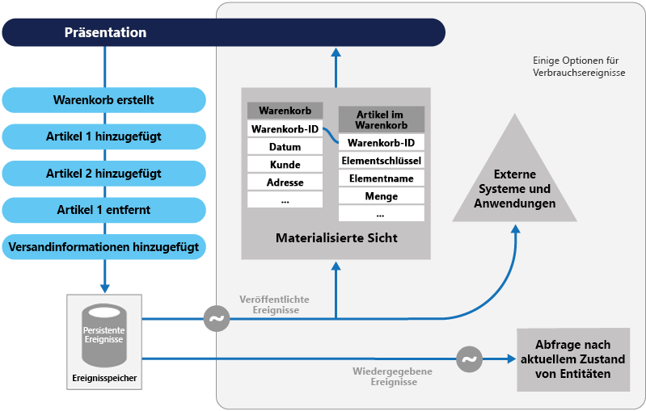
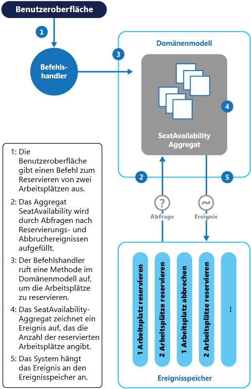

# Muster „Ereignissourcing“

[!INCLUDE [header](../_includes/header.md)]

Anstatt nur den aktuellen Zustand der Daten in einer Domäne zu speichern, verwenden Sie einen nur zum Anfügen vorgesehenen Speicher, um die vollständige Serie von Aktionen aufzuzeichnen, die mit diesen Daten ausgeführt wurden.
Der Speicher fungiert als Aufzeichnungssystem und kann zum Materialisieren der Domänenobjekte verwendet werden. Dadurch lassen sich Tasks in komplexen Domänen vereinfachen, da Datenmodell und Geschäftsdomäne nicht mehr synchronisiert werden müssen. Gleichzeitig steigen Leistung, Skalierbarkeit und Reaktionsfähigkeit. Das Muster kann auch Konsistenz für Transaktionsdaten bieten und vollständige Überwachungspfade und -verläufe verwalten, die kompensierende Maßnahmen ermöglichen können.

## Kontext und Problem

Die meisten Anwendungen basieren auf Daten. Der typische Ansatz besteht darin, dass die Anwendung den aktuellen Zustand der Daten verwaltet, indem sie die Daten aktualisiert, wenn Benutzer damit arbeiten. Im herkömmlichen CRUD-Modell (Create, Read, Update, Delete – Erstellen, Lesen, Aktualisieren, Löschen) sieht ein typischer Datenprozess folgendermaßen aus: Der Prozess liest Daten aus dem Speicher, nimmt einige Änderungen daran vor und aktualisiert den Zustand der Daten mit neuen Werten – häufig mithilfe von Transaktionen, die die Daten sperren.

Der CRUD-Ansatz weist einige Einschränkungen auf:

- CRUD-Systeme führen Aktualisierungsvorgänge direkt in einem Datenspeicher durch, was aufgrund des erforderlichen Verarbeitungsaufwands die Leistung und Reaktionsfähigkeit verringern und die Skalierbarkeit einschränken kann.

- In einer kollaborativen Domäne mit vielen gleichzeitigen Benutzern sind Datenaktualisierungskonflikte wahrscheinlicher, da die Aktualisierungsvorgänge in einem einzigen Datenelement stattfinden.

- Sofern kein zusätzlicher Überwachungsmechanismus vorhanden ist, der die Details jedes Vorgangs in einem separaten Protokoll aufzeichnet, ist der Verlauf nicht mehr nachvollziehbar.

> Einen ausführlicheren Überblick über die Einschränkungen des CRUD-Ansatzes finden Sie unter [CRUD, Only When You Can Afford It](https://blogs.msdn.microsoft.com/maarten_mullender/2004/07/23/crud-only-when-you-can-afford-it-revisited/) (CRUD, aber nur wenn Sie es sich leisten können).

## Lösung

Das Ereignissourcingmuster definiert eine Vorgehensweise zur Verarbeitung von Daten, die auf einer Ereignissequenz basiert. Jedes Ereignis wird in einem nur zum Anfügen vorgesehenen Speicher aufgezeichnet. Der Anwendungscode sendet eine Reihe von Ereignissen, die zwingend jede Aktion beschreiben, die für die Daten im Ereignisspeicher ausgeführt wurde, in dem die Daten dauerhaft gespeichert sind. Jedes Ereignis stellt eine Reihe von Änderungen der Daten dar (z.B. `AddedItemToOrder`).

Die Ereignisse werden in einem Ereignisspeicher dauerhaft gespeichert, der als Aufzeichnungssystem (die maßgebliche Datenquelle) für den aktuellen Zustand der Daten fungiert. Der Ereignisspeicher veröffentlicht diese Ereignisse in der Regel, sodass Consumer benachrichtigt werden und die Ereignisse bei Bedarf verarbeiten können. Consumer könnten z.B. Tasks initiieren, die die Vorgänge in den Ereignissen auf andere Systeme anwenden, oder eine andere verknüpfte Aktion ausführen, die zum Abschließen des Vorgangs erforderlich ist. Beachten Sie, dass der Anwendungscode, der die Ereignisse generiert, von den Systemen abgekoppelt ist, die die Ereignisse abonnieren.

Typische Anwendungen der vom Ereignisspeicher veröffentlichten Ereignisse sind die Verwaltung materialisierter Sichten von Entitäten, wenn Aktionen in der Anwendung diese ändern, und die Integration in externe Systeme. Ein System kann z.B. eine materialisierte Sicht aller Kundenaufträge verwalten, die zum Auffüllen von Teilen der Benutzeroberfläche verwendet wird. Wenn die Anwendung neue Aufträge hinzufügt, einzelne Posten im Auftrag hinzufügt oder daraus entfernt und Versandinformationen hinzufügt, können die Ereignisse, die diese Änderungen beschreiben, verarbeitet und zum Aktualisieren der [materialisierten Sicht](materialized-view.md) verwendet werden.

Darüber hinaus können Anwendungen zu jeder Zeit den Verlauf der Ereignisse lesen und zum Materialisieren des aktuellen Zustands einer Entität verwenden. Dazu werden alle Ereignisse, die mit dieser Entität in Zusammenhang stehen, wiedergegeben und genutzt. Dies kann bei Bedarf erfolgen, um bei der Verarbeitung einer Anforderung ein Domänenobjekt zu materialisieren, oder durch einen geplanten Task, sodass der Zustand der Entität als materialisierte Sicht gespeichert werden kann, um die Darstellungsschicht zu unterstützen.

Die Abbildung zeigt eine Übersicht über das Muster, einschließlich einiger Optionen für die Verwendung des Ereignisstroms: Erstellen einer materialisierten Sicht, Integrieren von Ereignissen in externe Anwendungen und Systeme und die Wiedergabe von Ereignissen, um Projektionen des aktuellen Zustands bestimmter Entitäten zu erstellen.

Das Ereignissourcingmuster bietet folgende Vorteile:

- Ereignisse sind unveränderlich und können mit einem Nur-Anfügen-Vorgang gespeichert werden. Benutzeroberflächenelemente, Workflows oder Prozesse, die ein Ereignis auslösen, können weiterhin ausgeführt werden, und Tasks, die die Ereignisse verarbeiten, können im Hintergrund ausgeführt werden. In Verbindung mit der Tatsache, dass bei der Verarbeitung von Transaktionen keine Konflikte auftreten, kann dies die Leistung und Skalierbarkeit von Anwendungen erheblich verbessern, insbesondere für die Darstellungsschicht oder die Benutzeroberfläche.

- Ereignisse sind einfache Objekte, die eine bestimmte durchgeführte Aktion sowie alle zugehörigen Daten beschreiben, die zum Beschreiben der durch das Ereignis repräsentierten Aktion erforderlich sind. Ereignisse aktualisieren einen Datenspeicher nicht direkt. Sie werden nur aufgezeichnet, um zur richtigen Zeit verarbeitet zu werden. Dies kann die Implementierung und Verwaltung vereinfachen.

- Ereignisse haben in der Regel eine Bedeutung für einen Domänenexperten, während die [objektrelationale Unverträglichkeit](https://en.wikipedia.org/wiki/Object-relational_impedance_mismatch) (Object-Relational Impedance Mismatch) dazu führen kann, dass komplexe Datenbanktabellen schwer zu verstehen sind. Tabellen sind künstliche Konstrukte, die den aktuellen Zustand des Systems repräsentieren, nicht die aufgetretenen Ereignisse.

- Ereignissourcing kann verhindern, dass gleichzeitige Updates Konflikte verursachen, weil Objekte nicht direkt im Datenspeicher aktualisiert werden müssen. Das Domänenmodell muss jedoch weiterhin so entworfen werden, dass es sich selbst vor Anforderungen schützen kann, die zu einem inkonsistenten Zustand führen könnten.

- Die Nur-Anfügen-Speicherung von Ereignissen bietet einen Überwachungspfad, der für folgende Aufgaben verwendet werden kann: Überwachen von Aktionen in einem Datenspeicher, Wiederherstellen des aktuellen Zustands als materialisierte Sichten oder Projektionen durch die Wiedergabe der Ereignisse zu einem beliebigen Zeitpunkt sowie Testen und Debuggen des Systems. Darüber hinaus wird durch die Anforderung, zum Abbrechen von Änderungen kompensierende Ereignisse zu verwenden, ein Verlauf der rückgängig gemachten Änderungen erstellt. Dies wäre nicht der Fall, wenn das Modell einfach nur den aktuellen Zustand speichern würde. Die Liste der Ereignisse kann auch verwendet werden, um die Anwendungsleistung zu analysieren und Trends im Benutzerverhalten zu erkennen oder um andere hilfreiche Geschäftsinformationen abzurufen.

- Der Ereignisspeicher löst Ereignisse aus, Tasks führen Vorgänge als Reaktion auf diese Ereignisse aus. Diese Abkopplung der Tasks von den Ereignissen sorgt für Flexibilität und Erweiterbarkeit. Tasks kennen den Ereignistyp und die Ereignisdaten, aber nicht den Vorgang, der das Ereignis ausgelöst hat. Darüber hinaus kann jedes Ereignis von mehreren Tasks verarbeitet werden. Dies ermöglicht eine einfache Integration in andere Dienste und Systeme, die nur auf neue vom Ereignisspeicher ausgelöste Ereignisse lauschen. Die Ereignisse beim Ereignissourcing sind jedoch zuweilen sehr spezifisch, und es ist möglicherweise erforderlich, stattdessen spezielle Integrationsereignisse zu generieren.

> Das Ereignissourcing wird häufig mit dem CQRS-Muster kombiniert, indem als Reaktion auf die Ereignisse Datenverwaltungstasks ausgeführt und aus den gespeicherten Ereignissen Sichten materialisiert werden.

## Probleme und Überlegungen

Beachten Sie die folgenden Punkte bei der Entscheidung, wie dieses Muster implementiert werden soll:

Das System ist nur dann letztlich konsistent, wenn durch Wiedergabe von Ereignissen materialisierte Sichten erstellt oder Projektionen generiert werden. Es gibt eine gewisse Verzögerung zwischen dem Hinzufügen von Ereignissen zum Ereignisspeicher durch eine Anwendung nach der Verarbeitung einer Anforderung, dem Veröffentlichen der Ereignisse und dem Verarbeiten der Ereignisse durch Consumer. Während dieses Zeitraums können neue Ereignisse im Ereignisspeicher eingegangen sein, die weitere Änderungen an Entitäten beschreiben.

> [!NOTE]
> Weitere Informationen zur letztlichen Konsistenz finden Sie unter [Data Consistency Primer](https://msdn.microsoft.com/library/dn589800.aspx) (Grundlagen der Datenkonsistenz).

Der Ereignisspeicher ist die dauerhafte Informationsquelle, daher sollten Ereignisdaten niemals aktualisiert werden. Die einzige Möglichkeit, eine Entität zu aktualisieren, um eine Änderung rückgängig zu machen, besteht darin, dem Ereignisspeicher ein kompensierendes Ereignis hinzuzufügen. Wenn das Format (nicht die Daten) der dauerhaft gespeicherten Ereignisse geändert werden muss – möglicherweise während einer Migration –, kann es schwierig sein, vorhandene Ereignisse im Speicher mit der neuen Version zu kombinieren. Möglicherweise müssen alle Ereignisse durchlaufen werden, die Änderungen vornehmen, sodass die Ereignisse mit dem neuen Format konform sind. Eventuell müssen auch neue Ereignisse hinzugefügt werden, die das neue Format verwenden. Ziehen Sie in Betracht, einen Versionsstempel für jede Version des Ereignisschemas zu verwenden, um sowohl das alte als auch das neue Ereignisformat beizubehalten.

Möglicherweise speichern Anwendungen mit mehreren Threads und mehrere Instanzen von Anwendungen Ereignisse im Ereignisspeicher. Die Konsistenz der Ereignisse im Ereignisspeicher ist von entscheidender Bedeutung, ebenso wie die Reihenfolge der Ereignisse, die eine bestimmte Entität betreffen (die Reihenfolge, in der Änderungen auf eine Entität angewendet werden, wirkt sich auf den aktuellen Zustand aus). Durch Hinzufügen eines Zeitstempels zu jedem Ereignis lassen sich Probleme verhindern. Eine weitere häufige Vorgehensweise besteht darin, jedes Ereignis, das aus einer Anforderung resultiert, mit einem inkrementellen Bezeichner zu kommentieren. Wenn zwei Aktionen versuchen, gleichzeitig Ereignisse für die gleiche Entität hinzuzufügen, kann der Ereignisspeicher ein Ereignis ablehnen, das mit einem vorhandenen Entitätsbezeichner und einem vorhandenen Ereignisbezeichner übereinstimmt.

Es gibt keine Standardmethode oder vorhandene Mechanismen wie beispielsweise SQL-Abfragen, um Informationen aus Ereignissen auszulesen. Die einzigen Daten, die extrahiert werden können, sind Ereignisströme. Hierbei wird ein Ereignisbezeichner als Kriterium verwendet. Die Ereignis-ID lässt sich in der Regel einzelnen Entitäten zuordnen. Der aktuelle Zustand einer Entität kann nur bestimmt werden, indem alle Ereignisse, die sich auf sie beziehen, im Vergleich zum ursprünglichen Zustand der Entität wiedergegeben werden.

Die Länge der einzelnen Ereignisströme wirkt sich auf die Verwaltung und Aktualisierung des Systems aus. Wenn die Ströme umfangreich sind, kann es sinnvoll sein, in bestimmten Intervallen – z.B. nach einer bestimmten Anzahl von Ereignissen – Momentaufnahmen zu erstellen. Der aktuelle Zustand der Entität kann aus der Momentaufnahme abgerufen werden, indem alle Ereignisse wiedergegeben werden, die nach diesem Zeitpunkt aufgetreten sind. Weitere Informationen zum Erstellen von Momentaufnahmen von Daten finden Sie auf der [Enterprise Application Architecture-Website von Martin Fowler unter „Snapshot“](http://martinfowler.com/eaaDev/Snapshot.html) und im Artikel [Master-Subordinate Snapshot Replication](https://msdn.microsoft.com/library/ff650012.aspx) (Momentaufnahmereplikation mit Masterelementen und untergeordneten Elementen).

Auch wenn das Ereignissourcing das Risiko von Aktualisierungskonflikten bei den Daten minimiert, muss die Anwendung dennoch weiterhin in der Lage sein, Inkonsistenzen zu bewältigen, die aus der letztlichen Konsistenz und dem Fehlen von Transaktionen entstehen. Ein Beispiel: Ein Ereignis, das eine Reduzierung des Lagerbestands für diesen Artikel angibt, wird in den Datenspeicher übermittelt, während eine Bestellung für einen Artikel platziert wird. Daraus entsteht eine Anforderung, die beiden Vorgänge in Einklang zu bringen – entweder durch eine Nachricht an den Kunden oder durch Nachbestellen des Artikels.

Jede Veröffentlichung kann als „at least once“ festgelegt sein, daher müssen Consumer der Ereignisse idempotent sein. Sie dürfen das in einem Ereignis beschriebene Update nicht erneut anwenden, wenn das Ereignis mehr als einmal verarbeitet wird. Wenn beispielsweise mehrere Instanzen eines Consumers das Aggregat einer Entitätseigenschaft verwalten, wie etwa die Gesamtanzahl platzierter Bestellungen, darf nur eine Instanz das Aggregat erhöhen, wenn ein „Bestellung platziert“-Ereignis auftritt. Dies ist zwar kein entscheidendes Merkmal des Ereignissourcing, aber die übliche Implementierungsentscheidung.

## Verwendung dieses Musters

Verwenden Sie dieses Muster in folgenden Szenarien:

- Sie möchten eine Absicht, einen Zweck oder einen Grund in den Daten erfassen. Änderungen an einer Kundenentität können z.B. als Reihe von bestimmten Ereignistypen erfasst werden, wie etwa _Umgezogen_, _Konto gekündigt_ oder _Verstorben_.

- Es ist von entscheidender Bedeutung, Aktualisierungskonflikte bei Daten zu minimieren oder vollständig zu vermeiden.

- Sie möchten auftretende Ereignisse aufzeichnen und wiedergeben, um den Zustand eines Systems wiederherzustellen, Änderungen rückgängig zu machen oder ein Verlaufs- und Überwachungsprotokoll zu pflegen. Wenn beispielsweise ein Task mehrere Schritte umfasst, müssen Sie möglicherweise Aktionen ausführen, um Updates rückgängig zu machen, und dann einige Schritte wiedergeben, um die Daten wieder in einen konsistenten Zustand zu versetzen.

- Das Verwenden von Ereignissen ist eine natürliche Betriebsfunktion der Anwendung und erfordert wenig zusätzlichen Aufwand für die Entwicklung und Implementierung.

- Sie müssen den Prozess der Eingabe oder Aktualisierung von Daten von den Tasks abkoppeln, die zum Anwenden dieser Aktionen erforderlich sind. Dies kann dazu dienen, die Leistung der Benutzeroberfläche zu verbessern oder Ereignisse auf andere Listener zu verteilen, die eine Aktion ausführen, wenn die Ereignisse auftreten. Ein Beispiel hierfür ist die Integration eines Lohnabrechnungssystems in eine Website für die Übermittlung von Spesenabrechnungen. Hierbei können Ereignisse, die vom Ereignisspeicher als Reaktion auf in der Website erfolgte Datenupdates ausgelöst wurden, sowohl von der Website als auch vom Lohnabrechnungssystem genutzt werden.

- Sie benötigen mehr Flexibilität, um das Format materialisierter Modelle und Entitätsdaten ändern zu können, wenn sich die Anforderungen ändern. Oder Sie verwenden das Muster zusammen mit CQRS und müssen ein Lesemodell oder die Ansichten anpassen, die die Daten verfügbar machen.

- Sie verwenden das Muster zusammen mit CQRS, und die letztliche Konsistenz ist akzeptabel, während ein Lesemodell aktualisiert wird, oder die Leistungsbeeinträchtigung durch das Aktivieren von Entitäten und Daten aus einem Ereignisstrom ist akzeptabel.

Dieses Muster ist in den folgenden Situationen eventuell nicht nützlich:

- Kleine oder einfache Domänen, Systeme ohne oder mit nur geringfügiger Geschäftslogik oder Systeme ohne Domäne, die naturgemäß gut mit herkömmlichen CRUD-Datenverwaltungsmechanismen funktionieren.

- Systeme, in denen Konsistenz und Echtzeitupdates der Datensichten erforderlich sind.

- Systeme, in den Überwachungspfade, Verlaufsinformationen und Funktionen zum Ausführen von Rollbacks und Wiedergeben von Aktionen nicht erforderlich sind.

- Systeme, bei denen nur in sehr geringem Maß Aktualisierungskonflikte bei den zugrunde liegenden Daten auftreten. Dies können z.B. Systeme sein, die Daten eher hinzufügen als aktualisieren.

## Beispiel

Ein Konferenzverwaltungssystem muss die Anzahl abgeschlossener Buchungen für eine Konferenz nachverfolgen, um überprüfen zu können, ob noch Plätze verfügbar sind, wenn ein potenzieller Teilnehmer eine Buchung vornehmen möchte. Das System kann die Gesamtanzahl von Buchungen für eine Konferenz auf mindestens zwei Arten speichern:

- Das System kann die Informationen zur Gesamtanzahl von Buchungen als separate Entität in einer Datenbank speichern, die Buchungsinformationen enthält. Wenn Buchungen vorgenommen oder storniert werden, kann das System diese Zahl entsprechend erhöhen oder reduzieren. Dieser Ansatz ist in der Theorie sehr einfach, kann aber zu Skalierbarkeitsproblemen führen, wenn eine große Anzahl von Teilnehmern innerhalb kurzer Zeit versucht, Plätze zu buchen. Dies kann beispielsweise am letzten Tag des möglichen Buchungszeitraums der Fall sein.

- Das System kann Informationen zu Buchungen und Stornierungen in Form von Ereignissen in einem Ereignisspeicher speichern. So kann das System die Anzahl der verfügbaren Plätze durch Wiedergabe dieser Ereignisse berechnen. Dieser Ansatz ist aufgrund der Unveränderlichkeit von Ereignissen besser skalierbar. Das System muss nur Daten aus dem Ereignisspeicher lesen oder an den Ereignisspeicher anfügen können. Ereignisinformationen zu Buchungen und Stornierungen werden niemals geändert.

Das folgende Diagramm veranschaulicht, wie das Platzreservierungs-Subsystem des Konferenzverwaltungssystems mithilfe des Ereignissourcingmusters implementiert werden könnte.

Die Aktionssequenz für die Reservierung von zwei Plätzen lautet folgendermaßen:

1. Die Benutzeroberfläche gibt einen Befehl aus, um Plätze für zwei Teilnehmer zu reservieren. Der Befehl wird von einem separaten Befehlshandler verarbeitet. Dies ist ein Stück Logik, das von der Benutzeroberfläche abgekoppelt ist und für die Verarbeitung von Anforderungen zuständig ist, die als Befehle übermittelt werden.

2. Es wird ein Aggregat mit Informationen zu allen Reservierungen für die Konferenz erstellt, indem die Ereignisse abgefragt werden, die Buchungen und Stornierungen beschreiben. Dieses Aggregat wird als `SeatAvailability` bezeichnet und ist in einem Domänenmodell enthalten, das Methoden zum Abfragen und Ändern der Daten im Aggregat verfügbar macht.

    > Ziehen Sie ggf. folgende Optimierungen in Betracht: Verwenden von Momentaufnahmen (damit Sie nicht die gesamte Liste der Ereignisse abfragen und wiedergeben müssen, um den aktuellen Zustand des Aggregats zu erhalten) und Zwischenspeichern einer Kopie des Aggregats im Arbeitsspeicher.

3. Der Befehlshandler ruft eine Methode auf, die vom Domänenmodell verfügbar gemacht wurde, um die Reservierungen vorzunehmen.

4. Das `SeatAvailability`-Aggregat zeichnet ein Ereignis auf, das die Anzahl von reservierten Plätzen enthält. Wenn das Aggregat das nächste Mal Ereignisse anwendet, werden alle Reservierungen verwendet, um zu berechnen, wie viele Plätze verbleiben.

5. Das System fügt das neue Ereignis an die Liste der Ereignisse im Ereignisspeicher an.

Wenn ein Benutzer einen Platz storniert, ist das Verfahren ähnlich – mit einer Ausnahme: Der Befehlshandler gibt einen Befehl aus, der ein Stornierungsereignis generiert und dieses an den Ereignisspeicher anfügt.

Ein Ereignisspeicher bietet nicht nur mehr Raum für Skalierbarkeit, sondern auch einen vollständigen Verlauf bzw. Überwachungspfad der Buchungen und Stornierungen für eine Konferenz. Die Ereignisse im Ereignisspeicher stellen den korrekten Datensatz dar. Es ist nicht notwendig, Aggregate auf andere Weise dauerhaft zu speichern, weil das System ganz einfach die Ereignisse wiedergeben und den Zustand auf einen beliebigen Zeitpunkt wiederherstellen kann.

> Weitere Information zu diesem Beispiel finden Sie unter [Introducing Event Sourcing](https://msdn.microsoft.com/library/jj591559.aspx) (Einführung in das Ereignissourcing).

## Zugehörige Muster und Anleitungen

Die folgenden Muster und Anweisungen können für die Implementierung dieses Musters ebenfalls relevant sein:

- [CQRS-Muster (Command and Query Responsibility Segregation)](cqrs.md). Der Schreibspeicher, der die permanente Informationsquelle für eine CQRS-Implementierung bereitstellt, basiert oft auf einer Implementierung des Ereignissourcingmusters. Das Muster beschreibt, wie mithilfe separater Schnittstellen die Vorgänge, die Daten in einer Anwendung lesen, von den Vorgängen getrennt werden, die Daten aktualisieren.

- [Muster „Materialisierte Sichten“](materialized-view.md). Der Datenspeicher, der in einem auf Ereignissourcing basierenden System verwendet wird, eignet sich in der Regel nicht gut für effiziente Abfragen. Ein häufiger Ansatz besteht darin, in regelmäßigen Abständen oder bei Änderung von Daten vorab aufgefüllte Sichten der Daten zu generieren. Das Muster zeigt, wie dies umgesetzt wird.

- [Muster „Kompensierende Transaktion“](compensating-transaction.md). Die vorhandenen Daten in einem Ereignissourcingspeicher werden nicht aktualisiert. Stattdessen werden neue Einträge hinzugefügt, die den Zustand der Entitäten auf die neuen Werte übertragen. Um eine Änderung rückgängig zu machen, werden kompensierende Einträge verwendet, da es nicht möglich ist, die vorherige Änderung einfach rückgängig zu machen. Dieses Muster beschreibt, wie die Ergebnisse eines vorherigen Vorgangs rückgängig gemacht werden können.

- [Data Consistency Primer](https://msdn.microsoft.com/library/dn589800.aspx) (Grundlagen der Datenkonsistenz). Wenn das Ereignissourcing mit einem separaten Lesespeicher oder materialisierten Sichten verwendet wird, sind die gelesenen Daten nicht sofort, sondern nur letztlich konsistent. Das Muster bietet eine Übersicht über die Probleme bei der Gewährleistung von Konsistenz bei verteilten Daten.

- [Data Partitioning Guidance](https://msdn.microsoft.com/library/dn589795.aspx) (Leitfaden zur Datenpartitionierung). Beim Ereignissourcing werden Daten häufig partitioniert, um die Skalierbarkeit zu verbessern, Konflikte zu reduzieren und die Leistung zu optimieren. Das Muster beschreibt, wie Daten auf getrennte Partitionen aufgeteilt werden, und erläutert mögliche Probleme.

- Greg Youngs Beitrag [Why use Event Sourcing?](http://codebetter.com/gregyoung/2010/02/20/why-use-event-sourcing/) (Welche Gründe sprechen für das Ereignissourcing?)
