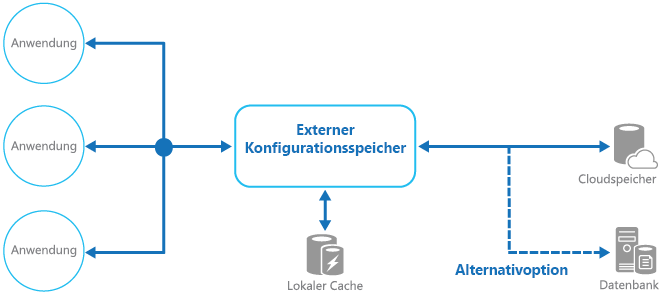

# <a name="external-configuration-store-pattern"></a><span data-ttu-id="46627-104">Muster mit externem Konfigurationsspeicher</span><span class="sxs-lookup"><span data-stu-id="46627-104">External Configuration Store pattern</span></span>

[!INCLUDE [header](../_includes/header.md)]

<span data-ttu-id="46627-105">Konfigurationsinformationen aus dem Anwendungsbereitstellungspaket an einen zentralen Speicherort verschieben</span><span class="sxs-lookup"><span data-stu-id="46627-105">Move configuration information out of the application deployment package to a centralized location.</span></span> <span data-ttu-id="46627-106">Dies kann das Verwalten und Steuern von Konfigurationsdaten und das gemeinsame Verwenden von Konfigurationsdaten in allen Anwendungen und Anwendungsinstanzen erleichtern.</span><span class="sxs-lookup"><span data-stu-id="46627-106">This can provide opportunities for easier management and control of configuration data, and for sharing configuration data across applications and application instances.</span></span>

## <a name="context-and-problem"></a><span data-ttu-id="46627-107">Kontext und Problem</span><span class="sxs-lookup"><span data-stu-id="46627-107">Context and problem</span></span>

<span data-ttu-id="46627-108">Die meisten Anwendungslaufzeitumgebungen enthalten Konfigurationsinformationen, die in Dateien gespeichert sind, welche mit der Anwendung bereitgestellt werden.</span><span class="sxs-lookup"><span data-stu-id="46627-108">The majority of application runtime environments include configuration information that's held in files deployed with the application.</span></span> <span data-ttu-id="46627-109">In einigen Fällen können diese Dateien bearbeitet werden, um das Verhalten der Anwendung zu ändern, nachdem sie bereitgestellt wurde.</span><span class="sxs-lookup"><span data-stu-id="46627-109">In some cases, it's possible to edit these files to change the application behavior after it's been deployed.</span></span> <span data-ttu-id="46627-110">Nach Änderungen an der Konfiguration muss die Anwendung jedoch neu bereitgestellt werden, was häufig zu inakzeptablen Ausfallzeiten und sonstigem Verwaltungsaufwand führt.</span><span class="sxs-lookup"><span data-stu-id="46627-110">However, changes to the configuration require the application be redeployed, often resulting in unacceptable downtime and other administrative overhead.</span></span>

<span data-ttu-id="46627-111">Lokale Konfigurationsdateien beschränken ferner die Konfiguration auf eine einzelne Anwendung, gelegentlich wäre es jedoch sinnvoll, Konfigurationseinstellungen für mehrere Anwendungen freizugeben.</span><span class="sxs-lookup"><span data-stu-id="46627-111">Local configuration files also limit the configuration to a single application, but sometimes it would be useful to share configuration settings across multiple applications.</span></span> <span data-ttu-id="46627-112">Beispiele: Datenbankverbindungszeichenfolgen, UI-Designinformationen, die URLs von Warteschlangen und durch eine zusammengehörige Gruppe von Anwendungen verwendeter Speicher.</span><span class="sxs-lookup"><span data-stu-id="46627-112">Examples include database connection strings, UI theme information, or the URLs of queues and storage used by a related set of applications.</span></span>

<span data-ttu-id="46627-113">Es ist nicht einfach, Änderungen an lokalen Konfigurationen über mehrere ausgeführte Instanzen der Anwendung, insbesondere in einem cloudgehosteten Szenario, zu verwalten.</span><span class="sxs-lookup"><span data-stu-id="46627-113">It's challenging to manage changes to local configurations across multiple running instances of the application, especially in a cloud-hosted scenario.</span></span> <span data-ttu-id="46627-114">Dies kann dazu führen, dass Instanzen andere Konfigurationseinstellungen verwenden, während das Update bereitgestellt wird.</span><span class="sxs-lookup"><span data-stu-id="46627-114">It can result in instances using different configuration settings while the update is being deployed.</span></span>

<span data-ttu-id="46627-115">Darüber hinaus erfordern Updates von Anwendungen und Komponenten möglicherweise Änderungen an den Konfigurationsschemas.</span><span class="sxs-lookup"><span data-stu-id="46627-115">In addition, updates to applications and components might require changes to configuration schemas.</span></span> <span data-ttu-id="46627-116">Viele Konfigurationssysteme unterstützen keine verschiedenen Versionen von Konfigurationsinformationen.</span><span class="sxs-lookup"><span data-stu-id="46627-116">Many configuration systems don't support different versions of configuration information.</span></span>

## <a name="solution"></a><span data-ttu-id="46627-117">Lösung</span><span class="sxs-lookup"><span data-stu-id="46627-117">Solution</span></span>

<span data-ttu-id="46627-118">Speichern Sie die Konfigurationsinformationen in einem externen Speicher, und stellen Sie eine Schnittstelle bereit, über die Konfigurationseinstellungen schnell und effizient gelesen und aktualisiert werden können.</span><span class="sxs-lookup"><span data-stu-id="46627-118">Store the configuration information in external storage, and provide an interface that can be used to quickly and efficiently read and update configuration settings.</span></span> <span data-ttu-id="46627-119">Der Typ des externen Speichers hängt von der Hosting- und Laufzeitumgebung der Anwendung ab.</span><span class="sxs-lookup"><span data-stu-id="46627-119">The type of external store depends on the hosting and runtime environment of the application.</span></span> <span data-ttu-id="46627-120">In einem cloudgehosteten Szenario handelt es sich in der Regel um einen cloudbasierten Speicherdienst, es könnte sich aber auch um eine gehostete Datenbank oder ein anderes System handeln.</span><span class="sxs-lookup"><span data-stu-id="46627-120">In a cloud-hosted scenario it's typically a cloud-based storage service, but could be a hosted database or other system.</span></span>

<span data-ttu-id="46627-121">Der Sicherungsspeicher, den Sie für Konfigurationsinformationen auswählen, sollte über eine Schnittstelle verfügen, die einen konsistenten, benutzerfreundlichen Zugriff erlaubt.</span><span class="sxs-lookup"><span data-stu-id="46627-121">The backing store you choose for configuration information should have an interface that provides consistent and easy-to-use access.</span></span> <span data-ttu-id="46627-122">Sie sollten die Informationen in einem ordnungsgemäß typisierten und strukturierten Format verfügbar machen.</span><span class="sxs-lookup"><span data-stu-id="46627-122">It should expose the information in a correctly typed and structured format.</span></span> <span data-ttu-id="46627-123">Die Implementierung muss möglicherweise auch den Benutzerzugriff autorisieren, um Konfigurationsdaten zu schützen, und so flexibel sein, das Speichern mehrerer Versionen der Konfiguration (wie Entwicklungs-, Staging- und Produktionsversionen, jeweils einschließlich mehrerer Releases) zu ermöglichen.</span><span class="sxs-lookup"><span data-stu-id="46627-123">The implementation might also need to authorize users’ access in order to protect configuration data, and be flexible enough to allow storage of multiple versions of the configuration (such as development, staging, or production, including multiple release versions of each one).</span></span>

> <span data-ttu-id="46627-124">Viele integrierte Konfigurationssysteme lesen die Daten beim Start der Anwendung und speichern die Daten im Speicher zwischen, um einen schnellen Zugriff zu ermöglichen und Auswirkungen auf die Anwendungsleistung zu minimieren.</span><span class="sxs-lookup"><span data-stu-id="46627-124">Many built-in configuration systems read the data when the application starts up, and cache the data in memory to provide fast access and minimize the impact on application performance.</span></span> <span data-ttu-id="46627-125">Je nach Art des verwendeten Sicherungsspeichers und der Latenz dieses Speichers kann es sinnvoll sein, einen Zwischenspeichermechanismus im externen Konfigurationsspeicher zu implementieren.</span><span class="sxs-lookup"><span data-stu-id="46627-125">Depending on the type of backing store used, and the latency of this store, it might be helpful to implement a caching mechanism within the external configuration store.</span></span> <span data-ttu-id="46627-126">Weitere Informationen finden Sie unter [Caching Guidance (Leitfaden für die Zwischenspeicherung)](https://msdn.microsoft.com/library/dn589802.aspx).</span><span class="sxs-lookup"><span data-stu-id="46627-126">For more information, see the [Caching Guidance](https://msdn.microsoft.com/library/dn589802.aspx).</span></span> <span data-ttu-id="46627-127">Die Abbildung zeigt einen Überblick über das Muster des externen Konfigurationsspeichers mit einem optionalen lokalen Cache.</span><span class="sxs-lookup"><span data-stu-id="46627-127">The figure illustrates an overview of the External Configuration Store pattern with optional local cache.</span></span>




## <a name="issues-and-considerations"></a><span data-ttu-id="46627-129">Probleme und Überlegungen</span><span class="sxs-lookup"><span data-stu-id="46627-129">Issues and considerations</span></span>

<span data-ttu-id="46627-130">Beachten Sie die folgenden Punkte bei der Entscheidung, wie dieses Muster implementiert werden soll:</span><span class="sxs-lookup"><span data-stu-id="46627-130">Consider the following points when deciding how to implement this pattern:</span></span>

<span data-ttu-id="46627-131">Wählen Sie einen Sicherungsspeicher aus, der eine akzeptable Leistung und eine hohe Verfügbarkeit und Stabilität bietet und im Rahmen der Anwendungswartung und -verwaltung gesichert werden kann.</span><span class="sxs-lookup"><span data-stu-id="46627-131">Choose a backing store that offers acceptable performance, high availability, robustness, and can be backed up as part of the application maintenance and administration process.</span></span> <span data-ttu-id="46627-132">In einer cloudgehosteten Anwendung ist die Verwendung eines Cloudspeichermechanismus in der Regel eine gute Wahl, um diese Anforderungen zu erfüllen.</span><span class="sxs-lookup"><span data-stu-id="46627-132">In a cloud-hosted application, using a cloud storage mechanism is usually a good choice to meet these requirements.</span></span>

<span data-ttu-id="46627-133">Gestalten Sie das Schema des Sicherungsspeichers so, dass der Speicher hinsichtlich der Informationsarten, die er speichern kann, flexibel ist.</span><span class="sxs-lookup"><span data-stu-id="46627-133">Design the schema of the backing store to allow flexibility in the types of information it can hold.</span></span> <span data-ttu-id="46627-134">Stellen Sie sicher, dass er für alle Konfigurationsanforderungen wie typisierte Daten, Sammlungen von Einstellungen, mehrere Versionen von Einstellungen und andere Funktionen geeignet ist, die die Anwendungen erfordern, die den Speicher verwenden.</span><span class="sxs-lookup"><span data-stu-id="46627-134">Ensure that it provides for all configuration requirements such as typed data, collections of settings, multiple versions of settings, and any other features that the applications using it require.</span></span> <span data-ttu-id="46627-135">Das Schema sollte sich leicht erweitern lassen, um zusätzliche Einstellungen zu unterstützen, wenn sich die Anforderungen ändern.</span><span class="sxs-lookup"><span data-stu-id="46627-135">The schema should be easy to extend to support additional settings as requirements change.</span></span>

<span data-ttu-id="46627-136">Berücksichtigen Sie die physischen Möglichkeiten des Sicherungsspeichers, welchen Bezug sie zu der Art der Speicherung der Konfigurationsinformationen haben und welche Auswirkungen auf die Leistung sich hieraus ergeben.</span><span class="sxs-lookup"><span data-stu-id="46627-136">Consider the physical capabilities of the backing store, how it relates to the way configuration information is stored, and the effects on performance.</span></span> <span data-ttu-id="46627-137">Für das Speichern eines XML-Dokuments, das Konfigurationsinformationen enthält, benötigen Sie beispielsweise entweder die Konfigurationsschnittstelle oder die Anwendung, um das Dokument zu analysieren und so einzelne Einstellungen zu lesen.</span><span class="sxs-lookup"><span data-stu-id="46627-137">For example, storing an XML document containing configuration information will require either the configuration interface or the application to parse the document in order to read individual settings.</span></span> <span data-ttu-id="46627-138">Das Aktualisieren einer Einstellung wird dadurch komplizierter, wenngleich eine Zwischenspeicherung der Einstellungen dazu beitragen kann, eine langsamere Leseleistung zu kompensieren.</span><span class="sxs-lookup"><span data-stu-id="46627-138">It'll make updating a setting more complicated, though caching the settings can help to offset slower read performance.</span></span>

<span data-ttu-id="46627-139">Berücksichtigen Sie, in welcher Weise die Konfigurationsschnittstelle eine Kontrolle über den Bereich und die Vererbung von Konfigurationseinstellungen zulässt.</span><span class="sxs-lookup"><span data-stu-id="46627-139">Consider how the configuration interface will permit control of the scope and inheritance of configuration settings.</span></span> <span data-ttu-id="46627-140">Möglicherweise kann es erforderlich sein, Konfigurationseinstellungen auf Organisations-, Anwendungs- oder Computerebene zu betrachten.</span><span class="sxs-lookup"><span data-stu-id="46627-140">For example, it might be a requirement to scope configuration settings at the organization, application, and the machine level.</span></span> <span data-ttu-id="46627-141">Es kann erforderlich sein, eine Delegierung der Zugriffsteuerung auf verschiedene Bereiche zu unterstützen und zu verhindern bzw. zuzulassen, dass einzelne Anwendungen Einstellungen außer Kraft setzen.</span><span class="sxs-lookup"><span data-stu-id="46627-141">It might need to support delegation of control over access to different scopes, and to prevent or allow individual applications to override settings.</span></span>

<span data-ttu-id="46627-142">Stellen Sie sicher, dass die Konfigurationsschnittstelle die Konfigurationsdaten in den erforderlichen Formaten wie typisierte Werte, Sammlungen, Schlüssel-/Wertpaare oder Eigenschaftensammlungen bereitstellen kann.</span><span class="sxs-lookup"><span data-stu-id="46627-142">Ensure that the configuration interface can expose the configuration data in the required formats such as typed values, collections, key/value pairs, or property bags.</span></span>

<span data-ttu-id="46627-143">Berücksichtigen Sie das Verhalten der Konfigurationsschnittstelle, wenn Einstellungen Fehler enthalten oder nicht im Sicherungsspeicher vorhanden sind.</span><span class="sxs-lookup"><span data-stu-id="46627-143">Consider how the configuration store interface will behave when settings contain errors, or don't exist in the backing store.</span></span> <span data-ttu-id="46627-144">Es kann zweckmäßig sein, Standardeinstellungen und Fehlerprotokolle zurückzugeben.</span><span class="sxs-lookup"><span data-stu-id="46627-144">It might be appropriate to return default settings and log errors.</span></span> <span data-ttu-id="46627-145">Berücksichtigen Sie auch Aspekte wie die Groß-/Kleinschreibung von Konfigurationseinstellungsschlüsseln oder -namen, die Speicherung und Handhabung binärer Daten sowie die Handhabung von Nullwerten oder leeren Werten.</span><span class="sxs-lookup"><span data-stu-id="46627-145">Also consider aspects such as the case sensitivity of configuration setting keys or names, the storage and handling of binary data, and the ways that null or empty values are handled.</span></span>

<span data-ttu-id="46627-146">Überlegen Sie, wie die Konfigurationsdaten geschützt werden können, sodass nur angemessenen Benutzern und Anwendungen Zugriff gewährt wird.</span><span class="sxs-lookup"><span data-stu-id="46627-146">Consider how to protect the configuration data to allow access to only the appropriate users and applications.</span></span> <span data-ttu-id="46627-147">Hierbei handelt es sich wahrscheinlich um eine Funktion der Konfigurationsspeicherschnittstelle, aber es muss auch sichergestellt werden, dass direkt ohne entsprechende Berechtigung auf die Daten im Sicherungsspeicher zugegriffen werden kann.</span><span class="sxs-lookup"><span data-stu-id="46627-147">This is likely a feature of the configuration store interface, but it's also necessary to ensure that the data in the backing store can't be accessed directly without the appropriate permission.</span></span> <span data-ttu-id="46627-148">Stellen Sie eine strikte Trennung zwischen den Berechtigungen sicher, die für das Lesen und das Schreiben von Konfigurationsdaten erforderlich sind.</span><span class="sxs-lookup"><span data-stu-id="46627-148">Ensure strict separation between the permissions required to read and to write configuration data.</span></span> <span data-ttu-id="46627-149">Überlegen Sie auch, ob Sie einige oder alle Konfigurationseinstellungen verschlüsseln müssen und wie dies in der Konfigurationsspeicher-Schnittstelle implementiert werden muss.</span><span class="sxs-lookup"><span data-stu-id="46627-149">Also consider whether you need to encrypt some or all of the configuration settings, and how this'll be implemented in the configuration store interface.</span></span>

<span data-ttu-id="46627-150">Zentral gespeicherte Konfigurationen, die das Verhalten der Anwendung während der Laufzeit ändern, sind sehr wichtig und sollten mit denselben Mechanismen bereitgestellt, aktualisiert und verwaltet werden, die auch für das Bereitstellen von Anwendungscode verwendet werden.</span><span class="sxs-lookup"><span data-stu-id="46627-150">Centrally stored configurations, which change application behavior during runtime, are critically important and should be deployed, updated, and managed using the same mechanisms as deploying application code.</span></span> <span data-ttu-id="46627-151">Änderungen, die beispielsweise mehrere Anwendungen betreffen können, müssen mithilfe eines umfassenden Test- und Stagingbereitstellungsansatzes durchgeführt werden, um sicherzustellen, dass sich die Änderung für alle Anwendungen eignet, die diese Konfiguration verwenden.</span><span class="sxs-lookup"><span data-stu-id="46627-151">For example, changes that can affect more than one application must be carried out using a full test and staged deployment approach to ensure that the change is appropriate for all applications that use this configuration.</span></span> <span data-ttu-id="46627-152">Wenn ein Administrator eine Einstellung bearbeitet, sodass eine Anwendung aktualisiert wird, kann sich dies negativ auf die übrigen Anwendungen auswirken, die dieselbe Einstellung verwenden.</span><span class="sxs-lookup"><span data-stu-id="46627-152">If an administrator edits a setting to update one application, it could adversely impact other applications that use the same setting.</span></span>

<span data-ttu-id="46627-153">Wenn eine Anwendung die Konfigurationsinformationen zwischenspeichert, muss die Anwendung benachrichtigt werden, wenn sich die Konfiguration ändert.</span><span class="sxs-lookup"><span data-stu-id="46627-153">If an application caches configuration information, the application needs to be alerted if the configuration changes.</span></span> <span data-ttu-id="46627-154">Unter Umständen ist es möglich, eine Ablaufrichtlinie über zwischengespeicherte Konfigurationsdaten zu implementieren, sodass diese Informationen automatisch in regelmäßigen Abständen aktualisiert werden und alle Änderungen übernommen (und verarbeitet) werden.</span><span class="sxs-lookup"><span data-stu-id="46627-154">It might be possible to implement an expiration policy over cached configuration data so that this information is automatically refreshed periodically and any changes picked up (and acted on).</span></span>

## <a name="when-to-use-this-pattern"></a><span data-ttu-id="46627-155">Verwendung dieses Musters</span><span class="sxs-lookup"><span data-stu-id="46627-155">When to use this pattern</span></span>

<span data-ttu-id="46627-156">Dieses Muster ist hilfreich:</span><span class="sxs-lookup"><span data-stu-id="46627-156">This pattern is useful for:</span></span>

- <span data-ttu-id="46627-157">Für Konfigurationseinstellungen, die von verschiedenen Anwendungen und Anwendungsinstanzen gemeinsam genutzt werden, oder bei denen eine Standardkonfiguration zwischen mehreren Anwendungen und Anwendungsinstanzen erzwungen werden muss.</span><span class="sxs-lookup"><span data-stu-id="46627-157">Configuration settings that are shared between multiple applications and application instances, or where a standard configuration must be enforced across multiple applications and application instances.</span></span>

- <span data-ttu-id="46627-158">Für ein Standardkonfigurationssystem, das nicht alle erforderlichen Konfigurationseinstellungen wie die Speicherung von Bildern oder komplexen Datentypen unterstützt.</span><span class="sxs-lookup"><span data-stu-id="46627-158">A standard configuration system that doesn't support all of the required configuration settings, such as storing images or complex data types.</span></span>

- <span data-ttu-id="46627-159">Als ergänzender Speicher für einige der Anwendungseinstellungen, wobei möglicherweise Anwendungen gestattet wird, einige oder alle der zentral gespeicherten Einstellungen außer Kraft zu setzen.</span><span class="sxs-lookup"><span data-stu-id="46627-159">As a complementary store for some of the settings for applications, perhaps allowing applications to override some or all of the centrally-stored settings.</span></span>

- <span data-ttu-id="46627-160">Als Methode, um die Verwaltung mehrerer Anwendungen zu vereinfachen und optional die Verwendung von Konfigurationseinstellungen zu überwachen, indem einige oder alle Zugriffsarten auf den Konfigurationsspeicher protokolliert werden.</span><span class="sxs-lookup"><span data-stu-id="46627-160">As a way to simplify administration of multiple applications, and optionally for monitoring use of configuration settings by logging some or all types of access to the configuration store.</span></span>

## <a name="example"></a><span data-ttu-id="46627-161">Beispiel</span><span class="sxs-lookup"><span data-stu-id="46627-161">Example</span></span>

<span data-ttu-id="46627-162">In einer gehosteten Microsoft Azure-Anwendung besteht eine gängige Methode für die externe Speicherung von Konfigurationsdaten darin, Azure Storage zu verwenden.</span><span class="sxs-lookup"><span data-stu-id="46627-162">In a Microsoft Azure hosted application, a typical choice for storing configuration information externally is to use Azure Storage.</span></span> <span data-ttu-id="46627-163">Azure Storage ist stabil, bietet eine hohe Leistung und wird für eine hohe Verfügbarkeit dreimal repliziert (mit automatischem Failover).</span><span class="sxs-lookup"><span data-stu-id="46627-163">This is resilient, offers high performance, and is replicated three times with automatic failover to offer high availability.</span></span> <span data-ttu-id="46627-164">Azure Table Storage bietet einen Schlüssel/Wert-Speicher mit der Möglichkeit, ein flexibles Schema für die Werte zu verwenden.</span><span class="sxs-lookup"><span data-stu-id="46627-164">Azure Table storage provides a key/value store with the ability to use a flexible schema for the values.</span></span> <span data-ttu-id="46627-165">Azure Blob Storage bietet einen hierarchisch strukturierten, containerbasierten Speicher, der beliebige Datentypen in einzeln benannten Blobs aufnehmen kann.</span><span class="sxs-lookup"><span data-stu-id="46627-165">Azure Blob storage provides a hierarchical, container-based store that can hold any type of data in individually named blobs.</span></span>

<span data-ttu-id="46627-166">Das folgende Beispiel zeigt, wie ein Konfigurationsspeicher über Blob Storage implementiert werden kann, um Konfigurationsinformationen zu speichern und verfügbar zu machen.</span><span class="sxs-lookup"><span data-stu-id="46627-166">The following example shows how a configuration store can be implemented over Blob storage to store and expose configuration information.</span></span> <span data-ttu-id="46627-167">Die `BlobSettingsStore`-Klasse abstrahiert Blob Storage für das Aufnehmen von Konfigurationsinformationen und implementiert die `ISettingsStore`-Schnittstelle, die im folgenden Code gezeigt wird.</span><span class="sxs-lookup"><span data-stu-id="46627-167">The `BlobSettingsStore` class abstracts Blob storage for holding configuration information, and implements the `ISettingsStore` interface shown in the following code.</span></span>

> <span data-ttu-id="46627-168">Diesen Code finden Sie unter dem Projekt _ExternalConfigurationStore.Cloud_ in der Lösung _ExternalConfigurationStore_, die auf [GitHub](https://github.com/mspnp/cloud-design-patterns/tree/master/external-configuration-store) verfügbar ist.</span><span class="sxs-lookup"><span data-stu-id="46627-168">This code is provided in the _ExternalConfigurationStore.Cloud_ project in the _ExternalConfigurationStore_ solution, available from [GitHub](https://github.com/mspnp/cloud-design-patterns/tree/master/external-configuration-store).</span></span>

```csharp
public interface ISettingsStore
{
    Task<string> GetVersionAsync();

    Task<Dictionary<string, string>> FindAllAsync();
}
```

<span data-ttu-id="46627-169">Diese Schnittstelle definiert Methoden zum Abrufen und Aktualisieren von Konfigurationseinstellungen, die im Konfigurationsspeicher gespeichert werden, und enthält eine Versionsnummer, die verwendet werden kann, um festzustellen, ob Konfigurationseinstellungen kürzlich geändert wurden.</span><span class="sxs-lookup"><span data-stu-id="46627-169">This interface defines methods for retrieving and updating configuration settings held in the configuration store, and includes a version number that can be used to detect whether any configuration settings have been modified recently.</span></span> <span data-ttu-id="46627-170">Die `BlobSettingsStore`-Klasse verwendet die `ETag`-Eigenschaft des Blobs zum Implementieren einer Versionsverwaltung.</span><span class="sxs-lookup"><span data-stu-id="46627-170">The `BlobSettingsStore` class uses the `ETag` property of the blob to implement versioning.</span></span> <span data-ttu-id="46627-171">Die `ETag`-Eigenschaft wird automatisch jedes Mal aktualisiert, wenn in das Blob geschrieben wird.</span><span class="sxs-lookup"><span data-stu-id="46627-171">The `ETag` property is updated automatically each time the blob is written.</span></span>

> <span data-ttu-id="46627-172">Standardmäßig macht diese einfache Lösung alle Konfigurationseinstellungen als Zeichenfolgenwerte anstelle typisierter Werten verfügbar.</span><span class="sxs-lookup"><span data-stu-id="46627-172">By design, this simple solution exposes all configuration settings as string values rather than typed values.</span></span>

<span data-ttu-id="46627-173">Die `ExternalConfigurationManager`-Klasse fungiert als Wrapper um ein `BlobSettingsStore`-Objekt.</span><span class="sxs-lookup"><span data-stu-id="46627-173">The `ExternalConfigurationManager` class provides a wrapper around a `BlobSettingsStore` object.</span></span> <span data-ttu-id="46627-174">Eine Anwendung kann diese Klasse zum Speichern und Abrufen von Konfigurationsinformationen verwenden.</span><span class="sxs-lookup"><span data-stu-id="46627-174">An application can use this class to store and retrieve configuration information.</span></span> <span data-ttu-id="46627-175">Diese Klasse verwendet die Microsoft [Reactive Extensions](https://msdn.microsoft.com/library/hh242985.aspx)-Bibliothek, um alle Änderungen an der Konfiguration über eine Implementierung der `IObservable`-Schnittstelle verfügbar zu machen.</span><span class="sxs-lookup"><span data-stu-id="46627-175">This class uses the Microsoft [Reactive Extensions](https://msdn.microsoft.com/library/hh242985.aspx) library to expose any changes made to the configuration through an implementation of the `IObservable` interface.</span></span> <span data-ttu-id="46627-176">Wenn eine Einstellung durch Aufrufen der `SetAppSetting`-Methode geändert wird, wird das `Changed`-Ereignis ausgelöst, und alle Abonnenten dieses Ereignisses werden benachrichtigt.</span><span class="sxs-lookup"><span data-stu-id="46627-176">If a setting is modified by calling the `SetAppSetting` method, the `Changed` event is raised and all subscribers to this event will be notified.</span></span>

<span data-ttu-id="46627-177">Beachten Sie, dass alle Einstellungen für den schnellen Zugriff auch in einem `Dictionary`-Objekt innerhalb der `ExternalConfigurationManager`-Klasse zwischengespeichert werden.</span><span class="sxs-lookup"><span data-stu-id="46627-177">Note that all settings are also cached in a `Dictionary` object inside the `ExternalConfigurationManager` class for fast access.</span></span> <span data-ttu-id="46627-178">Die `GetSetting`-Methode zum Abrufen einer Konfigurationseinstellung liest die Daten aus dem Cache.</span><span class="sxs-lookup"><span data-stu-id="46627-178">The `GetSetting` method used to retrieve a configuration setting reads the data from the cache.</span></span> <span data-ttu-id="46627-179">Wenn die Einstellung nicht im Cache gefunden wird, wird sie stattdessen aus dem `BlobSettingsStore`-Objekt abgerufen.</span><span class="sxs-lookup"><span data-stu-id="46627-179">If the setting isn't found in the cache, it's retrieved from the `BlobSettingsStore` object instead.</span></span>

<span data-ttu-id="46627-180">Die `GetSettings`-Methode ruft die `CheckForConfigurationChanges`-Methode ab, um festzustellen, ob sich die Konfigurationsinformationen in Blob Storage geändert haben.</span><span class="sxs-lookup"><span data-stu-id="46627-180">The `GetSettings` method invokes the `CheckForConfigurationChanges` method to detect whether the configuration information in blob storage has changed.</span></span> <span data-ttu-id="46627-181">Hierzu wird die Versionsnummer untersucht und mit der aktuellen Versionsnummer verglichen, die im `ExternalConfigurationManager`-Objekt gespeichert ist.</span><span class="sxs-lookup"><span data-stu-id="46627-181">It does this by examining the version number and comparing it with the current version number held by the `ExternalConfigurationManager` object.</span></span> <span data-ttu-id="46627-182">Wenn eine oder mehrere Änderungen aufgetreten sind, wird das `Changed`-Ereignis ausgelöst, und die im `Dictionary`-Objekt zwischengespeicherten Konfigurationseinstellungen werden aktualisiert.</span><span class="sxs-lookup"><span data-stu-id="46627-182">If one or more changes have occurred, the `Changed` event is raised and the configuration settings cached in the `Dictionary` object are refreshed.</span></span> <span data-ttu-id="46627-183">Dies ist eine Anwendung des [Cache-Aside-Musters](cache-aside.md).</span><span class="sxs-lookup"><span data-stu-id="46627-183">This is an application of the [Cache-Aside pattern](cache-aside.md).</span></span>

<span data-ttu-id="46627-184">Das folgende Codebeispiel zeigt, wie das `Changed`-Ereignis, die `GetSettings`-Methode und die `CheckForConfigurationChanges`-Methode implementiert werden:</span><span class="sxs-lookup"><span data-stu-id="46627-184">The following code sample shows how the `Changed` event, the `GetSettings` method, and the `CheckForConfigurationChanges` method are implemented:</span></span>

```csharp
public class ExternalConfigurationManager : IDisposable
{
  // An abstraction of the configuration store.
  private readonly ISettingsStore settings;
  private readonly ISubject<KeyValuePair<string, string>> changed;
  ...
  private readonly ReaderWriterLockSlim settingsCacheLock = new ReaderWriterLockSlim();
  private readonly SemaphoreSlim syncCacheSemaphore = new SemaphoreSlim(1);  
  ...
  private Dictionary<string, string> settingsCache;
  private string currentVersion;
  ...
  public ExternalConfigurationManager(ISettingsStore settings, ...)
  {
    this.settings = settings;
    ...
  }
  ...
  public IObservable<KeyValuePair<string, string>> Changed => this.changed.AsObservable();
  ...

  public string GetAppSetting(string key)
  {
    ...
    // Try to get the value from the settings cache. 
    // If there's a cache miss, get the setting from the settings store and refresh the settings cache.

    string value;
    try
    {
        this.settingsCacheLock.EnterReadLock();

        this.settingsCache.TryGetValue(key, out value);
    }
    finally
    {
        this.settingsCacheLock.ExitReadLock();
    }

    return value;
  }
  ...
  private void CheckForConfigurationChanges()
  {
    try
    {
        // It is assumed that updates are infrequent.
        // To avoid race conditions in refreshing the cache, synchronize access to the in-memory cache.
        await this.syncCacheSemaphore.WaitAsync();

        var latestVersion = await this.settings.GetVersionAsync();

        // If the versions are the same, nothing has changed in the configuration.
        if (this.currentVersion == latestVersion) return;

        // Get the latest settings from the settings store and publish changes.
        var latestSettings = await this.settings.FindAllAsync();

        // Refresh the settings cache.
        try
        {
            this.settingsCacheLock.EnterWriteLock();

            if (this.settingsCache != null)
            {
                //Notify settings changed
                latestSettings.Except(this.settingsCache).ToList().ForEach(kv => this.changed.OnNext(kv));
            }
            this.settingsCache = latestSettings;
        }
        finally
        {
            this.settingsCacheLock.ExitWriteLock();
        }

        // Update the current version.
        this.currentVersion = latestVersion;
    }
    catch (Exception ex)
    {
        this.changed.OnError(ex);
    }
    finally
    {
        this.syncCacheSemaphore.Release();
    }
  }
}
```

> <span data-ttu-id="46627-185">Die `ExternalConfigurationManager`-Klasse stellt außerdem eine Eigenschaft namens `Environment` bereit.</span><span class="sxs-lookup"><span data-stu-id="46627-185">The `ExternalConfigurationManager` class also provides a property named `Environment`.</span></span> <span data-ttu-id="46627-186">Diese Eigenschaft unterstützt unterschiedliche Konfigurationen für eine Anwendung, die in verschiedenen Umgebungen wie Staging und Produktion ausgeführt wird.</span><span class="sxs-lookup"><span data-stu-id="46627-186">This property supports varying configurations for an application running in different environments, such as staging and production.</span></span>

<span data-ttu-id="46627-187">Ein `ExternalConfigurationManager`-Objekt kann außerdem das `BlobSettingsStore`-Objekt in regelmäßigen Abständen nach Änderungen abfragen.</span><span class="sxs-lookup"><span data-stu-id="46627-187">An `ExternalConfigurationManager` object can also query the `BlobSettingsStore` object periodically for any changes.</span></span> <span data-ttu-id="46627-188">Im folgenden Code ruft die `StartMonitor`-Methode `CheckForConfigurationChanges` in einem Intervall auf, um Änderungen zu erkennen und das `Changed`-Ereignis auszulösen, wie weiter oben beschrieben.</span><span class="sxs-lookup"><span data-stu-id="46627-188">In the following code, the `StartMonitor` method calls `CheckForConfigurationChanges` at an interval to detect any changes and raise the `Changed` event, as described earlier.</span></span>

```csharp
public class ExternalConfigurationManager : IDisposable
{
  ...
  private readonly ISubject<KeyValuePair<string, string>> changed;
  private Dictionary<string, string> settingsCache;
  private readonly CancellationTokenSource cts = new CancellationTokenSource();
  private Task monitoringTask;
  private readonly TimeSpan interval;

  private readonly SemaphoreSlim timerSemaphore = new SemaphoreSlim(1);
  ...
  public ExternalConfigurationManager(string environment) : this(new BlobSettingsStore(environment), TimeSpan.FromSeconds(15), environment)
  {
  }
  
  public ExternalConfigurationManager(ISettingsStore settings, TimeSpan interval, string environment)
  {
      this.settings = settings;
      this.interval = interval;
      this.CheckForConfigurationChangesAsync().Wait();
      this.changed = new Subject<KeyValuePair<string, string>>();
      this.Environment = environment;
  }
  ...
  /// <summary>
  /// Check to see if the current instance is monitoring for changes
  /// </summary>
  public bool IsMonitoring => this.monitoringTask != null && !this.monitoringTask.IsCompleted;

  /// <summary>
  /// Start the background monitoring for configuration changes in the central store
  /// </summary>
  public void StartMonitor()
  {
      if (this.IsMonitoring)
          return;

      try
      {
          this.timerSemaphore.Wait();

          // Check again to make sure we are not already running.
          if (this.IsMonitoring)
              return;

          // Start running our task loop.
          this.monitoringTask = ConfigChangeMonitor();
      }
      finally
      {
          this.timerSemaphore.Release();
      }
  }

  /// <summary>
  /// Loop that monitors for configuration changes
  /// </summary>
  /// <returns></returns>
  public async Task ConfigChangeMonitor()
  {
      while (!cts.Token.IsCancellationRequested)
      {
          await this.CheckForConfigurationChangesAsync();
          await Task.Delay(this.interval, cts.Token);
      }
  }

  /// <summary>
  /// Stop monitoring for configuration changes
  /// </summary>
  public void StopMonitor()
  {
      try
      {
          this.timerSemaphore.Wait();

          // Signal the task to stop.
          this.cts.Cancel();

          // Wait for the loop to stop.
          this.monitoringTask.Wait();

          this.monitoringTask = null;
      }
      finally
      {
          this.timerSemaphore.Release();
      }
  }

  public void Dispose()
  {
      this.cts.Cancel();
  }
  ...
}
```

<span data-ttu-id="46627-189">Die `ExternalConfigurationManager`-Klasse wird durch die unten gezeigte `ExternalConfiguration`-Klasse als Singletoninstanz instanziiert.</span><span class="sxs-lookup"><span data-stu-id="46627-189">The `ExternalConfigurationManager` class is instantiated as a singleton instance by the `ExternalConfiguration` class shown below.</span></span>

```csharp
public static class ExternalConfiguration
{
    private static readonly Lazy<ExternalConfigurationManager> configuredInstance = new Lazy<ExternalConfigurationManager>(
        () =>
        {
            var environment = CloudConfigurationManager.GetSetting("environment");
            return new ExternalConfigurationManager(environment);
        });

    public static ExternalConfigurationManager Instance => configuredInstance.Value;
}
```

<span data-ttu-id="46627-190">Der folgende Code entstammt der `WorkerRole`-Klasse im Projekt _ExternalConfigurationStore.Cloud_.</span><span class="sxs-lookup"><span data-stu-id="46627-190">The following code is taken from the `WorkerRole` class in the _ExternalConfigurationStore.Cloud_ project.</span></span> <span data-ttu-id="46627-191">Er zeigt, wie die Anwendung die `ExternalConfiguration`-Klasse zum Lesen einer Einstellung verwendet.</span><span class="sxs-lookup"><span data-stu-id="46627-191">It shows how the application uses the `ExternalConfiguration` class to read a setting.</span></span>

```csharp
public override void Run()
{
  // Start monitoring configuration changes.
  ExternalConfiguration.Instance.StartMonitor();

  // Get a setting.
  var setting = ExternalConfiguration.Instance.GetAppSetting("setting1");
  Trace.TraceInformation("Worker Role: Get setting1, value: " + setting);

  this.completeEvent.WaitOne();
}
```

<span data-ttu-id="46627-192">Der folgende Code, der ebenfalls aus der `WorkerRole`-Klasse stammt, zeigt, wie die Anwendung Konfigurationsereignisse abonniert.</span><span class="sxs-lookup"><span data-stu-id="46627-192">The following code, also from the `WorkerRole` class, shows how the application subscribes to configuration events.</span></span>

```csharp
public override bool OnStart()
{
  ...
  // Subscribe to the event.
  ExternalConfiguration.Instance.Changed.Subscribe(
     m => Trace.TraceInformation("Configuration has changed. Key:{0} Value:{1}",
          m.Key, m.Value),
     ex => Trace.TraceError("Error detected: " + ex.Message));
  ...
}
```

## <a name="related-patterns-and-guidance"></a><span data-ttu-id="46627-193">Zugehörige Muster und Anleitungen</span><span class="sxs-lookup"><span data-stu-id="46627-193">Related patterns and guidance</span></span>

- <span data-ttu-id="46627-194">Ein Beispiel für dieses Muster steht auf [GitHub](https://github.com/mspnp/cloud-design-patterns/tree/master/external-configuration-store).</span><span class="sxs-lookup"><span data-stu-id="46627-194">A sample that demonstrates this pattern is available on [GitHub](https://github.com/mspnp/cloud-design-patterns/tree/master/external-configuration-store).</span></span>
