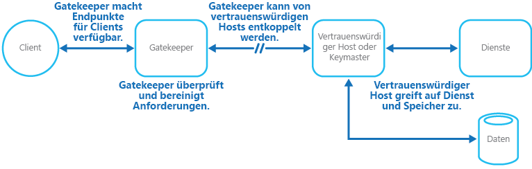

# Muster „Gatekeeper“

[!INCLUDE [header](../_includes/header.md)]

Schützen Sie Anwendungen und Dienste durch Verwendung einer dedizierten Hostinstanz, die als Broker zwischen Clients und der Anwendung oder dem Dienst fungiert, Anforderungen überprüft und bereinigt sowie Anforderungen und Daten zwischen ihnen weiterleitet. Dies kann eine zusätzliche Sicherheitsschicht schaffen und die Angriffsfläche des Systems reduzieren.

## Kontext und Problem

Anwendungen machen ihre Funktionalität den Clients verfügbar, indem sie Anforderungen annehmen und verarbeiten. In Szenarien, bei denen Anwendungen in der Cloud gehostet werden, machen diese Anwendungen Endpunkte verfügbar, mit denen Clients eine Verbindung herstellen. Zudem enthalten sie in der Regel den Code, um die Anforderungen von Clients zu verarbeiten. Dieser Code führt die Authentifizierung und Überprüfung sowie einen Teil oder die gesamte Verarbeitung von Anforderungen durch und greift aller Wahrscheinlichkeit nach für den Client auf Speicher und andere Dienste zu.

Wenn ein böswilliger Benutzer in der Lage ist, das System zu gefährden und Zugriff auf die Hostingumgebung der Anwendung zu erlangen, werden die von ihm verwendeten Sicherheitsmechanismen wie Anmeldeinformationen und Speicherschlüssel sowie die Dienste und Daten, auf die er zugreift, verfügbar gemacht. Folglich kann der böswillige Benutzer ungehinderten Zugriff auf vertrauliche Informationen und andere Dienste erhalten.

## Lösung

Um das Risiko eines clientseitigen Zugriffs auf vertrauliche Informationen und Dienste zu minimieren, entkoppeln Sie Hosts oder Aufgaben, die öffentliche Endpunkte von dem Code, der Anforderungen verarbeitet und auf Speicher zugreift, verfügbar machen. Hierfür können Sie eine Fassade oder eine dedizierte Aufgabe verwenden, die mit Clients interagiert und die Anforderung dann – wahrscheinlich über eine entkoppelte Schnittstelle – an die Hosts oder Aufgaben übergibt, die die Anforderung bearbeiten. Die Abbildung zeigt eine allgemeine Übersicht über dieses Muster.

Das Muster „Gatekeeper“ kann einfach zum Schutz des Speichers oder als umfangreichere Fassade verwendet werden, um alle Funktionen der Anwendung zu schützen. Zu den wichtigsten Faktoren zählen Folgende:

- **Kontrollierte Überprüfung:** Der Gatekeeper überprüft alle Anforderungen und lehnt diejenigen ab, die die Überprüfungsanforderungen nicht erfüllen.
- **Begrenztes Risiko und begrenzte Verfügbarkeit:** Der Gatekeeper hat keinen Zugriff auf die Anmeldeinformationen oder Schlüssel, die vom vertrauenswürdigen Host für den Zugriff auf Speicher und Dienste verwendet werden. Wenn der Gatekeeper gefährdet ist, erhält der Angreifer keinen Zugriff auf diese Anmeldeinformationen oder Schlüssel.
- **Angemessener Schutz:** Der Gatekeeper wird in einem Modus mit beschränkten Berechtigungen ausgeführt, während der Rest der Anwendung im Modus mit voller Vertrauenswürdigkeit ausgeführt wird, der für den Zugriff auf Speicher und Dienste erforderlich ist. Wenn der Gatekeeper gefährdet ist, kann er nicht direkt auf die Anwendungsdienste oder -daten zugreifen.

Dieses Muster verhält sich wie eine Firewall in einer typischen Netzwerktopologie. Durch dieses kann der Gatekeeper Anforderungen prüfen und entscheiden, ob die Anforderung an den vertrauenswürdigen Host (auch als „Schlüsselmaster“ bezeichnet) übergeben werden soll, der die erforderlichen Aufgaben ausführt. Für eine solche Entscheidung muss der Gatekeeper den Anforderungsinhalt in der Regel überprüfen und bereinigen, bevor er ihn an den vertrauenswürdigen Host übergibt.

## Probleme und Überlegungen

Beachten Sie die folgenden Punkte bei der Entscheidung, wie dieses Muster implementiert werden soll:

- Stellen Sie sicher, dass die vertrauenswürdigen Hosts, denen der Gatekeeper Anforderungen übergibt, nur interne oder geschützte Endpunkte verfügbar macht und ausschließlich mit dem Gatekeeper eine Verbindung herstellt. Die vertrauenswürdigen Hosts sollten keine externen Endpunkte oder Schnittstellen verfügbar machen.
- Der Gatekeeper muss im Modus mit beschränkten Berechtigungen ausgeführt werden. In der Regel bedeutet dies, dass der Gatekeeper und der vertrauenswürdige Host in Diensten oder auf virtuellen Computern, die separat gehostet werden, ausgeführt werden.
- Der Gatekeeper sollte keine Verarbeitungsaufgaben im Zusammenhang mit der Anwendung oder den Diensten durchführen oder auf Daten zugreifen. Seine Funktion besteht ausschließlich darin, Anforderungen zu überprüfen und zu bereinigen. Die vertrauenswürdigen Hosts müssen möglicherweise eine zusätzliche Überprüfung von Anforderungen durchführen, die Kernüberprüfung sollte jedoch vom Gatekeeper durchgeführt werden.
- Verwenden Sie nach Möglichkeit einen sicheren Kommunikationskanal (HTTPS, SSL oder TLS) zwischen dem Gatekeeper und den vertrauenswürdigen Hosts oder Aufgaben. Allerdings unterstützen einige Hostingumgebungen nicht HTTPS an internen Endpunkten.
- Das Hinzufügen der zusätzlichen Schicht zur Anwendung für die Implementierung des Musters „Gatekeeper“ wird aufgrund der zusätzlichen Verarbeitung und Netzwerkkommunikation sehr wahrscheinlich Auswirkungen auf die Leistung haben.
- Die Gatekeeper-Instanz kann einen Single Point of Failure darstellen. Um die Auswirkungen eines Ausfalls zu minimieren, sollten Sie die Bereitstellung zusätzlicher Instanzen und die Verwendung eines Mechanismus zur automatischen Skalierung in Betracht ziehen. So stellen Sie sicher, dass Kapazitäten zur Aufrechterhaltung der Verfügbarkeit vorhanden sind.

## Verwendung dieses Musters

Dieses Muster ist hilfreich:

- Für Anwendungen, die vertrauliche Informationen verarbeiten, Dienste verfügbar machen, die im hohen Maße vor bösartigen Angriffen geschützt werden müssen, oder unternehmenskritische Vorgänge durchführen, die nicht unterbrochen werden sollten
- Für verteilte Anwendungen, bei denen die Überprüfung von Anforderungen zur einfacheren Wartung und Verwaltung getrennt von den Hauptaufgaben durchgeführt oder zentralisiert werden muss

## Beispiel

In einem Szenario, bei dem eine Anwendung in der Cloud gehostet wird, kann dieses Muster implementiert werden, indem die Gatekeeper-Rolle oder der virtuelle Computer von den vertrauenswürdigen Rollen und Diensten in einer Anwendung entkoppelt wird. Verwenden Sie hierfür als Zwischenkommunikationsmechanismus einen internen Endpunkt, eine Warteschlange oder einen Speicher. Die Abbildung zeigt die Verwendung eines internen Endpunkts.

## Verwandte Muster

Das [Muster „Valet-Schlüssel“](valet-key.md) kann ebenfalls für die Implementierung des Gatekeeper-Musters relevant sein. Bei der Kommunikation zwischen dem Gatekeeper und den vertrauenswürdigen Rollen ist es empfehlenswert, die Sicherheit durch die Verwendung von Schlüsseln oder Tokens zu erhöhen, die die Berechtigungen für den Zugriff auf Ressourcen einschränken. Es beschreibt, wie ein Token oder ein Schlüssel verwendet wird, das bzw. der Clients eingeschränkten direkten Zugriff auf eine bestimmte Ressource oder einen bestimmten Dienst bietet.
