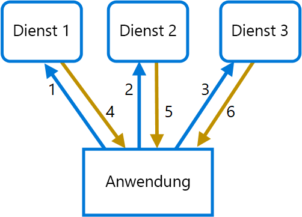

# <a name="gateway-aggregation-pattern"></a>Muster „Gatewayaggregation“

Aggregieren Sie mithilfe eines Gateways mehrere einzelne Anforderungen in einer einzelnen Anforderung. Dieses Muster ist hilfreich, wenn ein Client zur Durchführung eines Vorgangs mehrere Aufrufe an verschiedene Back-End-Systeme tätigen muss.

## <a name="context-and-problem"></a>Kontext und Problem

Um eine einzelne Aufgabe auszuführen, muss ein Client möglicherweise mehrere Aufrufe von verschiedenen Back-End-Diensten durchführen. Eine Anwendung, die zur Ausführung einer Aufgabe auf viele Dienste angewiesen ist, muss für jede Anforderung Ressourcen aufwenden. Wenn der Anwendung neue Features oder Dienste hinzugefügt werden, sind zusätzliche Anforderungen erforderlich, durch die sich der Ressourcenbedarf und die Anzahl der Netzwerkaufrufe weiter erhöhen. Eine derart umfangreiche Interaktion (Chattiness) zwischen einer Client- und einer Back-End-Anwendung können Leistung und Skalierung der Anwendung beeinträchtigen.  Durch Microservicearchitekturen ist dieses Problem immer verbreiteter geworden, da Anwendungen, die um viele kleinere Dienste herum erstellt werden, in der Regel eine größere Anzahl von dienstübergreifenden Aufrufen aufweisen. 

Im folgenden Diagramm sendet der Client Anforderungen an jeden Dienst (1, 2, 3). Jeder Dienst verarbeitet die Anforderung und sendet die Antwort an die Anwendung zurück (4, 5, 6). Bei einem Mobilfunknetz mit üblicherweise hohen Latenzen ist ein derartiger Einsatz einzelner Anforderungen ineffizient und kann Konnektivitätsabbrüche oder unvollständige Anforderungen verursachen. Die einzelnen Anforderungen können zwar parallel ausgeführt werden, allerdings muss die Anwendung für jede Anforderung Daten senden und verarbeiten bzw. auf diese warten. Da all diese Vorgänge über separate Verbindungen erfolgen, besteht hierbei eine höhere Wahrscheinlichkeit eines Ausfalls.

 

## <a name="solution"></a>Lösung

Verwenden Sie ein Gateway, um die umfangreiche Interaktion zwischen dem Client und den Diensten (Chattiness) zu reduzieren. Das Gateway empfängt Clientanforderungen, versendet Anforderungen an die verschiedenen Back-End-Systeme, aggregiert die Ergebnisse und sendet sie wieder an den anfordernden Client zurück.

Dieses Muster kann die Anzahl der Anforderungen, die die Anwendung an Back-End-Dienste sendet, reduzieren und die Anwendungsleistung für Netzwerke mit hohen Latenzen verbessern.

Im folgenden Diagramm sendet die Anwendung eine Anforderung an das Gateway (1). Die Anforderung enthält ein Paket mit zusätzlichen Anforderungen. Das Gateway zerlegt diese und verarbeitet jede Anforderung, indem es diese an den entsprechenden Dienst (2) sendet. Jeder Dienst gibt eine Antwort an das Gateway zurück (3). Das Gateway fasst die Antworten der einzelnen Dienste zusammen und sendet die Antwort an die Anwendung (4). Die Anwendung erstellt eine einzige Anforderung und erhält nur eine einzige Antwort vom Gateway.


## <a name="issues-and-considerations"></a>Probleme und Überlegungen

- Das Gateway sollte keine Kopplung zwischen Diensten für die Back-End-Dienste vornehmen.
- Das Gateway sollte sich in der Nähe der Back-End-Dienste befinden, um die Latenz so gering wie möglich zu halten.
- Der Gatewaydienst kann ein Single Point of Failure darstellen. Stellen Sie sicher, dass das Gateway die Verfügbarkeitsanforderungen Ihrer Anwendung erfüllt.
- Das Gateway kann einen Engpass darstellen. Stellen Sie sicher, dass das Gateway über die entsprechende Leistung zur Verarbeitung der Last verfügt und skaliert werden kann, um dem erwarteten Anstieg nachzukommen.
- Führen Sie einen Auslastungstest für das Gateway durch, um sicherzustellen, dass keine kaskadierenden Ausfälle bei den Diensten auftreten.
- Implementieren Sie einen stabilen Entwurf unter Verwendung von Mustern wie [Bulkheads][bulkhead], [Sicherung][circuit-breaker], [Wiederholung][retry] und Timeouts.
- Wenn Dienstaufrufe zu lange dauern, kann es helfen, ein Timeout durchzuführen und einen Teil des Datasets zurückzugeben. Berücksichtigen Sie, wie sich Ihre Anwendung in diesem Szenario verhält.
- Verwenden Sie asynchrone E/A-Vorgänge, um sicherzustellen, dass eine Verzögerung am Back-End keine Leistungsprobleme in der Anwendung verursacht.
- Implementieren Sie mithilfe von Korrelations-IDs verteilte Ablaufverfolgungen, um jeden einzelnen Aufruf nachzuverfolgen.
- Überwachen Sie Anforderungsmetriken und Antwortgrößen.
- Betrachten Sie die Rückgabe von zwischengespeicherten Daten als Failoverstrategie, um Ausfälle zu behandeln.
- Statt eine Aggregation in das Gateway zu integrieren, sollten Sie eventuell einen Aggregationsdienst hinter dem Gateway platzieren. Für die Aggregation von Anforderungen gelten wahrscheinlich andere Ressourcenanforderungen als für andere Dienste im Gateway, was sich auf die Routing- und Abladungsfunktionalität des Gateways auswirken kann.

## <a name="when-to-use-this-pattern"></a>Verwendung dieses Musters

Verwenden Sie dieses Muster in folgenden Fällen:

- Ein Client muss mit mehreren Back-End-Diensten kommunizieren, um einen Vorgang durchführen zu können.
- Der Client kann Netzwerke mit deutlich hoher Latenz verwenden (z.B. Mobilfunknetze).

Dieses Muster ist in folgenden Fällen möglicherweise nicht geeignet:

- Sie möchten die Anzahl der Aufrufe zwischen einem Client und einem einzelnen Dienst für mehrere Vorgänge reduzieren. In diesem Szenario kann es besser sein, dem Dienst einen Batchvorgang hinzuzufügen.
- Der Client oder die Anwendung befindet sich in der Nähe der Back-End-Dienste, und Latenzen spielen keine wesentliche Rolle.

## <a name="example"></a>Beispiel

Das folgende Beispiel zeigt, wie mit Lua ein einfacher NGINX-Dienst für die Gatewayaggregation erstellt wird.

```lua
worker_processes  4;

events {
  worker_connections 1024;
}

http {
  server {
    listen 80;

    location = /batch {
      content_by_lua '
        ngx.req.read_body()

        -- read json body content
        local cjson = require "cjson"
        local batch = cjson.decode(ngx.req.get_body_data())["batch"]

        -- create capture_multi table
        local requests = {}
        for i, item in ipairs(batch) do
          table.insert(requests, {item.relative_url, { method = ngx.HTTP_GET}})
        end

        -- execute batch requests in parallel
        local results = {}
        local resps = { ngx.location.capture_multi(requests) }
        for i, res in ipairs(resps) do
          table.insert(results, {status = res.status, body = cjson.decode(res.body), header = res.header})
        end

        ngx.say(cjson.encode({results = results}))
      ';
    }

    location = /service1 {
      default_type application/json;
      echo '{"attr1":"val1"}';
    }

    location = /service2 {
      default_type application/json;
      echo '{"attr2":"val2"}';
    }
  }
}
```

## <a name="related-guidance"></a>Verwandte Leitfäden

- [Muster „Back-Ends für Front-Ends“](./backends-for-frontends.md)
- [Muster „Gatewayabladung“](./gateway-offloading.md)
- [Muster „Gatewayrouting“](./gateway-routing.md)

[bulkhead]: ./bulkhead.md
[circuit-breaker]: ./circuit-breaker.md
[retry]: ./retry.md