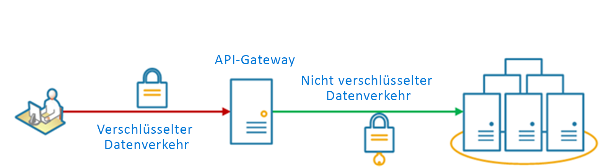

# <a name="gateway-offloading-pattern"></a><span data-ttu-id="4080e-103">Muster „Gatewayabladung“</span><span class="sxs-lookup"><span data-stu-id="4080e-103">Gateway Offloading pattern</span></span>

<span data-ttu-id="4080e-104">Es wird beschrieben, wie Sie freigegebene oder spezielle Dienstfunktionen an einen Gatewayproxy auslagern.</span><span class="sxs-lookup"><span data-stu-id="4080e-104">Offload shared or specialized service functionality to a gateway proxy.</span></span> <span data-ttu-id="4080e-105">Mit diesem Muster können Sie die Anwendungsentwicklung vereinfachen, indem Sie gemeinsam genutzte Dienstfunktionen, z.B. die Verwendung von SSL-Zertifikaten, aus anderen Teilen der Anwendung auf das Gateway verschieben.</span><span class="sxs-lookup"><span data-stu-id="4080e-105">This pattern can simplify application development by moving shared service functionality, such as the use of SSL certificates, from other parts of the application into the gateway.</span></span>

## <a name="context-and-problem"></a><span data-ttu-id="4080e-106">Kontext und Problem</span><span class="sxs-lookup"><span data-stu-id="4080e-106">Context and problem</span></span>

<span data-ttu-id="4080e-107">Einige Features werden häufig über mehrere Dienste hinweg verwendet, sodass dafür die entsprechende Konfiguration, Verwaltung und Wartung erforderlich ist.</span><span class="sxs-lookup"><span data-stu-id="4080e-107">Some features are commonly used across multiple services, and these features require configuration, management, and maintenance.</span></span> <span data-ttu-id="4080e-108">Ein freigegebener oder spezialisierter Dienst, der mit jeder Anwendungsbereitstellung verteilt wird, erhöht den Verwaltungsaufwand und die Wahrscheinlichkeit für Bereitstellungsfehler.</span><span class="sxs-lookup"><span data-stu-id="4080e-108">A shared or specialized service that is distributed with every application deployment increases the administrative overhead and increases the likelihood of deployment error.</span></span> <span data-ttu-id="4080e-109">Alle Updates eines freigegebenen Features müssen für alle Dienste bereitgestellt werden, von denen dieses Feature gemeinsam genutzt wird.</span><span class="sxs-lookup"><span data-stu-id="4080e-109">Any updates to a shared feature must be deployed across all services that share that feature.</span></span>

<span data-ttu-id="4080e-110">Der richtige Umgang mit Sicherheitsproblemen (Tokenüberprüfung, Verschlüsselung, SSL-Zertifikatverwaltung) und andere komplexe Aufgaben können bedingen, dass Teammitglieder über sehr spezielle Fähigkeiten verfügen.</span><span class="sxs-lookup"><span data-stu-id="4080e-110">Properly handling security issues (token validation, encryption, SSL certificate management) and other complex tasks can require team members to have highly specialized skills.</span></span> <span data-ttu-id="4080e-111">Beispielsweise muss ein Zertifikat, das von einer Anwendung benötigt wird, auf allen Anwendungsinstanzen konfiguriert und bereitgestellt werden.</span><span class="sxs-lookup"><span data-stu-id="4080e-111">For example, a certificate needed by an application must be configured and deployed on all application instances.</span></span> <span data-ttu-id="4080e-112">Für jede neue Bereitstellung muss das Zertifikat verwaltet werden, um sicherzustellen, dass es nicht abläuft.</span><span class="sxs-lookup"><span data-stu-id="4080e-112">With each new deployment, the certificate must be managed to ensure that it does not expire.</span></span> <span data-ttu-id="4080e-113">Alle allgemeinen Zertifikate, deren Ablauf bevorsteht, müssen bei jeder Anwendungsbereitstellung aktualisiert, getestet und überprüft werden.</span><span class="sxs-lookup"><span data-stu-id="4080e-113">Any common certificate that is due to expire must be updated, tested, and verified on every application deployment.</span></span>

<span data-ttu-id="4080e-114">Andere gemeinsam genutzte Dienste, z.B. Authentifizierung, Autorisierung, Protokollierung, Überwachung oder [Drosselung](./throttling.md), können für eine große Zahl von Bereitstellungen schwierig zu implementieren und zu verwalten sein.</span><span class="sxs-lookup"><span data-stu-id="4080e-114">Other common services such as authentication, authorization, logging, monitoring, or [throttling](./throttling.md) can be difficult to implement and manage across a large number of deployments.</span></span> <span data-ttu-id="4080e-115">Es kann besser sein, diese Art von Funktionen zu konsolidieren, um den Aufwand und die Fehlerwahrscheinlichkeit zu reduzieren.</span><span class="sxs-lookup"><span data-stu-id="4080e-115">It may be better to consolidate this type of functionality, in order to reduce overhead and the chance of errors.</span></span>

## <a name="solution"></a><span data-ttu-id="4080e-116">Lösung</span><span class="sxs-lookup"><span data-stu-id="4080e-116">Solution</span></span>

<span data-ttu-id="4080e-117">Lagern Sie einige Features auf ein API-Gateway aus. Dies gilt vor allem für sich überschneidende Bereiche wie die Zertifikatverwaltung, Authentifizierung, SSL-Beendigung, Überwachung, Protokollübersetzung oder Drosselung.</span><span class="sxs-lookup"><span data-stu-id="4080e-117">Offload some features into an API gateway, particularly cross-cutting concerns such as certificate management, authentication, SSL termination, monitoring, protocol translation, or throttling.</span></span> 

<span data-ttu-id="4080e-118">Im folgenden Diagramm ist ein API-Gateway dargestellt, mit dem eingehende SSL-Verbindungen beendet werden.</span><span class="sxs-lookup"><span data-stu-id="4080e-118">The following diagram shows an API gateway that terminates inbound SSL connections.</span></span> <span data-ttu-id="4080e-119">Hiermit werden Daten im Namen des ursprünglichen Anforderers von einem beliebigen HTTP-Server abgerufen, der dem API-Gateway vorgeschaltet ist.</span><span class="sxs-lookup"><span data-stu-id="4080e-119">It requests data on behalf of the original requestor from any HTTP server upstream of the API gateway.</span></span>

 
 
<span data-ttu-id="4080e-120">Vorteile dieses Musters:</span><span class="sxs-lookup"><span data-stu-id="4080e-120">Benefits of this pattern include:</span></span>

- <span data-ttu-id="4080e-121">Die Entwicklung von Diensten wird vereinfacht, indem das Verteilen und Warten von unterstützenden Ressourcen entfällt, z.B. Webserverzertifikate und die Konfiguration für sichere Websites.</span><span class="sxs-lookup"><span data-stu-id="4080e-121">Simplify the development of services by removing the need to distribute and maintain supporting resources, such as web server certificates and configuration for secure websites.</span></span> <span data-ttu-id="4080e-122">Eine einfachere Konfiguration führt zu einer Vereinfachung der Verwaltung und Skalierbarkeit und erleichtert die Durchführung von Dienstupgrades.</span><span class="sxs-lookup"><span data-stu-id="4080e-122">Simpler configuration results in easier management and scalability and makes service upgrades simpler.</span></span>

- <span data-ttu-id="4080e-123">Dedizierte Teams können Features implementieren, für die besondere Kenntnisse erforderlich sind, z.B. im Bereich der Sicherheit.</span><span class="sxs-lookup"><span data-stu-id="4080e-123">Allow dedicated teams to implement features that require specialized expertise, such as security.</span></span> <span data-ttu-id="4080e-124">So kann sich Ihr Kernteam auf die Anwendungsfunktionen konzentrieren und diese speziellen Probleme, die trotzdem mehrere Bereiche betreffen, den jeweiligen Experten überlassen.</span><span class="sxs-lookup"><span data-stu-id="4080e-124">This allows your core team to focus on the application functionality, leaving these specialized but cross-cutting concerns to the relevant experts.</span></span>

- <span data-ttu-id="4080e-125">Es kann Einheitlichkeit in Bezug auf die Protokollierung und Überwachung von Anforderungen und Antworten erzielt werden.</span><span class="sxs-lookup"><span data-stu-id="4080e-125">Provide some consistency for request and response logging and monitoring.</span></span> <span data-ttu-id="4080e-126">Auch wenn ein Dienst nicht richtig instrumentiert wurde, kann das Gateway so konfiguriert werden, dass ein Mindestmaß an Überwachung und Protokollierung sichergestellt ist.</span><span class="sxs-lookup"><span data-stu-id="4080e-126">Even if a service is not correctly instrumented, the gateway can be configured to ensure a minimum level of monitoring and logging.</span></span>

## <a name="issues-and-considerations"></a><span data-ttu-id="4080e-127">Probleme und Überlegungen</span><span class="sxs-lookup"><span data-stu-id="4080e-127">Issues and considerations</span></span>

- <span data-ttu-id="4080e-128">Stellen Sie sicher, dass das API-Gateway hoch verfügbar und robust gegenüber Fehlern ist.</span><span class="sxs-lookup"><span data-stu-id="4080e-128">Ensure the API gateway is highly available and resilient to failure.</span></span> <span data-ttu-id="4080e-129">Vermeiden Sie Single Points of Failure, indem Sie mehrere Instanzen Ihres API-Gateways ausführen.</span><span class="sxs-lookup"><span data-stu-id="4080e-129">Avoid single points of failure by running multiple instances of your API gateway.</span></span> 
- <span data-ttu-id="4080e-130">Stellen Sie sicher, dass das Gateway für die Kapazitäts- und Skalierungsanforderungen Ihrer Anwendung und Endpunkte ausgelegt ist.</span><span class="sxs-lookup"><span data-stu-id="4080e-130">Ensure the gateway is designed for the capacity and scaling requirements of your application and endpoints.</span></span> <span data-ttu-id="4080e-131">Sorgen Sie dafür, dass das Gateway nicht zu einem Engpass für die Anwendung wird und in ausreichendem Maße skaliert werden kann.</span><span class="sxs-lookup"><span data-stu-id="4080e-131">Make sure the gateway does not become a bottleneck for the application and is sufficiently scalable.</span></span>
- <span data-ttu-id="4080e-132">Lagern Sie nur Features aus, die von der gesamten Anwendung genutzt werden, z.B. Sicherheit oder Datenübertragung.</span><span class="sxs-lookup"><span data-stu-id="4080e-132">Only offload features that are used by the entire application, such as security or data transfer.</span></span>
- <span data-ttu-id="4080e-133">Geschäftslogik sollte niemals auf das API-Gateway ausgelagert werden.</span><span class="sxs-lookup"><span data-stu-id="4080e-133">Business logic should never be offloaded to the API gateway.</span></span> 
- <span data-ttu-id="4080e-134">Wenn Sie Transaktionen nachverfolgen müssen, sollten Sie erwägen, Korrelations-IDs für Protokollierungszwecke zu generieren.</span><span class="sxs-lookup"><span data-stu-id="4080e-134">If you need to track transactions, consider generating correlation IDs for logging purposes.</span></span>

## <a name="when-to-use-this-pattern"></a><span data-ttu-id="4080e-135">Verwendung dieses Musters</span><span class="sxs-lookup"><span data-stu-id="4080e-135">When to use this pattern</span></span>

<span data-ttu-id="4080e-136">Verwenden Sie dieses Muster in folgenden Fällen:</span><span class="sxs-lookup"><span data-stu-id="4080e-136">Use this pattern when:</span></span>

- <span data-ttu-id="4080e-137">Für eine Anwendungsbereitstellung besteht eine übergreifende Zuständigkeit, z.B. in Bezug auf SSL-Zertifikate oder die Verschlüsselung.</span><span class="sxs-lookup"><span data-stu-id="4080e-137">An application deployment has a shared concern such as SSL certificates or encryption.</span></span>
- <span data-ttu-id="4080e-138">Ein Feature, dass über Anwendungsbereitstellungen (ggf. mit unterschiedlichen Ressourcenanforderungen) hinweg gemeinsam genutzt wird, z.B. Arbeitsspeicherressourcen, Speicherkapazität oder Netzwerkverbindungen.</span><span class="sxs-lookup"><span data-stu-id="4080e-138">A feature that is common across application deployments that may have different resource requirements, such as memory resources, storage capacity or network connections.</span></span>
- <span data-ttu-id="4080e-139">Sie möchten die Zuständigkeit für Probleme, z.B. Netzwerksicherheit, Drosselung oder andere Fragen zu Netzwerkgrenzen, an ein Team mit besserer Spezialisierung vergeben.</span><span class="sxs-lookup"><span data-stu-id="4080e-139">You wish to move the responsibility for issues such as network security, throttling, or other network boundary concerns to a more specialized team.</span></span>

<span data-ttu-id="4080e-140">Dieses Muster ist unter Umständen nicht geeignet, wenn es dabei zu einer Kopplung zwischen Diensten kommt.</span><span class="sxs-lookup"><span data-stu-id="4080e-140">This pattern may not be suitable if it introduces coupling across services.</span></span>

## <a name="example"></a><span data-ttu-id="4080e-141">Beispiel</span><span class="sxs-lookup"><span data-stu-id="4080e-141">Example</span></span>

<span data-ttu-id="4080e-142">Indem Nginx als Appliance für die SSL-Auslagerung verwendet wird, wird mit der folgenden Konfiguration eine eingehende SSL-Verbindung beendet und die Verbindung auf einen von drei vorgeschalteten HTTP-Servern verteilt.</span><span class="sxs-lookup"><span data-stu-id="4080e-142">Using Nginx as the SSL offload appliance, the following configuration terminates an inbound SSL connection and distributes the connection to one of three upstream HTTP servers.</span></span>

```
upstream iis {
        server  10.3.0.10    max_fails=3    fail_timeout=15s;
        server  10.3.0.20    max_fails=3    fail_timeout=15s;
        server  10.3.0.30    max_fails=3    fail_timeout=15s;
}

server {
        listen 443;
        ssl on;
        ssl_certificate /etc/nginx/ssl/domain.cer;
        ssl_certificate_key /etc/nginx/ssl/domain.key;

        location / {
                set $targ iis;
                proxy_pass http://$targ;
                proxy_set_header X-Forwarded-For $proxy_add_x_forwarded_for;
                proxy_set_header X-Forwarded-Proto https;
proxy_set_header X-Real-IP $remote_addr;
                proxy_set_header Host $host;
        }
}
```

## <a name="related-guidance"></a><span data-ttu-id="4080e-143">Verwandte Anweisungen</span><span class="sxs-lookup"><span data-stu-id="4080e-143">Related guidance</span></span>

- [<span data-ttu-id="4080e-144">Muster „Back-Ends für Front-Ends“</span><span class="sxs-lookup"><span data-stu-id="4080e-144">Backends for Frontends pattern</span></span>](./backends-for-frontends.md)
- [<span data-ttu-id="4080e-145">Muster „Gatewayaggregation“</span><span class="sxs-lookup"><span data-stu-id="4080e-145">Gateway Aggregation pattern</span></span>](./gateway-aggregation.md)
- [<span data-ttu-id="4080e-146">Muster „Gatewayrouting“</span><span class="sxs-lookup"><span data-stu-id="4080e-146">Gateway Routing pattern</span></span>](./gateway-routing.md)

