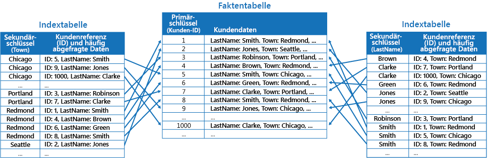
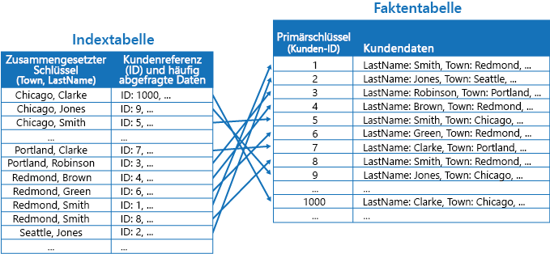
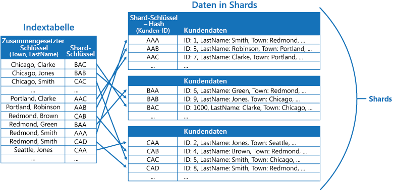
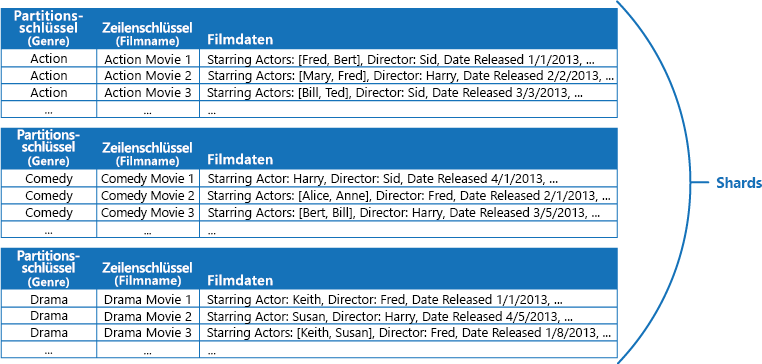

# Muster „Indextabelle“

[!INCLUDE [header](../_includes/header.md)]

Erstellen Sie Indizes für die Felder im Datenspeicher, auf die häufig von Abfragen verwiesen wird. Dieses Muster kann die Abfrageleistung verbessern, indem es Anwendungen das schnellere Auffinden der Daten, die aus einem Datenspeicher abgerufen werden sollen, ermöglicht.

## Kontext und Problem

Viele Datenspeicher organisieren die Daten für eine Sammlung von Entitäten unter Verwendung des Primärschlüssels. Mit diesem Schlüssel kann eine Anwendung Daten suchen und abrufen. Die Abbildung zeigt ein Beispiel für einen Datenspeicher, der Kundeninformationen enthält. Bei dem Primärschlüssel handelt es sich um die Kunden-ID. Die Abbildung zeigt die nach Primärschlüssel (Kunden-ID) organisierten Kundeninformationen.

Der Primärschlüssel ist zwar für Abfragen nützlich, die Daten basierend auf dem Wert dieses Schlüssels abrufen, eine Anwendung kann den Primärschlüssel möglicherweise jedoch nicht verwenden, wenn sie Daten basierend auf einem anderen Feld abrufen muss. Im Beispiel mit den Kundendaten kann eine Anwendung keine Kunden mithilfe der als Primärschlüssel dienenden Kunden-ID abrufen, wenn Daten ausschließlich über den Wert eines anderen Attributs abfragt werden (z.B. der Stadt, in der der Kunde ansässig ist). Um eine solche Abfrage durchzuführen, muss die Anwendung möglicherweise jeden Kundendatensatz abrufen und untersuchen, was sich als langwieriger Prozess erweisen kann.

Viele Managementsysteme für relationale Datenbanken unterstützen sekundäre Indizes. Ein sekundärer Index ist eine separate Datenstruktur, die nach einem oder mehreren Feldern für andere Schlüssel als Primärschlüssel (Sekundärschlüssel) organisiert ist, und weist darauf hin, wo die Daten für die einzelnen indizierten Werte gespeichert werden. Die Elemente in einem sekundären Index werden in der Regel nach dem Wert der Sekundärschlüssel sortiert, um eine schnelle Suche nach Daten zu ermöglichen. Diese Indizes werden in der Regel automatisch vom Datenbankmanagementsystem verwaltet.

Sie können beliebig viele sekundäre Indizes erstellen, um die verschiedenen von Ihrer Anwendung durchgeführten Abfragen zu unterstützen. Beispielsweise ist es in einer Tabelle mit Kundendaten in einer relationalen Datenbank, in der die Kunden-ID als Primärschlüssel dient, vorteilhaft, einen sekundären Index über das Feld „Town“ hinzuzufügen, wenn die Anwendung häufig anhand des Wohnsitzes nach Kunden sucht.

Obwohl Sekundärindizes in relationalen Systemen weit verbreitet sind, bieten die meisten von Cloudanwendungen verwendeten NoSQL-Datenspeicher keine vergleichbare Funktion.

## Lösung

Wenn der Datenspeicher keine Sekundärindizes unterstützt, können Sie diese manuell emulieren, indem Sie eigene Indextabellen erstellen. Eine Indextabelle organisiert die Daten nach einem bestimmten Schlüssel. Für die Strukturierung einer Indextabelle werden üblicherweise drei Strategien angewendet, je nachdem, wie viele Sekundärindizes benötigt werden und welche Arten von Abfragen von einer Anwendung durchgeführt werden.

Die erste Strategie besteht darin, die Daten in jeder Indextabelle zu duplizieren, aber nach verschiedenen Schlüsseln zu organisieren (vollständige Denormalisierung). Die folgende Abbildung zeigt Indextabellen, die die gleichen Kundeninformationen nach den Attributen „Town“ und „LastName“ organisiert.

Diese Strategie ist sinnvoll, wenn die Daten im Verhältnis zur Anzahl der Abfragen, die mit den einzelnen Schlüsseln durchgeführt werden, relativ statisch sind. Wenn die Daten dynamischer sind, wird der Verarbeitungsaufwand für die Verwaltung der einzelnen Indextabellen zu groß, als dass dieser Ansatz sinnvoll wäre. Zudem ist bei einem sehr großen Datenvolumen der Speicherplatzbedarf für die Speicherung der doppelten Daten beträchtlich.

Die zweite Strategie besteht darin, normalisierte, nach verschiedenen Schlüsseln organisierte Indextabellen zu erstellen und mithilfe des Primärschlüssels auf die Originaldaten zu verweisen, anstatt sie zu duplizieren, wie in der folgenden Abbildung gezeigt wird. Die Originaldaten werden als „Faktentabelle“ bezeichnet.

Diese Methode spart Speicherplatz und reduziert den Aufwand für die Verwaltung doppelter Daten. Der Nachteil ist, dass eine Anwendung zwei Suchvorgänge durchführen muss, um Daten mithilfe eines Sekundärschlüssels zu suchen. Sie muss den Primärschlüssel für die Daten in der Indextabelle suchen und die Daten dann mithilfe des Primärschlüssels in der Faktentabelle nachschlagen.

Die dritte Strategie besteht darin, teilweise normalisierte Indextabellen – organisiert nach verschiedenen Schlüsseln – zu erstellen, die häufig abgerufene Felder duplizieren. Verweisen Sie auf die Faktentabelle, um auf seltener verwendete Felder zuzugreifen. Die folgende Abbildung zeigt, wie häufig verwendete Daten in den einzelnen Indextabellen dupliziert werden.

Diese Strategie ist der goldene Mittelweg zwischen den ersten beiden Vorgehensweisen. Die Daten für häufige Abfragen können durch einen einzigen Suchvorgang schnell abgerufen werden, wobei der Speicherplatzbedarf und Verwaltungsaufwand nicht so hoch ausfallen wie bei der Duplizierung des gesamten Datasets.

Wenn eine Anwendung häufig durch eine Kombination von Werten Daten abfragt (z.B. „Finde alle Kunden, die in Redmond leben und mit Nachnamen „Smith“ heißen“), können Sie die Schlüssel für die Elemente in der Indextabelle als Verkettung des Town- und LastName-Attributs implementieren. Die folgende Abbildung zeigt eine Indextabelle basierend auf zusammengesetzten Schlüsseln. Sortiert werden die Schlüssel nach dem Town-Attribut und bei Datensätzen, die den gleichen Wert für das Town-Attribut enthalten, dann nach dem LastName-Attribut.

Indextabellen können Abfragevorgänge durch in Shards unterteilte Daten beschleunigen und sind besonders nützlich, wenn der Shardschlüssel mit Hashes versehen ist. Die folgende Abbildung zeigt ein Beispiel, bei dem der Shardschlüssel einen Hash der Kunden-ID darstellt. Die Indextabelle kann die Daten nach dem Wert ohne Hash (Town und LastName) organisieren und den Shardschlüssel mit Hash als Suchdaten zur Verfügung stellen. Dies erspart der Anwendung das wiederholte Berechnen von Hashschlüsseln (ein kostspieliger Vorgang), wenn sie Daten innerhalb eines Bereichs abrufen oder in der Reihenfolge des Schlüssels ohne Hash abrufen muss. Beispielsweise kann eine Abfrage wie „Finde alle Kunden, die in Redmond leben“ schnell gelöst werden, indem die entsprechenden Elemente in der Indextabelle, in der alle Elemente in einem zusammenhängenden Block gespeichert sind, gesucht werden. Folgen Sie dann mithilfe der in der Indextabelle gespeicherten Shardschlüssel den Verweisen auf die Kundendaten.

## Probleme und Überlegungen

Beachten Sie die folgenden Punkte bei der Entscheidung, wie dieses Muster implementiert werden soll:

- Der Aufwand für die Verwaltung von Sekundärindizes kann enorm sein. Sie müssen die Abfragen, die Ihre Anwendung verwendet, analysieren und verstehen. Erstellen Sie Indextabellen nur dann, wenn diese aller Wahrscheinlichkeit nach regelmäßig verwendet werden. Erstellen Sie keine Indextabellen für hypothetische Fälle, um Abfragen zu unterstützen, die eine Anwendung nicht oder nur gelegentlich ausführt.
- Durch das Duplizieren von Daten in einer Indextabelle können sich die Gemeinkosten in Bezug auf den Speicher und den Aufwand für die Verwaltung mehrerer Datenkopien signifikant erhöhen.
- Um eine Indextabelle als normalisierte Struktur zu implementieren, die auf die Originaldaten verweist, muss eine Anwendung für die Datensuche zwei Suchvorgänge durchführen. Der erste Vorgang durchsucht die Indextabelle, um den Primärschlüssel abzurufen, während der zweite Vorgang den Primärschlüssel zum Abrufen der Daten verwendet.
- Wenn ein System mehrere Indextabellen in verschiedenen sehr großen Datasets enthält, kann es schwierig sein, die Konsistenz zwischen Indextabellen und den Originaldaten aufrechtzuerhalten. Die Anwendung kann eventuell nach dem Modell der letztlichen Konsistenz entworfen werden. Um beispielsweise Daten einzufügen, zu aktualisieren oder zu löschen, könnte eine Anwendung eine Nachricht in eine Warteschlange einreihen. Anschließend könnte sie einen separaten Task den Vorgang durchführen und die Indextabellen, die auf diese Daten asynchron verweisen, verwalten lassen. Weitere Informationen zum Implementieren von letztlicher Konsistenz finden Sie unter [Data Consistency Primer](https://msdn.microsoft.com/library/dn589800.aspx) (Grundlagen der Datenkonsistenz).

   >  Microsoft Azure-Speichertabellen unterstützen transaktionale Updates für Änderungen an Daten in derselben Partition (als „Entitätsgruppentransaktionen“ bezeichnet). Wenn Sie die Daten für eine Faktentabelle und eine oder mehrere Indextabellen in derselben Partition speichern können, können Sie mithilfe dieser Funktion Konsistenz gewährleisten.

- Indextabellen können selbst partitioniert oder mit Shards konfiguriert sein.

## Verwendung dieses Musters

Verwenden Sie dieses Muster, um die Abfrageleistung zu verbessern, wenn eine Anwendung häufig mit einem anderen Schlüssel als den Primärschlüssel (bzw. Shardschlüssel) Daten abrufen muss.

Dieses Muster ist in folgenden Fällen möglicherweise nicht geeignet:

- Bei den Daten handelt es sich um temporäre Daten. Eine Indextabelle kann sehr schnell veraltet sein, wodurch sie ineffizient wird oder der Aufwand für die Verwaltung der Indextabelle die durch die Verwendung der Indextabelle erzielten Einsparungen übersteigt.
- Ein Feld, das als Sekundärschlüssel für eine Indextabelle ausgewählt wurde, ist nicht unterscheidend und kann nur eine kleine Menge von Werten (z.B. Geschlecht) enthalten.
- Die Datenwerte für ein Feld, das als Sekundärschlüssel für eine Indextabelle ausgewählt wurde, sind unterschiedlich verteilt. Wenn z.B. 90 % der Datensätze den gleichen Wert in einem Feld enthalten, kann die Erstellung und Verwaltung einer Indextabelle zum Nachschlagen von Daten basierend auf diesem Feld mit einem größeren Aufwand verbunden sein als das sequentielle Durchsuchen der Daten. Wenn sehr häufig Werte in den verbleibenden 10 % der Datensätze abgefragt werden, kann sich dieser Index dagegen als nützlich erweisen. Daher sollten Sie sich bewusst machen, welche Abfragen und wie häufig diese von Ihrer Anwendung ausgeführt werden.

## Beispiel

Azure-Speichertabellen stellen einen hochgradig skalierbaren Schlüssel-/Wertdatenspeicher für Anwendungen bereit, die in der Cloud ausgeführt werden. Anwendungen speichern und rufen Datenwerte durch Angabe eines Schlüssels ab. Die Datenwerte können mehrere Felder enthalten, doch die Struktur eines Datenelements ist für einen Tabellenspeicher opak, der ein Datenelement einfach als Array von Bytes verarbeitet.

Azure-Speichertabellen unterstützen auch Sharding. Der Shardingschlüssel enthält zwei Elemente: einen Partitionsschlüssel und einen Zeilenschlüssel. Elemente mit dem gleichen Partitionsschlüssel werden in der gleichen Partition (Shard) gespeichert und in einem Shard in der Reihenfolge der Zeilenschlüssel gespeichert. Der Tabellenspeicher ist für die Ausführung von Abfragen optimiert, die Daten in einem zusammenhängenden Bereich von Zeilenschlüsselwerten innerhalb einer Partition abrufen. Wenn Sie Cloudanwendungen erstellen, die Informationen in Azure-Tabellen speichern, sollten Sie Ihre Daten unter Berücksichtigung dieses Features strukturieren.

Sehen wir uns zum Beispiel eine Anwendung an, die Informationen über Filme speichert. Die Anwendung fragt Filme häufig nach Genre ab (Action, Dokumentarfilm, historischer Film, Komödie, Drama etc.). Sie könnten eine Azure-Tabelle mit Partitionen für jedes Genre erstellen, indem Sie das Genre als Partitionsschlüssel verwenden und den Filmnamen als Zeilenschlüssel angeben, wie in der folgende Abbildung gezeigt wird.

Diese Vorgehensweise ist nicht sehr effizient, wenn die Anwendung auch Filme nach Darstellern abfragen muss. In diesem Fall können Sie eine separate Azure-Tabelle erstellen, die als Indextabelle fungiert. Als Partitionsschlüssel dient der Darsteller und als Zeilenschlüssel der Filmname. Die Daten für jeden Darsteller werden in separaten Partitionen gespeichert. Wenn ein Film mehrere Darsteller enthält, wird derselbe Film in mehreren Partitionen angezeigt.

Sie können die Filmdaten in den Werten der einzelnen Partitionen duplizieren, indem Sie die im oben beschriebenen Abschnitt „Lösung“ erste Vorgehensweise befolgen. Da jeder Film jedoch wahrscheinlich mehrmals repliziert wird (einmal pro Darsteller), kann es effizienter sein, die Daten teilweise zu denormalisieren, um die gängigsten Abfragen (z.B. für die Namen der anderen Darsteller) zu unterstützen. Zudem sollte eine Anwendung alle verbleibenden Details abrufen können, indem sie den Partitionsschlüssel verwendet, der für die Suche nach vollständigen Informationen in den Genrepartitionen notwendig ist. Diese Vorgehensweise wird durch die dritte Option im Abschnitt „Lösung“ beschrieben. In der folgenden Abbildung wird diese Vorgehensweise veranschaulicht.

## Zugehörige Muster und Anleitungen

Die folgenden Muster und Anweisungen können ebenfalls für die Implementierung dieses Musters relevant sein:

- [Data Consistency Primer (Grundlagen der Datenkonsistenz)](https://msdn.microsoft.com/library/dn589800.aspx): Eine Indextabelle muss bei Änderungen an Daten, die sie indiziert, aktualisiert werden. In der Cloud ist es eventuell nicht möglich oder angebracht, Vorgänge durchzuführen, die im Rahmen derselben Transaktion für die Datenänderung einen Index aktualisieren. In diesem Fall ist eine letztlich konsistente Vorgehensweise angebrachter. Dieser Artikel enthält Informationen über die mit letztlicher Konsistenz verbundenen Probleme.
- [Muster „Sharding“](https://msdn.microsoft.com/library/dn589797.aspx): Das Muster „Indextabelle“ wird häufig in Verbindung mit Daten, die durch Shards partitioniert werden, verwendet. Das Muster „Sharding“ enthält weitere Informationen darüber, wie ein Datenspeicher in eine Gruppe von Shards aufgeteilt wird.
- [Muster „Materialisierte Sichten“](materialized-view.md): Statt Daten zu indizieren, um Abfragen zum Zusammenfassen von Daten zu unterstützen, kann es sinnvoller sein, eine materialisierte Sicht der Daten zu erstellen. In diesem Artikel wird beschrieben, wie effizientere Zusammenfassungsabfragen durch die Generierung von vordefinierten Datenansichten unterstützt werden.
