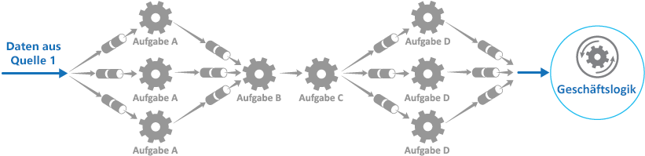

# <a name="pipes-and-filters-pattern"></a>Muster „Pipes und Filter“

[!INCLUDE [header](../_includes/header.md)]

Unterteilen Sie eine Aufgabe, die komplexe Verarbeitungsvorgänge ausführt, in eine Reihe von wiederverwendbaren separaten Elementen. Dies kann die Leistung, Skalierbarkeit und Wiederverwendbarkeit verbessern, indem Taskelemente, die Verarbeitungsvorgänge ausführen, unabhängig voneinander bereitgestellt und skaliert werden können.

## <a name="context-and-problem"></a>Kontext und Problem

Eine Anwendung muss verschiedene Tasks unterschiedlicher Komplexität mit den von ihr verarbeiteten Informationen ausführen. Ein einfacher, aber unflexibler Ansatz zur Implementierung einer Anwendung besteht darin, diese Verarbeitung in einem monolithischen Modul durchzuführen. Dieser Ansatz würde jedoch die Möglichkeiten zur Umgestaltung des Codes, zu seiner Optimierung und Wiederverwendung einschränken, wenn an anderer Stelle in der Anwendung Teile des gleichen Verarbeitungsmechanismus erforderlich sind.

Die Abbildung veranschaulicht die Problematik bei der Datenverarbeitung mit dem monolithischen Ansatz. Eine Anwendung empfängt und verarbeitet Daten aus zwei Quellen. Die Daten aus beiden Quellen werden von einem separaten Modul verarbeitet, das eine Reihe von Tasks zur Transformation dieser Daten ausführt, und das Ergebnis wird an die Geschäftslogik der Anwendung übergeben.


Einige Aufgaben, die die monolithischen Module durchführen, sind funktionell sehr ähnlich, doch die Module wurden separat entworfen. Der Code, der die Tasks implementiert, ist eng in einem Modul gekoppelt. Aspekte in Bezug auf die Wiederverwendung oder Skalierbarkeit wurden bei der Entwicklung kaum oder nicht berücksichtigt.

Die von den einzelnen Modulen ausgeführten Verarbeitungstasks bzw. die Bereitstellungsanforderungen für die einzelnen Tasks können sich jedoch ändern, wenn die Geschäftsanforderungen aktualisiert werden. Einige Tasks können rechenintensiv sein und sollten auf leistungsstarker Hardware ausgeführt werden, während andere Tasks weniger kostspielige Ressourcen erfordern. Zudem können künftig zusätzliche Verarbeitungsvorgänge erforderlich sein, oder die Reihenfolge, in der die Tasks bei der Verarbeitung ausgeführt werden, kann sich ändern. Es ist eine Lösung erforderlich, in der diese Probleme behandelt werden und die bessere Möglichkeiten für die Wiederverwendung von Codes bietet.

## <a name="solution"></a>Lösung

Unterteilen Sie die für jeden Datenstrom erforderliche Verarbeitung in eine Reihe von separaten Komponenten (oder Filtern), die jeweils einen einzelnen Task ausführen. Durch die Standardisierung des Formats der Daten, die jede Komponente empfängt und sendet, können diese Filter zu einer Pipeline zusammengefasst werden. Hierdurch werden doppelte Codes vermieden und ein einfaches Entfernen, Ersetzen oder Integrieren von zusätzlichen Komponenten ermöglicht, wenn sich die Verarbeitungsanforderungen ändern. Die folgende Abbildung zeigt eine Lösung, bei der Pipes und Filter implementiert wurden.


Die Verarbeitungszeit für eine einzelne Anforderung hängt von der Geschwindigkeit des langsamsten Filters in der Pipeline ab. Ein oder mehrere Filter könnten einen Engpass darstellen, insbesondere bei einer großen Anzahl von Anforderungen in einem Datenstrom aus einer bestimmten Datenquelle. Ein wesentlicher Vorteil der Pipelinestruktur besteht darin, dass sie die Ausführung paralleler Instanzen von langsamen Filtern ermöglicht, wodurch das System die Last verteilen und den Durchsatz verbessern kann.

Die Filter, aus denen sich eine Pipeline zusammensetzt, können auf verschiedenen Computern ausgeführt werden, sodass sie unabhängig voneinander skaliert werden und die Elastizität vieler Cloudumgebungen nutzen können. Ein rechenintensiver Filter kann auf leistungsstarker Hardware ausgeführt werden, während andere weniger anspruchsvolle Filter auf preiswerterer Standardhardware gehostet werden können. Die Filter müssen sich nicht einmal im selben Rechenzentrum oder am selben geografischen Standort befinden, weshalb jedes Element in einer Pipeline in einer Umgebung nahe bei den benötigten Ressourcen ausgeführt werden kann.  Die folgende Abbildung zeigt ein Beispiel, das für die Pipeline für die Daten aus Quelle 1 gilt.



Wenn die Ein- und Ausgabe eines Filters als Datenstrom strukturiert sind, ist es möglich, die Verarbeitung für jeden Filter parallel durchzuführen. Der erste Filter in der Pipeline kann mit der Durchführung der zugehörigen Tasks beginnen und die entsprechenden Ergebnisse ausgeben, die direkt an den nächsten Filter in der Sequenz übergeben werden, bevor der erste Filter seine Tasks abgeschlossen hat.

Ein weiterer Vorteil ist die Resilienz, die dieses Modell bieten kann. Wenn ein Filter Fehler verursacht oder der Computer, auf dem dieser ausgeführt wird, nicht mehr verfügbar ist, kann die Pipeline die von dem Filter ausgeführten Tasks erneut planen und diese Tasks an eine andere Instanz der Komponente weiterleiten. Der Ausfall eines einzelnen Filters führt nicht zwangsläufig zum Ausfall der gesamten Pipeline.

Die Verwendung des Musters „Pipes und Filter“ in Verbindung mit dem [Muster „Kompensierende Transaktion“](compensating-transaction.md) ist eine alternative Vorgehensweise zur Implementierung verteilter Transaktionen. Eine verteilte Transaktion kann in einzelne, kompensierbare Tasks zerlegt werden, die mit einem für das Muster „Kompensierende Transaktion“ implementierten Filter implementiert werden können. Die Filter in einer Pipeline können als separate gehostete Tasks implementiert werden, die in der Nähe der Daten, die sie verwalten, ausgeführt werden.

## <a name="issues-and-considerations"></a>Probleme und Überlegungen

Bei der Entscheidung, wie dieses Muster implementiert werden soll, sind die folgenden Punkte zu beachten:
- **Komplexität**: Durch die zusätzliche Flexibilität, die dieses Muster bietet, erhöht sich möglicherweise auch die Komplexität, insbesondere wenn die Filter in einer Pipeline auf verschiedenen Server verteilt sind.

- **Zuverlässigkeit**: Verwenden Sie eine Infrastruktur, die sicherstellt, dass die zwischen Filtern in einer Pipeline weitergeleiteten Daten nicht verloren gehen.

- **Idempotenz**: Wenn ein Filter in einer Pipeline nach dem Empfang einer Nachricht Fehler verursacht und der Task auf einer anderen Instanz des Filters neu geplant wird, kann es sein, dass ein Teil des Tasks bereits abgeschlossen ist. Wenn dieser Task einige Punkte hinsichtlich des globalen Status aktualisiert (z.B. die in einer Datenbank gespeicherten Informationen), kann das Update wiederholt werden. Ein ähnliches Problem kann auftreten, wenn ein Filter Fehler verursacht, nachdem er die zugehörigen Ergebnisse für den nächsten Filter in der Pipeline bereitstellt, jedoch bevor er darauf hinweist, dass der Task erfolgreich abgeschlossen wurde. In diesen Fällen könnte derselbe Task von einer anderen Instanz des Filters wiederholt werden, sodass die gleichen Ergebnisse zweimal bereitgestellt werden. Dies könnte dazu führen, dass nachfolgende Filter in der Pipeline dieselben Daten zweimal verarbeiten. Deshalb sollten Filter in einer Pipeline so entworfen sein, dass sie idempotent sind. Weitere Informationen finden Sie unter [Idempotency Patterns](http://blog.jonathanoliver.com/idempotency-patterns/) (Idempotenzmuster) im Blog von Jonathan Oliver.

- **Wiederholte Nachrichten**: Wenn ein Filter in einer Pipeline Fehler verursacht, nachdem eine Nachricht für die nächste Phase der Pipeline bereitgestellt wurde, wird möglicherweise eine weitere Instanz des Filters ausgeführt und eine Kopie derselben Nachricht für die Pipeline bereitgestellt. Dies könnte dazu führen, dass zwei Instanzen derselben Nachricht an den nächsten Filter übergeben werden. Um dies zu vermeiden, sollten die Pipeline doppelte Nachrichten erkennen und entfernen.

    >  Wenn Sie die Pipeline mithilfe von Nachrichtenwarteschlangen (z.B. Microsoft Azure Service Bus-Warteschlangen) implementieren, bietet die Message Queuing-Infrastruktur möglicherweise eine Funktion zur automatischen Erkennung und Entfernung doppelter Nachrichten.

- **Kontext und Status**: In einer Pipeline werden die einzelnen Filter im Wesentlichen separat ausgeführt und sollten nicht auf Annahmen zur Art, wie diese aufgerufen wurden, basieren. Das bedeutet, dass jeder Filter für die Durchführung des jeweiligen Tasks mit ausreichendem Kontext versehen werden sollte. Dieser Kontext kann eine große Menge an Statusinformationen beinhalten.

## <a name="when-to-use-this-pattern"></a>Verwendung dieses Musters

Verwenden Sie dieses Muster in folgenden Fällen:
- Die von einer Anwendung benötigten Verarbeitungsschritte können mühelos in eine Reihe von unabhängigen Schritten zerlegt werden.

- Die von einer Anwendung ausgeführten Verarbeitungsschritte stellen unterschiedliche Anforderungen an die Skalierbarkeit.

    >  Es ist möglich, Filter zu gruppieren, die im selben Prozess skaliert werden sollen. Weitere Informationen finden Sie unter [Muster „Computeressourcenkonsolidierung“](compute-resource-consolidation.md).

- Es wird Flexibilität benötigt, um eine Neuanordnung der von einer Anwendung ausgeführten Verarbeitungsschritte oder das Hinzufügen und Entfernen von Schritten zu ermöglichen.

- Die Systemleistung kann durch die Verteilung der Verarbeitungsschritte auf verschiedene Server verbessert werden.

- Es ist eine zuverlässige Lösung erforderlich, die die Auswirkungen von Fehlern in einem Schritt während der Datenverarbeitung minimiert.

Dieses Muster ist in folgenden Fällen möglicherweise nicht geeignet:
- Die von einer Anwendung ausgeführten Verarbeitungsschritte sind nicht unabhängig voneinander oder müssen gemeinsam im Rahmen derselben Transaktion ausgeführt werden.

- Die Menge an Kontext- oder Statusinformationen, die für einen Schritt erforderlich sind, macht diese Vorgehensweise ineffizient. Statusinformationen können stattdessen möglicherweise in einer Datenbank gespeichert werden. Verwenden Sie diese Strategie jedoch nicht, wenn die zusätzliche Auslastung der Datenbank zu übermäßigen Konflikten führt.

## <a name="example"></a>Beispiel

Sie können eine Reihe von Nachrichtenwarteschlangen verwenden, um die für die Implementierung einer Pipeline erforderliche Infrastruktur bereitzustellen. Eine anfängliche Nachrichtenwarteschlange empfängt nicht verarbeitete Nachrichten. Eine als Filtertask implementierte Komponente lauscht auf eine Nachricht in dieser Warteschlange, führt die zugehörigen Tasks aus und stellt die transformierte Nachricht dann für die nächste Warteschlange in der Sequenz bereit. Ein anderer Filtertask kann u.a. auf Nachrichten in dieser Warteschlange lauschen, diese verarbeiten und die Ergebnisse für eine andere Warteschlange bereitstellen, bis die vollständig transformierten Daten in der letzten Nachricht in der Warteschlange angezeigt werden. Die folgende Abbildung zeigt die Implementierung einer Pipeline mithilfe von Nachrichtenwarteschlangen.


Wenn Sie eine Lösung in Azure erstellen, können Sie durch Service Bus-Warteschlangen einen zuverlässigen und skalierbaren Warteschlangenmechanismus bereitstellen. Die unten in C# gezeigte Klasse `ServiceBusPipeFilter` zeigt, wie Sie einen Filter implementieren können, der Eingabenachrichten von einer Warteschlange empfängt, diese Nachrichten verarbeitet und die Ergebnisse für eine andere Warteschlange bereitstellt.

>  Die Klasse `ServiceBusPipeFilter` wird im Projekt „PipesAndFilters.Shared“ definiert, das auf [GitHub](https://github.com/mspnp/cloud-design-patterns/tree/master/pipes-and-filters) zur Verfügung gestellt wird.

```csharp
public class ServiceBusPipeFilter
{
  ...
  private readonly string inQueuePath;
  private readonly string outQueuePath;
  ...
  private QueueClient inQueue;
  private QueueClient outQueue;
  ...

  public ServiceBusPipeFilter(..., string inQueuePath, string outQueuePath = null)
  {
     ...
     this.inQueuePath = inQueuePath;
     this.outQueuePath = outQueuePath;
  }

  public void Start()
  {
    ...
    // Create the outbound filter queue if it doesn't exist.
    ...
    this.outQueue = QueueClient.CreateFromConnectionString(...);

    ...
    // Create the inbound and outbound queue clients.
    this.inQueue = QueueClient.CreateFromConnectionString(...);
  }

  public void OnPipeFilterMessageAsync(
    Func<BrokeredMessage, Task<BrokeredMessage>> asyncFilterTask, ...)
  {
    ...

    this.inQueue.OnMessageAsync(
      async (msg) =>
    {
      ...
      // Process the filter and send the output to the
      // next queue in the pipeline.
      var outMessage = await asyncFilterTask(msg);

      // Send the message from the filter processor
      // to the next queue in the pipeline.
      if (outQueue != null)
      {
        await outQueue.SendAsync(outMessage);
      }

      // Note: There's a chance that the same message could be sent twice
      // or that a message gets processed by an upstream or downstream
      // filter at the same time.
      // This would happen in a situation where processing of a message was
      // completed, it was sent to the next pipe/queue, and then failed
      // to complete when using the PeekLock method.
      // Idempotent message processing and concurrency should be considered
      // in a real-world implementation.
    },
    options);
  }

  public async Task Close(TimeSpan timespan)
  {
    // Pause the processing threads.
    this.pauseProcessingEvent.Reset();

    // There's no clean approach for waiting for the threads to complete
    // the processing. This example simply stops any new processing, waits
    // for the existing thread to complete, then closes the message pump
    // and finally returns.
    Thread.Sleep(timespan);

    this.inQueue.Close();
    ...
  }

  ...
}
```

Die `Start`-Methode in der Klasse `ServiceBusPipeFilter` stellt eine Verbindung mit einem Paar aus Eingabe- und Ausgabewarteschlangen her, wohingegen die `Close`-Methode die Verbindung mit der Eingabewarteschlange trennt. Die `OnPipeFilterMessageAsync`-Methode führt die tatsächliche Verarbeitung der Nachrichten durch, wobei der Parameter `asyncFilterTask` die für diese Methode auszuführenden Verarbeitungsschritte angibt. Die Methode `OnPipeFilterMessageAsync` wartet auf eingehende Nachrichten in der Eingabewarteschlange, führt den vom Parameter `asyncFilterTask` angegebenen Code bei jeder eingehenden Nachricht aus und stellt die Ergebnisse für die Ausgabewarteschlange bereit. Die Warteschlangen selbst werden vom Konstruktor angegeben.

Die Beispiellösung implementiert Filter in einer Gruppe von Workerrollen. Die einzelnen Workerrollen können unabhängig voneinander skaliert werden, je nachdem, wie komplex die von ihr ausgeführte Verarbeitung von Geschäftsinformationen ist oder welche Ressourcen für die Verarbeitung benötigt werden. Darüber hinaus können zur Verbesserung des Durchsatzes mehrere Instanzen von jeder Workerrolle parallel ausgeführt werden.

Der folgende Code zeigt eine Azure-Workerrolle namens `PipeFilterARoleEntry`, die im Projekt „PipeFilterA“ in der Beispiellösung definiert wurde.

```csharp
public class PipeFilterARoleEntry : RoleEntryPoint
{
  ...
  private ServiceBusPipeFilter pipeFilterA;

  public override bool OnStart()
  {
    ...
    this.pipeFilterA = new ServiceBusPipeFilter(
      ...,
      Constants.QueueAPath,
      Constants.QueueBPath);

    this.pipeFilterA.Start();
    ...
  }

  public override void Run()
  {
    this.pipeFilterA.OnPipeFilterMessageAsync(async (msg) =>
    {
      // Clone the message and update it.
      // Properties set by the broker (Deliver count, enqueue time, ...)
      // aren't cloned and must be copied over if required.
      var newMsg = msg.Clone();

      await Task.Delay(500); // DOING WORK

      Trace.TraceInformation("Filter A processed message:{0} at {1}",
        msg.MessageId, DateTime.UtcNow);

      newMsg.Properties.Add(Constants.FilterAMessageKey, "Complete");

      return newMsg;
    });

    ...
  }

  ...
}
```

Diese Rolle enthält ein `ServiceBusPipeFilter`-Objekt. Die `OnStart`-Methode in der Rolle stellt eine Verbindung mit den Warteschlangen für den Empfang von Eingabenachrichten und die Bereitstellung von Ausgabenachrichten bereit (die Namen der Warteschlangen sind in der Klasse `Constants` definiert). Die `Run`-Methode ruft die `OnPipeFilterMessagesAsync`-Methode auf, um eine Verarbeitung für jede empfangene Nachricht durchzuführen (in diesem Beispiel wird die Verarbeitung simuliert, indem eine kurze Zeit lang gewartet wird). Nach Abschluss der Verarbeitung wird eine neue Nachricht erstellt, die die Ergebnisse enthält (in diesem Fall wurde der Eingabenachricht eine benutzerdefinierte Eigenschaft hinzugefügt), und diese Nachricht wird für die Ausgabewarteschlange bereitgestellt.

Der Beispielcode enthält eine weitere Workerrolle namens `PipeFilterBRoleEntry` im Projekt „PipeFilterB“. Diese Rolle weist Ähnlichkeiten mit `PipeFilterARoleEntry` auf, nur dass sie andere Verarbeitungsschritte in der `Run`-Methode durchführt. In der Beispiellösung werden diese beiden Rollen zu einer Pipeline zusammengefasst. Die Ausgabewarteschlange für die Rolle `PipeFilterARoleEntry` ist die Eingabewarteschlange für die Rolle `PipeFilterBRoleEntry`.

Die Beispiellösung bietet außerdem zwei zusätzliche Rollen mit den Namen `InitialSenderRoleEntry` (im Projekt „InitialSender“) und `FinalReceiverRoleEntry` (im Projekt „FinalReceiver“). Die Rolle `InitialSenderRoleEntry` stellt die erste Nachricht in der Pipeline bereit. Die `OnStart`-Methode stellt eine Verbindung mit einer einzelnen Warteschlange her, während die `Run`-Methode eine Methode für diese Warteschlange bereitstellt. Diese Warteschlange ist die Eingabewarteschlange, die von der Rolle `PipeFilterARoleEntry` verwendet wird. Wenn Sie also eine Nachricht für diese bereitstellen, wird die Nachricht von der Rolle `PipeFilterARoleEntry` empfangen und verarbeitet. Die verarbeitete Nachricht übergibt dann die Rolle `PipeFilterBRoleEntry`.

Die Eingabewarteschlange für die Rolle `FinalReceiveRoleEntry` ist die Ausgabewarteschlange für die Rolle `PipeFilterBRoleEntry`. Die unten gezeigte `Run`-Methode in der Rolle `FinalReceiveRoleEntry` empfängt die Nachricht und führt die abschließende Verarbeitung durch. Anschließend schreibt sie die Werte der benutzerdefinierten Eigenschaften, die von den Filtern in der Pipeline hinzugefügt wurden, in die Ablaufverfolgungsausgabe.

```csharp
public class FinalReceiverRoleEntry : RoleEntryPoint
{
  ...
  // Final queue/pipe in the pipeline to process data from.
  private ServiceBusPipeFilter queueFinal;

  public override bool OnStart()
  {
    ...
    // Set up the queue.
    this.queueFinal = new ServiceBusPipeFilter(...,Constants.QueueFinalPath);
    this.queueFinal.Start();
    ...
  }

  public override void Run()
  {
    this.queueFinal.OnPipeFilterMessageAsync(
      async (msg) =>
      {
        await Task.Delay(500); // DOING WORK

        // The pipeline message was received.
        Trace.TraceInformation(
          "Pipeline Message Complete - FilterA:{0} FilterB:{1}",
          msg.Properties[Constants.FilterAMessageKey],
          msg.Properties[Constants.FilterBMessageKey]);

        return null;
      });
    ...
  }

  ...
}
```

##<a name="related-patterns-and-guidance"></a>Zugehörige Muster und Anleitungen

Die folgenden Muster und Anweisungen können ebenfalls für die Implementierung dieses Musters relevant sein:
- Ein Beispiel für dieses Muster steht auf [GitHub](https://github.com/mspnp/cloud-design-patterns/tree/master/pipes-and-filters).
- [Muster „Konkurrierende Consumer“](competing-consumers.md): Eine Pipeline kann mehrere Instanzen eines oder mehrerer Filter enthalten. Diese Vorgehensweise ist nützlich, um parallele Instanzen von langsamen Filtern auszuführen, sodass das System die Last verteilen und den Durchsatz verbessern kann. Jede Instanz eines Filters konkurriert mit anderen Instanzen um die Eingabe, wobei zwei Instanzen eines Filters nicht die gleichen Daten verarbeiten können sollten. In diesem Artikel wird diese Vorgehensweise erläutert.
- [Muster „Computeressourcenkonsolidierung“](compute-resource-consolidation.md): Filter, die im selben Prozess skaliert werden sollen, können gruppiert werden. Dieser Artikel enthält weitere Informationen über die Vor- und Nachteile dieser Vorgehensweise.
- [Muster „Kompensierende Transaktion“](compensating-transaction.md): Ein Filter kann als umkehrbarer Vorgang oder mit einem kompensierenden Vorgang, der im Fehlerfall den Zustand einer früheren Version wiederherstellt, implementiert werden. In diesem Artikel wird erläutert, wie dieses Muster zur Verwaltung oder Bereitstellung von letztlicher Konsistenz implementiert werden kann.
- [Idempotency Patterns](http://blog.jonathanoliver.com/idempotency-patterns/) (Idempotenzmuster) im Blog von Jonathan Oliver
