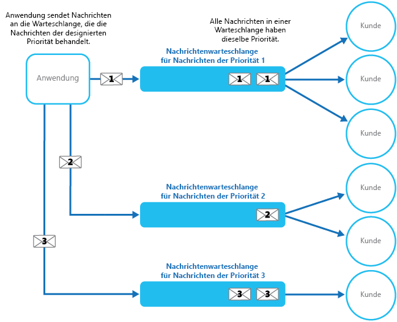

# <a name="priority-queue-pattern"></a>Muster „Prioritätswarteschlange“

[!INCLUDE [header](../_includes/header.md)]

Priorisieren Sie an Dienste gesendete Anforderungen, sodass Anforderungen mit einer höheren Priorität schneller empfangen und verarbeitet werden als Anforderungen mit einer niedrigeren Priorität. Dieses Muster erweist sich bei Anwendungen als nützlich, die einzelnen Clients unterschiedliche Servicelevelgarantien bieten.

## <a name="context-and-problem"></a>Kontext und Problem

Anwendungen können bestimmte Aufgaben an andere Dienste delegieren, beispielsweise für die Ausführung der Hintergrundverarbeitung oder Integration in andere Anwendungen oder Dienste. In der Cloud werden mit Nachrichtenwarteschlangen üblicherweise Aufgaben an die Hintergrundverarbeitung delegiert. In der Vielzahl der Fällen ist die Reihenfolge, in der Anforderungen von einem Dienst empfangen werden, unerheblich. In manchen Fällen ist es jedoch notwendig, bestimmte Anforderungen zu priorisieren. Diese Anforderungen sollten vor Anforderungen mit niedrigerer Priorität, die zuvor von der Anwendung gesendet wurden, verarbeitet werden.

## <a name="solution"></a>Lösung

Eine Warteschlange folgt in der Regel dem FIFO-Prinzip (First In, First Out), und Consumer erhalten Nachrichten normalerweise in der gleichen Reihenfolge, in der sie in der Warteschlange bereitgestellt wurden. Einige Nachrichtenwarteschlangen unterstützen jedoch priorisierte Nachrichten. Die Anwendung, die eine Nachricht bereitstellt, kann eine Priorität zuweisen. Die Nachrichten werden dann in der Warteschlange automatisch neu angeordnet, sodass Nachrichten mit einer höheren Priorität vor denen mit einer niedrigeren Priorität empfangen werden. Die folgende Abbildung zeigt eine Warteschlange mit priorisierten Nachrichten.


> Die meisten Implementierungen für Nachrichtenwarteschlangen unterstützen mehrere Consumer (nach dem [Muster „Konkurrierende Consumer“](https://msdn.microsoft.com/library/dn568101.aspx)), und die Anzahl der Consumerprozesse kann je nach Bedarf zentral hoch- oder herunterskaliert werden.

In Systemen, die keine prioritätsbasierten Nachrichtenwarteschlangen unterstützen, kann alternativ für jede Priorität eine eigene Warteschlange verwaltet werden. Die Anwendung ist für die Bereitstellung von Nachrichten in der entsprechenden Warteschlange zuständig. Jede Warteschlange kann über einen separaten Pool von Consumern verfügen. Für Warteschlangen mit höherer Priorität kann ein größerer Consumerpool auf schnellerer Hardware ausgeführt werden als für Warteschlangen mit niedrigerer Priorität. Die folgende Abbildung veranschaulicht die Verwendung von separaten Nachrichtenwarteschlangen für die einzelnen Prioritäten.




Eine Variante dieser Strategie besteht darin, einen einzigen Consumerpool zu verwalten, der zuerst in Warteschlangen mit hoher Priorität nach Nachrichten sucht und erst dann damit beginnt, Nachrichten aus Warteschlangen mit niedrigerer Priorität abzurufen. Es gibt einige semantische Unterschiede zwischen einer Lösung, die einen einzigen Pool von Consumerprozessen verwendet (entweder mit einer einzigen Warteschlange, die Nachrichten mit unterschiedlichen Prioritäten unterstützt, oder mit mehreren Warteschlangen, die jeweils Nachrichten mit einer einzigen Priorität verarbeiten), und einer Lösung, die mehrere Warteschlangen mit einem separaten Pool für jede Warteschlange verwendet.

Bei dem Modell mit einem einzigen Pool werden Nachrichten mit höherer Priorität stets vor Nachrichten mit niedrigerer Priorität empfangen und verarbeitet. Theoretisch könnten Nachrichten mit einer sehr niedrigen Priorität kontinuierlich abgelöst und niemals verarbeitet werden. Bei dem Modell mit mehreren Pools werden Nachrichten mit niedrigerer Priorität immer verarbeitet, nur nicht so schnell wie Nachrichten mit höherer Priorität (abhängig von der relativen Größe der Pools und den für diese zur Verfügung stehenden Ressourcen).

Die Verwendung eines Prioritätswarteschlangenmechanismus kann folgende Vorteile bieten:

- Durch diesen Mechanismus wird es Anwendungen ermöglicht, Geschäftsanforderungen zu erfüllen, die eine Priorisierung der Verfügbarkeit oder Leistung erfordern, wie z.B. durch das Anbieten unterschiedlicher Servicelevels für bestimmte Kundengruppen.

- Der Mechanismus kann zur Minimierung der Betriebskosten beitragen. Bei dem Modell mit einer einzigen Warteschlange können Sie die Anzahl der Consumer bei Bedarf reduzieren. Nachrichten mit hoher Priorität werden nach wie vor zuerst verarbeitet (wenn auch möglicherweise langsamer), und Nachrichten mit niedrigerer Priorität werden möglicherweise länger verzögert. Wenn Sie das Modell mit mehreren Nachrichtenwarteschlangen mit separaten Consumerpools für die einzelnen Warteschlangen implementiert haben, können Sie den Consumerpool für Warteschlangen mit niedrigerer Priorität verringern oder sogar die Verarbeitung für einige Warteschlangen mit sehr niedriger Priorität anhalten. Für Letzteres müssen Sie alle Consumer anhalten, die auf Nachrichten in diesen Warteschlangen lauschen.

- Durch das Modell mit mehreren Nachrichtenwarteschlangen können Anwendungsleistung und Skalierbarkeit maximiert werden, indem Nachrichten gemäß den Verarbeitungsanforderungen partitioniert werden. So können wichtige Aufgaben z.B. derart priorisiert werden, dass sie von Empfängern für die sofortige Ausführung bearbeitet werden, während weniger wichtige Hintergrundaufgaben von Empfängern bearbeitet werden können, die für die Ausführung in weniger stark ausgelasteten Zeiträumen geplant sind.

## <a name="issues-and-considerations"></a>Probleme und Überlegungen

Beachten Sie die folgenden Punkte bei der Entscheidung, wie dieses Muster implementiert werden soll:

Definieren Sie die Prioritäten im Kontext der Lösung. Eine hohe Priorität könnte z.B. bedeuten, dass Nachrichten innerhalb von zehn Sekunden verarbeitet werden sollten. Ermitteln Sie die Anforderungen für die Bearbeitung von Elementen mit hoher Priorität und anderen Ressourcen, die zur Erfüllung dieser Kriterien zugewiesen werden sollten.

Legen Sie fest, ob alle Elemente mit hoher Priorität vor sämtlichen Elementen mit niedrigerer Priorität verarbeitet werden müssen. Wenn die Nachrichten von einem einzigen Consumerpool verarbeitet werden, müssen Sie einen Mechanismus bereitstellen, der eine Aufgabe zur Bearbeitung einer Nachricht mit niedriger Priorität verdrängen und anhalten kann, wenn eine Nachricht mit höherer Priorität verfügbar wird.

Wenn bei einem Modell mit mehreren Warteschlangen ein einziger Pool mit Consumerprozessen eingesetzt wird, der auf alle Warteschlangen lauscht statt auf einen dedizierten Consumerpool für jede Warteschlange, muss auf den Consumer ein Algorithmus angewendet werden, der sicherstellt, dass er Nachrichten aus Warteschlangen mit höherer Priorität immer vor denen aus Warteschlangen mit niedrigerer Priorität verarbeitet.

Überwachen Sie die Verarbeitungsgeschwindigkeit von Warteschlangen mit hoher und niedriger Priorität, um sicherzustellen, dass Nachrichten in diesen Warteschlangen mit der erwarteten Geschwindigkeit verarbeitet werden.

Wenn Sie sicherstellen müssen, dass Nachrichten mit niedriger Priorität verarbeitet werden, muss das Modell mit mehreren Warteschlangen mit mehreren Consumerpools implementiert werden. Alternativ besteht bei einer Warteschlange mit Unterstützung für Nachrichtenpriorisierung die Möglichkeit, die Priorität einer in der Warteschlange gereihten Nachricht mit fortlaufender Dauer dynamisch zu erhöhen. Um dieses Modell verwenden zu können, muss jedoch gegeben sein, dass dieses Feature von der Nachrichtenwarteschlange bereitgestellt wird.

Die Verwendung einer separaten Warteschlange für die einzelnen Nachrichtenprioritäten ist am besten für Systeme geeignet, die eine kleine Anzahl von klar definierter Prioritäten aufweisen.

Nachrichtenprioritäten können vom System logisch ermittelt werden. Anstelle von Nachrichten mit explizit hoher und niedriger Priorität könnten Nachrichten beispielsweise mit den Bezeichnungen „zahlungspflichtiger Kunde“ oder „nicht zahlungspflichtiger Kunde“ versehen werden. Abhängig von Ihrem Geschäftsmodell kann Ihr System mehr Ressourcen für die Nachrichtenverarbeitung zahlungspflichtiger Kunden bereitstellen als für nicht zahlungspflichtige Kunden.

Für die Suche nach einer Nachricht in einer Warteschlange fallen eventuell Verarbeitungskosten an (einige kommerzielle Messagingsysteme erheben eine geringfügige Gebühr, wenn eine Nachricht bereitgestellt oder abgerufen wird und Nachrichten in einer Warteschlange abgefragt werden). Bei der Prüfung von mehreren Warteschlangen fallen diese Kosten höher aus.

Die Größe eines Consumerpools kann basierend auf der Länge der Warteschlange, die der Pool bedient, dynamisch angepasst werden. Weitere Informationen finden Sie im [Leitfaden für die automatische Skalierung](https://msdn.microsoft.com/library/dn589774.aspx).

## <a name="when-to-use-this-pattern"></a>Verwendung dieses Musters

Dieses Muster ist in Szenarien wie den folgenden nützlich:

- Das System muss mehrere Aufgaben mit unterschiedlichen Prioritäten verarbeiten.

- Unterschiedliche Benutzer oder Mandanten sollten mit unterschiedlichen Prioritäten versehen werden.

## <a name="example"></a>Beispiel

Microsoft Azure bietet keinen Queuingmechanismus, der die automatische Priorisierung von Nachrichten durch Sortierung nativ unterstützt. Microsoft Azure bietet jedoch Azure Service Bus-Themen und -Abonnements, die einen Queuingmechanismus mit Nachrichtenfilterung sowie einem großen Spektrum an flexiblen Funktionen unterstützen. Somit ist Microsoft Azure die ideale Lösung für den Einsatz in den meisten Implementierungen von Prioritätswarteschlangen.

Eine Azure-Lösung kann ein Service Bus-Thema implementieren, für das eine Anwendung wie bei einer Warteschlange Nachrichten bereitstellen kann. Nachrichten können Metadaten in Form von anwendungs- und benutzerdefinierten Eigenschaften enthalten. Dem Thema können Service Bus-Abonnements zugeordnet werden, die Nachrichten anhand ihrer Eigenschaften filtern können. Wenn eine Anwendung eine Nachricht an ein Thema sendet, wird die Nachricht an das entsprechende Abonnement weitergeleitet, wo sie von einem Consumer gelesen werden kann. Consumerprozesse können Nachrichten mit derselben Semantik aus einem Abonnement abrufen wie eine Nachrichtenwarteschlange (ein Abonnement stellt eine logische Warteschlange dar). Die folgende Abbildung zeigt die Implementierung einer Prioritätswarteschlange mit Azure Service Bus-Themen und -Abonnements.


In der obigen Abbildung erstellt die Anwendung mehrere Nachrichten und weist einer benutzerdefinierten Eigenschaft namens `Priority` in jeder Nachricht entweder den Wert `High` oder `Low` zu. Diese Nachrichten werden von der Anwendung für ein Thema bereitgestellt. Dem Thema sind zwei Abonnements zugeordnet, die beide anhand der Eigenschaft `Priority` Nachrichten filtern. Ein Abonnement akzeptiert Nachrichten, bei denen die Eigenschaft `Priority` auf `High` festgelegt ist, während das andere Abonnement Nachrichten akzeptiert, bei denen die Eigenschaft `Priority` auf `Low` festgelegt ist. Ein Consumerpool liest Nachrichten aus jedem Abonnement. Das Abonnement mit hoher Priorität weist einen größeren Pool auf. Diese Consumer können eventuell auf leistungsstärkeren Computern mit einer größeren Anzahl verfügbarer Ressourcen ausgeführt werden als die Consumer im Pool mit niedriger Priorität.

Beachten Sie, dass die Bezeichnung von Nachrichten mit hoher und niedriger Priorität in diesem Beispiel keine Besonderheit darstellt. Es handelt sich lediglich um Bezeichnungen, die in den einzelnen Nachrichten als Eigenschaften angegeben sind und zur Weiterleitung von Nachrichten an ein bestimmtes Abonnement verwendet werden. Falls zusätzliche Prioritäten erforderlich sein sollten, ist es relativ einfach, weitere Abonnements und Pools von Consumerprozessen für die Verarbeitung dieser Prioritäten zu erstellen.

Die PriorityQueue-Lösung, die auf [GitHub](https://github.com/mspnp/cloud-design-patterns/tree/master/priority-queue) verfügbar ist, umfasst eine Implementierung dieses Ansatzes. Diese Lösung enthält die zwei Workerrollenprojekte namens `PriorityQueue.High` und `PriorityQueue.Low`. Diese Workerrollen erben die Klasse `PriorityWorkerRole`, die die Funktionalität für die Verbindung mit einem bestimmten Abonnement in der `OnStart`-Methode enthält.

Die Workerrollen `PriorityQueue.High` und `PriorityQueue.Low` stellen eine Verbindung mit verschiedenen Abonnements her, die in den jeweiligen Konfigurationseinstellungen definiert sind. Ein Administrator kann für jede Rolle, die ausgeführt werden soll, eine unterschiedliche Anzahl konfigurieren. Normalerweise gibt es von der Workerrolle `PriorityQueue.High` mehr Instanzen als von der Workerrolle `PriorityQueue.Low`.

Die `Run`-Methode in der Klasse `PriorityWorkerRole` bewirkt, dass für jede empfangene Nachricht in der Warteschlange die virtuelle `ProcessMessage`-Methode (ebenfalls in der Klasse `PriorityWorkerRole` definiert) ausgeführt wird. Der folgende Code zeigt die `Run`- und `ProcessMessage`-Methoden: Die im PriorityQueue.Shared-Projekt definierte Klasse `QueueManager` stellt Hilfsmethoden für die Verwendung von Azure Service Bus-Warteschlangen zur Verfügung.

```csharp
public class PriorityWorkerRole : RoleEntryPoint
{
  private QueueManager queueManager;
  ...

  public override void Run()
  {
    // Start listening for messages on the subscription.
    var subscriptionName = CloudConfigurationManager.GetSetting("SubscriptionName");
    this.queueManager.ReceiveMessages(subscriptionName, this.ProcessMessage);
    ...;
  }
  ...

  protected virtual async Task ProcessMessage(BrokeredMessage message)
  {
    // Simulating processing.
    await Task.Delay(TimeSpan.FromSeconds(2));
  }
}
```
Die Workerrolle `PriorityQueue.High` und `PriorityQueue.Low` überschreiben die Standardfunktionalität der `ProcessMessage`-Methode. Im folgenden Code wird die `ProcessMessage`-Methode für die Workerrolle `PriorityQueue.High` veranschaulicht.

```csharp
protected override async Task ProcessMessage(BrokeredMessage message)
{
  // Simulate message processing for High priority messages.
  await base.ProcessMessage(message);
  Trace.TraceInformation("High priority message processed by " +
    RoleEnvironment.CurrentRoleInstance.Id + " MessageId: " + message.MessageId);
}
```

Wenn eine Anwendung Nachrichten zu dem Thema bereitstellt, das den von den Workerrollen `PriorityQueue.High` und `PriorityQueue.Low` verwendeten Abonnements zugeordnet ist, legt sie die Priorität mithilfe der benutzerdefinierten Eigenschaft `Priority` fest, wie im folgenden Codebeispiel gezeigt wird. Dieser Code (in der Klasse `WorkerRole` im PriorityQueue.Sender-Projekt implementiert) verwendet die Hilfsmethode `SendBatchAsync` der Klasse `QueueManager`, um Nachrichten zu einem Thema batchweise bereitzustellen.

```csharp
// Send a low priority batch.
var lowMessages = new List<BrokeredMessage>();

for (int i = 0; i < 10; i++)
{
  var message = new BrokeredMessage() { MessageId = Guid.NewGuid().ToString() };
  message.Properties["Priority"] = Priority.Low;
  lowMessages.Add(message);
}

this.queueManager.SendBatchAsync(lowMessages).Wait();
...

// Send a high priority batch.
var highMessages = new List<BrokeredMessage>();

for (int i = 0; i < 10; i++)
{
  var message = new BrokeredMessage() { MessageId = Guid.NewGuid().ToString() };
  message.Properties["Priority"] = Priority.High;
  highMessages.Add(message);
}

this.queueManager.SendBatchAsync(highMessages).Wait();
```

## <a name="related-patterns-and-guidance"></a>Zugehörige Muster und Anleitungen

Die folgenden Muster und Anweisungen können ebenfalls für die Implementierung dieses Musters relevant sein:

- Ein Beispiel für dieses Muster steht auf [GitHub](https://github.com/mspnp/cloud-design-patterns/tree/master/priority-queue).

- [Primer für asynchrone Nachrichten](https://msdn.microsoft.com/library/dn589781.aspx): Ein Consumerdienst, der eine Anforderung verarbeitet, muss möglicherweise eine Antwort an die Instanz der Anwendung senden, die die Anforderung bereitgestellt hat. Dieser Primer stellt Informationen zu den Strategien bereit, die Sie zur Implementierung von Anforderung/Antwort-Nachrichten implementieren können.

- [Muster „Konkurrierende Consumer“](competing-consumers.md): Um den Durchsatz der Warteschlangen zu erhöhen, können mehrere Consumer auf die gleiche Warteschlange lauschen und die Aufgaben parallel verarbeiten. Diese Consumer konkurrieren um Nachrichten, doch nur ein Consumer sollte in der Lage sein, die einzelnen Nachrichten zu verarbeiten. Dieses Muster bietet weitere Informationen über die Vor- und Nachteile, die sich bei der Implementierung dieser Vorgehensweise ergeben.

- [Muster „Drosselung“](throttling.md): Sie können Drosselungen über Warteschlangen implementieren. Anhand von Prioritätsnachrichten kann sichergestellt werden, dass Anforderungen von kritischen Anwendungen oder Anwendungen, die von wichtigen Kunden ausgeführt werden, Vorrang gegenüber Anforderungen von weniger wichtigen Anwendungen haben.

- [Leitfaden für die automatische Skalierung](https://msdn.microsoft.com/library/dn589774.aspx): Die Größe des Pools von Consumerprozessen, die eine Warteschlange verarbeiten, kann abhängig von der Länge der Warteschlange skaliert werden. Diese Strategie kann helfen, um die Leistung insbesondere bei Pools zu verbessern, die Nachrichten mit hoher Priorität verarbeiten.

- [Enterprise Integration Patterns with Service Bus](http://abhishekrlal.com/2013/01/11/enterprise-integration-patterns-with-service-bus-part-2/) (Unternehmensintegrationsmuster mit Service Bus) im Blog von Abhishek Lal

