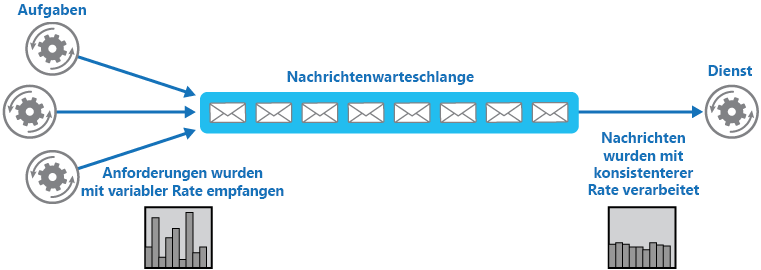
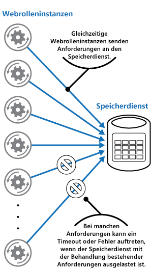
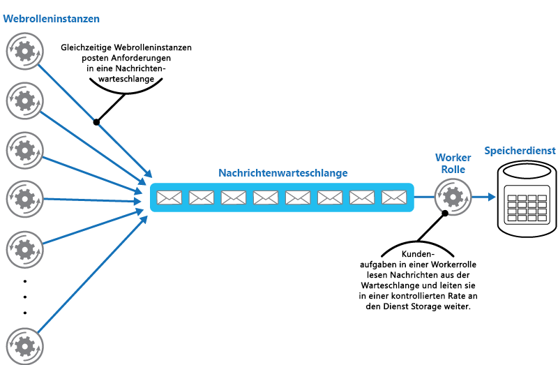

# Warteschlangenbasiertes LastenausgleichsmusterQueue-Based Load Leveling pattern

[!INCLUDE [header](../_includes/header.md)]

Verwenden Sie eine Warteschlange, die als Puffer zwischen einem Task und einem von ihm aufgerufenen Dienst fungiert, um unregelmäßig auftretende hohe Lasten aufzufangen, die den Ausfall des Diensts oder eine Zeitüberschreitung des Tasks verursachen können. Dies kann dazu beitragen, die Auswirkungen von Bedarfsspitzen auf die Verfügbarkeit und Reaktionsfähigkeit von Task und Dienst zu minimieren.Use a queue that acts as a buffer between a task and a service it invokes in order to smooth intermittent heavy loads that can cause the service to fail or the task to time out. This can help to minimize the impact of peaks in demand on availability and responsiveness for both the task and the service.

## Kontext und ProblemContext and problem

Viele Lösungen in der Cloud beinhalten das Ausführen von Tasks, die Dienste aufrufen.Many solutions in the cloud involve running tasks that invoke services. Wenn in dieser Umgebung ein Dienst zeitweilig starken Lasten ausgesetzt ist, kann dies Probleme bei der Leistung oder Zuverlässigkeit verursachen.In this environment, if a service is subjected to intermittent heavy loads, it can cause performance or reliability issues.

Ein Dienst kann in derselben Lösung enthalten sein wie die Tasks, die ihn verwenden, oder es kann sich um einen Drittanbieterdienst handeln, der Zugriff auf häufig genutzte Ressourcen bietet, z.B. ein Cache oder Speicherdienst.A service could be part of the same solution as the tasks that use it, or it could be a third-party service providing access to frequently used resources such as a cache or a storage service. Wenn derselbe Dienst von mehreren gleichzeitig ausgeführten Tasks verwendet wird, ist die Menge der zu einem bestimmten Zeitpunkt an den Dienst gesendeten Anforderungen eventuell schwierig vorherzusagen.If the same service is used by a number of tasks running concurrently, it can be difficult to predict the volume of requests to the service at any time.

Bei einem Dienst können Bedarfsspitzen auftreten, die dazu führen, dass der Dienst überlastet ist und nicht zeitgerecht auf Anforderungen reagieren kann.A service might experience peaks in demand that cause it to overload and be unable to respond to requests in a timely manner. Die Belastung eines Diensts durch eine große Anzahl gleichzeitiger Anforderungen kann auch zum Ausfall des Diensts führen, wenn er die durch diese Anforderungen verursachten Konflikte nicht bewältigen kann.Flooding a service with a large number of concurrent requests can also result in the service failing if it's unable to handle the contention these requests cause.

## LösungSolution

Gestalten Sie die Lösung um, und setzen Sie zwischen den Task und den Dienst eine Warteschlange.Refactor the solution and introduce a queue between the task and the service. Der Task und der Dienst werden asynchron ausgeführt.The task and the service run asynchronously. Der Task sendet eine Nachricht mit den für den Dienst erforderlichen Daten an die Warteschlange.The task posts a message containing the data required by the service to a queue. Die Warteschlange fungiert als Puffer, der die Nachricht speichert, bis sie vom Dienst abgerufen wird.The queue acts as a buffer, storing the message until it's retrieved by the service. Der Dienst empfängt die Nachrichten aus der Warteschlange und verarbeitet sie.The service retrieves the messages from the queue and processes them. Anforderungen von mehreren Tasks, die mit einer stark schwankenden Rate generiert werden können, können über dieselbe Nachrichtenwarteschlange an den Dienst übergeben werden.Requests from a number of tasks, which can be generated at a highly variable rate, can be passed to the service through the same message queue. In dieser Abbildung wird die Verwendung einer Warteschlange zum Ausgleichen der Last für einen Dienst gezeigt.This figure shows using a queue to level the load on a service.

Die Warteschlange entkoppelt die Tasks vom Dienst, und der Dienst kann die Nachrichten mit der ihm angemessenen Geschwindigkeit behandeln, unabhängig von der Menge der Anforderungen von gleichzeitigen Tasks.The queue decouples the tasks from the service, and the service can handle the messages at its own pace regardless of the volume of requests from concurrent tasks. Zudem wird ein Task nicht verzögert, wenn der Dienst zu dem Zeitpunkt, zu dem der Task eine Nachricht an die Warteschlange sendet, nicht verfügbar ist.Additionally, there's no delay to a task if the service isn't available at the time it posts a message to the queue.

Dieses Muster bietet folgende Vorteile:This pattern provides the following benefits:

- Es kann zum Erhöhen der Verfügbarkeit beitragen, da Verzögerungen in Diensten keine unverzügliche und direkte Auswirkung auf die Anwendung haben. Diese kann weiter Nachrichten an die Warteschlange senden, selbst wenn der Dienst nicht verfügbar ist oder Nachrichten nicht parallel verarbeitet.It can help to maximize availability because delays arising in services won't have an immediate and direct impact on the application, which can continue to post messages to the queue even when the service isn't available or isn't currently processing messages.
- Es kann zum Erhöhen der Skalierbarkeit beitragen, da sowohl die Anzahl der Warteschlangen als auch die Anzahl der Dienste an den Bedarf angepasst werden können.It can help to maximize scalability because both the number of queues and the number of services can be varied to meet demand.
- Es kann zur Kontrolle der Kosten beitragen, da die Anzahl der bereitgestellten Dienstinstanzen nur der durchschnittlichen Last und nicht der Spitzenlast entsprechen muss.It can help to control costs because the number of service instances deployed only have to be adequate to meet average load rather than the peak load.

    >  Manche Dienste implementieren Drosselung, wenn der Bedarf einen Schwellenwert erreicht, nach dessen Überschreiten das System ausfallen kann.Some services implement throttling when demand reaches a threshold beyond which the system could fail. Durch die Drosselung kann die verfügbare Funktionalität reduziert werden.Throttling can reduce the functionality available. Sie können für diese Dienste Lastenausgleich implementieren, um zu verhindern, dass dieser Schwellenwert erreicht wird.You can implement load leveling with these services to ensure that this threshold isn't reached.

## Probleme und ÜberlegungenIssues and considerations

Beachten Sie die folgenden Punkte bei der Entscheidung, wie dieses Muster implementiert werden soll:Consider the following points when deciding how to implement this pattern:

- Es muss Anwendungslogik implementiert werden, mit der die Rate der Verarbeitung von Nachrichten durch Dienste gesteuert wird, um eine Überlastung der Zielressource zu verhindern.It's necessary to implement application logic that controls the rate at which services handle messages to avoid overwhelming the target resource. Reichen Sie Bedarfsspitzen nicht an die nächste Stufe im System weiter.Avoid passing spikes in demand to the next stage of the system. Testen Sie das System unter Last, um sicherzustellen, dass es den erforderlichen Ausgleich bietet, und passen Sie die Anzahl der Warteschlangen und die Anzahl der Dienstinstanzen, die Nachrichten verarbeiten, entsprechend an.Test the system under load to ensure that it provides the required leveling, and adjust the number of queues and the number of service instances that handle messages to achieve this.
- Nachrichtenwarteschlangen sind ein unidirektionaler Kommunikationsmechanismus.Message queues are a one-way communication mechanism. Wenn ein Task eine Antwort von einem Dienst erwartet, muss möglicherweise ein Mechanismus implementiert werden, den der Dienst zum Senden einer Antwort verwenden kann.If a task expects a reply from a service, it might be necessary to implement a mechanism that the service can use to send a response. Weitere Informationen finden Sie unter [Einführung in asynchrone Nachrichten](https://msdn.microsoft.com/library/dn589781.aspx).For more information, see the [Asynchronous Messaging Primer](https://msdn.microsoft.com/library/dn589781.aspx).
- Gehen Sie vorsichtig vor, wenn Sie die automatische Skalierung auf Dienste anwenden, die auf Anforderungen in der Warteschlange lauschen.Be careful if you apply autoscaling to services that are listening for requests on the queue. Dies kann die Konflikte um Ressourcen erhöhen, die von diesen Diensten gemeinsam genutzt werden, und die Effektivität der Verwendung der Warteschlange für den Lastenausgleich verringern.This can result in increased contention for any resources that these services share and diminish the effectiveness of using the queue to level the load.

## Verwendung dieses MustersWhen to use this pattern

Dieses Muster ist für jede Anwendung hilfreich, die Dienste verwendet, die Überlastung ausgesetzt sind.This pattern is useful to any application that uses services that are subject to overloading.

Dieses Muster ist nicht hilfreich, wenn die Anwendung eine Antwort vom Dienst mit minimaler Wartezeit erwartet.This pattern isn't useful if the application expects a response from the service with minimal latency.

## BeispielExample

Eine Microsoft Azure-Webrolle speichert Daten mit einem eigenen Speicherdienst.A Microsoft Azure web role stores data using a separate storage service. Wenn eine große Anzahl von Instanzen der Webrolle gleichzeitig ausgeführt wird, kann der Speicherdienst möglicherweise nicht schnell genug auf Anforderungen reagieren, um zu verhindern, dass für diese Anforderungen eine Zeitüberschreitung auftritt oder dass sie fehlschlagen.If a large number of instances of the web role run concurrently, it's possible that the storage service will be unable to respond to requests quickly enough to prevent these requests from timing out or failing. In dieser Abbildung wird ein Dienst veranschaulicht, der durch eine große Anzahl gleichzeitiger Anforderungen von Instanzen einer Webrolle überlastet wird.This figure highlights a service being overwhelmed by a large number of concurrent requests from instances of a web role.

Zum Beheben dieses Problems können Sie eine Warteschlange für den Lastenausgleich zwischen den Webrolleninstanzen und dem Speicherdienst verwenden.To resolve this, you can use a queue to level the load between the web role instances and the storage service. Der Speicherdienst ist jedoch zum Akzeptieren synchroner Anforderungen konzipiert und kann nicht problemlos geändert werden, um Nachrichten zu lesen und den Durchsatz zu bewältigen.However, the storage service is designed to accept synchronous requests and can't be easily modified to read messages and manage throughput. Sie können eine Workerrolle einführen, die als Proxydienst fungiert, der Anforderungen aus der Warteschlange empfängt und an den Speicherdienst weiterleitet.You can introduce a worker role to act as a proxy service that receives requests from the queue and forwards them to the storage service. Die Anwendungslogik in der Workerrolle kann die Rate steuern, mit der Anforderungen an den Speicherdienst übergeben werden, um eine Überlastung des Speicherdiensts zu verhindern.The application logic in the worker role can control the rate at which it passes requests to the storage service to prevent the storage service from being overwhelmed. In dieser Abbildung wird die Verwendung einer Warteschlange und einer Workerrolle für den Lastenausgleich zwischen Instanzen der Webrolle und des Diensts veranschaulicht.This figure illustrates using a queue and a worker role to level the load between instances of the web role and the service.

## Zugehörige Muster und AnleitungenRelated patterns and guidance

Die folgenden Muster und Anweisungen können für die Implementierung dieses Musters ebenfalls relevant sein:The following patterns and guidance might also be relevant when implementing this pattern:

- [Einführung in asynchrone Nachrichten](https://msdn.microsoft.com/library/dn589781.aspx).[Asynchronous Messaging Primer](https://msdn.microsoft.com/library/dn589781.aspx). Nachrichtenwarteschlangen sind grundsätzlich asynchron.Message queues are inherently asynchronous. Möglicherweise muss die Anwendungslogik in einem Task neu entworfen werden, wenn dieser nicht mehr direkt mit einem Dienst kommuniziert, sondern eine Nachrichtenwarteschlange verwendet.It might be necessary to redesign the application logic in a task if it's adapted from communicating directly with a service to using a message queue. Ebenso kann es erforderlich sein, einen Dienst umzugestalten, damit er Anforderungen aus einer Nachrichtenwarteschlange akzeptiert.Similarly, it might be necessary to refactor a service to accept requests from a message queue. Alternativ kann möglicherweise ein Proxydienst implementiert werden, wie im Beispiel beschrieben.Alternatively, it might be possible to implement a proxy service, as described in the example.
- [Muster „Konkurrierende Consumer“](competing-consumers.md).[Competing Consumers pattern](competing-consumers.md). Möglicherweise können mehrere Instanzen eines Diensts ausgeführt werden, von denen jede als Consumer von Nachrichten aus der Warteschlange für den Lastenausgleich fungiert.It might be possible to run multiple instances of a service, each acting as a message consumer from the load-leveling queue. Sie können diesen Ansatz verwenden, um die Rate anzupassen, mit der Nachrichten empfangen und an einen Dienst übergeben werden.You can use this approach to adjust the rate at which messages are received and passed to a service.
- [Drosselungsmuster](throttling.md).[Throttling pattern](throttling.md). Eine einfache Möglichkeit zum Implementieren von Drosselung für einen Dienst ist die Verwendung von warteschlangenbasiertem Lastenausgleich und die Weiterleitung aller Anforderungen an einen Dienst über eine Nachrichtenwarteschlange.A simple way to implement throttling with a service is to use queue-based load leveling and route all requests to a service through a message queue. Der Dienst kann Anforderungen mit einer Rate verarbeiten, die sicherstellt, dass die für den Dienst erforderlichen Ressourcen nicht erschöpft werden, und mit der die möglicherweise auftretenden Konflikte reduziert werden.The service can process requests at a rate that ensures that resources required by the service aren't exhausted, and to reduce the amount of contention that could occur.
- [Konzepte des Warteschlangendiensts](https://msdn.microsoft.com/library/azure/dd179353.aspx).[Queue Service Concepts](https://msdn.microsoft.com/library/azure/dd179353.aspx). Informationen zum Auswählen eines Nachrichten- und Warteschlangenmechanismus in Azure-Anwendungen.Information about choosing a messaging and queuing mechanism in Azure applications.
