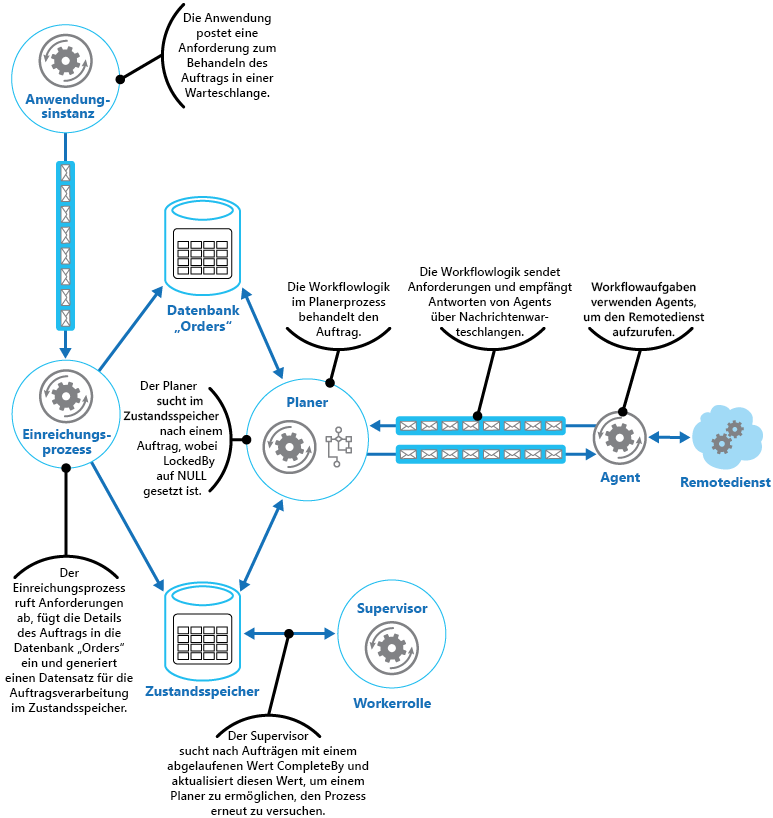

# Muster „Scheduler-Agent-Supervisor“

[!INCLUDE [header](../_includes/header.md)]

Koordinieren Sie eine Reihe von verteilten Aktionen als einen einzelnen Vorgang. Wenn eine der Aktionen nicht erfolgreich ist, versuchen Sie, die Fehler transparent zu behandeln, oder machen Sie andernfalls die ausgeführte Arbeit rückgängig, damit der Vorgang als Ganzes erfolgreich ist oder zu einem Fehler führt. Dies kann zur Resilienz eines verteilten Systems beitragen, indem das Wiederherstellen und Wiederholen von Aktionen ermöglicht wird, die aufgrund von vorübergehenden Ausnahmen, langfristigen Fehlern und Prozessausfällen zu einem Fehler führen.

## Kontext und Problem

Eine Anwendung führt Tasks aus, die eine Reihe von Schritten umfassen, von denen einige möglicherweise Remotedienste aufrufen oder auf Remoteressourcen zugreifen. Die einzelnen Schritte können voneinander unabhängig sein, aber sie werden von der Anwendungslogik orchestriert, die den Task implementiert.

Wann immer dies möglich ist, sollte die Anwendung sicherstellen, dass der Task bis zum Abschluss ausgeführt wird, und alle Fehler beheben, die beim Zugriff auf Remotedienste oder Ressourcen auftreten können. Fehler können verschiedenste Ursachen haben. Beispielsweise kann das Netzwerk ausgefallen sein, die Kommunikation unterbrochen werden, ein Remotedienst reagiert möglicherweise nicht oder befindet sich in einem instabilen Zustand, oder eine Remoteressource ist vielleicht aufgrund von Ressourcenbeschränkungen vorübergehend nicht erreichbar. In vielen Fällen sind die Fehler vorübergehend und können mithilfe des [Musters „Wiederholung“][retry-pattern] behandelt werden.

Wenn die Anwendung einen langfristigeren Fehler feststellt, für den keine einfache Wiederherstellung möglich ist, muss sie in der Lage sein, das System in einen konsistenten Zustand zu versetzen und die Integrität für den gesamten Vorgang zu gewährleisten.

## Lösung

Das Muster „Scheduler-Agent-Supervisor“ definiert die folgenden Akteure. Diese Akteure sorgen für eine Orchestrierung der Schritte, die im Rahmen des gesamten Tasks ausgeführt werden müssen.

- Der **Scheduler** handhabt die Schritte für den auszuführenden Task und orchestriert deren Ausführung. Diese Schritte können in einer Pipeline oder einem Workflow kombiniert werden. Der Scheduler muss dafür Sorge tragen, dass die Schritte in diesem Workflow in der richtigen Reihenfolge ausgeführt werden. Während jeder Schritt ausgeführt wird, zeichnet der Scheduler den Zustand des Workflows auf, wie z.B. „Schritt noch nicht gestartet“, „Schritt wird ausgeführt“ oder „Schritt beendet“. Die Zustandsinformationen müssen außerdem eine Obergrenze für die Zeit enthalten, die für die Beendigung des Schritts zur Verfügung steht, die so genannte Zeit bis zum Abschluss. Wenn ein Schritt den Zugriff auf einen Remotedienst oder eine Ressource erfordert, ruft der Scheduler den entsprechenden Agent auf und übergibt ihm die Details der auszuführenden Arbeit. Der Scheduler kommuniziert typischerweise über asynchrone Anforderungs-/Antwortnachrichten mit dem Agent. Diese können mithilfe von Warteschlangen realisiert werden, es können aber auch andere verteilte Messagingtechnologien verwendet werden.

    > Der Scheduler hat eine ähnliche Funktion wie der Prozess-Manager im [Muster „Prozess-Manager“](http://www.enterpriseintegrationpatterns.com/patterns/messaging/ProcessManager.html). Der tatsächliche Workflow wird typischerweise durch ein Workflowmodul definiert und implementiert, das über den Scheduler gesteuert wird. Dieser Ansatz entkoppelt die Geschäftslogik im Workflow vom Scheduler.

- Der **Agent** umfasst Logik, die einen Aufruf an einen Remotedienst oder den Zugriff auf eine Remoteressource kapselt, auf die durch einen Schritt in einem Task verwiesen wird. Jeder Agent umschließt Aufrufe an einen einzelnen Dienst oder eine einzelne Ressource und implementiert die entsprechende Fehlerbehandlung und Wiederholungslogik (abhängig von einer Timeoutbeschränkung, die später beschrieben wird). Wenn die Schritte im Workflow, die vom Scheduler ausgeführt werden, mehrere Dienste und Ressourcen über verschiedene Schritte hinweg verwenden, kann jeder Schritt einen anderen Agent referenzieren (dies ist ein Implementierungsdetail des Musters).

- Der **Supervisor** überwacht den Status der Schritte in dem Task, der vom Scheduler ausgeführt wird. Der Supervisor wird in regelmäßigen Abständen (die Häufigkeit ist systemabhängig) ausgeführt und untersucht den Status der Schritte, die vom Scheduler verwaltet werden. Wenn der Supervisor eine Zeitüberschreitung oder einen Fehler ermittelt, veranlasst er den zuständigen Agent, den Schritt wiederherzustellen oder die geeignete Bereinigungsaktion auszuführen (dies kann eine Änderung des Status für einen Schritt bedeuten). Beachten Sie, dass die Wiederherstellungs- oder Bereinigungsaktionen vom Scheduler und den Agents implementiert werden. Der Supervisor fordert lediglich an, dass diese Aktionen ausgeführt werden.

Scheduler, Agent und Supervisor sind logische Komponenten, und ihre physische Implementierung hängt von der verwendeten Technologie ab. Beispielsweise können mehrere logische Agents als Teil eines einzigen Webdiensts implementiert werden.

Der Scheduler verwaltet Informationen über den Fortschritt des Tasks und den Zustand jedes einzelnen Schritts in einem dauerhaften Datenspeicher, dem so genannten Zustandsspeicher. Anhand dieser Informationen kann der Supervisor feststellen, ob es bei einem Schritt zu einem Fehler gekommen ist. Die Abbildung veranschaulicht die Beziehung zwischen dem Scheduler, den Agents, dem Supervisor und dem Zustandsspeicher.

> Dieses Diagramm zeigt eine vereinfachte Version des Musters. In einer echten Implementierung können viele Instanzen des Schedulers parallel ausgeführt werden, jede als Teilmenge von Tasks. Ebenso könnte das System mehrere Instanzen von jedem Agent oder sogar mehrere Supervisors ausführen. In diesem Fall müssen die Supervisors ihre Arbeit sorgfältig aufeinander abstimmen, um sicherzustellen, dass sie nicht dieselben fehlerhaften Schritte und Tasks wiederherstellen. Das [Muster für die Auswahl einer übergeordneten Instanz](leader-election.md) bietet eine mögliche Lösung für dieses Problem.

Wenn die Anwendung bereit ist, einen Task auszuführen, sendet sie eine Anforderung an den Scheduler. Der Scheduler zeichnet im Zustandsspeicher anfängliche Zustandsinformationen zum Task und den zugehörigen Schritten (z.B. „Schritt noch nicht gestartet“) auf und beginnt dann mit der Ausführung der durch den Workflow definierten Vorgänge. Wenn der Scheduler einen Schritt startet, aktualisiert er die Informationen über den Zustand dieses Schritts im Zustandsspeicher (z.B. „Schritt wird ausgeführt“).

Wenn ein Schritt auf einen Remotedienst oder eine Ressource verweist, sendet der Scheduler eine Nachricht an den entsprechenden Agent. Die Nachricht enthält die Informationen, die der Agent für die Weiterleitung an den Dienst oder für den Zugriff auf die Ressource benötigt, und umfasst die Zeit bis zum Abschluss für den Vorgang. Wenn der Agent den Vorgang erfolgreich abgeschlossen hat, gibt er eine Antwort an den Scheduler zurück. Der Scheduler kann anschließend die Zustandsinformationen im Zustandsspeicher aktualisieren (z.B. „Schritt beendet“) und den nächsten Schritt ausführen. Dieser Prozess wird fortgesetzt, bis der gesamte Task abgeschlossen wurde.

Ein Agent kann eine beliebige Wiederholungslogik implementieren, die für die Ausführung seiner Arbeit notwendig ist. Wenn der Agent seine Arbeit jedoch nicht vor Ablauf der Zeit bis zum Abschluss beendet, betrachtet der Scheduler den Vorgang als fehlerhaft. In diesem Fall sollte der Agent seine Arbeit einstellen und weder versuchen, Daten an den Scheduler zurückzugeben (nicht einmal eine Fehlermeldung), noch irgendeine Form der Wiederherstellung durchführen. Der Grund für diese Einschränkung liegt darin, dass nach einem Timeout oder Fehler für einen Schritt eine andere Instanz des Agents zur Ausführung des fehlerhaften Schritts geplant sein könnte (dieser Prozess wird später beschrieben).

Bei einem Fehler des Agents erhält der Scheduler keine Antwort. Das Muster unterscheidet nicht zwischen einem Schritt mit einem Timeout oder einem Schritt mit einem Fehler.

Wenn für einen Schritt ein Timeout oder ein Fehler auftritt, weist ein Datensatz im Zustandsspeicher darauf hin, dass der Schritt ausgeführt wird, aber die Zeit bis zum Abschluss abgelaufen ist. Der Supervisor sucht nach solchen Schritten und versucht, sie wiederherzustellen. Eine mögliche Strategie besteht darin, dass der Supervisor den Wert für die Zeit bis zum Abschluss aktualisiert, um den verfügbaren Zeitraum bis zum Abschluss des Schritts zu verlängern, und dann den Scheduler mithilfe einer Nachricht über den Schritt informiert, für den ein Timeout aufgetreten ist. Der Scheduler kann dann versuchen, diesen Schritt zu wiederholen. Dieser Entwurf erfordert jedoch, dass die Tasks idempotent sind.

Der Supervisor muss möglicherweise verhindern, dass ein und derselbe Schritt wiederholt wird, wenn er fortlaufend zu einem Fehler oder einem Timeout führt. Zu diesem Zweck kann der Supervisor im Zustandsspeicher zusätzlich zu den Zustandsinformationen einen Zähler für die Wiederholungsversuche für jeden Schritt verwalten. Wenn die Anzahl von Wiederholungsversuchen einen vordefinierten Schwellenwert überschreitet, kann der Supervisor eine bestimmte Zeit abwarten, bevor der Scheduler darüber benachrichtigt wird, dass der Schritt wiederholt werden muss. Hierbei wird die Erwartung zugrunde gelegt, dass der Fehler innerhalb der Wartezeit gelöst wird. Alternativ kann der Supervisor eine Nachricht an den Scheduler senden, um den gesamten Task rückgängig zu machen, indem er ein [Muster für eine ausgleichende Transaktion](compensating-transaction.md) implementiert. Dieser Ansatz hängt davon ab, dass der Scheduler und die Agents die notwendigen Informationen zur Verfügung stellen, um die Ausgleichsvorgänge für jeden erfolgreich ausgeführten Schritt zu implementieren.

> Es ist nicht die Aufgabe des Supervisors, den Scheduler und die Agents zu überwachen und sie bei einem Fehler neu zu starten. Dieser Aspekt des Systems sollte durch die Infrastruktur abgedeckt werden, in der diese Komponenten ausgeführt werden. Ebenso sollte der Supervisor keine Kenntnis von den tatsächlichen Geschäftsvorgängen haben, die mit den vom Scheduler verarbeiteten Tasks ausgeführt werden (dies schließt auch Informationen zum Ausgleich ein, falls diese Tasks nicht erfolgreich sind). Diese Aufgabe übernimmt die vom Scheduler implementierte Workflowlogik. Die alleinige Verantwortung des Supervisors besteht darin, fehlerhafte Schritte zu ermitteln und dafür zu sorgen, dass nicht erfolgreiche Schritte entweder wiederholt werden oder der gesamte Task rückgängig gemacht wird, der den fehlerhaften Schritt enthält.

Wenn der Scheduler nach einem Fehler neu gestartet oder der vom Scheduler ausgeführte Workflow unerwartet beendet wird, muss der Scheduler in der Lage sein, den Status aller aktiven Tasks zu ermitteln, die er beim Auftreten des Fehlers verarbeitet hat. Außerdem muss er fähig sein, diesen Task von diesem Zeitpunkt an wieder aufzunehmen. Die Implementierungsdetails dieses Prozesses sind wahrscheinlich systemspezifisch. Wenn der Task nicht wiederhergestellt werden kann, muss die vom Task bereits ausgeführte Arbeit möglicherweise rückgängig gemacht werden. Dies kann auch die Implementierung einer [ausgleichenden Transaktion](compensating-transaction.md) erfordern.

Der Hauptvorteil dieses Musters besteht darin, dass das System bei unerwarteten, vorübergehenden oder nicht behebbaren Fehlern stabil bleibt. Das System kann für eine Selbstreparatur konzipiert werden. Wenn z.B. ein Agent oder der Scheduler ausfällt, kann ein neuer Agent gestartet werden, und der Supervisor kann die Wiederaufnahme eines Tasks veranlassen. Fällt der Supervisor aus, kann eine weitere Instanz gestartet werden, die an der Stelle übernimmt, an der der Fehler aufgetreten ist. Wenn der Supervisor in regelmäßigen Abständen ausgeführt wird, kann eine neue Instanz nach einem vordefinierten Intervall automatisch gestartet werden. Der Zustandsspeicher kann repliziert werden, um eine noch höhere Resilienz zu erreichen.

## Probleme und Überlegungen

Bei der Entscheidung, wie dieses Muster implementiert werden soll, sind die folgenden Punkte zu beachten:

- Dieses Muster kann schwierig zu implementieren sein und erfordert umfassende Tests aller möglichen Fehlermodi des Systems.

- Die vom Scheduler implementierte Wiederherstellungs-/Wiederholungslogik ist komplex und hängt von den Zustandsinformationen im Zustandsspeicher ab. Es kann außerdem notwendig sein, die zum Implementieren einer ausgleichenden Transaktion erforderlichen Informationen in einem dauerhaften Datenspeicher aufzuzeichnen.

- Es ist wichtig, wie häufig der Supervisor ausgeführt wird. Der Supervisor sollte oft genug ausgeführt werden, um zu verhindern, dass nicht erfolgreiche Schritte eine Anwendung für einen längeren Zeitraum blockieren. Gleichzeitig darf die Ausführung nicht zu oft erfolgen, damit es nicht zu einem Overhead kommt.

- Die von einem Agent verarbeiteten Schritte können mehrmals ausgeführt werden. Die Logik zur Implementierung dieser Schritte sollte idempotent sein.

## Verwendung dieses Musters

Verwenden Sie dieses Muster, wenn ein in einer verteilten Umgebung – wie z.B. der Cloud – ausgeführter Prozess gegenüber Kommunikationsfehlern und/oder Betriebsausfällen widerstandsfähig sein muss.

Dieses Muster eignet sich möglicherweise nicht für Tasks, die keine Remotedienste aufrufen oder auf Remoteressourcen zugreifen.

## Beispiel

Eine Webanwendung zur Implementierung eines E-Commerce-Systems wurde in Microsoft Azure bereitgestellt. Benutzer können diese Anwendung ausführen, um die verfügbaren Produkte zu durchsuchen und Aufträge zu erteilen. Die Benutzeroberfläche wird als Webrolle ausgeführt, und die Anwendungselemente für die Auftragsabwicklung sind als Gruppe von Workerrollen implementiert. Im Rahmen der Logik für die Auftragsabwicklung wird auf einen Remotedienst zugegriffen, und dieser Aspekt des Systems könnte anfällig für vorübergehende oder länger andauernde Fehler sein. Aus diesem Grund haben die Designer zum Implementieren der Systemelemente für die Auftragsabwicklung das Muster „Scheduler-Agent-Supervisor“ verwendet.

Wenn ein Kunde einen Auftrag erteilt, erstellt die Anwendung eine Nachricht mit einer Beschreibung des Auftrags und reiht diese Nachricht in eine Warteschlange ein. Ein separater Übermittlungsprozess, der in einer Workerrolle ausgeführt wird, ruft die Nachricht ab, fügt die Auftragsdetails in die Auftragsdatenbank ein und erstellt einen Datensatz für den Auftragsprozess im Zustandsspeicher. Beachten Sie, dass das Einfügen in die Auftragsdatenbank und den Zustandsspeicher im Rahmen desselben Vorgangs durchgeführt werden. Der Übermittlungsprozess ist so konzipiert, dass beide Einfügevorgänge gemeinsam abgeschlossen werden.

Der Übermittlungsprozess erstellt die folgenden Zustandsinformationen zum Auftrag:

- **OrderID**. Die ID des Auftrags in der Auftragsdatenbank.

- **LockedBy**. Die Instanz-ID der Workerrolle, die den Auftrag verarbeitet. Es kann mehrere aktuelle Instanzen der Workerrolle geben, die den Scheduler ausführen, aber jeder Auftrag sollte nur von einer einzigen Instanz verarbeitet werden.

- **CompleteBy**. Die Zeit, bis zu der der Auftrag verarbeitet werden muss.

- **ProcessState**. Der aktuelle Zustand des Tasks, der den Auftrag bearbeitet. Mögliche Zustandswerte:

    - **Pending**. Der Auftrag wurde erstellt, aber die Verarbeitung wurde noch nicht gestartet.
    - **Processing**. Der Auftrag wird aktuell verarbeitet.
    - **Processed**. Der Auftrag wurde erfolgreich verarbeitet.
    - **Error**. Bei der Auftragsverarbeitung ist ein Fehler aufgetreten.

- **FailureCount**. Gibt an, wie oft versucht wurde, den Auftrag zu verarbeiten.

In diesen Zustandsinformation wird das Feld `OrderID` aus der Auftrags-ID des neuen Auftrags übernommen. Die Felder `LockedBy` und `CompleteBy` werden auf `null` festgelegt, das Feld `ProcessState` ist auf `Pending`, das Feld `FailureCount` ist auf 0 festgelegt.

> In diesem Beispiel ist die Logik der Auftragsabwicklung relativ einfach und besteht nur aus einem einzigen Schritt, der einen Remotedienst aufruft. In einem komplexeren mehrstufigen Szenario würde der Übermittlungsprozess wahrscheinlich mehrere Schritte umfassen, sodass mehrere Datensätze im Zustandsspeicher erstellt werden – jeder dieser Datensätze beschreibt den Zustand eines einzelnen Schritts.

Der Scheduler wird ebenfalls als Bestandteil der Workerrolle ausgeführt und implementiert die Geschäftslogik zur Verarbeitung des Auftrags. Eine Instanz des Schedulers zum Abrufen neuer Aufträge untersucht den Zustandsspeicher auf Datensätze, bei denen das Feld `LockedBy` NULL ist und das Feld `ProcessState` den Wert „Pending“ aufweist. Wenn der Scheduler einen neuen Auftrag ermittelt, füllt er das Feld `LockedBy` sofort mit seiner eigenen Instanz-ID auf, legt das Feld `CompleteBy` auf eine angemessene Zeit und das Feld `ProcessState` auf „Processing“ fest. Der Code ist als exklusiv und unteilbar konzipiert, um sicherzustellen, dass zwei parallel ausgeführte Instanzen des Schedulers nicht denselben Auftrag verarbeiten können.

Der Scheduler führt dann den Geschäftsworkflow zur asynchronen Verarbeitung des Auftrags aus und übergibt ihm den Wert im Feld `OrderID` aus dem Zustandsspeicher. Der Workflow, der den Auftrag bearbeitet, ruft die Details zum Auftrag aus der Auftragsdatenbank ab und führt seine Arbeit aus. Wenn ein Schritt im Workflow für die Auftragsabwicklung einen Aufruf des Remotediensts erfordert, wird ein Agent verwendet. Der Workflowschritt kommuniziert mit dem Agent über zwei Azure Service Bus-Nachrichtenwarteschlangen, die als Anforderungs-/Antwortkanal fungieren. Die Abbildung zeigt eine allgemeine Ansicht der Lösung.

Die Nachricht, die aus einem Workflowschritt an den Agent gesendet wird, beschreibt den Auftrag und umfasst die Zeit bis zum Abschluss. Wenn der Agent vor Ablauf der Zeit bis zum Abschluss eine Antwort vom Remotedienst empfängt, sendet er eine Antwortnachricht an die Service Bus-Warteschlange, auf der der Workflow lauscht. Wenn der Workflowschritt die gültige Antwortnachricht erhält, schließt er seine Verarbeitung ab, und der Scheduler legt das Feld „ProcessState“ für den Auftragszustand auf „Processed“ fest. Zu diesem Zeitpunkt ist die Auftragsabwicklung erfolgreich abgeschlossen.

Wenn die Zeit bis zum Abschluss abgelaufen ist, bevor der Agent eine Antwort vom Remotedienst empfangen hat, stoppt der Agent einfach seine Verarbeitung und beendet die Bearbeitung des Auftrags. In gleicher Weise beendet der Workflow die Auftragsbearbeitung, wenn die Zeit bis zum Abschluss überschritten wird. In beiden Fällen weist der Auftrag im Zustandsspeicher weiterhin den Zustand „Processing“ auf, aber die Zeit bis zum Abschluss zeigt an, dass der Zeitraum für die Auftragsbearbeitung verstrichen ist, und der Prozess wird als fehlerhaft eingestuft. Beachten Sie hierbei Folgendes: Bei einer unerwarteten Beendigung des Agents, der auf den Remotedienst zugreift, oder des Workflows für die Auftragsbearbeitung (oder beides) lautet der Wert im Zustandsspeicher weiterhin „Processing“ und führt schließlich zu einem Ablauf der Zeit bis zum Abschluss.

Wenn der Agent beim Versuch der Kontaktaufnahme mit dem Remotedienst einen nicht behebbaren, nicht vorübergehenden Fehler ermittelt, kann er eine Fehlerantwort an den Workflow senden. Der Scheduler kann den Zustand des Auftrags auf „Error“ festlegen und ein Ereignis auslösen, mit dem ein Operator alarmiert wird. Der Operator kann dann versuchen, die Ursache des Fehlers manuell zu beheben und den fehlerhaften Verarbeitungsschritt erneut übermitteln.

Der Supervisor untersucht den Zustandsspeicher in regelmäßigen Abständen auf Aufträge mit einem abgelaufenen Wert für die Zeit bis zum Abschluss. Wenn der Supervisor einen solchen Datensatz findet, wird der Wert im Feld `FailureCount` erhöht. Wenn die Fehleranzahl unter einem bestimmten Schwellenwert liegt, setzt der Supervisor das Feld `LockedBy` auf NULL zurück, aktualisiert das Feld `CompleteBy` mit einer neuen Ablaufzeit und legt das Feld `ProcessState` auf „Pending“ fest. Eine Instanz des Schedulers kann diesen Auftrag auswählen und wie zuvor verarbeiten. Wenn die Fehleranzahl einen bestimmten Schwellenwert überschreitet, wird davon ausgegangen, dass die Fehlerursache nicht vorübergehend ist. Der Supervisor legt den Zustand des Auftrags auf „Error“ fest und löst ein Ereignis aus, mit dem ein Operator alarmiert wird.

> In diesem Beispiel wird der Supervisor in einer separaten Workerrolle implementiert. Sie können verschiedene Strategien anwenden, um den Supervisortask auszuführen, beispielsweise können Sie hierzu den Azure Scheduler-Dienst verwenden (nicht zu verwechseln mit der Schedulerkomponente in diesem Muster). Weitere Informationen zum Azure Scheduler-Dienst finden Sie auf der Seite [Scheduler](https://azure.microsoft.com/services/scheduler/).

Im Beispiel wird dies nicht gezeigt, aber es kann erforderlich sein, dass der Scheduler die Anwendung, die den Auftrag übermittelt, über den Fortschritt und Zustand des Auftrags auf dem Laufenden halten muss. Die Anwendung und der Scheduler sind voneinander isoliert, um Abhängigkeiten zwischen ihnen zu unterbinden. Die Anwendung hat keine Kenntnis darüber, welche Instanz des Schedulers den Auftrag bearbeitet, und der Scheduler weiß nicht, welche spezifische Anwendungsinstanz den Auftrag gesendet hat.

Um den Auftragsstatus rückmelden zu können, kann die Anwendung beispielsweise eine eigene, private Antwortwarteschlange verwenden. Die Details dieser Antwortwarteschlange würden in die Anforderung an den Übermittlungsprozess eingeschlossen werden, der diese Informationen dann in den Zustandsspeicher aufnimmt. Der Scheduler würde anschließend Nachrichten mit dem Auftragsstatus an diese Warteschlange senden („Anforderung eingegangen“, „Auftrag abgeschlossen“, „Auftrag fehlerhaft“ usw.). Diese Nachrichten müssten die Auftrags-ID enthalten, um eine Korrelation mit der ursprünglichen Anforderung durch die Anwendung zu ermöglichen.

## Zugehörige Muster und Anleitungen

Die folgenden Muster und Anweisungen können für die Implementierung dieses Musters ebenfalls relevant sein:
- [Muster „Wiederholung“][retry-pattern]. Ein Agent kann dieses Muster verwenden, um einen Vorgang zum Zugriff auf einen Remotedienst oder eine Remoteressource transparent zu wiederholen, bei dem zuvor ein Fehler aufgetreten ist. Verwenden Sie dieses Muster, wenn erwartet wird, dass die Fehlerursache vorübergehend ist und korrigiert werden kann.
- [Muster „Trennschalter“](circuit-breaker.md). Ein Agent kann mit diesem Muster Fehler behandeln, deren Behebung beim Herstellen einer Verbindung mit einem Remotedienst oder einer Remoteressource unterschiedlich lange dauern kann.
- [Muster „Ausgleichende Transaktion“](compensating-transaction.md). Wenn der von einem Scheduler ausgeführte Workflow nicht erfolgreich abgeschlossen werden kann, muss möglicherweise die gesamte zuvor ausgeführte Arbeit rückgängig gemacht werden. Das Muster „Ausgleichende Transaktion“ beschreibt, wie dies für Vorgänge erreicht werden kann, die dem Modell der letztlichen Konsistenz folgen. Solche Vorgänge werden üblicherweise von einem Scheduler implementiert, der komplexe Geschäftsprozesse und Workflows ausführt.
- [Einführung in asynchrone Nachrichten](https://msdn.microsoft.com/library/dn589781.aspx). Die Komponenten im Muster „Scheduler-Agent-Supervisor“ werden typischerweise entkoppelt voneinander ausgeführt und kommunizieren asynchron. Hier werden einige der Ansätze beschrieben, mit denen eine asynchrone Kommunikation auf der Basis von Nachrichtenwarteschlangen realisiert werden kann.
- [Muster für die Auswahl einer übergeordneten Instanz](leader-election.md). Die Aktionen mehrerer Instanzen eines Supervisors müssen ggf. koordiniert werden, damit nicht versucht wird, dieselben fehlerhaften Prozesse wiederherzustellen. Das Muster für die Auswahl einer übergeordneten Instanz beschreibt, wie dies erreicht wird.
- [Cloud Architecture: The Scheduler-Agent-Supervisor Pattern](https://blogs.msdn.microsoft.com/clemensv/2010/09/27/cloud-architecture-the-scheduler-agent-supervisor-pattern/) (Cloudarchitektur: Das Scheduler-Agent-Supervisor-Muster) im Blog von Clements Vasters
- [Muster „Prozess-Manager“](http://www.enterpriseintegrationpatterns.com/patterns/messaging/ProcessManager.html)
- [Reference 6: A Saga on Sagas](https://msdn.microsoft.com/library/jj591569.aspx) (Referenz 6: Eine Saga zur Saga). In diesem Beispiel wird gezeigt, wie das CQRS-Muster einen Prozess-Manager verwendet (Teil des CQRS Journey-Leitfadens).
- [Microsoft Azure Scheduler](https://azure.microsoft.com/services/scheduler/)

[retry-pattern]: ./retry.md
