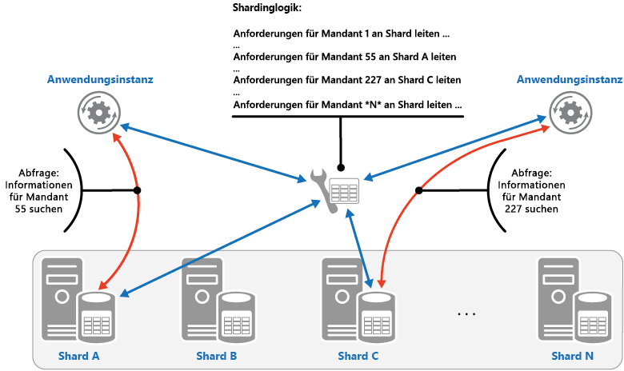

# <a name="sharding-pattern"></a><span data-ttu-id="ee89a-104">Sharding-Muster</span><span class="sxs-lookup"><span data-stu-id="ee89a-104">Sharding pattern</span></span>

[!INCLUDE [header](../_includes/header.md)]

<span data-ttu-id="ee89a-105">Einen Datenspeicher in einen Satz horizontaler Partitionen oder Shards unterteilen</span><span class="sxs-lookup"><span data-stu-id="ee89a-105">Divide a data store into a set of horizontal partitions or shards.</span></span> <span data-ttu-id="ee89a-106">Dies kann die Skalierbarkeit bei der Speicherung großer Datenmengen sowie beim Zugriff auf diese Daten verbessern.</span><span class="sxs-lookup"><span data-stu-id="ee89a-106">This can improve scalability when storing and accessing large volumes of data.</span></span>

## <a name="context-and-problem"></a><span data-ttu-id="ee89a-107">Kontext und Problem</span><span class="sxs-lookup"><span data-stu-id="ee89a-107">Context and problem</span></span>

<span data-ttu-id="ee89a-108">Ein Datenspeicher, der von einem einzelnen Server gehostet wird, unterliegt möglicherweise den folgenden Einschränkungen:</span><span class="sxs-lookup"><span data-stu-id="ee89a-108">A data store hosted by a single server might be subject to the following limitations:</span></span>

- <span data-ttu-id="ee89a-109">**Speicherplatz**:</span><span class="sxs-lookup"><span data-stu-id="ee89a-109">**Storage space**.</span></span> <span data-ttu-id="ee89a-110">Es wird erwartet, dass ein Datenspeicher für eine umfangreiche Cloudanwendung eine riesige Datenmenge enthält, die mit der Zeit deutlich zunehmen könnte.</span><span class="sxs-lookup"><span data-stu-id="ee89a-110">A data store for a large-scale cloud application is expected to contain a huge volume of data that could increase significantly over time.</span></span> <span data-ttu-id="ee89a-111">Ein Server bietet normalerweise nur eine begrenzte Menge an Datenspeicher, aber Sie können vorhandene Datenträger durch größere ersetzen oder weitere Datenträger zu einem Computer hinzufügen, wenn die Datenmenge zunimmt.</span><span class="sxs-lookup"><span data-stu-id="ee89a-111">A server typically provides only a finite amount of disk storage, but you can replace existing disks with larger ones, or add further disks to a machine as data volumes grow.</span></span> <span data-ttu-id="ee89a-112">Allerdings wird das System irgendwann eine Kapazitätsgrenze erreichen, ab der es nicht mehr möglich ist, die Speicherkapazität auf einem bestimmten Server einfach zu erhöhen.</span><span class="sxs-lookup"><span data-stu-id="ee89a-112">However, the system will eventually reach a limit where it isn't possible to easily increase the storage capacity on a given server.</span></span>

- <span data-ttu-id="ee89a-113">**Computingressourcen**:</span><span class="sxs-lookup"><span data-stu-id="ee89a-113">**Computing resources**.</span></span> <span data-ttu-id="ee89a-114">Eine Cloudanwendung ist erforderlich, um eine große Anzahl gleichzeitiger Benutzer zu unterstützen, von denen jeder eine Abfrage ausführt, die Informationen aus dem Datenspeicher abruft.</span><span class="sxs-lookup"><span data-stu-id="ee89a-114">A cloud application is required to support a large number of concurrent users, each of which run queries that retrieve information from the data store.</span></span> <span data-ttu-id="ee89a-115">Ein einzelner Server, der den Datenspeicher hostet, ist möglicherweise nicht in der Lage, die erforderliche Computeleistung zur Verfügung zu stellen, um diese Auslastung zu unterstützen. Dies führt zu verlängerten Antwortzeiten für Benutzer und häufigen Ausfällen bei Anwendungen, die versuchen, Daten zu speichern und abzurufen. Möglicherweise können Sie Arbeitsspeicher hinzufügen oder Prozessoren aufrüsten, aber das System wird eine Grenze erreichen, ab der es nicht mehr möglich ist, die Computeressourcen weiter zu erhöhen.</span><span class="sxs-lookup"><span data-stu-id="ee89a-115">A single server hosting the data store might not be able to provide the necessary computing power to support this load, resulting in extended response times for users and frequent failures as applications attempting to store and retrieve data time out. It might be possible to add memory or upgrade processors, but the system will reach a limit when it isn't possible to increase the compute resources any further.</span></span>

- <span data-ttu-id="ee89a-116">**Netzwerkbandbreite**:</span><span class="sxs-lookup"><span data-stu-id="ee89a-116">**Network bandwidth**.</span></span> <span data-ttu-id="ee89a-117">Letztendlich wird die Leistung eines Datenspeichers, der auf einem einzelnen Server ausgeführt wird, durch die Geschwindigkeit bestimmt, mit der der Server Anforderungen empfangen und Antworten senden kann.</span><span class="sxs-lookup"><span data-stu-id="ee89a-117">Ultimately, the performance of a data store running on a single server is governed by the rate the server can receive requests and send replies.</span></span> <span data-ttu-id="ee89a-118">Es ist möglich, dass die Menge des Netzwerkdatenverkehrs die Kapazität des Netzwerks übersteigt, das für die Verbindung mit dem Server verwendet wird, was zu Anforderungsfehlern führt.</span><span class="sxs-lookup"><span data-stu-id="ee89a-118">It's possible that the volume of network traffic might exceed the capacity of the network used to connect to the server, resulting in failed requests.</span></span>

- <span data-ttu-id="ee89a-119">**Geografie**:</span><span class="sxs-lookup"><span data-stu-id="ee89a-119">**Geography**.</span></span> <span data-ttu-id="ee89a-120">Es kann erforderlich sein, von bestimmten Benutzern generierte Daten, die sich in derselben Region wie diese Benutzer befinden, aus rechtlichen, Konformitäts- oder Leistungsgründen zu speichern oder die Wartezeit des Datenzugriffs zu reduzieren.</span><span class="sxs-lookup"><span data-stu-id="ee89a-120">It might be necessary to store data generated by specific users in the same region as those users for legal, compliance, or performance reasons, or to reduce latency of data access.</span></span> <span data-ttu-id="ee89a-121">Wenn die Benutzer über verschiedene Länder oder Regionen verteilt sind, ist es unter Umständen nicht möglich, die gesamten Daten für die Anwendung in einem einzelnen Datenspeicher zu speichern.</span><span class="sxs-lookup"><span data-stu-id="ee89a-121">If the users are dispersed across different countries or regions, it might not be possible to store the entire data for the application in a single data store.</span></span>

<span data-ttu-id="ee89a-122">Eine vertikale Skalierung durch Hinzufügen von mehr Datenträgerkapazität, Rechenleistung, Arbeitsspeicher und Netzwerkverbindungen kann die Auswirkungen einiger dieser Einschränkungen hinauszögern, aber es handelt sich wahrscheinlich nur um eine vorübergehende Lösung.</span><span class="sxs-lookup"><span data-stu-id="ee89a-122">Scaling vertically by adding more disk capacity, processing power, memory, and network connections can postpone the effects of some of these limitations, but it's likely to only be a temporary solution.</span></span> <span data-ttu-id="ee89a-123">Eine kommerzielle Cloudanwendung, die eine große Anzahl von Benutzern und große Datenmengen unterstützen kann, muss nahezu unbegrenzt skalierbar sein, sodass eine vertikale Skalierung nicht unbedingt die beste Lösung darstellt.</span><span class="sxs-lookup"><span data-stu-id="ee89a-123">A commercial cloud application capable of supporting large numbers of users and high volumes of data must be able to scale almost indefinitely, so vertical scaling isn't necessarily the best solution.</span></span>

## <a name="solution"></a><span data-ttu-id="ee89a-124">Lösung</span><span class="sxs-lookup"><span data-stu-id="ee89a-124">Solution</span></span>

<span data-ttu-id="ee89a-125">Den Datenspeicher in horizontale Partitionen oder Shards unterteilen</span><span class="sxs-lookup"><span data-stu-id="ee89a-125">Divide the data store into horizontal partitions or shards.</span></span> <span data-ttu-id="ee89a-126">Jeder Shard weist das gleiche Schema auf, besitzt aber eine eigene, eindeutige Untermenge der Daten.</span><span class="sxs-lookup"><span data-stu-id="ee89a-126">Each shard has the same schema, but holds its own distinct subset of the data.</span></span> <span data-ttu-id="ee89a-127">Ein Shard ist ein eigenständiger Datenspeicher (er kann die Daten für viele Entitäten verschiedener Typen enthalten), der auf einem Server ausgeführt wird, der als Speicherknoten fungiert.</span><span class="sxs-lookup"><span data-stu-id="ee89a-127">A shard is a data store in its own right (it can contain the data for many entities of different types), running on a server acting as a storage node.</span></span>

<span data-ttu-id="ee89a-128">Dieses Muster hat folgende Vorteile:</span><span class="sxs-lookup"><span data-stu-id="ee89a-128">This pattern has the following benefits:</span></span>

- <span data-ttu-id="ee89a-129">Sie können das System horizontal hochskalieren, indem Sie weitere Shards hinzufügen, die auf zusätzlichen Speicherknoten ausgeführt werden.</span><span class="sxs-lookup"><span data-stu-id="ee89a-129">You can scale the system out by adding further shards running on additional storage nodes.</span></span>

- <span data-ttu-id="ee89a-130">Ein System kann anstelle spezieller und teurer Computer für jeden Speicherknoten Standardhardware verwenden.</span><span class="sxs-lookup"><span data-stu-id="ee89a-130">A system can use off-the-shelf hardware rather than specialized and expensive computers for each storage node.</span></span>

- <span data-ttu-id="ee89a-131">Sie können Konflikte reduzieren und die Leistung verbessern, indem Sie die Workload auf mehrere Shards verteilen.</span><span class="sxs-lookup"><span data-stu-id="ee89a-131">You can reduce contention and improve performance by balancing the workload across shards.</span></span>

- <span data-ttu-id="ee89a-132">In der Cloud können Shards physisch in der Nähe der Benutzer angeordnet werden, die auf die Daten zugreifen.</span><span class="sxs-lookup"><span data-stu-id="ee89a-132">In the cloud, shards can be located physically close to the users that'll access the data.</span></span>

<span data-ttu-id="ee89a-133">Entscheiden Sie bei der Aufteilung eines Datenspeichers in Shards, welche Daten in jedem Shard abgelegt werden sollen.</span><span class="sxs-lookup"><span data-stu-id="ee89a-133">When dividing a data store up into shards, decide which data should be placed in each shard.</span></span> <span data-ttu-id="ee89a-134">Ein Shard enthält typischerweise Elemente, die in einen bestimmten Bereich fallen, der durch mindestens ein Attribut der Daten bestimmt wird.</span><span class="sxs-lookup"><span data-stu-id="ee89a-134">A shard typically contains items that fall within a specified range determined by one or more attributes of the data.</span></span> <span data-ttu-id="ee89a-135">Diese Attribute bilden den Shard-Schlüssel (auch als Partitionsschlüssel bezeichnet).</span><span class="sxs-lookup"><span data-stu-id="ee89a-135">These attributes form the shard key (sometimes referred to as the partition key).</span></span> <span data-ttu-id="ee89a-136">Der Shard-Schlüssel sollte statisch sein.</span><span class="sxs-lookup"><span data-stu-id="ee89a-136">The shard key should be static.</span></span> <span data-ttu-id="ee89a-137">Er sollte nicht auf Daten basieren, die sich möglicherweise ändern.</span><span class="sxs-lookup"><span data-stu-id="ee89a-137">It shouldn't be based on data that might change.</span></span>

<span data-ttu-id="ee89a-138">Durch das Sharding werden die Daten physisch angeordnet.</span><span class="sxs-lookup"><span data-stu-id="ee89a-138">Sharding physically organizes the data.</span></span> <span data-ttu-id="ee89a-139">Wenn eine Anwendung Daten speichert und abruft, leitet die Sharding-Logik die Anwendung an den entsprechenden Shard weiter.</span><span class="sxs-lookup"><span data-stu-id="ee89a-139">When an application stores and retrieves data, the sharding logic directs the application to the appropriate shard.</span></span> <span data-ttu-id="ee89a-140">Diese Sharding-Logik kann als Teil des Datenzugriffscodes in der Anwendung implementiert werden, oder sie kann vom Datenspeichersystem implementiert werden, wenn es das Sharding offensichtlich unterstützt.</span><span class="sxs-lookup"><span data-stu-id="ee89a-140">This sharding logic can be implemented as part of the data access code in the application, or it could be implemented by the data storage system if it transparently supports sharding.</span></span>

<span data-ttu-id="ee89a-141">Die Abstraktion der physischen Speicherorte der Daten in der Sharding-Logik bietet ein hohes Maß an Kontrolle darüber, welche Shards welche Daten enthalten.</span><span class="sxs-lookup"><span data-stu-id="ee89a-141">Abstracting the physical location of the data in the sharding logic provides a high level of control over which shards contain which data.</span></span> <span data-ttu-id="ee89a-142">Sie ermöglicht auch die Migration von Daten zwischen Shards, ohne die Geschäftslogik einer Anwendung überarbeiten zu müssen, wenn die Daten in den Shards später neu verteilt werden müssen (wenn die Shards z. B. unausgeglichen sind).</span><span class="sxs-lookup"><span data-stu-id="ee89a-142">It also enables data to migrate between shards without reworking the business logic of an application if the data in the shards need to be redistributed later (for example, if the shards become unbalanced).</span></span> <span data-ttu-id="ee89a-143">Der Nachteil hierbei ist der zusätzliche Aufwand für den Datenzugriff, der erforderlich ist, um den Speicherort der einzelnen Datenelemente beim Abruf zu bestimmen.</span><span class="sxs-lookup"><span data-stu-id="ee89a-143">The tradeoff is the additional data access overhead required in determining the location of each data item as it's retrieved.</span></span>

<span data-ttu-id="ee89a-144">Um eine optimale Leistung und Skalierbarkeit sicherzustellen, ist es wichtig, die Daten so aufzuteilen, dass sie für die von der Anwendung ausgeführten Abfragen geeignet sind.</span><span class="sxs-lookup"><span data-stu-id="ee89a-144">To ensure optimal performance and scalability, it's important to split the data in a way that's appropriate for the types of queries that the application performs.</span></span> <span data-ttu-id="ee89a-145">In vielen Fällen ist es unwahrscheinlich, dass das Sharding-Schema genau den Anforderungen jeder Abfrage entspricht.</span><span class="sxs-lookup"><span data-stu-id="ee89a-145">In many cases, it's unlikely that the sharding scheme will exactly match the requirements of every query.</span></span> <span data-ttu-id="ee89a-146">In einem mehrinstanzenfähigen System kann es z. B. erforderlich sein, dass eine Anwendung die Mandantendaten über die Mandanten-ID abrufen muss. Möglicherweise muss sie diese Daten aber auch anhand eines anderen Attributs suchen, z. B. Name oder Standort des Mandanten.</span><span class="sxs-lookup"><span data-stu-id="ee89a-146">For example, in a multi-tenant system an application might need to retrieve tenant data using the tenant ID, but it might also need to look up this data based on some other attribute such as the tenant’s name or location.</span></span> <span data-ttu-id="ee89a-147">Implementieren Sie zur Bewältigung dieser Situationen eine Sharding-Strategie mit einem Shard-Schlüssel, der die gängigsten Abfragen unterstützt.</span><span class="sxs-lookup"><span data-stu-id="ee89a-147">To handle these situations, implement a sharding strategy with a shard key that supports the most commonly performed queries.</span></span>

<span data-ttu-id="ee89a-148">Wenn Abfragen regelmäßig Daten über eine Kombination von Attributwerten abrufen, können Sie wahrscheinlich einen zusammengesetzten Shard-Schlüssel definieren, indem Sie Attribute miteinander verknüpfen.</span><span class="sxs-lookup"><span data-stu-id="ee89a-148">If queries regularly retrieve data using a combination of attribute values, you can likely define a composite shard key by linking attributes together.</span></span> <span data-ttu-id="ee89a-149">Alternativ können Sie auch ein Muster wie [Indextabelle](index-table.md) verwenden, um eine schnelle Suche nach Daten zu ermöglichen, die auf Attributen basieren, die nicht durch den Shard-Schlüssel abgedeckt sind.</span><span class="sxs-lookup"><span data-stu-id="ee89a-149">Alternatively, use a pattern such as [Index Table](index-table.md) to provide fast lookup to data based on attributes that aren't covered by the shard key.</span></span>

## <a name="sharding-strategies"></a><span data-ttu-id="ee89a-150">Sharding-Strategien</span><span class="sxs-lookup"><span data-stu-id="ee89a-150">Sharding strategies</span></span>

<span data-ttu-id="ee89a-151">Bei der Auswahl des Shard-Schlüssels und der Entscheidung, wie die Daten auf die Shards verteilt werden sollen, werden im Allgemeinen drei Strategien verwendet.</span><span class="sxs-lookup"><span data-stu-id="ee89a-151">Three strategies are commonly used when selecting the shard key and deciding how to distribute data across shards.</span></span> <span data-ttu-id="ee89a-152">Beachten Sie, dass es keine eineindeutige Übereinstimmung zwischen den Shards und den Servern, die sie hosten, geben muss. Ein einzelner Server kann mehrere Shards hosten.</span><span class="sxs-lookup"><span data-stu-id="ee89a-152">Note that there doesn't have to be a one-to-one correspondence between shards and the servers that host them&mdash;a single server can host multiple shards.</span></span> <span data-ttu-id="ee89a-153">Verfügbare Strategien</span><span class="sxs-lookup"><span data-stu-id="ee89a-153">The strategies are:</span></span>

<span data-ttu-id="ee89a-154">**Suchstrategie**:</span><span class="sxs-lookup"><span data-stu-id="ee89a-154">**The Lookup strategy**.</span></span> <span data-ttu-id="ee89a-155">Bei dieser Strategie implementiert die Sharding-Logik eine Zuordnung, die eine Datenanforderung mithilfe des Shard-Schlüssels an den Shard weiterleitet, der diese Daten enthält.</span><span class="sxs-lookup"><span data-stu-id="ee89a-155">In this strategy the sharding logic implements a map that routes a request for data to the shard that contains that data using the shard key.</span></span> <span data-ttu-id="ee89a-156">In einer mehrinstanzenfähigen Anwendung können alle Daten eines Mandanten unter Verwendung der Mandanten-ID als Shard-Schlüssel in einem Shard gespeichert werden.</span><span class="sxs-lookup"><span data-stu-id="ee89a-156">In a multi-tenant application all the data for a tenant might be stored together in a shard using the tenant ID as the shard key.</span></span> <span data-ttu-id="ee89a-157">Mehrere Mandanten können denselben Shard gemeinsam nutzen, aber die Daten für einen einzelnen Mandanten werden nicht über mehrere Shards verteilt.</span><span class="sxs-lookup"><span data-stu-id="ee89a-157">Multiple tenants might share the same shard, but the data for a single tenant won't be spread across multiple shards.</span></span> <span data-ttu-id="ee89a-158">Die Abbildung veranschaulicht das Sharding für Mandantendaten auf Grundlage der Mandanten-IDs.</span><span class="sxs-lookup"><span data-stu-id="ee89a-158">The figure illustrates sharding tenant data based on tenant IDs.</span></span>

   


   <span data-ttu-id="ee89a-160">Die Zuordnung zwischen Shard-Schlüssel und physischem Speicher kann auf physischen Shards basieren, wobei jeder Shard-Schlüssel einer physischen Partition zugeordnet wird.</span><span class="sxs-lookup"><span data-stu-id="ee89a-160">The mapping between the shard key and the physical storage can be based on physical shards where each shard key maps to a physical partition.</span></span> <span data-ttu-id="ee89a-161">Alternativ dazu ist die virtuelle Partitionierung ein flexibleres Verfahren zum Neuverteilen von Shards, wobei die Shard-Schlüssel derselben Anzahl virtueller Shards zugeordnet wird, die wiederum auf weniger physische Partitionen abgebildet werden.</span><span class="sxs-lookup"><span data-stu-id="ee89a-161">Alternatively, a more flexible technique for rebalancing shards is virtual partitioning, where shard keys map to the same number of virtual shards, which in turn map to fewer physical partitions.</span></span> <span data-ttu-id="ee89a-162">Bei diesem Ansatz sucht eine Anwendung die Daten mit Hilfe eines Shard-Schlüssels, der auf einen virtuellen Shard verweist, und das System ordnet virtuelle Shards transparent physischen Partitionen zu.</span><span class="sxs-lookup"><span data-stu-id="ee89a-162">In this approach, an application locates data using a shard key that refers to a virtual shard, and the system transparently maps virtual shards to physical partitions.</span></span> <span data-ttu-id="ee89a-163">Die Zuordnung zwischen einem virtuellen Shard und einer physischen Partition kann sich ändern, ohne dass der Anwendungscode geändert werden muss, um einen anderen Satz von Shard-Schlüsseln zu verwenden.</span><span class="sxs-lookup"><span data-stu-id="ee89a-163">The mapping between a virtual shard and a physical partition can change without requiring the application code be modified to use a different set of shard keys.</span></span>

<span data-ttu-id="ee89a-164">**Bereichsstrategie**:</span><span class="sxs-lookup"><span data-stu-id="ee89a-164">**The Range strategy**.</span></span> <span data-ttu-id="ee89a-165">Bei dieser Strategie werden zusammengehörige Elemente im selben Shard gruppiert und nach Shard-Schlüssel angeordnet. Die Shard-Schlüssel sind aufeinander folgend.</span><span class="sxs-lookup"><span data-stu-id="ee89a-165">This strategy groups related items together in the same shard, and orders them by shard key&mdash;the shard keys are sequential.</span></span> <span data-ttu-id="ee89a-166">Sie eignet sich für Anwendungen, die häufig Sätze von Datenelementen mithilfe von Bereichsabfragen (Abfragen, die einen Satz von Datenelementen für einen Shard-Schlüssel zurückgeben, der in einen bestimmten Bereich liegt) abrufen müssen.</span><span class="sxs-lookup"><span data-stu-id="ee89a-166">It's useful for applications that frequently retrieve sets of items using range queries (queries that return a set of data items for a shard key that falls within a given range).</span></span> <span data-ttu-id="ee89a-167">Wenn eine Anwendung z. B. regelmäßig alle in einem bestimmten Monat aufgegebenen Bestellungen finden muss, können diese Daten schneller abgerufen werden, wenn alle Bestellungen eines Monats im selben Shard nach Datum und Zeit gespeichert werden.</span><span class="sxs-lookup"><span data-stu-id="ee89a-167">For example, if an application regularly needs to find all orders placed in a given month, this data can be retrieved more quickly if all orders for a month are stored in date and time order in the same shard.</span></span> <span data-ttu-id="ee89a-168">Wenn jede Bestellung in einem anderen Shard gespeichert wurde, müssten sie einzeln über eine große Anzahl von Punktabfragen (Abfragen, die ein einzelnes Datenelement zurückgeben) abgeholt werden.</span><span class="sxs-lookup"><span data-stu-id="ee89a-168">If each order was stored in a different shard, they'd have to be fetched individually by performing a large number of point queries (queries that return a single data item).</span></span> <span data-ttu-id="ee89a-169">Die folgende Abbildung veranschaulicht das Speichern von sequentiellen Datensätzen (Bereiche) in Shards.</span><span class="sxs-lookup"><span data-stu-id="ee89a-169">The next figure illustrates storing sequential sets (ranges) of data in shard.</span></span>

   

<span data-ttu-id="ee89a-171">In diesem Beispiel ist der Shard-Schlüssel ein zusammengesetzter Schlüssel, der den Bestellmonat als wichtigstes Element enthält, gefolgt vom Bestelltag und der Uhrzeit.</span><span class="sxs-lookup"><span data-stu-id="ee89a-171">In this example, the shard key is a composite key containing the order month as the most significant element, followed by the order day and the time.</span></span> <span data-ttu-id="ee89a-172">Die Daten für Bestellungen werden natürlich sortiert, wenn neue Bestellungen erstellt und einem Shard hinzugefügt werden.</span><span class="sxs-lookup"><span data-stu-id="ee89a-172">The data for orders is naturally sorted when new orders are created and added to a shard.</span></span> <span data-ttu-id="ee89a-173">Einige Datenspeicher unterstützen zweiteilige Shard-Schlüssel, die ein Partitionsschlüsselelement enthalten, das den Shard kennzeichnet, und einen Zeilenschlüssel, der ein Element im Shard eindeutig kennzeichnet.</span><span class="sxs-lookup"><span data-stu-id="ee89a-173">Some data stores support two-part shard keys containing a partition key element that identifies the shard and a row key that uniquely identifies an item in the shard.</span></span> <span data-ttu-id="ee89a-174">Daten werden im Shard normalerweise nach Zeilenschlüssel gespeichert.</span><span class="sxs-lookup"><span data-stu-id="ee89a-174">Data is usually held in row key order in the shard.</span></span> <span data-ttu-id="ee89a-175">Elemente, die Bereichsabfragen unterliegen und gruppiert werden müssen, können einen Shard-Schlüssel verwenden, der denselben Wert für den Partitionsschlüssel, aber einen eindeutigen Wert für den Zeilenschlüssel hat.</span><span class="sxs-lookup"><span data-stu-id="ee89a-175">Items that are subject to range queries and need to be grouped together can use a shard key that has the same value for the partition key but a unique value for the row key.</span></span>

<span data-ttu-id="ee89a-176">**Hashstrategie**:</span><span class="sxs-lookup"><span data-stu-id="ee89a-176">**The Hash strategy**.</span></span> <span data-ttu-id="ee89a-177">Ziel dieser Strategie ist es, die Wahrscheinlichkeit von sogenannten Hotspots (Shards, die überproportional belastet werden) zu reduzieren.</span><span class="sxs-lookup"><span data-stu-id="ee89a-177">The purpose of this strategy is to reduce the chance of hotspots (shards that receive a disproportionate amount of load).</span></span> <span data-ttu-id="ee89a-178">Verteilt die Daten in einer Weise auf die Shards, die ein Gleichgewicht zwischen der Größe der einzelnen Shards und der durchschnittlichen Workload erreicht, die für die einzelnen Shards auftritt.</span><span class="sxs-lookup"><span data-stu-id="ee89a-178">It distributes the data across the shards in a way that achieves a balance between the size of each shard and the average load that each shard will encounter.</span></span> <span data-ttu-id="ee89a-179">Die Sharding-Logik berechnet den Shard für die Speicherung eines Elements auf Grundlage eines Hashs von mindestens einem Attribut der Daten.</span><span class="sxs-lookup"><span data-stu-id="ee89a-179">The sharding logic computes the shard to store an item in based on a hash of one or more attributes of the data.</span></span> <span data-ttu-id="ee89a-180">Die gewählte Hashfunktion sollte die Daten gleichmäßig über die Shards verteilen, möglicherweise durch die Einführung eines zufälligen Elements in die Berechnung.</span><span class="sxs-lookup"><span data-stu-id="ee89a-180">The chosen hashing function should distribute data evenly across the shards, possibly by introducing some random element into the computation.</span></span> <span data-ttu-id="ee89a-181">Die nächste Abbildung veranschaulicht das Sharding für Mandantendaten auf Grundlage des Hashs der Mandanten-IDs.</span><span class="sxs-lookup"><span data-stu-id="ee89a-181">The next figure illustrates sharding tenant data based on a hash of tenant IDs.</span></span>

   

<span data-ttu-id="ee89a-183">Um den Vorteil der Hashstrategie gegenüber anderen Sharding-Strategien zu verstehen, sollten Sie sich überlegen, wie eine mehrinstanzenfähige Anwendung, die neue Mandanten sequentiell registriert, die Mandanten den Shards im Datenspeicher zuordnen kann.</span><span class="sxs-lookup"><span data-stu-id="ee89a-183">To understand the advantage of the Hash strategy over other sharding strategies, consider how a multi-tenant application that enrolls new tenants sequentially might assign the tenants to shards in the data store.</span></span> <span data-ttu-id="ee89a-184">Bei Verwendung der Bereichsstrategie werden die Daten für die Mandanten 1 bis n alle in Shard A gespeichert, während die Daten für die Mandanten n+1 bis m alle in Shard B gespeichert werden usw.</span><span class="sxs-lookup"><span data-stu-id="ee89a-184">When using the Range strategy, the data for tenants 1 to n will all be stored in shard A, the data for tenants n+1 to m will all be stored in shard B, and so on.</span></span> <span data-ttu-id="ee89a-185">Wenn die zuletzt registrierten Mandanten auch die aktivsten sind, wird die meiste Datenaktivität in einer kleinen Anzahl von Shards erfolgen, was zu überproportional belasteten Shards führen kann.</span><span class="sxs-lookup"><span data-stu-id="ee89a-185">If the most recently registered tenants are also the most active, most data activity will occur in a small number of shards, which could cause hotspots.</span></span> <span data-ttu-id="ee89a-186">Im Gegensatz dazu ordnet die Hashstrategie Mandanten auf Basis eines Hashs ihrer Mandanten-ID zu Shards zu.</span><span class="sxs-lookup"><span data-stu-id="ee89a-186">In contrast, the Hash strategy allocates tenants to shards based on a hash of their tenant ID.</span></span> <span data-ttu-id="ee89a-187">Das bedeutet, dass sequentielle Mandanten höchstwahrscheinlich verschiedenen Shards zugeordnet werden, die die Workload auf sie verteilen.</span><span class="sxs-lookup"><span data-stu-id="ee89a-187">This means that sequential tenants are most likely to be allocated to different shards, which will distribute the load across them.</span></span> <span data-ttu-id="ee89a-188">Die vorherige Abbildung zeigt dies für die Mandanten 55 und 56.</span><span class="sxs-lookup"><span data-stu-id="ee89a-188">The previous figure shows this for tenants 55 and 56.</span></span>

<span data-ttu-id="ee89a-189">Die drei Sharding-Strategien weisen die folgenden Vorteile und Aspekte auf:</span><span class="sxs-lookup"><span data-stu-id="ee89a-189">The three sharding strategies have the following advantages and considerations:</span></span>

- <span data-ttu-id="ee89a-190">**Suche**:</span><span class="sxs-lookup"><span data-stu-id="ee89a-190">**Lookup**.</span></span> <span data-ttu-id="ee89a-191">Bietet eine umfassendere Kontrolle über die Konfiguration und Verwendung der Shards.</span><span class="sxs-lookup"><span data-stu-id="ee89a-191">This offers more control over the way that shards are configured and used.</span></span> <span data-ttu-id="ee89a-192">Die Verwendung virtueller Shards reduziert die Auswirkungen beim Neuverteilen von Daten, da neue physische Partitionen hinzugefügt werden können, um die Workloads auszugleichen.</span><span class="sxs-lookup"><span data-stu-id="ee89a-192">Using virtual shards reduces the impact when rebalancing data because new physical partitions can be added to even out the workload.</span></span> <span data-ttu-id="ee89a-193">Die Zuordnung zwischen einem virtuellen Shard und den physischen Partitionen, die den Shard implementieren, kann geändert werden, ohne den Anwendungscode zu beeinflussen, der einen Shard-Schlüssel zum Speichern und Abrufen von Daten verwendet.</span><span class="sxs-lookup"><span data-stu-id="ee89a-193">The mapping between a virtual shard and the physical partitions that implement the shard can be modified without affecting application code that uses a shard key to store and retrieve data.</span></span> <span data-ttu-id="ee89a-194">Die Suche nach Shard-Speicherorten kann einen zusätzlichen Aufwand verursachen.</span><span class="sxs-lookup"><span data-stu-id="ee89a-194">Looking up shard locations can impose an additional overhead.</span></span>

- <span data-ttu-id="ee89a-195">**Bereich**:</span><span class="sxs-lookup"><span data-stu-id="ee89a-195">**Range**.</span></span> <span data-ttu-id="ee89a-196">Diese Strategie ist einfach zu implementieren und eignet sich gut für Bereichsabfragen, da sie oft mehrere Datenelemente von einem einzelnen Shard in einem einzigen Vorgang abrufen können.</span><span class="sxs-lookup"><span data-stu-id="ee89a-196">This is easy to implement and works well with range queries because they can often fetch multiple data items from a single shard in a single operation.</span></span> <span data-ttu-id="ee89a-197">Diese Strategie bietet eine einfachere Datenverwaltung.</span><span class="sxs-lookup"><span data-stu-id="ee89a-197">This strategy offers easier data management.</span></span> <span data-ttu-id="ee89a-198">Wenn sich Benutzer z. B. in der gleichen Region im selben Shard befinden, können Updates in den jeweiligen Zeitzonen basierend auf dem lokalen Workload- und Bedarfsmuster geplant werden.</span><span class="sxs-lookup"><span data-stu-id="ee89a-198">For example, if users in the same region are in the same shard, updates can be scheduled in each time zone based on the local load and demand pattern.</span></span> <span data-ttu-id="ee89a-199">Diese Strategie bietet jedoch keinen optimalen Ausgleich zwischen den Shards.</span><span class="sxs-lookup"><span data-stu-id="ee89a-199">However, this strategy doesn't provide optimal balancing between shards.</span></span> <span data-ttu-id="ee89a-200">Die Neuverteilung für Shards ist schwierig und behebt möglicherweise nicht das Problem ungleichmäßiger Workloads, wenn der Großteil der Aktivität für angrenzende Shard-Schlüssel anfällt.</span><span class="sxs-lookup"><span data-stu-id="ee89a-200">Rebalancing shards is difficult and might not resolve the problem of uneven load if the majority of activity is for adjacent shard keys.</span></span>

- <span data-ttu-id="ee89a-201">**Hash**:</span><span class="sxs-lookup"><span data-stu-id="ee89a-201">**Hash**.</span></span> <span data-ttu-id="ee89a-202">Diese Strategie bietet eine höhere Wahrscheinlichkeit, dass Daten und Workloads gleichmäßiger verteilt werden.</span><span class="sxs-lookup"><span data-stu-id="ee89a-202">This strategy offers a better chance of more even data and load distribution.</span></span> <span data-ttu-id="ee89a-203">Das Routing von Anforderungen kann direkt über die Hashfunktion durchgeführt werden.</span><span class="sxs-lookup"><span data-stu-id="ee89a-203">Request routing can be accomplished directly by using the hash function.</span></span> <span data-ttu-id="ee89a-204">Die Verwaltung einer Zuordnung ist nicht erforderlich.</span><span class="sxs-lookup"><span data-stu-id="ee89a-204">There's no need to maintain a map.</span></span> <span data-ttu-id="ee89a-205">Beachten Sie, dass die Hashberechnung möglicherweise einen zusätzlichen Aufwand darstellt.</span><span class="sxs-lookup"><span data-stu-id="ee89a-205">Note that computing the hash might impose an additional overhead.</span></span> <span data-ttu-id="ee89a-206">Die Neuverteilung auf die Shards ist zudem schwierig.</span><span class="sxs-lookup"><span data-stu-id="ee89a-206">Also, rebalancing shards is difficult.</span></span>

<span data-ttu-id="ee89a-207">Die geläufigsten Sharding-Systeme implementieren einen der oben beschriebenen Ansätze, aber Sie sollten auch die Geschäftsanforderungen Ihrer Anwendungen und deren Datennutzungsmuster berücksichtigen.</span><span class="sxs-lookup"><span data-stu-id="ee89a-207">Most common sharding systems implement one of the approaches described above, but you should also consider the business requirements of your applications and their patterns of data usage.</span></span> <span data-ttu-id="ee89a-208">Beispielsweise in einer mehrinstanzenfähigen Anwendung:</span><span class="sxs-lookup"><span data-stu-id="ee89a-208">For example, in a multi-tenant application:</span></span>

- <span data-ttu-id="ee89a-209">Sie können Daten auf Basis der Workload auf Shards verteilen.</span><span class="sxs-lookup"><span data-stu-id="ee89a-209">You can shard data based on workload.</span></span> <span data-ttu-id="ee89a-210">Sie könnten die Daten für sehr unbeständige Mandanten in separaten Shards isolieren.</span><span class="sxs-lookup"><span data-stu-id="ee89a-210">You could segregate the data for highly volatile tenants in separate shards.</span></span> <span data-ttu-id="ee89a-211">Die Geschwindigkeit des Datenzugriffs könnte dadurch für andere Mandanten verbessert werden.</span><span class="sxs-lookup"><span data-stu-id="ee89a-211">The speed of data access for other tenants might be improved as a result.</span></span>

- <span data-ttu-id="ee89a-212">Sie können die Daten auf Basis des Standorts der Mandanten auf Shards verteilen.</span><span class="sxs-lookup"><span data-stu-id="ee89a-212">You can shard data based on the location of tenants.</span></span> <span data-ttu-id="ee89a-213">Sie können die Daten von Mandanten in einer bestimmten geografischen Region zur Sicherung und Wartung während der Nebenzeiten in dieser Region offline nehmen, während die Daten von Mandanten in anderen Regionen während ihrer Geschäftszeiten online und zugänglich bleiben.</span><span class="sxs-lookup"><span data-stu-id="ee89a-213">You can take the data for tenants in a specific geographic region offline for backup and maintenance during off-peak hours in that region, while the data for tenants in other regions remains online and accessible during their business hours.</span></span>

- <span data-ttu-id="ee89a-214">Mandanten mit höherer Priorität könnten eigene, private Shards mit geringer Auslastung zugewiesen werden, während sich Mandanten mit niedrigerer Priorität möglicherweise Shards mit höherer Auslastung teilen müssen.</span><span class="sxs-lookup"><span data-stu-id="ee89a-214">High-value tenants could be assigned their own private, high performing, lightly loaded shards, whereas lower-value tenants might be expected to share more densely-packed, busy shards.</span></span>

- <span data-ttu-id="ee89a-215">Die Daten für Mandanten, die ein hohes Maß an Datenisolation und Datenschutz benötigen, können auf einem vollständig separaten Server gespeichert werden.</span><span class="sxs-lookup"><span data-stu-id="ee89a-215">The data for tenants that need a high degree of data isolation and privacy can be stored on a completely separate server.</span></span>

## <a name="scaling-and-data-movement-operations"></a><span data-ttu-id="ee89a-216">Skalierungs- und Datenverschiebungsvorgänge</span><span class="sxs-lookup"><span data-stu-id="ee89a-216">Scaling and data movement operations</span></span>

<span data-ttu-id="ee89a-217">Jede der Sharding-Strategien umfasst unterschiedliche Funktionen und Komplexitätsstufen für das horizontale Herunter- und Hochskalieren, für die Datenverschiebung und die Aufrechterhaltung des Zustands.</span><span class="sxs-lookup"><span data-stu-id="ee89a-217">Each of the sharding strategies implies different capabilities and levels of complexity for managing scale in, scale out, data movement, and maintaining state.</span></span>

<span data-ttu-id="ee89a-218">Die Suchstrategie ermöglicht Skalierungs- und Datenverschiebungsvorgänge auf Benutzerebene, die entweder online oder offline ausgeführt werden.</span><span class="sxs-lookup"><span data-stu-id="ee89a-218">The Lookup strategy permits scaling and data movement operations to be carried out at the user level, either online or offline.</span></span> <span data-ttu-id="ee89a-219">Die Methode besteht darin, einige oder alle Benutzeraktivitäten zu unterbrechen (z. B. während der Nebenzeiten), die Daten auf die neue virtuelle Partition oder den physischen Shard zu verschieben, die Zuordnungen zu ändern, alle Caches, die diese Daten enthalten, außer Kraft zu setzen oder zu aktualisieren und dann die Benutzeraktivität wieder aufzunehmen.</span><span class="sxs-lookup"><span data-stu-id="ee89a-219">The technique is to suspend some or all user activity (perhaps during off-peak periods), move the data to the new virtual partition or physical shard, change the mappings, invalidate or refresh any caches that hold this data, and then allow user activity to resume.</span></span> <span data-ttu-id="ee89a-220">Dieser Typ von Vorgang kann oftmals zentral verwaltet werden.</span><span class="sxs-lookup"><span data-stu-id="ee89a-220">Often this type of operation can be centrally managed.</span></span> <span data-ttu-id="ee89a-221">Die Suchstrategie setzt voraus, dass der Zustand in hohem Maße zwischenspeicherbar und replizierbar ist.</span><span class="sxs-lookup"><span data-stu-id="ee89a-221">The Lookup strategy requires state to be highly cacheable and replica friendly.</span></span>

<span data-ttu-id="ee89a-222">Die Bereichsstrategie bedeutet einige Einschränkungen für Skalierungs- und Datenverschiebungsvorgänge, die typischerweise ausgeführt werden müssen, wenn ein Teil oder der gesamte Datenspeicher offline ist, da die Daten über die Shards hinweg verteilt und zusammengeführt werden müssen.</span><span class="sxs-lookup"><span data-stu-id="ee89a-222">The Range strategy imposes some limitations on scaling and data movement operations, which must typically be carried out when a part or all of the data store is offline because the data must be split and merged across the shards.</span></span> <span data-ttu-id="ee89a-223">Das Verschieben der Daten zur Neuverteilung von Shards kann das Problem der ungleichmäßigen Workload nicht lösen, wenn der Großteil der Aktivität auf benachbarte Shard-Schlüssel oder Datenbezeichner entfällt, die sich im gleichen Bereich befinden.</span><span class="sxs-lookup"><span data-stu-id="ee89a-223">Moving the data to rebalance shards might not resolve the problem of uneven load if the majority of activity is for adjacent shard keys or data identifiers that are within the same range.</span></span> <span data-ttu-id="ee89a-224">Die Bereichsstrategie könnte auch erfordern, dass ein gewisser Zustand beibehalten wird, um Bereiche den physischen Partitionen zuzuordnen.</span><span class="sxs-lookup"><span data-stu-id="ee89a-224">The Range strategy might also require some state to be maintained in order to map ranges to the physical partitions.</span></span>

<span data-ttu-id="ee89a-225">Die Hashstrategie gestaltet Skalierungs- und Datenverschiebungsvorgänge komplizierter, da die Partitionsschlüssel Hashes der Shard-Schlüssel oder Datenbezeichner sind.</span><span class="sxs-lookup"><span data-stu-id="ee89a-225">The Hash strategy makes scaling and data movement operations more complex because the partition keys are hashes of the shard keys or data identifiers.</span></span> <span data-ttu-id="ee89a-226">Der neue Speicherort der einzelnen Shards muss über die Hashfunktion ermittelt oder die Funktion so geändert werden, dass die ordnungsgemäßen Zuordnungen vorgenommen werden.</span><span class="sxs-lookup"><span data-stu-id="ee89a-226">The new location of each shard must be determined from the hash function, or the function modified to provide the correct mappings.</span></span> <span data-ttu-id="ee89a-227">Die Hashstrategie erfordert jedoch keine Aufrechterhaltung des Zustands.</span><span class="sxs-lookup"><span data-stu-id="ee89a-227">However, the Hash strategy doesn't require maintenance of state.</span></span>

## <a name="issues-and-considerations"></a><span data-ttu-id="ee89a-228">Probleme und Überlegungen</span><span class="sxs-lookup"><span data-stu-id="ee89a-228">Issues and considerations</span></span>

<span data-ttu-id="ee89a-229">Beachten Sie die folgenden Punkte bei der Entscheidung, wie dieses Muster implementiert werden soll:</span><span class="sxs-lookup"><span data-stu-id="ee89a-229">Consider the following points when deciding how to implement this pattern:</span></span>

- <span data-ttu-id="ee89a-230">Das Sharding ergänzt andere Formen der Partitionierung, z. B. die vertikale und die funktionale Partitionierung.</span><span class="sxs-lookup"><span data-stu-id="ee89a-230">Sharding is complementary to other forms of partitioning, such as vertical partitioning and functional partitioning.</span></span> <span data-ttu-id="ee89a-231">Ein einzelner Shard kann z. B. vertikal partitionierte Elemente enthalten und eine funktionale Partition kann als mehrere Shards implementiert werden.</span><span class="sxs-lookup"><span data-stu-id="ee89a-231">For example, a single shard can contain entities that have been partitioned vertically, and a functional partition can be implemented as multiple shards.</span></span> <span data-ttu-id="ee89a-232">Weitere Informationen zur Partitionierung finden Sie im [Leitfaden zur Datenpartitionierung](https://msdn.microsoft.com/library/dn589795.aspx).</span><span class="sxs-lookup"><span data-stu-id="ee89a-232">For more information about partitioning, see the [Data Partitioning Guidance](https://msdn.microsoft.com/library/dn589795.aspx).</span></span>

- <span data-ttu-id="ee89a-233">Sorgen Sie für ausgeglichene Shards, die alle ein ähnliches E/A-Aufkommen bewältigen müssen.</span><span class="sxs-lookup"><span data-stu-id="ee89a-233">Keep shards balanced so they all handle a similar volume of I/O.</span></span> <span data-ttu-id="ee89a-234">Wenn Daten eingefügt und gelöscht werden, ist es erforderlich, die Shards regelmäßig neu auszugleichen, um eine gleichmäßige Verteilung zu gewährleisten und die Wahrscheinlichkeit von überproportional belasteten Shards zu verringern.</span><span class="sxs-lookup"><span data-stu-id="ee89a-234">As data is inserted and deleted, it's necessary to periodically rebalance the shards to guarantee an even distribution and to reduce the chance of hotspots.</span></span> <span data-ttu-id="ee89a-235">Die Neuverteilung kann sich als kostenintensiver Vorgang erweisen.</span><span class="sxs-lookup"><span data-stu-id="ee89a-235">Rebalancing can be an expensive operation.</span></span> <span data-ttu-id="ee89a-236">Um die Notwendigkeit der Neuverteilung zu reduzieren, planen Sie das Wachstum ein, indem Sie sicherstellen, dass jeder Shard genügend freien Speicherplatz bietet, um das erwartete Ausmaß an Änderungen zu bewerkstelligen.</span><span class="sxs-lookup"><span data-stu-id="ee89a-236">To reduce the necessity of rebalancing, plan for growth by ensuring that each shard contains sufficient free space to handle the expected volume of changes.</span></span> <span data-ttu-id="ee89a-237">Sie sollten auch Strategien und Skripts entwickeln, mit denen Sie Shards bei Bedarf schnell ausgleichen können.</span><span class="sxs-lookup"><span data-stu-id="ee89a-237">You should also develop strategies and scripts you can use to quickly rebalance shards if this becomes necessary.</span></span>

- <span data-ttu-id="ee89a-238">Verwenden Sie für den Shard-Schlüssel entsprechend beständige Daten.</span><span class="sxs-lookup"><span data-stu-id="ee89a-238">Use stable data for the shard key.</span></span> <span data-ttu-id="ee89a-239">Wenn sich der Shard-Schlüssel ändert, muss das entsprechende Datenelement möglicherweise zwischen den Shards hin- und herbewegt werden, was den Aufwand für Aktualisierungsvorgänge erhöht.</span><span class="sxs-lookup"><span data-stu-id="ee89a-239">If the shard key changes, the corresponding data item might have to move between shards, increasing the amount of work performed by update operations.</span></span> <span data-ttu-id="ee89a-240">Vermeiden Sie es daher, den Shard-Schlüssel auf potenziell unbeständige Informationen zu stützen.</span><span class="sxs-lookup"><span data-stu-id="ee89a-240">For this reason, avoid basing the shard key on potentially volatile information.</span></span> <span data-ttu-id="ee89a-241">Suchen Sie stattdessen nach Attributen, die unveränderlich sind oder auf natürliche Weise einen Schlüssel bilden.</span><span class="sxs-lookup"><span data-stu-id="ee89a-241">Instead, look for attributes that are invariant or that naturally form a key.</span></span>

- <span data-ttu-id="ee89a-242">Stellen Sie sicher, dass Shard-Schlüssel eindeutig sind.</span><span class="sxs-lookup"><span data-stu-id="ee89a-242">Ensure that shard keys are unique.</span></span> <span data-ttu-id="ee89a-243">Vermeiden Sie z. B. die Verwendung von Feldern mit automatischer Inkrementierung als Shard-Schlüssel.</span><span class="sxs-lookup"><span data-stu-id="ee89a-243">For example, avoid using autoincrementing fields as the shard key.</span></span> <span data-ttu-id="ee89a-244">Bei manchen Systemen können automatisch inkrementierte Felder nicht über Shards hinweg koordiniert werden, was dazu führen kann, dass Elemente in verschiedenen Shards den gleichen Shard-Schlüssel aufweisen.</span><span class="sxs-lookup"><span data-stu-id="ee89a-244">Is some systems, autoincremented fields can't be coordinated across shards, possibly resulting in items in different shards having the same shard key.</span></span>

    >  <span data-ttu-id="ee89a-245">Automatisch inkrementierte Werte in anderen Feldern, die keine Shard-Schlüssel sind, können ebenfalls Probleme verursachen.</span><span class="sxs-lookup"><span data-stu-id="ee89a-245">Autoincremented values in other fields that are not shard keys can also cause problems.</span></span> <span data-ttu-id="ee89a-246">Wenn Sie z. B. automatisch inkrementierte Felder verwenden, um eindeutige IDs zu generieren, können zwei verschiedene Elemente, die sich in verschiedenen Shards befinden, dieselbe ID erhalten.</span><span class="sxs-lookup"><span data-stu-id="ee89a-246">For example, if you use autoincremented fields to generate unique IDs, then two different items located in different shards might be assigned the same ID.</span></span>

- <span data-ttu-id="ee89a-247">Unter Umständen ist es nicht möglich, einen Shard-Schlüssel zu entwerfen, der den Anforderungen jeder möglichen Abfrage in Bezug auf die Daten entspricht.</span><span class="sxs-lookup"><span data-stu-id="ee89a-247">It might not be possible to design a shard key that matches the requirements of every possible query against the data.</span></span> <span data-ttu-id="ee89a-248">Verteilen Sie die Daten auf Shards, um die am häufigsten ausgeführten Abfragen zu unterstützen, und erstellen Sie bei Bedarf sekundäre Indextabellen, um Abfragen zu unterstützen, die Daten mithilfe von Kriterien abrufen, die auf Attributen basieren, die nicht Teil des Shard-Schlüssels sind.</span><span class="sxs-lookup"><span data-stu-id="ee89a-248">Shard the data to support the most frequently performed queries, and if necessary create secondary index tables to support queries that retrieve data using criteria based on attributes that aren't part of the shard key.</span></span> <span data-ttu-id="ee89a-249">Weitere Informationen finden Sie unter [Index Table Pattern](index-table.md) (Indextabellenmuster).</span><span class="sxs-lookup"><span data-stu-id="ee89a-249">For more information, see the [Index Table pattern](index-table.md).</span></span>

- <span data-ttu-id="ee89a-250">Abfragen, die nur auf einen einzelnen Shard zugreifen, sind effizienter als Abfragen, die Daten von mehreren Shards abrufen. Vermeiden Sie es daher, ein Sharding-System zu implementieren, das dazu führt, dass Anwendungen eine große Anzahl von Abfragen ausführen, die Daten aus verschiedenen Shards zusammenführen.</span><span class="sxs-lookup"><span data-stu-id="ee89a-250">Queries that access only a single shard are more efficient than those that retrieve data from multiple shards, so avoid implementing a sharding system that results in applications performing large numbers of queries that join data held in different shards.</span></span> <span data-ttu-id="ee89a-251">Denken Sie daran, dass ein einzelner Shard die Daten für mehrere Typen von Entitäten enthalten kann.</span><span class="sxs-lookup"><span data-stu-id="ee89a-251">Remember that a single shard can contain the data for multiple types of entities.</span></span> <span data-ttu-id="ee89a-252">Ziehen Sie in Betracht, Ihre Daten zu denormalisieren, um verwandte Entitäten, die häufig gemeinsam abgefragt werden (z. B. die Details von Kunden und Bestellungen, die sie aufgegeben haben), im selben Shard zu speichern, um die Anzahl der separaten Lesezugriffe zu reduzieren, die eine Anwendung ausführt.</span><span class="sxs-lookup"><span data-stu-id="ee89a-252">Consider denormalizing your data to keep related entities that are commonly queried together (such as the details of customers and the orders that they have placed) in the same shard to reduce the number of separate reads that an application performs.</span></span>

    >  <span data-ttu-id="ee89a-253">Wenn eine Entität in einem Shard auf eine Entität verweist, die in einem anderen Shard gespeichert ist, fügen Sie den Shard-Schlüssel für die zweite Entität als Teil des Schemas für die erste Entität hinzu.</span><span class="sxs-lookup"><span data-stu-id="ee89a-253">If an entity in one shard references an entity stored in another shard, include the shard key for the second entity as part of the schema for the first entity.</span></span> <span data-ttu-id="ee89a-254">Dies kann dazu beitragen, die Leistung von Abfragen zu verbessern, die über Shards hinweg auf verwandte Daten verweisen.</span><span class="sxs-lookup"><span data-stu-id="ee89a-254">This can help to improve the performance of queries that reference related data across shards.</span></span>

- <span data-ttu-id="ee89a-255">Wenn eine Anwendung Abfragen durchführen muss, die Daten von mehreren Shards abrufen, können diese Daten möglicherweise über parallele Aufgaben abgerufen werden.</span><span class="sxs-lookup"><span data-stu-id="ee89a-255">If an application must perform queries that retrieve data from multiple shards, it might be possible to fetch this data by using parallel tasks.</span></span> <span data-ttu-id="ee89a-256">Beispiele hierfür sind Auffächerungsabfragen, bei denen Daten aus mehreren Shards parallel abgerufen und dann in ein einzelnes Ergebnis aggregiert werden.</span><span class="sxs-lookup"><span data-stu-id="ee89a-256">Examples include fan-out queries, where data from multiple shards is retrieved in parallel and then aggregated into a single result.</span></span> <span data-ttu-id="ee89a-257">Dieser Ansatz erhöht jedoch zwangsläufig die Komplexität der Datenzugriffslogik einer Lösung.</span><span class="sxs-lookup"><span data-stu-id="ee89a-257">However, this approach inevitably adds some complexity to the data access logic of a solution.</span></span>

- <span data-ttu-id="ee89a-258">Für viele Anwendungen kann es effizienter sein, eine größere Anzahl von kleinen Shards zu erzeugen als eine kleine Anzahl von großen Shards, da sie bessere Möglichkeiten für den Lastausgleich bieten.</span><span class="sxs-lookup"><span data-stu-id="ee89a-258">For many applications, creating a larger number of small shards can be more efficient than having a small number of large shards because they can offer increased opportunities for load balancing.</span></span> <span data-ttu-id="ee89a-259">Dies kann auch hilfreich sein, wenn Sie erwarten, dass Shards von einem physischen Speicherort zu einem anderen migriert werden müssen.</span><span class="sxs-lookup"><span data-stu-id="ee89a-259">This can also be useful if you anticipate the need to migrate shards from one physical location to another.</span></span> <span data-ttu-id="ee89a-260">Kleine Shards können schneller als große Shards verschoben werden.</span><span class="sxs-lookup"><span data-stu-id="ee89a-260">Moving a small shard is quicker than moving a large one.</span></span>

- <span data-ttu-id="ee89a-261">Stellen Sie sicher, dass die für jeden Shard-Speicherknoten verfügbaren Ressourcen ausreichen, um den Anforderungen an die Skalierbarkeit im Hinblick auf die Größe der Daten und den Durchsatz zu entsprechen.</span><span class="sxs-lookup"><span data-stu-id="ee89a-261">Make sure the resources available to each shard storage node are sufficient to handle the scalability requirements in terms of data size and throughput.</span></span> <span data-ttu-id="ee89a-262">Weitere Informationen finden Sie im Abschnitt „Entwerfen von Partitionen für Skalierbarkeit“ im [Leitfaden zur Datenpartitionierung](https://msdn.microsoft.com/library/dn589795.aspx).</span><span class="sxs-lookup"><span data-stu-id="ee89a-262">For more information, see the section “Designing Partitions for Scalability” in the [Data Partitioning Guidance](https://msdn.microsoft.com/library/dn589795.aspx).</span></span>

- <span data-ttu-id="ee89a-263">Ziehen Sie in Betracht, entsprechende Referenzdaten auf alle Shards zu replizieren.</span><span class="sxs-lookup"><span data-stu-id="ee89a-263">Consider replicating reference data to all shards.</span></span> <span data-ttu-id="ee89a-264">Wenn ein Vorgang, der Daten von einem Shard abruft, auch auf statische oder langsam zu verschiebende Daten als Teil derselben Abfrage verweist, fügen Sie diese Daten dem Shard hinzu.</span><span class="sxs-lookup"><span data-stu-id="ee89a-264">If an operation that retrieves data from a shard also references static or slow-moving data as part of the same query, add this data to the shard.</span></span> <span data-ttu-id="ee89a-265">Die Anwendung kann dann auf einfache Weise alle Daten für die Abfrage holen, ohne einen zusätzlichen Roundtrip zu einem separaten Datenspeicher durchführen zu müssen.</span><span class="sxs-lookup"><span data-stu-id="ee89a-265">The application can then fetch all of the data for the query easily, without having to make an additional round trip to a separate data store.</span></span>

    >  <span data-ttu-id="ee89a-266">Wenn in mehreren Shards gespeicherte Referenzdaten geändert werden, muss das System diese Änderungen über alle Shards hinweg synchronisieren.</span><span class="sxs-lookup"><span data-stu-id="ee89a-266">If reference data held in multiple shards changes, the system must synchronize these changes across all shards.</span></span> <span data-ttu-id="ee89a-267">Während dieser Synchronisation kann es zu Inkonsistenzen im System kommen.</span><span class="sxs-lookup"><span data-stu-id="ee89a-267">The system can experience a degree of inconsistency while this synchronization occurs.</span></span> <span data-ttu-id="ee89a-268">In diesem Fall sollten Sie Ihre Anwendungen so gestalten, dass sie damit entsprechend umgehen können.</span><span class="sxs-lookup"><span data-stu-id="ee89a-268">If you do this, you should design your applications to be able to handle it.</span></span>

- <span data-ttu-id="ee89a-269">Es kann schwierig sein, die referentielle Integrität und Konsistenz zwischen den Shards aufrechtzuerhalten, daher sollten Sie Vorgänge, die Daten in mehreren Shards betreffen, minimieren.</span><span class="sxs-lookup"><span data-stu-id="ee89a-269">It can be difficult to maintain referential integrity and consistency between shards, so you should minimize operations that affect data in multiple shards.</span></span> <span data-ttu-id="ee89a-270">Wenn eine Anwendung Daten über mehrere Shards hinweg ändern muss, prüfen Sie, ob eine umfassende Datenkonsistenz tatsächlich erforderlich ist.</span><span class="sxs-lookup"><span data-stu-id="ee89a-270">If an application must modify data across shards, evaluate whether complete data consistency is actually required.</span></span> <span data-ttu-id="ee89a-271">Stattdessen ist eine gängige Vorgehensweise in der Cloud, letztendliche Konsistenz zu implementieren.</span><span class="sxs-lookup"><span data-stu-id="ee89a-271">Instead, a common approach in the cloud is to implement eventual consistency.</span></span> <span data-ttu-id="ee89a-272">Die Daten in den einzelnen Partitionen werden separat aktualisiert, und die Anwendungslogik muss die Verantwortung dafür übernehmen, dass die Aktualisierungen erfolgreich abgeschlossen werden. Zudem ist sie dafür zuständig, die Inkonsistenzen zu behandeln, die durch die Abfrage von Daten während eines letztendlich konsistenten Vorgangs entstehen können.</span><span class="sxs-lookup"><span data-stu-id="ee89a-272">The data in each partition is updated separately, and the application logic must take responsibility for ensuring that the updates all complete successfully, as well as handling the inconsistencies that can arise from querying data while an eventually consistent operation is running.</span></span> <span data-ttu-id="ee89a-273">Weitere Informationen zum Implementieren von letztlicher Konsistenz finden Sie unter [Data Consistency Primer](https://msdn.microsoft.com/library/dn589800.aspx) (Grundlagen der Datenkonsistenz).</span><span class="sxs-lookup"><span data-stu-id="ee89a-273">For more information about implementing eventual consistency, see the [Data Consistency Primer](https://msdn.microsoft.com/library/dn589800.aspx).</span></span>

- <span data-ttu-id="ee89a-274">Die Konfiguration und Verwaltung einer großen Anzahl von Shards kann eine Herausforderung darstellen.</span><span class="sxs-lookup"><span data-stu-id="ee89a-274">Configuring and managing a large number of shards can be a challenge.</span></span> <span data-ttu-id="ee89a-275">Aufgaben wie Überwachung, Sicherung, Konsistenzprüfung, Protokollierung oder Überprüfung müssen auf mehreren Shards und Servern durchgeführt werden, die sich möglicherweise an mehreren Standorten befinden.</span><span class="sxs-lookup"><span data-stu-id="ee89a-275">Tasks such as monitoring, backing up, checking for consistency, and logging or auditing must be accomplished on multiple shards and servers, possibly held in multiple locations.</span></span> <span data-ttu-id="ee89a-276">Diese Aufgaben werden wahrscheinlich mithilfe von Skripts oder anderen Automatisierungslösungen realisiert, aber das kann die zusätzlichen Verwaltungsanforderungen nicht vollständig ausschließen.</span><span class="sxs-lookup"><span data-stu-id="ee89a-276">These tasks are likely to be implemented using scripts or other automation solutions, but that might not completely eliminate the additional administrative requirements.</span></span>

- <span data-ttu-id="ee89a-277">Shards können so positioniert werden, dass die darin befindlichen Daten in der Nähe der Instanzen einer Anwendung liegen, die diese verwenden.</span><span class="sxs-lookup"><span data-stu-id="ee89a-277">Shards can be geolocated so that the data that they contain is close to the instances of an application that use it.</span></span> <span data-ttu-id="ee89a-278">Dieser Ansatz kann die Leistung erheblich verbessern, erfordert jedoch zusätzliche Überlegungen für Aufgaben, die auf mehrere Shards an verschiedenen Standorten zugreifen müssen.</span><span class="sxs-lookup"><span data-stu-id="ee89a-278">This approach can considerably improve performance, but requires additional consideration for tasks that must access multiple shards in different locations.</span></span>

## <a name="when-to-use-this-pattern"></a><span data-ttu-id="ee89a-279">Verwendung dieses Musters</span><span class="sxs-lookup"><span data-stu-id="ee89a-279">When to use this pattern</span></span>

<span data-ttu-id="ee89a-280">Verwenden Sie dieses Muster, wenn ein Datenspeicher voraussichtlich über die Ressourcen hinaus skaliert werden muss, die für einen einzelnen Speicherknoten zur Verfügung stehen, oder um die Leistung zu verbessern, indem Sie mögliche Konflikte in einem Datenspeicher verringern.</span><span class="sxs-lookup"><span data-stu-id="ee89a-280">Use this pattern when a data store is likely to need to scale beyond the resources available to a single storage node, or to improve performance by reducing contention in a data store.</span></span>

>  <span data-ttu-id="ee89a-281">Der primäre Fokus des Shardings liegt auf der Verbesserung von Leistung und Skalierbarkeit eines Systems, aber als Nebeneffekt kann es auch die Verfügbarkeit verbessern, da die Daten auf separate Partitionen aufgeteilt werden.</span><span class="sxs-lookup"><span data-stu-id="ee89a-281">The primary focus of sharding is to improve the performance and scalability of a system, but as a by-product it can also improve availability due to how the data is divided into separate partitions.</span></span> <span data-ttu-id="ee89a-282">Ein Ausfall einer Partition hindert eine Anwendung nicht unbedingt daran, auf Daten in anderen Partitionen zuzugreifen. Zudem kann ein Bediener die Wartung oder Wiederherstellung einer oder mehrerer Partitionen durchführen, ohne die gesamten Daten für eine Anwendung unzugänglich zu machen.</span><span class="sxs-lookup"><span data-stu-id="ee89a-282">A failure in one partition doesn't necessarily prevent an application from accessing data held in other partitions, and an operator can perform maintenance or recovery of one or more partitions without making the entire data for an application inaccessible.</span></span> <span data-ttu-id="ee89a-283">Weitere Informationen finden Sie im [Leitfaden zur Datenpartitionierung](https://msdn.microsoft.com/library/dn589795.aspx).</span><span class="sxs-lookup"><span data-stu-id="ee89a-283">For more information, see the [Data Partitioning Guidance](https://msdn.microsoft.com/library/dn589795.aspx).</span></span>

## <a name="example"></a><span data-ttu-id="ee89a-284">Beispiel</span><span class="sxs-lookup"><span data-stu-id="ee89a-284">Example</span></span>

<span data-ttu-id="ee89a-285">Das folgende Beispiel in C# verwendet eine Reihe von SQL Server-Datenbanken, die als Shards fungieren.</span><span class="sxs-lookup"><span data-stu-id="ee89a-285">The following example in C# uses a set of SQL Server databases acting as shards.</span></span> <span data-ttu-id="ee89a-286">Jede Datenbank enthält eine Teilmenge der Daten, die von einer Anwendung verwendet werden.</span><span class="sxs-lookup"><span data-stu-id="ee89a-286">Each database holds a subset of the data used by an application.</span></span> <span data-ttu-id="ee89a-287">Die Anwendung ruft über Shards verteilte Daten mithilfe einer eigenen Sharding-Logik (dies ist ein Beispiel für eine Auffächerungsabfrage) ab.</span><span class="sxs-lookup"><span data-stu-id="ee89a-287">The application retrieves data that's distributed across the shards using its own sharding logic (this is an example of a fan-out query).</span></span> <span data-ttu-id="ee89a-288">Die Details der Daten, die sich in jedem Shard befinden, werden von einer Methode namens `GetShards` zurückgegeben.</span><span class="sxs-lookup"><span data-stu-id="ee89a-288">The details of the data that's located in each shard is returned by a method called `GetShards`.</span></span> <span data-ttu-id="ee89a-289">Diese Methode gibt eine aufzählbare Liste von `ShardInformation`-Objekten zurück, wobei der Typ `ShardInformation` einen Bezeichner für jeden Shard und die SQL Server-Verbindungszeichenfolge enthält, die eine Anwendung verwenden sollte, um sich mit dem Shard zu verbinden (die Verbindungszeichenfolgen werden im Codebeispiel nicht angezeigt).</span><span class="sxs-lookup"><span data-stu-id="ee89a-289">This method returns an enumerable list of `ShardInformation` objects, where the `ShardInformation` type contains an identifier for each shard and the SQL Server connection string that an application should use to connect to the shard (the connection strings aren't shown in the code example).</span></span>

```csharp
private IEnumerable<ShardInformation> GetShards()
{
  // This retrieves the connection information from a shard store
  // (commonly a root database).
  return new[]
  {
    new ShardInformation
    {
      Id = 1,
      ConnectionString = ...
    },
    new ShardInformation
    {
      Id = 2,
      ConnectionString = ...
    }
  };
}
```

<span data-ttu-id="ee89a-290">Der folgende Code zeigt, wie die Anwendung die Liste der `ShardInformation`-Objekte verwendet, um eine Abfrage auszuführen, die Daten von den einzelnen Shards gleichzeitig abruft.</span><span class="sxs-lookup"><span data-stu-id="ee89a-290">The code below shows how the application uses the list of `ShardInformation` objects to perform a query that fetches data from each shard in parallel.</span></span> <span data-ttu-id="ee89a-291">Die Details der Abfrage werden nicht angezeigt, aber in diesem Beispiel enthalten die abgerufenen Daten eine Zeichenfolge, die Informationen wie den Namen eines Kunden enthalten könnte, wenn die Shards die Details von Kunden enthalten.</span><span class="sxs-lookup"><span data-stu-id="ee89a-291">The details of the query aren't shown, but in this example the data that's retrieved contains a string that could hold information such as the name of a customer if the shards contain the details of customers.</span></span> <span data-ttu-id="ee89a-292">Die Ergebnisse werden in eine `ConcurrentBag`-Sammlung aggregiert und von der Anwendung verarbeitet.</span><span class="sxs-lookup"><span data-stu-id="ee89a-292">The results are aggregated into a `ConcurrentBag` collection for processing by the application.</span></span>

```csharp
// Retrieve the shards as a ShardInformation[] instance.
var shards = GetShards();

var results = new ConcurrentBag<string>();

// Execute the query against each shard in the shard list.
// This list would typically be retrieved from configuration
// or from a root/master shard store.
Parallel.ForEach(shards, shard =>
{
  // NOTE: Transient fault handling isn't included,
  // but should be incorporated when used in a real world application.
  using (var con = new SqlConnection(shard.ConnectionString))
  {
    con.Open();
    var cmd = new SqlCommand("SELECT ... FROM ...", con);

    Trace.TraceInformation("Executing command against shard: {0}", shard.Id);

    var reader = cmd.ExecuteReader();
    // Read the results in to a thread-safe data structure.
    while (reader.Read())
    {
      results.Add(reader.GetString(0));
    }
  }
});

Trace.TraceInformation("Fanout query complete - Record Count: {0}",
                        results.Count);
```

## <a name="related-patterns-and-guidance"></a><span data-ttu-id="ee89a-293">Zugehörige Muster und Anleitungen</span><span class="sxs-lookup"><span data-stu-id="ee89a-293">Related patterns and guidance</span></span>

<span data-ttu-id="ee89a-294">Die folgenden Muster und Anweisungen können ebenfalls für die Implementierung dieses Musters relevant sein:</span><span class="sxs-lookup"><span data-stu-id="ee89a-294">The following patterns and guidance might also be relevant when implementing this pattern:</span></span>
- <span data-ttu-id="ee89a-295">[Data Consistency Primer (Grundlagen der Datenkonsistenz)](https://msdn.microsoft.com/library/dn589800.aspx):</span><span class="sxs-lookup"><span data-stu-id="ee89a-295">[Data Consistency Primer](https://msdn.microsoft.com/library/dn589800.aspx).</span></span> <span data-ttu-id="ee89a-296">Es ist möglicherweise erforderlich, die Konsistenz der Daten, die über verschiedene Shards verteilt sind, zu erhalten.</span><span class="sxs-lookup"><span data-stu-id="ee89a-296">It might be necessary to maintain consistency for data distributed across different shards.</span></span> <span data-ttu-id="ee89a-297">Fasst die Probleme bei der Aufrechterhaltung von Konsistenz in verteilten Daten zusammen und beschreibt die Vor- und Nachteile der verschiedenen Konsistenzmodelle.</span><span class="sxs-lookup"><span data-stu-id="ee89a-297">Summarizes the issues surrounding maintaining consistency over distributed data, and describes the benefits and tradeoffs of different consistency models.</span></span>
- <span data-ttu-id="ee89a-298">[Leitfaden zur Datenpartitionierung](https://msdn.microsoft.com/library/dn589795.aspx):</span><span class="sxs-lookup"><span data-stu-id="ee89a-298">[Data Partitioning Guidance](https://msdn.microsoft.com/library/dn589795.aspx).</span></span> <span data-ttu-id="ee89a-299">Das Sharding eines Datenspeichers kann eine Reihe von zusätzlichen Problemen mit sich bringen.</span><span class="sxs-lookup"><span data-stu-id="ee89a-299">Sharding a data store can introduce a range of additional issues.</span></span> <span data-ttu-id="ee89a-300">Beschreibt diese Probleme in Bezug auf die Partitionierung von Datenspeichern in der Cloud, um die Skalierbarkeit zu verbessern, Konflikte zu verringern und die Leistung zu optimieren.</span><span class="sxs-lookup"><span data-stu-id="ee89a-300">Describes these issues in relation to partitioning data stores in the cloud to improve scalability, reduce contention, and optimize performance.</span></span>
- <span data-ttu-id="ee89a-301">[Index Table Pattern (Indextabellenmuster)](index-table.md):</span><span class="sxs-lookup"><span data-stu-id="ee89a-301">[Index Table pattern](index-table.md).</span></span> <span data-ttu-id="ee89a-302">Mitunter ist es nicht möglich, Abfragen allein durch die Gestaltung des Shard-Schlüssels vollständig zu unterstützen.</span><span class="sxs-lookup"><span data-stu-id="ee89a-302">Sometimes it isn't possible to completely support queries just through the design of the shard key.</span></span> <span data-ttu-id="ee89a-303">Ermöglicht einer Anwendung das schnelle Abrufen von Daten aus einem großen Datenspeicher durch die Angabe eines anderen Schlüssels als des Shard-Schlüssels.</span><span class="sxs-lookup"><span data-stu-id="ee89a-303">Enables an application to quickly retrieve data from a large data store by specifying a key other than the shard key.</span></span>
- <span data-ttu-id="ee89a-304">[Muster für materialisierte Sichten](materialized-view.md):</span><span class="sxs-lookup"><span data-stu-id="ee89a-304">[Materialized View pattern](materialized-view.md).</span></span> <span data-ttu-id="ee89a-305">Um die Leistung einiger Abfragevorgänge aufrechtzuerhalten, ist es sinnvoll, materialisierte Ansichten zu erstellen, die Daten aggregieren und zusammenfassen. Dies ist insbesondere hilfreich, wenn diese zusammenfassenden Daten auf Informationen basieren, die über Shards verteilt sind.</span><span class="sxs-lookup"><span data-stu-id="ee89a-305">To maintain the performance of some query operations, it's useful to create materialized views that aggregate and summarize data, especially if this summary data is based on information that's distributed across shards.</span></span> <span data-ttu-id="ee89a-306">Beschreibt das Erstellen und Füllen dieser Ansichten.</span><span class="sxs-lookup"><span data-stu-id="ee89a-306">Describes how to generate and populate these views.</span></span>
- <span data-ttu-id="ee89a-307">[Shard Lessons](http://www.addsimplicity.com/adding_simplicity_an_engi/2008/08/shard-lessons.html) (Shard-Lektionen) zum Blog „Adding Simplicity“ (Hinzufügen der Einfachheit).</span><span class="sxs-lookup"><span data-stu-id="ee89a-307">[Shard Lessons](http://www.addsimplicity.com/adding_simplicity_an_engi/2008/08/shard-lessons.html) on the Adding Simplicity blog.</span></span>
- <span data-ttu-id="ee89a-308">[Database Sharding](http://dbshards.com/database-sharding/) (Datenbank-Sharding) auf der CodeFutures-Website.</span><span class="sxs-lookup"><span data-stu-id="ee89a-308">[Database Sharding](http://dbshards.com/database-sharding/) on the CodeFutures web site.</span></span>
- <span data-ttu-id="ee89a-309">[Scalability Strategies Primer: Database Sharding](http://blog.maxindelicato.com/2008/12/scalability-strategies-primer-database-sharding.html) (Einführung zu Skalierbarkeitsstrategien: Datenbank-Sharding) im Blog von Max Indelicato.</span><span class="sxs-lookup"><span data-stu-id="ee89a-309">[Scalability Strategies Primer: Database Sharding](http://blog.maxindelicato.com/2008/12/scalability-strategies-primer-database-sharding.html) on Max Indelicato's blog.</span></span>
- <span data-ttu-id="ee89a-310">[Building Scalable Databases: Pros and Cons of Various Database Sharding Schemes](http://www.25hoursaday.com/weblog/2009/01/16/BuildingScalableDatabasesProsAndConsOfVariousDatabaseShardingSchemes.aspx) (Erstellen von skalierbaren Datenbanken: Vor- und Nachteile verschiedener Schemas zum Datenbank-Sharding) im Blog von Dare Obasanjo.</span><span class="sxs-lookup"><span data-stu-id="ee89a-310">[Building Scalable Databases: Pros and Cons of Various Database Sharding Schemes](http://www.25hoursaday.com/weblog/2009/01/16/BuildingScalableDatabasesProsAndConsOfVariousDatabaseShardingSchemes.aspx) on Dare Obasanjo's blog.</span></span>
