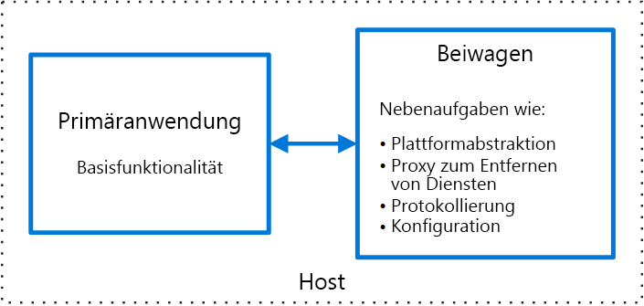

# Sidecar-Muster

Stellen Sie Komponenten einer Anwendung zwecks Isolation und Kapselung in einem separaten Prozess oder Container bereit. Dieses Muster kann Anwendungen auch eine Zusammenstellung aus heterogenen Komponenten und Technologien ermöglichen.

Dieses Muster trägt den Namen *Sidecar*, da es an einen Beiwagen erinnert, der an ein Motorrad angebracht wird. Im Muster wird der Sidecar an eine übergeordnete Anwendung angefügt und stellt unterstützende Funktionen für die Anwendung bereit. Der Sidecar weist auch denselben Lebenszyklus wie die übergeordnete Anwendung auf und wird zusammen mit dieser erstellt und außer Kraft gesetzt. Das Sidecar-Muster wird manchmal auch als Sidekick-Muster bezeichnet und ist ein Aufgliederungsmuster.

## Kontext und Problem

Anwendungen und Dienste benötigen häufig zusammengehörige Funktionen, wie z. B. Überwachung, Protokollierung, Konfiguration und Netzwerkdienste. Diese Peripherieaufgaben können als separate Komponenten oder Dienste implementiert werden. 

Wenn sie eng in die Anwendung integriert sind, können sie in demselben Prozess wie die Anwendung ausgeführt werden und dadurch gemeinsam verwendete Ressourcen effizient nutzen. Dies bedeutet aber auch, dass sie nicht gut isoliert sind, und ein Ausfall in einer dieser Komponenten kann Auswirkungen auf andere Komponenten oder die gesamte Anwendung haben. Außerdem müssen sie üblicherweise mit derselben Sprache wie die übergeordnete Anwendung implementiert werden. Daher weisen die Komponente und die Anwendung eine starke wechselseitige Abhängigkeit auf.

Wenn die Anwendung in Dienste aufgegliedert wird, kann jeder Dienst mit einer anderen Sprache und anderer Technologie erstellt werden. Zwar bietet dies mehr Flexibilität, doch bedeutet es auch, dass jede Komponente eigene Abhängigkeiten aufweist und sprachspezifische Bibliotheken für den Zugriff auf die zugrunde liegende Plattform und alle mit der übergeordneten Anwendung gemeinsam verwendeten Ressourcen benötigt. Darüber hinaus kann eine Bereitstellung dieser Funktionen als separate Dienste zu höherer Latenz der Anwendung führen. Das Verwalten des Codes und der Abhängigkeiten für diese sprachspezifischen Schnittstellen kann auch zu wesentlich höherer Komplexität führen, insbesondere bei Hosting, Bereitstellung und Verwaltung.

## Lösung

Verbinden Sie eine zusammenhängende Gruppe von Aufgaben mit der primären Anwendung, aber platzieren Sie diese in einem eigenen Prozess oder Container, um eine homogene Schnittstelle für Plattformdienste sprachübergreifend bereitzustellen. 

Ein Sidecar-Dienst ist nicht notwendigerweise Teil der Anwendung, ist aber mit ihr verbunden. Er befindet sich dort, wo sich auch die übergeordnete Anwendung befindet. Sidecars sind unterstützte Prozesse oder Dienste, die mit der primären Anwendung bereitgestellt werden. Bei einem Motorrad wird ein Sidecar (Beiwagen) an ein einzelnes Fahrzeug angebracht, und jedes Motorrad kann einen eigenen Beiwagen haben. Auf die gleiche Weise teilt auch ein Sidecar-Dienst das Schicksal der übergeordneten Anwendung. Für jede Instanz der Anwendung wird eine Instanz des Sidecar bereitgestellt und parallel gehostet. 

Die Verwendung eines Sidecar-Musters bietet unter anderem folgende Vorteile:

- Ein Sidecar ist in Hinsicht auf die Laufzeitumgebung und die Programmiersprache von der primären Anwendung unabhängig, sodass Sie nicht einen Sidecar pro Sprache entwickeln müssen. 

- Der Sidecar kann auf dieselben Ressourcen wie die primäre Anwendung zugreifen. Beispielsweise kann ein Sidecar Systemressourcen überwachen, die sowohl vom Sidecar als auch der primären Anwendung verwendet werden. 

- Aufgrund der Nähe zur primären Anwendung besteht keine wesentliche Latenz bei der Kommunikation zwischen beiden.

- Selbst bei Anwendungen, die keinen Erweiterbarkeitsmechanismus bieten, können Sie einen Sidecar zum Erweitern der Funktionalität verwenden, indem Sie ihn als eigenen Prozess in demselben Host- oder Untercontainer wie die primäre Anwendung anfügen.

Das Sidecar-Muster wird häufig mit Containern verwendet und als Sidecar-Container oder Sidekick-Container bezeichnet. 

## Probleme und Überlegungen

- Beachten Sie das Bereitstellungs- und Paketerstellungsformat, das Sie zum Bereitstellen von Diensten, Prozessen oder Containern verwenden. Container eignen sich besonders gut für das Sidecar-Muster.
- Wählen Sie beim Entwerfen eines Sidecar-Diensts den Mechanismus für die prozessübergreifende Kommunikation sorgfältig aus. Versuchen Sie Technologien zu verwenden, die von der Sprache oder dem Framework unabhängig sind, sofern Leistungsanforderungen dies nicht unmöglich ist.
- Bedenken Sie vor der Aufnahme von Funktionen in einen Sidecar, ob dafür ein separater Dienst oder ein herkömmlicher Daemon besser geeignet ist.
- Überlegen Sie auch, ob die Funktionen als Bibliothek oder mithilfe eines herkömmlichen Erweiterungsmechanismus implementiert werden können. Sprachspezifische Bibliotheken bieten möglicherweise eine tiefer greifende Integration und weniger Netzwerkaufwand.

## Verwendung dieses Musters

Verwenden Sie dieses Muster in folgenden Fällen:

- Die primäre Anwendung verwendet eine heterogene Gruppe von Sprachen und Frameworks. Eine Komponente, die sich in einem Sidecar-Dienst befindet, kann von Anwendungen verwendet werden, die mithilfe verschiedener Frameworks in unterschiedlichen Sprachen geschrieben wurden.
- Eine Komponente befindet sich im Besitz eines Remoteteams oder einer anderen Organisation.
- Eine Komponente oder Funktion muss sich auf demselben Host wie die Anwendung befinden.
- Sie benötigen einen Dienst, der den gesamten Lebenszyklus Ihrer Hauptanwendung teilt, aber unabhängig aktualisiert werden kann.
- Sie benötigen eine präzisere Kontrolle über Einschränkungen für eine bestimmte Ressource oder Komponente. Sie möchten beispielsweise die Speichermenge beschränken, die eine bestimmte Komponente verwendet. Sie können die Komponente als einen Sidecar bereitstellen und die Speichernutzung unabhängig von der Hauptanwendung verwalten.

Dieses Muster ist in folgenden Fällen möglicherweise nicht geeignet:

- Wenn die prozessübergreifende Kommunikation optimiert werden muss. Die Kommunikation zwischen einer übergeordneten Anwendung und Sidecar-Diensten bedeutet einen gewissen Mehraufwand, insbesondere Latenz bei den Aufrufen. Dies ist bei Schnittstellen mit einer hohen Anzahl von Einzelaufrufen möglicherweise nicht annehmbar.
- Bei kleinen Anwendungen, bei denen der Vorteil der Isolation die Ressourcenkosten für die Bereitstellung eines Sidecar-Diensts für jede Instanz nicht aufheben.
- Wenn der Dienst anders als oder unabhängig von den Hauptanwendungen skaliert werden muss. Wenn das der Fall ist, wird die Funktion möglicherweise besser als separater Dienst bereitgestellt.

## Beispiel

Das Sidecar-Muster kann für viele Szenarien angewendet werden. Hier einige typische Beispiele:

- Infrastruktur API. Das Infrastruktur-Entwicklungsteam erstellt einen Dienst, der zusammen mit den einzelnen Anwendungen bereitgestellt wird, anstelle einer sprachspezifischen Clientbibliothek für den Zugriff auf die Infrastruktur. Der Dienst wird als Sidecar geladen und stellt eine allgemeine Ebene für Infrastrukturdienste bereit, einschließlich Protokollierung, Umgebungsdaten, Konfigurationsspeicher, Ermittlung, Integritätsüberprüfungen und Watchdog-Dienste. Der Sidecar überwacht auch die Hostumgebung und den Prozess (oder Container) der übergeordneten Anwendung und protokolliert die Informationen in einem zentralen Dienst.
- Verwalten von NGINX/HAProxy. Stellen Sie NGINX mit einem Sidecar-Dienst bereit, der den Zustand der Umgebung überwacht, dann die NGINX-Konfigurationsdatei aktualisiert und den Prozess wiederverwendet, wenn eine Zustandsänderung benötigt wird.
- Ambassador-Sidecar. Stellen Sie einen [Ambassador][ambassador]-Dienst als Sidecar bereit. Die Aufrufe der Anwendung erfolgen über Ambassador, der Anforderungsprotokollierung, Routing, Verbindungsunterbrechung und andere Funktionen im Zusammenhang mit der Konnektivität handhabt.
- Auslagern des Proxy. Platzieren Sie einen NGINX-Proxy vor einer node.js-Dienstinstanz, um die Bereitstellung statischer Dateiinhalte für den Dienst zu handhaben.

## Verwandte Anweisungen

- [Ambassador-Muster][ambassador]

[ambassador]: ./ambassador.md

