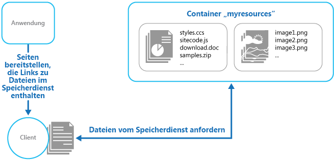

# <a name="static-content-hosting-pattern"></a><span data-ttu-id="1ce7d-104">Muster für das Hosten von statischen Inhalten</span><span class="sxs-lookup"><span data-stu-id="1ce7d-104">Static Content Hosting pattern</span></span>

[!INCLUDE [header](../_includes/header.md)]

<span data-ttu-id="1ce7d-105">Stellen Sie statische Inhalte in einem cloudbasierten Speicherdienst bereit, der die Inhalte direkt an den Client übermitteln kann.</span><span class="sxs-lookup"><span data-stu-id="1ce7d-105">Deploy static content to a cloud-based storage service that can deliver them directly to the client.</span></span> <span data-ttu-id="1ce7d-106">Dies kann den Bedarf an potenziell kostspieligen Compute-Instanzen reduzieren.</span><span class="sxs-lookup"><span data-stu-id="1ce7d-106">This can reduce the need for potentially expensive compute instances.</span></span>

## <a name="context-and-problem"></a><span data-ttu-id="1ce7d-107">Kontext und Problem</span><span class="sxs-lookup"><span data-stu-id="1ce7d-107">Context and problem</span></span>

<span data-ttu-id="1ce7d-108">Webanwendungen enthalten i.d.R. auch statische Inhalte.</span><span class="sxs-lookup"><span data-stu-id="1ce7d-108">Web applications typically include some elements of static content.</span></span> <span data-ttu-id="1ce7d-109">Diese statischen Inhalte umfassen möglicherweise HTML-Seiten und andere Ressourcen, z.B. Bilder und Dokumente, die für den Client verfügbar sind, entweder als Teil einer HTML-Seite (z.B. Inlinebilder, Formatvorlagen und clientseitige JavaScript-Dateien) oder als eigene Downloads (z.B. PDF-Dokumente).</span><span class="sxs-lookup"><span data-stu-id="1ce7d-109">This static content might include HTML pages and other resources such as images and documents that are available to the client, either as part of an HTML page (such as inline images, style sheets, and client-side JavaScript files) or as separate downloads (such as PDF documents).</span></span>

<span data-ttu-id="1ce7d-110">Obwohl Webserver Anforderungen durch die effiziente Ausführung von Code für dynamische Seiten und die Zwischenspeicherung der Ausgabe optimieren können, müssen sie Anforderungen zum Herunterladen von statischen Inhalten verarbeiten.</span><span class="sxs-lookup"><span data-stu-id="1ce7d-110">Although web servers are well tuned to optimize requests through efficient dynamic page code execution and output caching, they still have to handle requests to download static content.</span></span> <span data-ttu-id="1ce7d-111">Dies beansprucht Verarbeitungszyklen, die häufig besser genutzt werden können.</span><span class="sxs-lookup"><span data-stu-id="1ce7d-111">This consumes processing cycles that could often be put to better use.</span></span>

## <a name="solution"></a><span data-ttu-id="1ce7d-112">Lösung</span><span class="sxs-lookup"><span data-stu-id="1ce7d-112">Solution</span></span>

<span data-ttu-id="1ce7d-113">In den meisten Cloudhostingumgebungen kann der Bedarf an Compute-Instanzen minimiert werden (z.B. Verwendung einer kleineren Instanz oder einer geringeren Anzahl von Instanzen), indem einige der Ressourcen und statischen Seiten einer Anwendung in einer Speicherinstanz untergebracht werden.</span><span class="sxs-lookup"><span data-stu-id="1ce7d-113">In most cloud hosting environments it's possible to minimize the need for compute instances (for example, use a smaller instance or fewer instances), by locating some of an application’s resources and static pages in a storage service.</span></span> <span data-ttu-id="1ce7d-114">Die Kosten für in der Cloud gehosteten Speicher sind in der Regel weitaus geringer als die Kosten für Compute-Instanzen.</span><span class="sxs-lookup"><span data-stu-id="1ce7d-114">The cost for cloud-hosted storage is typically much less than for compute instances.</span></span>

<span data-ttu-id="1ce7d-115">Wenn einige Teile einer Anwendung in einem Speicherdienst gehostet werden, beziehen sich die wichtigsten Überlegungen auf die Bereitstellung der Anwendung und das Sichern der Ressourcen, die nicht für anonyme Benutzer verfügbar sein sollen.</span><span class="sxs-lookup"><span data-stu-id="1ce7d-115">When hosting some parts of an application in a storage service, the main considerations are related to deployment of the application and to securing resources that aren't intended to be available to anonymous users.</span></span>

## <a name="issues-and-considerations"></a><span data-ttu-id="1ce7d-116">Probleme und Überlegungen</span><span class="sxs-lookup"><span data-stu-id="1ce7d-116">Issues and considerations</span></span>

<span data-ttu-id="1ce7d-117">Beachten Sie die folgenden Punkte bei der Entscheidung, wie dieses Muster implementiert werden soll:</span><span class="sxs-lookup"><span data-stu-id="1ce7d-117">Consider the following points when deciding how to implement this pattern:</span></span>

- <span data-ttu-id="1ce7d-118">Der gehostete Speicherdienst muss einen HTTP-Endpunkt verfügbar machen, auf den Benutzer zugreifen können, um die statischen Ressourcen herunterzuladen.</span><span class="sxs-lookup"><span data-stu-id="1ce7d-118">The hosted storage service must expose an HTTP endpoint that users can access to download the static resources.</span></span> <span data-ttu-id="1ce7d-119">Einige Speicherdienste unterstützen auch HTTPS, daher können Ressourcen in Speicherdiensten gehostet werden, die SSL erfordern.</span><span class="sxs-lookup"><span data-stu-id="1ce7d-119">Some storage services also support HTTPS, so it's possible to host resources in storage services that require SSL.</span></span>

- <span data-ttu-id="1ce7d-120">Für maximale Leistung und Verfügbarkeit empfiehlt es sich, ein Content Delivery Network (CDN) zu verwenden, um die Inhalte des Speichercontainers in mehreren Datencentern auf der ganzen Welt zwischenzuspeichern.</span><span class="sxs-lookup"><span data-stu-id="1ce7d-120">For maximum performance and availability, consider using a content delivery network (CDN) to cache the contents of the storage container in multiple datacenters around the world.</span></span> <span data-ttu-id="1ce7d-121">Wahrscheinlich ist CDN jedoch für Sie kostenpflichtig.</span><span class="sxs-lookup"><span data-stu-id="1ce7d-121">However, you'll likely have to pay for using the CDN.</span></span>

- <span data-ttu-id="1ce7d-122">Speicherkonten werden häufig standardmäßig georepliziert, um Resilienz im Fall von Ereignissen zu bieten, die sich auf das Datencenter auswirken können.</span><span class="sxs-lookup"><span data-stu-id="1ce7d-122">Storage accounts are often geo-replicated by default to provide resiliency against events that might affect a datacenter.</span></span> <span data-ttu-id="1ce7d-123">Dies bedeutet, dass sich die IP-Adresse ändern kann, die URL bleibt aber die gleiche.</span><span class="sxs-lookup"><span data-stu-id="1ce7d-123">This means that the IP address might change, but the URL will remain the same.</span></span>

- <span data-ttu-id="1ce7d-124">Wenn sich einige Inhalte in einem Speicherkonto und andere Inhalte in einer gehosteten Compute-Instanz befinden, wird es schwieriger, eine Anwendung bereitzustellen und zu aktualisieren.</span><span class="sxs-lookup"><span data-stu-id="1ce7d-124">When some content is located in a storage account and other content is in a hosted compute instance it becomes more challenging to deploy an application and to update it.</span></span> <span data-ttu-id="1ce7d-125">Möglicherweise müssen Sie getrennte Bereitstellungen durchführen und Versionen der Anwendung und Inhalte erstellen, um die Verwaltung zu vereinfachen – insbesondere, wenn die statischen Inhalte Skriptdateien oder UI-Komponenten umfassen.</span><span class="sxs-lookup"><span data-stu-id="1ce7d-125">You might have to perform separate deployments, and version the application and content to manage it more easily&mdash;especially when the static content includes script files or UI components.</span></span> <span data-ttu-id="1ce7d-126">Wenn jedoch nur statische Ressourcen aktualisiert werden müssen, können sie einfach in das Speicherkonto hochgeladen werden, ohne das Anwendungspaket erneut bereitzustellen.</span><span class="sxs-lookup"><span data-stu-id="1ce7d-126">However, if only static resources have to be updated, they can simply be uploaded to the storage account without needing to redeploy the application package.</span></span>

- <span data-ttu-id="1ce7d-127">Speicherdienste unterstützen möglicherweise nicht die Verwendung von benutzerdefinierten Domänennamen.</span><span class="sxs-lookup"><span data-stu-id="1ce7d-127">Storage services might not support the use of custom domain names.</span></span> <span data-ttu-id="1ce7d-128">In diesem Fall muss in Links die vollständige URL der Ressourcen angegeben werden, da sie sich in einer anderen Domäne als der dynamisch generierte Inhalt befinden, der die Links enthält.</span><span class="sxs-lookup"><span data-stu-id="1ce7d-128">In this case it's necessary to specify the full URL of the resources in links because they'll be in a different domain from the dynamically-generated content containing the links.</span></span>

- <span data-ttu-id="1ce7d-129">Die Speichercontainer müssen für öffentlichen Lesezugriff konfiguriert werden. Um das Hochladen von Inhalten durch Benutzer zu verhindern, muss jedoch unbedingt sichergestellt werden, dass sie nicht für den öffentlichen Schreibzugriff konfiguriert sind.</span><span class="sxs-lookup"><span data-stu-id="1ce7d-129">The storage containers must be configured for public read access, but it's vital to ensure that they aren't configured for public write access to prevent users being able to upload content.</span></span> <span data-ttu-id="1ce7d-130">Verwenden Sie einen Valet-Schlüssel oder ein Token zum Steuern des Zugriffs auf Ressourcen, die nicht anonym verfügbar sein sollten. Weitere Informationen finden Sie unter [Valet-Schlüssel-Muster](valet-key.md).</span><span class="sxs-lookup"><span data-stu-id="1ce7d-130">Consider using a valet key or token to control access to resources that shouldn't be available anonymously&mdash;see the [Valet Key pattern](valet-key.md) for more information.</span></span>

## <a name="when-to-use-this-pattern"></a><span data-ttu-id="1ce7d-131">Verwendung dieses Musters</span><span class="sxs-lookup"><span data-stu-id="1ce7d-131">When to use this pattern</span></span>

<span data-ttu-id="1ce7d-132">Dieses Muster ist hilfreich:</span><span class="sxs-lookup"><span data-stu-id="1ce7d-132">This pattern is useful for:</span></span>

- <span data-ttu-id="1ce7d-133">Zum Minimieren der Hostingkosten für Websites und Anwendungen, die statische Ressourcen enthalten.</span><span class="sxs-lookup"><span data-stu-id="1ce7d-133">Minimizing the hosting cost for websites and applications that contain some static resources.</span></span>

- <span data-ttu-id="1ce7d-134">Zum Minimieren der Hostingkosten für Websites, die nur aus statischen Inhalten und Ressourcen bestehen.</span><span class="sxs-lookup"><span data-stu-id="1ce7d-134">Minimizing the hosting cost for websites that consist of only static content and resources.</span></span> <span data-ttu-id="1ce7d-135">Abhängig von den Funktionen des Speichersystems des Hostinganbieters kann möglicherweise eine gesamte vollständig statische Website in einem Speicherkonto gehostet werden.</span><span class="sxs-lookup"><span data-stu-id="1ce7d-135">Depending on the capabilities of the hosting provider’s storage system, it might be possible to entirely host a fully static website in a storage account.</span></span>

- <span data-ttu-id="1ce7d-136">Zum Verfügbarmachen statischer Ressourcen und Inhalte für Anwendungen, die in anderen Hostumgebungen oder auf lokalen Servern ausgeführt werden.</span><span class="sxs-lookup"><span data-stu-id="1ce7d-136">Exposing static resources and content for applications running in other hosting environments or on-premises servers.</span></span>

- <span data-ttu-id="1ce7d-137">Zum Suchen von Inhalten in mehreren geografischen Regionen mithilfe eines Content Delivery Network, das die Inhalte des Speicherkontos in mehreren Datencentern auf der ganzen Welt zwischenspeichert.</span><span class="sxs-lookup"><span data-stu-id="1ce7d-137">Locating content in more than one geographical area using a content delivery network that caches the contents of the storage account in multiple datacenters around the world.</span></span>

- <span data-ttu-id="1ce7d-138">Zum Überwachen von Kosten und Bandbreitennutzung.</span><span class="sxs-lookup"><span data-stu-id="1ce7d-138">Monitoring costs and bandwidth usage.</span></span> <span data-ttu-id="1ce7d-139">Durch die Verwendung eines eigenen Speicherkontos für einige oder alle statischen Inhalte lassen sich die Hosting- und Laufzeitkosten leichter trennen.</span><span class="sxs-lookup"><span data-stu-id="1ce7d-139">Using a separate storage account for some or all of the static content allows the costs to be more easily separated from hosting and runtime costs.</span></span>

<span data-ttu-id="1ce7d-140">Dieses Muster ist in den folgenden Situationen eventuell nicht hilfreich:</span><span class="sxs-lookup"><span data-stu-id="1ce7d-140">This pattern might not be useful in the following situations:</span></span>

- <span data-ttu-id="1ce7d-141">Die Anwendung muss statische Inhalte vor der Übermittlung an den Client verarbeiten.</span><span class="sxs-lookup"><span data-stu-id="1ce7d-141">The application needs to perform some processing on the static content before delivering it to the client.</span></span> <span data-ttu-id="1ce7d-142">Beispielsweise kann es erforderlich, einem Dokument einen Zeitstempel hinzuzufügen.</span><span class="sxs-lookup"><span data-stu-id="1ce7d-142">For example, it might be necessary to add a timestamp to a document.</span></span>

- <span data-ttu-id="1ce7d-143">Die Menge statischer Inhalte ist sehr gering.</span><span class="sxs-lookup"><span data-stu-id="1ce7d-143">The volume of static content is very small.</span></span> <span data-ttu-id="1ce7d-144">Der Mehraufwand für das Abrufen dieser Inhalte aus einem eigenen Speicherkonto überwiegt möglicherweise den Kostenvorteil durch die Trennung von der Compute-Ressource.</span><span class="sxs-lookup"><span data-stu-id="1ce7d-144">The overhead of retrieving this content from separate storage can outweigh the cost benefit of separating it out from the compute resource.</span></span>

## <a name="example"></a><span data-ttu-id="1ce7d-145">Beispiel</span><span class="sxs-lookup"><span data-stu-id="1ce7d-145">Example</span></span>

<span data-ttu-id="1ce7d-146">Auf statische Inhalte in Azure Blob Storage kann von einem Webbrowser direkt zugegriffen werden.</span><span class="sxs-lookup"><span data-stu-id="1ce7d-146">Static content located in Azure Blob storage can be accessed directly by a web browser.</span></span> <span data-ttu-id="1ce7d-147">Azure stellt eine HTTP-basierte Schnittstelle für Speicher bereit, die für Clients öffentlich verfügbar gemacht werden kann.</span><span class="sxs-lookup"><span data-stu-id="1ce7d-147">Azure provides an HTTP-based interface over storage that can be publicly exposed to clients.</span></span> <span data-ttu-id="1ce7d-148">Beispielsweise können Inhalte in einem Azure Blob Storage-Container über eine URL im folgenden Format verfügbar gemacht werden:</span><span class="sxs-lookup"><span data-stu-id="1ce7d-148">For example, content in an Azure Blob storage container is exposed using a URL with the following form:</span></span>

`http://[ storage-account-name ].blob.core.windows.net/[ container-name ]/[ file-name ]`


<span data-ttu-id="1ce7d-149">Beim Hochladen der Inhalte müssen einer oder mehrere BLOB-Container für die Dateien und Dokumente erstellt werden.</span><span class="sxs-lookup"><span data-stu-id="1ce7d-149">When uploading the content it's necessary to create one or more blob containers to hold the files and documents.</span></span> <span data-ttu-id="1ce7d-150">Beachten Sie, dass die Standardberechtigung für einen neuen Container „Privat“ lautet und in „Öffentlich“ geändert werden muss, um Clients Zugriff auf die Inhalte zu gewähren.</span><span class="sxs-lookup"><span data-stu-id="1ce7d-150">Note that the default permission for a new container is Private, and you must change this to Public to allow clients to access the contents.</span></span> <span data-ttu-id="1ce7d-151">Wenn die Inhalte vor anonymem Zugriff geschützt werden müssen, können Sie das [Valet-Schlüssel-Muster](valet-key.md) implementieren, damit Benutzer ein gültiges Token vorlegen müssen, um die Ressourcen herunterzuladen.</span><span class="sxs-lookup"><span data-stu-id="1ce7d-151">If it's necessary to protect the content from anonymous access, you can implement the [Valet Key pattern](valet-key.md) so users must present a valid token to download the resources.</span></span>

> <span data-ttu-id="1ce7d-152">In [Konzepte des Blob-Diensts](https://msdn.microsoft.com/library/azure/dd179376.aspx) finden Sie Informationen zu Blob Storage und den Verfahren, mit denen Sie auf diesen Dienst zugreifen und ihn verwenden können.</span><span class="sxs-lookup"><span data-stu-id="1ce7d-152">[Blob Service Concepts](https://msdn.microsoft.com/library/azure/dd179376.aspx) has information about blob storage, and the ways that you can access and use it.</span></span>

<span data-ttu-id="1ce7d-153">Die Links auf den einzelnen Seiten geben die URL der Ressource an, und der Client greift direkt aus dem Speicherdienst auf sie zu.</span><span class="sxs-lookup"><span data-stu-id="1ce7d-153">The links in each page will specify the URL of the resource and the client will access it directly from the storage service.</span></span> <span data-ttu-id="1ce7d-154">Die Abbildung veranschaulicht die direkte Übermittlung von statischen Teilen einer Anwendung aus einem Speicherdienst.</span><span class="sxs-lookup"><span data-stu-id="1ce7d-154">The figure illustrates delivering static parts of an application directly from a storage service.</span></span>




<span data-ttu-id="1ce7d-156">Die Links auf den Seiten, die an den Client übermittelt werden, müssen die vollständige URL des BLOB-Containers und der Ressource angeben.</span><span class="sxs-lookup"><span data-stu-id="1ce7d-156">The links in the pages delivered to the client must specify the full URL of the blob container and resource.</span></span> <span data-ttu-id="1ce7d-157">Beispielsweise kann eine Seite, die einen Link zu einem Bild in einem öffentlichen Container enthält, den folgenden HTML-Code enthalten.</span><span class="sxs-lookup"><span data-stu-id="1ce7d-157">For example, a page that contains a link to an image in a public container might contain the following HTML.</span></span>

```html

```

> <span data-ttu-id="1ce7d-158">Wenn die Ressourcen durch einen Valet-Schlüssel, z.B. eine Azure SAS, geschützt sind, muss diese Signatur in den URLs der Links enthalten sein.</span><span class="sxs-lookup"><span data-stu-id="1ce7d-158">If the resources are protected by using a valet key, such as an Azure shared access signature, this signature must be included in the URLs in the links.</span></span>

<span data-ttu-id="1ce7d-159">In [GitHub](https://github.com/mspnp/cloud-design-patterns/tree/master/static-content-hosting) ist eine Lösung mit dem Namen „StaticContentHosting“ verfügbar, die das Verwenden von externem Speicher für statische Ressourcen veranschaulicht.</span><span class="sxs-lookup"><span data-stu-id="1ce7d-159">A solution named StaticContentHosting that demonstrates using external storage for static resources is available from [GitHub](https://github.com/mspnp/cloud-design-patterns/tree/master/static-content-hosting).</span></span> <span data-ttu-id="1ce7d-160">Das Projekt „StaticContentHosting.Cloud“ enthält Konfigurationsdateien, die das Speicherkonto und den Container angeben, in dem sich die statischen Inhalte befinden.</span><span class="sxs-lookup"><span data-stu-id="1ce7d-160">The StaticContentHosting.Cloud project contains configuration files that specify the storage account and container that holds the static content.</span></span>

```xml
<Setting name="StaticContent.StorageConnectionString"
         value="UseDevelopmentStorage=true" />
<Setting name="StaticContent.Container" value="static-content" />
```

<span data-ttu-id="1ce7d-161">Die `Settings`-Klasse in der Datei „Settings.cs“ des Projekts „StaticContentHosting.Web“ enthält Methoden zum Extrahieren dieser Werte und zum Erstellen eines Zeichenfolgenwerts, der die URL des Cloudspeicherkonto-Containers enthält.</span><span class="sxs-lookup"><span data-stu-id="1ce7d-161">The `Settings` class in the file Settings.cs of the StaticContentHosting.Web project contains methods to extract these values and build a string value containing the cloud storage account container URL.</span></span>

```csharp
public class Settings
{
  public static string StaticContentStorageConnectionString {
    get
    {
      return RoleEnvironment.GetConfigurationSettingValue(
                              "StaticContent.StorageConnectionString");
    }
  }

  public static string StaticContentContainer
  {
    get
    {
      return RoleEnvironment.GetConfigurationSettingValue("StaticContent.Container");
    }
  }

  public static string StaticContentBaseUrl
  {
    get
    {
      var account = CloudStorageAccount.Parse(StaticContentStorageConnectionString);

      return string.Format("{0}/{1}", account.BlobEndpoint.ToString().TrimEnd('/'),
                                      StaticContentContainer.TrimStart('/'));
    }
  }
}
```

<span data-ttu-id="1ce7d-162">Die `StaticContentUrlHtmlHelper`-Klasse in der Datei „StaticContentUrlHtmlHelper.cs“ macht die Methode `StaticContentUrl` verfügbar. Diese generiert eine URL, die den Pfad zu dem Cloudspeicherkonto enthält, wenn die an sie übergebene URL mit dem ASP.NET-Zeichen für das Stammverzeichnis (~) beginnt.</span><span class="sxs-lookup"><span data-stu-id="1ce7d-162">The `StaticContentUrlHtmlHelper` class in the file StaticContentUrlHtmlHelper.cs exposes a method named `StaticContentUrl` that generates a URL containing the path to the cloud storage account if the URL passed to it starts with the ASP.NET root path character (~).</span></span>

```csharp
public static class StaticContentUrlHtmlHelper
{
  public static string StaticContentUrl(this HtmlHelper helper, string contentPath)
  {
    if (contentPath.StartsWith("~"))
    {
      contentPath = contentPath.Substring(1);
    }

    contentPath = string.Format("{0}/{1}", Settings.StaticContentBaseUrl.TrimEnd('/'),
                                contentPath.TrimStart('/'));

    var url = new UrlHelper(helper.ViewContext.RequestContext);

    return url.Content(contentPath);
  }
}
```

<span data-ttu-id="1ce7d-163">Die Datei „Index.cshtml“ im Ordner „Views\Home“ enthält ein image-Element, das mit der `StaticContentUrl`-Methode die URL für das `src`-Attribut erstellt.</span><span class="sxs-lookup"><span data-stu-id="1ce7d-163">The file Index.cshtml in the Views\Home folder contains an image element that uses the `StaticContentUrl` method to create the URL for its `src` attribute.</span></span>

```html

```

## <a name="related-patterns-and-guidance"></a><span data-ttu-id="1ce7d-164">Zugehörige Muster und Anleitungen</span><span class="sxs-lookup"><span data-stu-id="1ce7d-164">Related patterns and guidance</span></span>

- <span data-ttu-id="1ce7d-165">Ein Beispiel für dieses Muster steht auf [GitHub](https://github.com/mspnp/cloud-design-patterns/tree/master/static-content-hosting).</span><span class="sxs-lookup"><span data-stu-id="1ce7d-165">A sample that demonstrates this pattern is available on [GitHub](https://github.com/mspnp/cloud-design-patterns/tree/master/static-content-hosting).</span></span>
- <span data-ttu-id="1ce7d-166">[Valet-Schlüssel-Muster](valet-key.md).</span><span class="sxs-lookup"><span data-stu-id="1ce7d-166">[Valet Key pattern](valet-key.md).</span></span> <span data-ttu-id="1ce7d-167">Wenn die Zielressourcen nicht für anonyme Benutzer verfügbar sein sollen, muss Sicherheit für den Speicher implementiert werden, in dem sich die statischen Inhalte befinden.</span><span class="sxs-lookup"><span data-stu-id="1ce7d-167">If the target resources aren't supposed to be available to anonymous users it's necessary to implement security over the store that holds the static content.</span></span> <span data-ttu-id="1ce7d-168">In diesem Artikel wird beschrieben, wie ein Token oder Schlüssel verwendet wird, das bzw. der Clients eingeschränkten Direktzugriff auf eine bestimmte Ressource oder einen bestimmten Dienst, z.B. einen in der Cloud gehosteten Speicherdienst, bietet.</span><span class="sxs-lookup"><span data-stu-id="1ce7d-168">Describes how to use a token or key that provides clients with restricted direct access to a specific resource or service such as a cloud-hosted storage service.</span></span>
- <span data-ttu-id="1ce7d-169">[An efficient way of deploying a static web site on Azure](http://www.infosysblogs.com/microsoft/2010/06/an_efficient_way_of_deploying.html) (Eine effiziente Möglichkeit zum Bereitstellen einer statischen Website in Azure, in englischer Sprache) im Infosys-Blog.</span><span class="sxs-lookup"><span data-stu-id="1ce7d-169">[An efficient way of deploying a static web site on Azure](http://www.infosysblogs.com/microsoft/2010/06/an_efficient_way_of_deploying.html) on the Infosys blog.</span></span>
- [<span data-ttu-id="1ce7d-170">Konzepte des Blob-Diensts</span><span class="sxs-lookup"><span data-stu-id="1ce7d-170">Blob Service Concepts</span></span>](https://msdn.microsoft.com/library/azure/dd179376.aspx)
