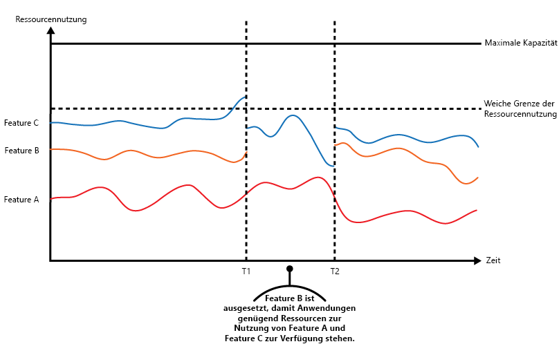

# Muster „Drosselung“Throttling pattern

[!INCLUDE [header](../_includes/header.md)]

Steuern Sie den Verbrauch der von einer Anwendungsinstanz, einem einzelnen Mandanten oder einem gesamten Dienst verwendeten Ressourcen.Control the consumption of resources used by an instance of an application, an individual tenant, or an entire service. So kann das System auch dann weiter funktionieren und Vereinbarungen zum Servicelevel (Service Level Agreement, SLAs) erfüllen, wenn ein steigender Bedarf zu einer extremen Ressourcenauslastung führt.This can allow the system to continue to function and meet service level agreements, even when an increase in demand places an extreme load on resources.

## Kontext und ProblemContext and problem

Die Last einer Cloudanwendung schwankt normalerweise im Laufe der Zeit, je nach Anzahl der aktiven Benutzer oder den Arten der von ihnen ausgeführten Aktivitäten.The load on a cloud application typically varies over time based on the number of active users or the types of activities they are performing. Dies ist beispielsweise während den Geschäftszeiten der Fall, in denen aller Wahrscheinlichkeit nach mehr Benutzer aktiv sind, oder am Ende eines jeden Monats, an dem das System rechenintensive Analysen durchführen muss.For example, more users are likely to be active during business hours, or the system might be required to perform computationally expensive analytics at the end of each month. Zudem kann es zu plötzlichen und unvorhergesehenen Aktivitätsspitzen kommen.There might also be sudden and unanticipated bursts in activity. Wenn die Verarbeitungsanforderungen des Systems die Kapazität der verfügbaren Ressourcen überschreiten, kommt es zu einer Leistungsverschlechterung und eventuell sogar zu Ausfällen.If the processing requirements of the system exceed the capacity of the resources that are available, it'll suffer from poor performance and can even fail. Wenn das System einen vereinbarten Servicelevel erfüllen muss, kann ein solcher Ausfall untragbar sein.If the system has to meet an agreed level of service, such failure could be unacceptable.

Für den Umgang mit einer schwankenden Last in der Cloud gibt es zahlreiche Strategien, was von den Geschäftszielen der Anwendung abhängt.There're many strategies available for handling varying load in the cloud, depending on the business goals for the application. Eine Strategie besteht darin, die bereitgestellten Ressourcen zu einem beliebigen Zeitpunkt durch automatische Skalierung an die Benutzeranforderungen anzupassen.One strategy is to use autoscaling to match the provisioned resources to the user needs at any given time. Hierdurch können nicht nur Benutzeranforderungen konsistent erfüllt werden, sondern es werden gleichzeitig laufende Kosten optimiert.This has the potential to consistently meet user demand, while optimizing running costs. Die automatische Skalierung kann zwar die Bereitstellung zusätzlicher Ressourcen auslösen, eine solche Bereitstellung erfolgt jedoch nicht unmittelbar.However, while autoscaling can trigger the provisioning of additional resources, this provisioning isn't immediate. Steigt die Nachfrage schnell, kann es innerhalb eines bestimmten Zeitfensters zu einem Ressourcendefizit kommen.If demand grows quickly, there can be a window of time where there's a resource deficit.

## LösungSolution

Eine alternative Strategie zur automatischen Skalierung besteht darin, die Nutzung von Ressourcen durch Anwendungen bis zu einem bestimmten Grenzwert zuzulassen und diese bei Erreichen dieses Grenzwerts dann zu drosseln.An alternative strategy to autoscaling is to allow applications to use resources only up to a limit, and then throttle them when this limit is reached. Das System sollte die eigene Ressourcennutzung überwachen, damit Anforderungen von einem oder mehreren Benutzern bei einer Überschreitung des Schwellenwertes gedrosselt werden können.The system should monitor how it's using resources so that, when usage exceeds the threshold, it can throttle requests from one or more users. Auf diese Weise kann das System weiterhin funktionieren und alle bestehenden Vereinbarungen zum Servicelevel (SLAs) erfüllen.This will enable the system to continue functioning and meet any service level agreements (SLAs) that are in place. Weitere Informationen zur Überwachung der Ressourcennutzung finden Sie unter [Instrumentierungs- und Telemetrieleitfaden](https://msdn.microsoft.com/library/dn589775.aspx).For more information on monitoring resource usage, see the [Instrumentation and Telemetry Guidance](https://msdn.microsoft.com/library/dn589775.aspx).

Das System kann mehrere Drosselungsstrategien implementieren, wie etwa Folgende:The system could implement several throttling strategies, including:

- Ablehnung von Anforderungen eines einzelnen Benutzers, der in einem bestimmten Zeitraum bereits mehr als n-mal pro Sekunde auf System-APIs zugegriffen hat.Rejecting requests from an individual user who's already accessed system APIs more than n times per second over a given period of time. Hierfür muss das System den Ressourcenverbrauch für jeden Mandanten oder Benutzer, der eine Anwendung ausführt, messen.This requires the system to meter the use of resources for each tenant or user running an application. Weitere Informationen finden Sie im [Leitfaden zur Dienstmessung](https://msdn.microsoft.com/library/dn589796.aspx).For more information, see the [Service Metering Guidance](https://msdn.microsoft.com/library/dn589796.aspx).

- Deaktivieren oder Beschränken der Funktionalität ausgewählter nicht wesentlicher Dienste, sodass wesentliche Dienste ungehindert mit ausreichenden Ressourcen ausgeführt werden können.Disabling or degrading the functionality of selected nonessential services so that essential services can run unimpeded with sufficient resources. Wenn die Anwendung beispielsweise Videoausgaben streamt, kann sie zu einer geringeren Auflösung wechseln.For example, if the application is streaming video output, it could switch to a lower resolution.

- Abschwächen des Aktivitätsvolumens durch einen Lastenausgleich (diese Vorgehensweise wird unter [Muster „Warteschlangenbasierter Lastenausgleich“](queue-based-load-leveling.md) näher beschrieben).Using load leveling to smooth the volume of activity (this approach is covered in more detail by the [Queue-based Load Leveling pattern](queue-based-load-leveling.md)). In einer mehrinstanzenfähigen Umgebung wird die Leistung durch diese Vorgehensweise bei jedem Mandanten beeinträchtigt.In a multi-tenant environment, this approach will reduce the performance for every tenant. Wenn das System eine Kombination von Mandanten mit unterschiedlichen SLAs unterstützen muss, können die Aufgaben für Mandanten mit hoher Priorität sofort durchgeführt werden.If the system must support a mix of tenants with different SLAs, the work for high-value tenants might be performed immediately. Anforderungen für andere Mandanten können zurückgehalten und bearbeitet werden, wenn der Rückstand nachgelassen hat.Requests for other tenants can be held back, and handled when the backlog has eased. Zur Implementierung dieser Vorgehensweise kann als Unterstützung das [Muster „Prioritätswarteschlange“][] verwendet werden.The [Priority Queue pattern][] could be used to help implement this approach.

- Verschieben von Vorgängen, die für Anwendungen oder Mandanten mit geringerer Priorität durchgeführt werden.Deferring operations being performed on behalf of lower priority applications or tenants. Diese Vorgänge können angehalten oder beschränkt werden, wobei eine Ausnahme erzeugt wird, um den Mandanten darüber zu informieren, dass das System ausgelastet ist und der Vorgang später erneut wiederholt werden sollte.These operations can be suspended or limited, with an exception generated to inform the tenant that the system is busy and that the operation should be retried later.

Die Abbildung zeigt ein Flächendiagramm zum Ressourcenverbrauch (eine Kombination aus Speicher, CPU, Bandbreite und anderen Faktoren) im Zeitverlauf für Anwendungen, die auf alle drei Funktionen zurückgreifen.The figure shows an area graph for resource use (a combination of memory, CPU, bandwidth, and other factors) against time for applications that are making use of three features. Ein Feature ist ein Funktionsbereich wie etwa eine Komponente, die eine bestimmte Gruppe von Aufgaben ausführt, ein Codeausschnitt, der eine komplexe Berechnung durchführt, oder ein Element, das einen Dienst bereitstellt (z.B. ein In-Memory-Cache).A feature is an area of functionality, such as a component that performs a specific set of tasks, a piece of code that performs a complex calculation, or an element that provides a service such as an in-memory cache. Diese Features sind mit den Buchstaben A, B und C gekennzeichnet.These features are labeled A, B, and C.

> Der Bereich unmittelbar unter der Linie eines Features stellt die Ressourcen dar, die von Anwendungen beim Aufrufen dieses Features verwendet werden.The area immediately below the line for a feature indicates the resources that are used by applications when they invoke this feature. Der Bereich unterhalb der Linie von Feature A beispielsweise stellt die Ressourcen dar, die von Anwendungen verwendet werden, die Feature A verwenden, während der Bereich zwischen den Linien von Feature A und Feature B die Ressourcen darstellt, die von Anwendungen verwendet werden, die Feature B aufrufen. Die aggregierten Bereiche der einzelnen Features stellen die gesamte Ressourcennutzung des Systems dar.For example, the area below the line for Feature A shows the resources used by applications that are making use of Feature A, and the area between the lines for Feature A and Feature B indicates the resources used by applications invoking Feature B. Aggregating the areas for each feature shows the total resource use of the system.

Die vorherige Abbildung zeigt die Auswirkungen bei einer Verschiebung von Vorgängen.The previous figure illustrates the effects of deferring operations. Kurz vor Zeitpunkt T1 erreichen die gesamten Ressourcen, die sämtlichen diese Features nutzenden Anwendungen zugewiesen sind, einen Schwellenwert (den Grenzwert des Ressourcenverbrauchs).Just prior to time T1, the total resources allocated to all applications using these features reach a threshold (the limit of resource use). An diesem Punkt besteht die Gefahr, dass Anwendungen die verfügbaren Ressourcen ausschöpfen.At this point, the applications are in danger of exhausting the resources available. In diesem System ist Feature B weniger entscheidend als Feature A oder Feature C. Es wird daher vorübergehend deaktiviert, und die von diesem Feature verwendeten Ressourcen werden freigegeben.In this system, Feature B is less critical than Feature A or Feature C, so it's temporarily disabled and the resources that it was using are released. Im Zeitraum zwischen Zeitpunkt T1 und T2 werden die Anwendungen, die Feature A und Feature C verwenden, wie gewohnt ausgeführt.Between times T1 and T2, the applications using Feature A and Feature C continue running as normal. Letztendlich sinkt der Ressourcenverbrauch dieser beiden Features so weit, dass bei Zeitpunkt T2 genügend Kapazitäten für die erneute Aktivierung von Feature B vorhanden sind.Eventually, the resource use of these two features diminishes to the point when, at time T2, there is sufficient capacity to enable Feature B again.

Die Vorgehensweisen zur automatischen Skalierung und Drosselung können auch kombiniert werden, um weiterhin die Reaktionsfähigkeit der Anwendungen und die Erfüllung der SLAs sicherzustellen.The autoscaling and throttling approaches can also be combined to help keep the applications responsive and within SLAs. Wenn davon ausgegangen wird, dass die Nachfrage weiterhin hoch bleibt, stellt die Drosselung eine vorübergehende Lösung während der horizontalen Skalierung des Systems dar. An dieser Stelle kann die komplette Funktionalität des Systems wiederhergestellt werden.If the demand is expected to remain high, throttling provides a temporary solution while the system scales out. At this point, the full functionality of the system can be restored.

Die folgende Abbildung zeigt ein Flächendiagramm zum gesamten Ressourcenverbrauch sämtlicher Anwendungen, die in einem bestimmten Zeitraum in einem System ausgeführt werden, und wie die Drosselung mit automatischer Skalierung kombiniert werden kann.The next figure shows an area graph of the overall resource use by all applications running in a system against time, and illustrates how throttling can be combined with autoscaling.

Bei Zeitpunkt T1 ist der Schwellenwert erreicht, der den weichen Grenzwert des Ressourcenverbrauchs angibt.At time T1, the threshold specifying the soft limit of resource use is reached. An dieser Stelle kann das System mit der horizontalen Skalierung beginnen. Wenn die neuen Ressourcen jedoch nicht schnell genug zur Verfügung stehen, werden die vorhandenen Ressourcen möglicherweise aufgebraucht, und das System könnte ausfallen.At this point, the system can start to scale out. However, if the new resources don't become available quickly enough, then the existing resources might be exhausted and the system could fail. Um dies zu verhindern, wird das System wie zuvor beschrieben vorübergehend gedrosselt.To prevent this from occurring, the system is temporarily throttled, as described earlier. Wenn die automatische Skalierung abgeschlossen ist und die zusätzlichen Ressourcen zur Verfügung stehen, kann die Drosselung wieder gelockert werden.When autoscaling has completed and the additional resources are available, throttling can be relaxed.

## Probleme und ÜberlegungenIssues and considerations

Bei der Entscheidung, wie dieses Muster implementiert werden soll, sind die folgenden Punkte zu beachten:You should consider the following points when deciding how to implement this pattern:

- Die Drosselung einer Anwendung und die anzuwendende Strategie sind Bestandteil der architekturbezogenen Entscheidung, die sich auf den gesamten Entwurf eines Systems auswirkt.Throttling an application, and the strategy to use, is an architectural decision that impacts the entire design of a system. Bereits frühzeitig im Anwendungsentwurfsprozess sollte eine Drosselung in Erwägung gezogen werden, da es schwierig ist, nach der Implementierung eines Systems Ressourcen hinzuzufügen.Throttling should be considered early in the application design process because it isn't easy to add once a system has been implemented.

- Eine Drosselung muss schnell erfolgen.Throttling must be performed quickly. Das System muss einen Aktivitätsanstieg erkennen und entsprechend darauf reagieren können.The system must be capable of detecting an increase in activity and react accordingly. Das System muss außerdem in der Lage sein, zu seinem ursprünglichen Zustand zurückzukehren, sobald sich die Last verringert hat.The system must also be able to revert to its original state quickly after the load has eased. Dies setzt voraus, dass die entsprechenden Leistungsdaten kontinuierlich erfasst und überwacht werden.This requires that the appropriate performance data is continually captured and monitored.

- Wenn ein Dienst vorübergehend eine Benutzeranforderung ablehnen muss, sollte dieser einen bestimmten Fehlercode zurückgeben, um die Clientanwendung darüber zu informieren, dass die Ablehnung zur Durchführung eines Vorgangs auf eine Drosselung zurückzuführen ist.If a service needs to temporarily deny a user request, it should return a specific error code so the client application understands that the reason for the refusal to perform an operation is due to throttling. Die Clientanwendung wartet möglicherweise für einen gewissen Zeitraum, bis sie die Anforderung wiederholt.The client application can wait for a period before retrying the request.

- Die Drosselung kann als vorübergehende Maßnahme während der automatischen Skalierung eines Systems genutzt werden.Throttling can be used as a temporary measure while a system autoscales. In manchen Fällen empfiehlt es sich, beim plötzlichen Auftreten einer Aktivitätsspitze von wahrscheinlich nicht sehr langer Dauer einfach eine Drosselung anstelle einer automatischen Skalierung vorzunehmen, da eine Skalierung die laufenden Kosten deutlich in die Höhe treiben kann.In some cases it's better to simply throttle, rather than to scale, if a burst in activity is sudden and isn't expected to be long lived because scaling can add considerably to running costs.

- Wenn während der automatischen Skalierung eines Systems eine Drosselung als vorübergehende Maßnahme verwendet wird und der Ressourcenbedarf sehr schnell ansteigt, kann das System möglicherweise nicht mehr funktionieren – selbst wenn es im gedrosselten Modus betrieben wird.If throttling is being used as a temporary measure while a system autoscales, and if resource demands grow very quickly, the system might not be able to continue functioning&mdash;even when operating in a throttled mode. Wenn dies nicht hinnehmbar ist, sollten Sie eventuell größere Kapazitätsreserven vorhalten und eine weitreichendere automatische Skalierung konfigurieren.If this isn't acceptable, consider maintaining larger capacity reserves and configuring more aggressive autoscaling.

## Verwendung dieses MustersWhen to use this pattern

Verwenden Sie dieses Muster in folgenden Fällen:Use this pattern:

- Um sicherzustellen, dass ein System weiterhin die Vereinbarungen zum Servicelevel erfülltTo ensure that a system continues to meet service level agreements.

- Um zu verhindern, dass ein einzelner Mandant die von einer Anwendung bereitgestellten Ressourcen monopolisiertTo prevent a single tenant from monopolizing the resources provided by an application.

- Um Aktivitätsspitzen zu verarbeitenTo handle bursts in activity.

- Um die Kosten für ein System durch Beschränkung des maximalen Ressourcenbedarfs zu optimieren, der für die Aufrechterhaltung seiner Funktionsfähigkeit erforderlich istTo help cost-optimize a system by limiting the maximum resource levels needed to keep it functioning.

## BeispielExample

Die letzte Abbildung zeigt, wie eine Drosselung in einem mehrinstanzenfähigen System implementiert werden kann.The final figure illustrates how throttling can be implemented in a multi-tenant system. Benutzer der einzelnen Mandantenorganisationen greifen auf eine in der Cloud gehostete Anwendung zu, in der sie Umfragen ausfüllen und einreichen.Users from each of the tenant organizations access a cloud-hosted application where they fill out and submit surveys. Die Anwendung beinhaltet eine Instrumentierung, die die Geschwindigkeit überwacht, mit der diese Benutzer Anforderungen an die Anwendung senden.The application contains instrumentation that monitors the rate at which these users are submitting requests to the application.

Um zu verhindern, dass Benutzer eines Mandanten die Reaktionsfähigkeit und Verfügbarkeit der Anwendung für alle anderen Benutzer beeinträchtigen, wird die Anzahl der Anforderungen, die die Benutzer eines beliebigen Mandanten pro Sekunde senden können, begrenzt.In order to prevent the users from one tenant affecting the responsiveness and availability of the application for all other users, a limit is applied to the number of requests per second the users from any one tenant can submit. Die Anwendung blockiert Anforderungen, die diesen Grenzwert überschreiten.The application blocks requests that exceed this limit.

## Zugehörige Muster und AnleitungenRelated patterns and guidance

Die folgenden Muster und Anleitungen können auch relevant sein, wenn dieses Muster implementiert wird:The following patterns and guidance may also be relevant when implementing this pattern:
- [Instrumentations- und Telemetrieanleitungen](https://msdn.microsoft.com/library/dn589775.aspx).[Instrumentation and Telemetry Guidance](https://msdn.microsoft.com/library/dn589775.aspx). Für die Drosselung müssen Informationen über die Nutzlast eines Diensts gesammelt werden.Throttling depends on gathering information about how heavily a service is being used. Dieser Leitfaden beschreibt, wie benutzerdefinierte Überwachungsinformationen generiert und erfasst werden.Describes how to generate and capture custom monitoring information.
- [Leitfaden zur Dienstmessung](https://msdn.microsoft.com/library/dn589796.aspx):[Service Metering Guidance](https://msdn.microsoft.com/library/dn589796.aspx). Dieser Leitfaden beschreibt, wie die Nutzung von Diensten gemessen wird, um Einblick über deren Verwendung zu erhalten.Describes how to meter the use of services in order to gain an understanding of how they are used. Diese Informationen können als Entscheidungshilfe zur Auswahl einer Drosselungsmethode für einen Dienst dienen.This information can be useful in determining how to throttle a service.
- [Leitfaden für die automatische Skalierung](https://msdn.microsoft.com/library/dn589774.aspx):[Autoscaling Guidance](https://msdn.microsoft.com/library/dn589774.aspx). Die Drosselung kann als Übergangsmaßnahme während der automatischen Skalierung eines Systems oder zur Vermeidung der automatischen Skalierung eines Systems verwendet werden.Throttling can be used as an interim measure while a system autoscales, or to remove the need for a system to autoscale. Dieser Leitfaden enthält Informationen über Strategien zur automatischen Skalierung.Contains information on autoscaling strategies.
- [Muster „Warteschlangenbasierter Lastenausgleich“](queue-based-load-leveling.md):[Queue-based Load Leveling pattern](queue-based-load-leveling.md). Ein warteschlangenbasierter Lastenausgleich ist eine häufig verwendete Methode zur Implementierung der Drosselung.Queue-based load leveling is a commonly used mechanism for implementing throttling. Eine Warteschlange kann als Puffer herangezogen werden, um die Geschwindigkeit auszugleichen, mit der die von einer Anwendung gesendeten Anforderungen an einen Dienst gesendet werden.A queue can act as a buffer that helps to even out the rate at which requests sent by an application are delivered to a service.
- [Muster „Prioritätswarteschlange“][]:[Priority Queue pattern][]. Ein System kann im Rahmen seiner Drosselungsstrategie Prioritätswarteschlangen einsetzen, um die Leistung von kritischen oder höherwertigen Anwendungen aufrechtzuerhalten und gleichzeitig die von weniger wichtigen Anwendungen zu reduzieren.A system can use priority queuing as part of its throttling strategy to maintain performance for critical or higher value applications, while reducing the performance of less important applications.

[Muster „Prioritätswarteschlange“]: priority-queue.md
[Priority Queue pattern]: priority-queue.md