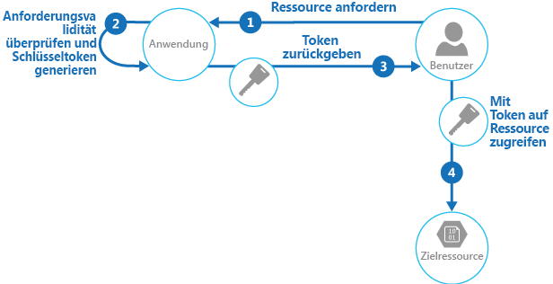

# <a name="valet-key-pattern"></a>Muster „Valet-Schlüssel“

[!INCLUDE [header](../_includes/header.md)]

Verwenden Sie ein Token, das Clients eingeschränkten direkten Zugriff auf eine bestimmte Ressource gewährt, um die Datenübertragung der Anwendung auszulagern. Dies ist besonders nützlich bei Anwendungen, die in der Cloud gehostete Speichersysteme oder Warteschlangen verwenden, und kann die Skalierbarkeit und Leistung bei gleichzeitiger Kostensenkung maximieren.

## <a name="context-and-problem"></a>Kontext und Problem

Clientprogramme und Webbrowser müssen oft Dateien oder Datenströme aus dem bzw. in den Speicher einer Anwendung lesen oder schreiben. In der Regel führt die Anwendung die Verschiebung der Daten durch – entweder durch Abrufen diese Daten aus dem Speicher und Streamen in den Client oder durch Lesen des hochgeladenen Datenstroms vom Client und Speichern im Datenspeicher. Bei dieser Vorgehensweise werden jedoch wertvolle Ressourcen wie Compute-, Speicher- und Bandbreitenressourcen in Anspruch genommen.

Datenspeicher sind in der Lage, Datenuploads und -downloads direkt zu verarbeiten, ohne dass die Anwendung Verarbeitungskapazitäten für die Verschiebung dieser Daten aufwenden muss. Hierfür muss der Client jedoch in der Regel Zugriff auf die Sicherheitsanmeldeinformationen für den Speicher haben. Dies kann eine nützliche Methode sein, um die Kosten für die Datenübertragung und die Anforderungen hinsichtlich der horizontalen Skalierung der Anwendung und Maximierung der Leistung zu minimieren. Das bedeutet jedoch, dass die Anwendung nicht mehr in der Lage ist, die Sicherheit der Daten zu gewährleisten. Nachdem der Client eine Verbindung mit dem Datenspeicher für den direkten Zugriff hergestellt hat, kann die Anwendung nicht mehr als Gatekeeper fungieren. Er hat keine Kontrolle mehr über den Prozess und kann nachfolgende Uploads oder Downloads aus dem Datenspeicher nicht verhindern.

Dies ist keine realistische Vorgehensweise in verteilten Systemen, die Anforderungen von nicht vertrauenswürdigen Clients verarbeiten müssen. Stattdessen müssen Anwendungen in der Lage sein, den Zugriff auf Daten granular und sicher zu steuern, aber dennoch die Auslastung des Servers zu reduzieren. Hierfür müssen sie diese Verbindung einrichten und anschließend dem Client die direkte Kommunikation mit dem Datenspeicher ermöglichen, damit die erforderlichen Lese- oder Schreibvorgänge durchgeführt werden können.

## <a name="solution"></a>Lösung

Sie müssen das Problem bezüglich der Steuerung des Zugriffs auf einen Datenspeicher lösen, in dem der Speicher die Authentifizierung und Autorisierung von Clients nicht verwalten kann. Eine typische Lösung besteht darin, den Zugriff auf die öffentliche Verbindung des Datenspeichers zu beschränken und dem Client einen Schlüssel oder ein Token zur Verfügung zu stellen, den bzw. das der Datenspeicher überprüfen kann.

Der Schlüssel bzw. das Token wird üblicherweise als „Valet-Schlüssel“ bezeichnet. Dieser bietet zeitlich begrenzten Zugriff auf bestimmte Ressourcen und erlaubt nur vordefinierte Vorgänge, wie das Lesen und Schreiben von Daten aus oder in Speicher(n) oder Warteschlangen oder das Hochladen in einen und Herunterladen von einem Webbrowser. Anwendungen können schnell und einfach Valet-Schlüssel für Clientgeräte und Webbrowser erstellen und ausstellen, sodass Clients die erforderlichen Vorgänge durchführen können, ohne dass die Anwendung die Datenübertragung direkt verarbeiten muss. Dadurch entfallen der Verarbeitungsaufwand und die Auswirkungen auf die Leistung und Skalierbarkeit der Anwendung und des Servers.

Der Client verwendet dieses Token, um nur für einen bestimmten Zeitraum und mit bestimmten Einschränkungen der Zugriffsberechtigungen auf eine bestimmte Ressource im Datenspeicher zuzugreifen, wie in der Abbildung dargestellt wird. Nach Ablauf des angegebenen Zeitraums wird der Schlüssel ungültig und erlaubt keinen Zugriff auf die Ressource.



Es ist auch möglich, einen Schlüssel mit anderen Abhängigkeiten wie dem Geltungsbereich der Daten zu konfigurieren. Je nach den Datenspeicherfunktionen kann der Schlüssel beispielsweise eine komplette Tabelle in einem Datenspeicher oder nur bestimmte Zeilen in einer Tabelle angeben. In Cloudspeichersystemen kann der Schlüssel einen Container oder nur ein bestimmtes Element in einem Container angeben.

Der Schlüssel kann auch von der Anwendung ungültig gemacht werden. Dies ist eine hilfreiche Vorgehensweise, wenn der Client dem Server mitteilt, dass der Datenübertragungsvorgang abgeschlossen ist. Der Server kann dann diesen Schlüssel ungültig machen, um weitere Aktionen zu verhindern.

Die Verwendung dieses Musters kann die Verwaltung des Zugriffs auf Ressourcen vereinfachen, da es nicht erforderlich ist, einen Benutzer zu erstellen und zu authentifizieren, Berechtigungen zu erteilen und den Benutzer dann wieder zu entfernen. Zudem ist damit auch einfach, den Speicherort, die Berechtigung und die Gültigkeitsdauer zu begrenzen, indem man zur Runtime einfach einen Schlüssel generiert. Wichtig ist es, die Gültigkeitsdauer und insbesondere den Speicherort der Ressource so weit wie möglich zu begrenzen, damit der Empfänger diese nur für den vorgesehenen Zweck nutzen kann.

## <a name="issues-and-considerations"></a>Probleme und Überlegungen

Beachten Sie die folgenden Punkte bei der Entscheidung, wie dieses Muster implementiert werden soll:

**Verwalten Sie den Gültigkeitsstatus und die Gültigkeitsdauer des Schlüssels**. Im Falle eines Verlusts oder einer Gefährdung entsperrt der Schlüssel effektiv das Zielelement und stellt es im Zeitraum der Gültigkeitsdauer für die böswillige Verwendung zur Verfügung. Ein Schlüssel kann in der Regel widerrufen oder deaktiviert werden, je nachdem, wie er ausgestellt wurde. Serverseitige Richtlinien können geändert werden oder der Serverschlüssel, mit dem er signiert wurde, kann ungültig gemacht werden. Geben Sie eine kurze Gültigkeitsdauer an, um das Risiko zu minimieren, dass nicht autorisierte Vorgänge für den Datenspeicher durchgeführt werden. Wenn die Gültigkeitsdauer jedoch zu kurz ist, kann es vorkommen, dass der Client den Vorgang nicht vor Ablauf der Gültigkeitsdauer des Schlüssels abschließen kann. Erlauben Sie autorisierten Benutzern, den Schlüssel vor Ablauf der Gültigkeitsdauer zu verlängern, wenn mehrere Zugriffe auf die geschützte Ressource erforderlich sind.

**Steuern Sie die Zugriffsebene, die der Schlüssel gewährt**. Der Schlüssel sollte dem Benutzer in der Regel erlauben, nur die Aktionen auszuführen, die für die Durchführung des Vorgangs notwendig sind, wie z.B. einen schreibgeschützten Zugriff, wenn der Client keine Daten in den Datenspeicher hochladen können soll. Bei Dateiuploads ist es üblich, einen Schlüssel, der nur zum Schreiben berechtigt, sowie den Speicherort und die Gültigkeitsdauer anzugeben. Es ist wichtig, die Ressource oder die Gruppe von Ressourcen, auf die der Schlüssel angewendet wird, exakt anzugeben.

**Überlegen Sie, wie Sie das Verhalten der Benutzer steuern können**. Die Implementierung dieses Musters ist mit einem gewissen Verlust der Kontrolle über die Ressourcen, für die dem Benutzer Zugriff gewährt wurde, verbunden. Der Grad der Kontrolle, der ausgeübt werden kann, wird durch die Funktionen der Richtlinien und Berechtigungen begrenzt, die für den Dienst oder den Zieldatenspeicher eingerichtet wurden. Beispielsweise ist es in der Regel nicht möglich, einen Schlüssel zu erstellen, der die Größe der in den Speicher zu schreibenden Daten oder die Häufigkeit, mit der anhand des Schlüssels auf eine Datei zugegriffen werden kann, begrenzt. Selbst wenn der Schlüssel vom vorgesehenen Client genutzt wird, kann dies zu enormen, unerwarteten Datenübertragungskosten führen, die möglicherweise durch wiederholte Uploads oder Downloads aufgrund eines Fehlers im Code verursacht werden. Um die Anzahl der Uploads einer Datei zu begrenzen, erzwingen Sie nach Möglichkeit, dass der Client die Anwendung über den Abschluss eines Vorgangs benachrichtigt. Beispielsweise lösen einige Datenspeicher Ereignisse aus, mit denen der Anwendungscode Vorgänge überwachen und das Benutzerverhalten steuern kann. Allerdings ist es schwierig, Kontingente für einzelne Benutzer in einem Szenario mit mehreren Mandanten zu erzwingen, in dem derselbe Schlüssel von allen Benutzern eines Mandanten verwendet wird.

**Überprüfen und bereinigen Sie optional alle hochgeladenen Daten**. Ein böswilliger Benutzer, der Zugriff auf den Schlüssel erhält, könnte Daten, die auf die Gefährdung des Systems abzielen, hochladen. Alternativ können autorisierte Benutzer ungültige Daten hochladen, die bei der Verarbeitung zu Fehlern oder einem Systemfehler führen könnten. Um sich davor zu schützen, stellen Sie sicher, dass alle hochgeladenen Daten vor der Verwendung überprüft und auf schadhafte Inhalte geprüft werden.

**Überwachen Sie alle Vorgänge**. Viele schlüsselbasierten Mechanismen können Vorgänge wie Uploads, Downloads und Fehler protokollieren. Diese Protokolle können in der Regel in einen Überwachungsprozess eingebunden werden und auch für die Abrechnung des Benutzers verwendet werden, sofern diese basierend auf Dateigröße oder Datenvolumen erfolgt. Verwenden Sie die Protokolle, um Authentifizierungsfehler zu erkennen, die durch Probleme mit dem Schlüsselanbieter oder durch versehentliches Entfernen einer gespeicherten Zugriffsrichtlinie verursacht werden können.

**Übermitteln Sie den Schlüssel auf sichere Weise**. Dieser kann in eine URL eingebettet werden, die der Benutzer auf einer Webseite aktiviert, oder in einem Serverumleitungsvorgang verwendet werden, sodass der Download automatisch erfolgt. Verwenden Sie immer HTTPS, um den Schlüssel über einen sicheren Kanal zu übermitteln.

**Schützen Sie sensible Daten bei der Übertragung**. Sensible Daten, die durch die Anwendung übermittelt werden, werden in der Regel über SSL oder TLS übertragen, und dies sollte auch bei Clients mit direktem Zugriff auf den Datenspeicher erzwungen werden.

Bei der Implementierung dieses Musters sind außerdem folgende weitere Probleme zu beachten:

- Wenn der Client den Server nicht über den Abschluss des Vorgangs informiert oder nicht benachrichtigen kann und die einzige Einschränkung der Ablaufzeitraum des Schlüssels darstellt, kann die Anwendung keine Überwachungsvorgänge durchführen, wie das Nachverfolgen der Upload- oder Downloadhäufigkeit oder die Vermeidung mehrfacher Uploads oder Downloads.

- Die Flexibilität der Schlüsselrichtlinien, die generiert werden können, ist möglicherweise begrenzt. Einige Mechanismen erlauben beispielsweise nur die Verwendung eines begrenzten Ablaufzeitraums. Andere Mechanismen können wiederum keine ausreichende Granularität für Schreib-/Leseberechtigungen bereitstellen.

- Wenn die Startzeit für die Gültigkeitsdauer des Schlüssels oder Tokens festgelegt ist, stellen Sie sicher, dass sie diese etwas früher als die aktuelle Serverzeit einstellen, um geringfügige Abweichungen bei Clientuhren zu berücksichtigen. Falls nicht anderes festgelegt ist, ist in der Regel standardmäßig die aktuelle Serverzeit eingestellt.

- Die URL mit dem Schlüssel wird in Serverprotokolldateien aufgezeichnet. Der Schlüssel wird zwar normalerweise abgelaufen sein, bevor die Protokolldateien für die Analyse verwendet werden, Sie sollten jedoch den Zugriff darauf auf jeden Fall einschränken. Wenn die Protokolldaten an ein Überwachungssystem übertragen oder an einem anderen Speicherort gespeichert werden, sollten Sie eine Verzögerung implementieren, um einen Verlust der Schlüssel nach Ablauf der Gültigkeitsdauer zu verhindern.

- Wenn der Clientcode in einem Webbrowser ausgeführt wird, muss der Browser möglicherweise Unterstützung für CORS (Cross-Origin Resource Sharing) bieten, damit im Webbrowser ausgeführte Codes auf Daten in einer anderen Domäne als derjenigen, die die Seite bedient, zugreifen können. Einige ältere Browser und einige Datenspeicher unterstützen CORS nicht, und Codes, die in diesen Browsern ausgeführt werden, können möglicherweise mithilfe eines Valet-Schlüssels auf Daten in einer anderen Domäne (z.B. einem Cloudspeicherkonto) zugreifen.

## <a name="when-to-use-this-pattern"></a>Verwendung dieses Musters

Dieses Muster ist in folgenden Situationen nützlich:

- Zur Minimierung der Ressourcenauslastung und Maximierung der Leistung und Skalierbarkeit. Für die Verwendung eines Valet-Schlüssels ist weder eine Sperrung der Ressource noch ein Remoteserveraufruf erforderlich. Zudem gibt es keine Begrenzung bezüglich der Anzahl der Valet-Schlüssel, die ausgestellt werden können, und es verhindert einen Single Point of Failure, der aus der Durchführung der Datenübertragung über den Anwendungscode resultiert. Bei der Erstellung eines Valet-Schlüssels handelt es sich in der Regel um einen einfachen kryptographischen Vorgang, bei dem eine Zeichenfolge mit einem Schlüssel signiert wird.

- Zur Minimierung der Betriebskosten. Der direkte Zugriff auf Speicher und Warteschlangen ist ressourcen- und kosteneffizient – so können die Anzahl der Netzwerkroundtrips und der benötigten Rechenressourcen reduziert werden.

- Wenn Clients regelmäßig Daten hoch- oder herunterladen, insbesondere bei großen Datenmengen oder bei Vorgängen mit großen Dateien.

- Wenn die Anwendung aufgrund von Hostingeinschränkungen oder Kostenüberlegungen nur über begrenzte Rechenressourcen verfügt. In diesem Szenario ist das Muster bei vielen gleichzeitigen Datenuploads oder -downloads noch hilfreicher, da es die Anwendung von der Verarbeitung der Datenübertragung entlastet.

- Wenn die Daten in einem Remotedatenspeicher oder einem anderen Rechenzentrum gespeichert werden. Wenn die Anwendung als Gatekeeper fungieren sollte, könnte die zusätzliche Bandbreite für die Übertragung der Daten zwischen Rechenzentren oder über öffentliche oder private Netzwerke zwischen dem Client und der Anwendung und dann zwischen der Anwendung und dem Datenspeicher kostenpflichtig sein.

Dieses Muster ist in den folgenden Situationen eventuell nicht nützlich:

- Wenn die Anwendung vor dem Speichern oder Senden von Daten an den Client einen Task für die Daten ausführen muss. Dies ist beispielsweise der Fall, wenn die Anwendung eine Überprüfung ausführen, erfolgte Zugriffe protokollieren oder eine Transformation der Daten ausführen muss. Einige Datenspeicher und Clients sind jedoch in der Lage, einfache Transformationen wie Komprimierungen und Dekomprimierungen auszuhandeln und durchzuführen (z.B. kann ein Webbrowser in der Regel GZip-Formate verarbeiten).

- Wenn der Entwurf einer bestehenden Anwendung die Einbindung des Musters erschwert. Die Verwendung dieses Musters erfordert in der Regel einen anderen architektonischen Ansatz für die Bereitstellung und den Empfang von Daten.

- Wenn Audit-Trails verwaltet oder die Anzahl der ausgeführten Datenübertragungsvorgänge kontrolliert werden muss und der verwendete Valet-Schlüsselmechanismus keine Benachrichtigungen unterstützt, anhand derer der Server diese Vorgänge verwalten kann.

- Wenn die Größe der Daten begrenzt werden muss, insbesondere bei Uploadvorgängen. Die einzige Lösung hierfür besteht darin, dass die Anwendung die Datengröße nach Abschluss des Vorgangs überprüft oder die Größe der Uploads nach einem bestimmten Zeitraum oder nach einem Zeitplan überprüft.

## <a name="example"></a>Beispiel

Azure unterstützt SAS (Shared Access Signature) in Azure Storage für die granulare Zugriffssteuerung von Daten in Blobs, Tabellen und Warteschlangen sowie für Service Bus-Warteschlangen und -Themen. Ein SAS-Token kann so konfiguriert werden, dass es spezielle Zugriffsrechte gewährt, z.B. das Lesen, Schreiben, Aktualisieren und Löschen einer bestimmten Tabelle sowie eines Schlüsselbereichs in einer Tabelle, einer Warteschlange, einem Blob oder einem Blobcontainer. Die Gültigkeit kann zeitlich begrenzt oder unbegrenzt sein.

Azure-SAS-Tokens (Shared Access Signature) unterstützen auch serverseitig gespeicherte Zugriffsrichtlinien, die mit einer bestimmten Ressource wie einer Tabelle oder einem Blob verknüpft werden können. Dieses Feature bietet zusätzliche Kontrolle und Flexibilität im Vergleich zu anwendungsgenerierten SAS-Tokens und sollte nach Möglichkeit verwendet werden. Einstellungen, die in einer serverseitig gespeicherten Richtlinie definiert sind, können geändert werden und werden im Token dargestellt, ohne dass ein neues Token ausgestellt werden muss, doch die im Token definierten Einstellungen können nur durch Ausstellung eines neuen Tokens geändert werden. Durch diese Vorgehensweise kann zudem ein gültiges SAS-Token vor dessen Ablauf widerrufen werden.

> Weitere Informationen finden Sie unter [Introducing Table SAS (Shared Access Signature), Queue SAS and update to Blob SAS](https://blogs.msdn.microsoft.com/windowsazurestorage/2012/06/12/introducing-table-sas-shared-access-signature-queue-sas-and-update-to-blob-sas/) (Einführung zu Tabellen-SAS (Shared Access Signature), Warteschlangen-SAS und Aktualisieren von Blob-SAS) und [Verwenden von Shared Access Signatures (SAS)](https://azure.microsoft.com/documentation/articles/storage-dotnet-shared-access-signature-part-1/) auf MSDN.

Der folgende Code zeigt, wie ein SAS-Token erstellt wird, das fünf Minuten lang gültig ist. Die `GetSharedAccessReferenceForUpload`-Methode gibt ein SAS-Token zurück, mit dem eine Datei in Azure Blob Storage hochgeladen werden kann.

```csharp
public class ValuesController : ApiController
{
  private readonly CloudStorageAccount account;
  private readonly string blobContainer;
  ...
  /// <summary>
  /// Return a limited access key that allows the caller to upload a file
  /// to this specific destination for a defined period of time.
  /// </summary>
  private StorageEntitySas GetSharedAccessReferenceForUpload(string blobName)
  {
    var blobClient = this.account.CreateCloudBlobClient();
    var container = blobClient.GetContainerReference(this.blobContainer);

    var blob = container.GetBlockBlobReference(blobName);

    var policy = new SharedAccessBlobPolicy
    {
      Permissions = SharedAccessBlobPermissions.Write,

      // Specify a start time five minutes earlier to allow for client clock skew.
      SharedAccessStartTime = DateTime.UtcNow.AddMinutes(-5),

      // Specify a validity period of five minutes starting from now.
      SharedAccessExpiryTime = DateTime.UtcNow.AddMinutes(5)
    };

    // Create the signature.
    var sas = blob.GetSharedAccessSignature(policy);

    return new StorageEntitySas
    {
      BlobUri = blob.Uri,
      Credentials = sas,
      Name = blobName
    };
  }

  public struct StorageEntitySas
  {
    public string Credentials;
    public Uri BlobUri;
    public string Name;
  }
}
```

> Das gesamte Beispiel steht in der ValetKey-Lösung zum Download über [GitHub](https://github.com/mspnp/cloud-design-patterns/tree/master/valet-key) zur Verfügung. Das Projekt „ValetKey.Web“ in dieser Lösung enthält eine Webanwendung, die die oben gezeigte Klasse `ValuesController` umfasst. Eine Beispielclientanwendung, die mithilfe dieser Webanwendung einen SAS-Schlüssel abruft und eine Datei in Blob Storage hochlädt, ist im Projekt „ValetKey.Client“ verfügbar.

## <a name="next-steps"></a>Nächste Schritte

Die folgenden Muster und Anweisungen können ebenfalls für die Implementierung dieses Musters relevant sein:
- Ein Beispiel für dieses Muster steht auf [GitHub](https://github.com/mspnp/cloud-design-patterns/tree/master/valet-key).
- [Muster „Gatekeeper“](gatekeeper.md): Dieses Muster kann in Verbindung mit dem Muster „Valet-Schlüssel“ verwendet werden, um Anwendungen und Dienste durch Verwendung einer dedizierten Hostinstanz zu schützen, die als Broker zwischen Clients und der Anwendung oder dem Dienst fungiert. Der Gatekeeper überprüft und bereinigt Anforderungen und leitet Anforderungen und Daten zwischen dem Client und der Anwendung weiter. Dies kann eine zusätzliche Sicherheitsschicht schaffen und die Angriffsfläche des Systems reduzieren.
- [Muster „Hosten von statischen Inhalten“](static-content-hosting.md): Dieses Muster beschreibt, wie statische Ressourcen für einen cloudbasierten Speicherdienst bereitgestellt werden, der diese Ressourcen zur Verringerung des Bedarfs an kostspieligen Serverinstanzen direkt an den Client übermitteln kann. Wenn die Ressourcen nicht öffentlich zugänglich sein sollen, können diese mit dem Muster „Valet-Schlüssel“ geschützt werden.
- [Introducing Table SAS (Shared Access Signature), Queue SAS and update to Blob SAS (Einführung zu Tabellen-SAS (Shared Access Signature), Warteschlangen-SAS und Aktualisieren von Blob-SAS)](https://blogs.msdn.microsoft.com/windowsazurestorage/2012/06/12/introducing-table-sas-shared-access-signature-queue-sas-and-update-to-blob-sas/)
- [Verwenden von Shared Access Signatures (SAS)](https://azure.microsoft.com/documentation/articles/storage-dotnet-shared-access-signature-part-1/)
- [SAS-Authentifizierung bei Service Bus](https://azure.microsoft.com/documentation/articles/service-bus-shared-access-signature-authentication/)
