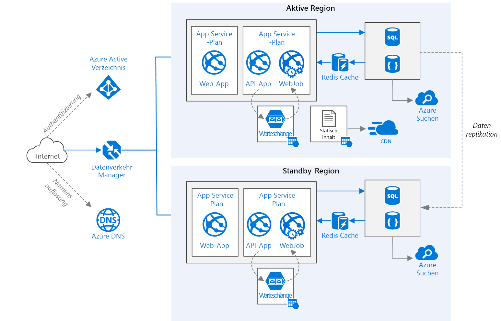

# <a name="run-a-web-application-in-multiple-regions"></a><span data-ttu-id="7eb42-103">Ausführen einer Webanwendung in mehreren Regionen</span><span class="sxs-lookup"><span data-stu-id="7eb42-103">Run a web application in multiple regions</span></span>
[!INCLUDE [header](../../_includes/header.md)]

<span data-ttu-id="7eb42-104">Diese Referenzarchitektur zeigt, wie Sie eine Azure App Service-Anwendung in mehreren Regionen ausführen, um Hochverfügbarkeit zu erzielen.</span><span class="sxs-lookup"><span data-stu-id="7eb42-104">This reference architecture shows how to run an Azure App Service application in multiple regions to achieve high availability.</span></span> 

 

<span data-ttu-id="7eb42-106">*Laden Sie eine [Visio-Datei][visio-download] mit dieser Architektur herunter.*</span><span class="sxs-lookup"><span data-stu-id="7eb42-106">*Download a [Visio file][visio-download] of this architecture.*</span></span>

## <a name="architecture"></a><span data-ttu-id="7eb42-107">Architektur</span><span class="sxs-lookup"><span data-stu-id="7eb42-107">Architecture</span></span> 

<span data-ttu-id="7eb42-108">Diese Architektur basiert auf der in [Verbessern der Skalierbarkeit in einer Webanwendung][guidance-web-apps-scalability] gezeigten.</span><span class="sxs-lookup"><span data-stu-id="7eb42-108">This architecture builds on the one shown in [Improve scalability in a web application][guidance-web-apps-scalability].</span></span> <span data-ttu-id="7eb42-109">Im Folgenden werden die Hauptunterschiede erläutert:</span><span class="sxs-lookup"><span data-stu-id="7eb42-109">The main differences are:</span></span>

* <span data-ttu-id="7eb42-110">**Primäre und sekundäre Regionen**.</span><span class="sxs-lookup"><span data-stu-id="7eb42-110">**Primary and secondary regions**.</span></span> <span data-ttu-id="7eb42-111">Diese Architektur nutzt zwei Regionen, um eine höhere Verfügbarkeit zu erreichen.</span><span class="sxs-lookup"><span data-stu-id="7eb42-111">This architecture uses two regions to achieve higher availability.</span></span> <span data-ttu-id="7eb42-112">Die Anwendung wird in jeder Region bereitgestellt.</span><span class="sxs-lookup"><span data-stu-id="7eb42-112">The application is deployed to each region.</span></span> <span data-ttu-id="7eb42-113">Während des normalen Betriebs wird Netzwerkdatenverkehr an die primäre Region weitergeleitet.</span><span class="sxs-lookup"><span data-stu-id="7eb42-113">During normal operations, network traffic is routed to the primary region.</span></span> <span data-ttu-id="7eb42-114">Wenn die primäre Region nicht verfügbar ist, wird der Datenverkehr an die sekundäre Region umgeleitet.</span><span class="sxs-lookup"><span data-stu-id="7eb42-114">If the primary region becomes unavailable, traffic is routed to the secondary region.</span></span> 
* <span data-ttu-id="7eb42-115">**Azure Traffic Manager**.</span><span class="sxs-lookup"><span data-stu-id="7eb42-115">**Azure Traffic Manager**.</span></span> <span data-ttu-id="7eb42-116">[Traffic Manager][traffic-manager] leitet eingehende Anforderungen an die primäre Region weiter.</span><span class="sxs-lookup"><span data-stu-id="7eb42-116">[Traffic Manager][traffic-manager] routes incoming requests to the primary region.</span></span> <span data-ttu-id="7eb42-117">Wenn die in dieser Region ausgeführte Anwendung nicht verfügbar ist, führt Traffic Manager ein Failover zur sekundären Region aus.</span><span class="sxs-lookup"><span data-stu-id="7eb42-117">If the application running that region becomes unavailable, Traffic Manager fails over to the secondary region.</span></span>
* <span data-ttu-id="7eb42-118">**Georeplikation** von SQL-Datenbank und Cosmos DB.</span><span class="sxs-lookup"><span data-stu-id="7eb42-118">**Geo-replication** of SQL Database and Cosmos DB.</span></span> 

<span data-ttu-id="7eb42-119">Eine Architektur mit mehreren Regionen kann eine höhere Verfügbarkeit als eine Bereitstellung in einer einzelnen Region bieten.</span><span class="sxs-lookup"><span data-stu-id="7eb42-119">A multi-region architecture can provide higher availability than deploying to a single region.</span></span> <span data-ttu-id="7eb42-120">Wenn ein regionaler Ausfall die primäre Region beeinträchtigt, können Sie mit [Traffic Manager][traffic-manager] ein Failover zur sekundären Region ausführen.</span><span class="sxs-lookup"><span data-stu-id="7eb42-120">If a regional outage affects the primary region, you can use [Traffic Manager][traffic-manager] to fail over to the secondary region.</span></span> <span data-ttu-id="7eb42-121">Diese Architektur kann auch hilfreich sein, wenn bei einem einzelnen Subsystem der Anwendung ein Fehler auftritt.</span><span class="sxs-lookup"><span data-stu-id="7eb42-121">This architecture can also help if an individual subsystem of the application fails.</span></span>

<span data-ttu-id="7eb42-122">Es gibt mehrere allgemeine Vorgehensweisen für das Erreichen von Hochverfügbarkeit mit mehreren Regionen:</span><span class="sxs-lookup"><span data-stu-id="7eb42-122">There are several general approaches to achieving high availability across regions:</span></span> 

* <span data-ttu-id="7eb42-123">Aktiv/passiv mit Hot Standby.</span><span class="sxs-lookup"><span data-stu-id="7eb42-123">Active/passive with hot standby.</span></span> <span data-ttu-id="7eb42-124">Der Datenverkehr wird an eine Region weitergeleitet, während die andere im Hot Standby wartet.</span><span class="sxs-lookup"><span data-stu-id="7eb42-124">Traffic goes to one region, while the other waits on hot standby.</span></span> <span data-ttu-id="7eb42-125">Hot Standby (unmittelbar betriebsbereit) bedeutet, dass die virtuellen Computer in der sekundären Region jederzeit zugeordnet sind und ausgeführt werden.</span><span class="sxs-lookup"><span data-stu-id="7eb42-125">Hot standby means the VMs in the secondary region are allocated and running at all times.</span></span>
* <span data-ttu-id="7eb42-126">Aktiv/passiv mit Cold Standby.</span><span class="sxs-lookup"><span data-stu-id="7eb42-126">Active/passive with cold standby.</span></span> <span data-ttu-id="7eb42-127">Der Datenverkehr wird an eine Region weitergeleitet, während die andere im Cold Standby wartet.</span><span class="sxs-lookup"><span data-stu-id="7eb42-127">Traffic goes to one region, while the other waits on cold standby.</span></span> <span data-ttu-id="7eb42-128">Cold Standby (verzögert betriebsbereit) bedeutet, dass die virtuellen Computer in der sekundären Region erst zugewiesen werden, wenn sie für das Failover benötigt werden.</span><span class="sxs-lookup"><span data-stu-id="7eb42-128">Cold standby means the VMs in the secondary region are not allocated until needed for failover.</span></span> <span data-ttu-id="7eb42-129">Dieser Ansatz erfordert weniger Ausführungszeit, es dauert aber im Allgemeinen länger, bis bei einem Ausfall alle Komponenten online geschaltet sind.</span><span class="sxs-lookup"><span data-stu-id="7eb42-129">This approach costs less to run, but will generally take longer to come online during a failure.</span></span>
* <span data-ttu-id="7eb42-130">Aktiv/aktiv.</span><span class="sxs-lookup"><span data-stu-id="7eb42-130">Active/active.</span></span> <span data-ttu-id="7eb42-131">Beide Regionen sind aktiv, und Anforderungen werden per Lastenausgleich zwischen ihnen verteilt.</span><span class="sxs-lookup"><span data-stu-id="7eb42-131">Both regions are active, and requests are load balanced between them.</span></span> <span data-ttu-id="7eb42-132">Wenn eine Region nicht verfügbar ist, wird sie aus der Rotation entfernt.</span><span class="sxs-lookup"><span data-stu-id="7eb42-132">If one region becomes unavailable, it is taken out of rotation.</span></span> 

<span data-ttu-id="7eb42-133">In dieser Referenzarchitektur liegt der Fokus auf aktiv/passiv mit Hot Standby, wobei Traffic Manager für das Failover verwendet wird.</span><span class="sxs-lookup"><span data-stu-id="7eb42-133">This reference architecture focuses on active/passive with hot standby, using Traffic Manager for failover.</span></span> 


## <a name="recommendations"></a><span data-ttu-id="7eb42-134">Recommendations</span><span class="sxs-lookup"><span data-stu-id="7eb42-134">Recommendations</span></span>

<span data-ttu-id="7eb42-135">Ihre Anforderungen können von der hier beschriebenen Architektur abweichen.</span><span class="sxs-lookup"><span data-stu-id="7eb42-135">Your requirements might differ from the architecture described here.</span></span> <span data-ttu-id="7eb42-136">Verwenden Sie die Empfehlungen in diesem Abschnitt als Ausgangspunkt.</span><span class="sxs-lookup"><span data-stu-id="7eb42-136">Use the recommendations in this section as a starting point.</span></span>

### <a name="regional-pairing"></a><span data-ttu-id="7eb42-137">Regionspaare</span><span class="sxs-lookup"><span data-stu-id="7eb42-137">Regional pairing</span></span>
<span data-ttu-id="7eb42-138">Jede Azure-Region ist mit einer anderen Region innerhalb desselben Gebiets gepaart.</span><span class="sxs-lookup"><span data-stu-id="7eb42-138">Each Azure region is paired with another region within the same geography.</span></span> <span data-ttu-id="7eb42-139">Sie wählen im Allgemeinen Regionen aus dem gleichen Regionspaar aus (z.B. „USA, Osten 2“ und „USA, Mitte“).</span><span class="sxs-lookup"><span data-stu-id="7eb42-139">In general, choose regions from the same regional pair (for example, East US 2 and Central US).</span></span> <span data-ttu-id="7eb42-140">Das bietet die folgenden Vorteile:</span><span class="sxs-lookup"><span data-stu-id="7eb42-140">Benefits of doing so include:</span></span>

* <span data-ttu-id="7eb42-141">Bei einem umfassenden Ausfall wird die Wiederherstellung mindestens einer Region aus jedem Paar priorisiert.</span><span class="sxs-lookup"><span data-stu-id="7eb42-141">If there is a broad outage, recovery of at least one region out of every pair is prioritized.</span></span>
* <span data-ttu-id="7eb42-142">Geplante Azure-Systemupdates werden in Regionspaaren nacheinander ausgeführt, um mögliche Ausfallzeiten zu minimieren.</span><span class="sxs-lookup"><span data-stu-id="7eb42-142">Planned Azure system updates are rolled out to paired regions sequentially to minimize possible downtime.</span></span>
* <span data-ttu-id="7eb42-143">In den meisten Fällen befinden sich Regionspaare innerhalb desselben geografischen Gebiets, um spezifische regionale Anforderungen zu erfüllen.</span><span class="sxs-lookup"><span data-stu-id="7eb42-143">In most cases, regional pairs reside within the same geography to meet data residency requirements.</span></span>

<span data-ttu-id="7eb42-144">Sie sollten allerdings sicherstellen, dass beide Regionen alle Azure-Dienste, die für Ihre Anwendung erforderlich sind, unterstützen.</span><span class="sxs-lookup"><span data-stu-id="7eb42-144">However, make sure that both regions support all of the Azure services needed for your application.</span></span> <span data-ttu-id="7eb42-145">Weitere Informationen finden Sie unter [Dienste nach Region][services-by-region].</span><span class="sxs-lookup"><span data-stu-id="7eb42-145">See [Services by region][services-by-region].</span></span> <span data-ttu-id="7eb42-146">Weitere Informationen zu Regionspaaren finden Sie unter [Geschäftskontinuität und Notfallwiederherstellung: Azure-Regionspaare][regional-pairs].</span><span class="sxs-lookup"><span data-stu-id="7eb42-146">For more information about regional pairs, see [Business continuity and disaster recovery (BCDR): Azure Paired Regions][regional-pairs].</span></span>

### <a name="resource-groups"></a><span data-ttu-id="7eb42-147">Ressourcengruppen</span><span class="sxs-lookup"><span data-stu-id="7eb42-147">Resource groups</span></span>
<span data-ttu-id="7eb42-148">Sie sollten die primäre Region, die sekundäre Region und Traffic Manager unterschiedlichen [Ressourcengruppen][resource groups] zuordnen.</span><span class="sxs-lookup"><span data-stu-id="7eb42-148">Consider placing the primary region, secondary region, and Traffic Manager into separate [resource groups][resource groups].</span></span> <span data-ttu-id="7eb42-149">So können Sie die in jeder Region bereitgestellten Ressourcen als Einzelsammlungen verwalten.</span><span class="sxs-lookup"><span data-stu-id="7eb42-149">This lets you manage the resources deployed to each region as a single collection.</span></span>

### <a name="traffic-manager-configuration"></a><span data-ttu-id="7eb42-150">Traffic Manager-Konfiguration</span><span class="sxs-lookup"><span data-stu-id="7eb42-150">Traffic Manager configuration</span></span> 

<span data-ttu-id="7eb42-151">**Routing:**</span><span class="sxs-lookup"><span data-stu-id="7eb42-151">**Routing**.</span></span> <span data-ttu-id="7eb42-152">Traffic Manager unterstützt mehrere [Routingalgorithmen][tm-routing].</span><span class="sxs-lookup"><span data-stu-id="7eb42-152">Traffic Manager supports several [routing algorithms][tm-routing].</span></span> <span data-ttu-id="7eb42-153">Verwenden Sie für das in diesem Artikel beschriebenen Szenario Routing nach *Priorität* (ehemals Routingmethode *Failover*).</span><span class="sxs-lookup"><span data-stu-id="7eb42-153">For the scenario described in this article, use *priority* routing (formerly called *failover* routing).</span></span> <span data-ttu-id="7eb42-154">Bei dieser Einstellung sendet Traffic Manager alle Anforderungen an die primäre Region, bis der Endpunkt für diese Region nicht mehr erreichbar ist.</span><span class="sxs-lookup"><span data-stu-id="7eb42-154">With this setting, Traffic Manager sends all requests to the primary region unless the endpoint for that region becomes unreachable.</span></span> <span data-ttu-id="7eb42-155">Zu diesem Zeitpunkt wird automatisch ein Failover zur sekundären Region ausgeführt.</span><span class="sxs-lookup"><span data-stu-id="7eb42-155">At that point, it automatically fails over to the secondary region.</span></span> <span data-ttu-id="7eb42-156">Weitere Informationen finden Sie unter [Konfigurieren der Routingmethode „Failover“][tm-configure-failover].</span><span class="sxs-lookup"><span data-stu-id="7eb42-156">See [Configure Failover routing method][tm-configure-failover].</span></span>

<span data-ttu-id="7eb42-157">**Integritätstest:**</span><span class="sxs-lookup"><span data-stu-id="7eb42-157">**Health probe**.</span></span> <span data-ttu-id="7eb42-158">Traffic Manager verwendet einen HTTP-Test (oder HTTPS), um die Verfügbarkeit aller Endpunkte zu überwachen.</span><span class="sxs-lookup"><span data-stu-id="7eb42-158">Traffic Manager uses an HTTP (or HTTPS) probe to monitor the availability of each endpoint.</span></span> <span data-ttu-id="7eb42-159">Der Test meldet Traffic Manager seinen erfolgreichen oder fehlerhaften Abschluss, damit ggf. ein Failover zur sekundären Region ausgeführt werden kann.</span><span class="sxs-lookup"><span data-stu-id="7eb42-159">The probe gives Traffic Manager a pass/fail test for failing over to the secondary region.</span></span> <span data-ttu-id="7eb42-160">Dies erfolgt durch das Senden einer Anforderung an einen angegebenen URL-Pfad.</span><span class="sxs-lookup"><span data-stu-id="7eb42-160">It works by sending a request to a specified URL path.</span></span> <span data-ttu-id="7eb42-161">Wenn der Test innerhalb des Zeitlimits eine andere Antwort als „200“ erhält, löst er einen Fehler aus.</span><span class="sxs-lookup"><span data-stu-id="7eb42-161">If it gets a non-200 response within a timeout period, the probe fails.</span></span> <span data-ttu-id="7eb42-162">Nach vier fehlerhaften Anforderungen kennzeichnet Traffic Manager den Endpunkt als heruntergestuft und führt ein Failover zum anderen Endpunkt aus.</span><span class="sxs-lookup"><span data-stu-id="7eb42-162">After four failed requests, Traffic Manager marks the endpoint as degraded and fails over to the other endpoint.</span></span> <span data-ttu-id="7eb42-163">Weitere Informationen finden Sie unter [Traffic Manager-Endpunktüberwachung und -Failover][tm-monitoring].</span><span class="sxs-lookup"><span data-stu-id="7eb42-163">For details, see [Traffic Manager endpoint monitoring and failover][tm-monitoring].</span></span>

<span data-ttu-id="7eb42-164">Es hat sich bewährt, einen fehlerfreien Testendpunkt zu erstellen, der die Gesamtintegrität der Anwendung meldet, und diesen Endpunkt für den Integritätstest zu verwenden.</span><span class="sxs-lookup"><span data-stu-id="7eb42-164">As a best practice, create a health probe endpoint that reports the overall health of the application and use this endpoint for the health probe.</span></span> <span data-ttu-id="7eb42-165">Der Endpunkt sollte alle wichtigen Abhängigkeiten überprüfen, dazu gehören z.B. App Service-Apps, die Speicherwarteschlange und SQL-Datenbank.</span><span class="sxs-lookup"><span data-stu-id="7eb42-165">The endpoint should check critical dependencies such as the App Service apps, storage queue, and SQL Database.</span></span> <span data-ttu-id="7eb42-166">Andernfalls meldet der Test eventuell einen fehlerfreien Endpunkt, obwohl wichtige Teile der Anwendung fehlerhaft sind.</span><span class="sxs-lookup"><span data-stu-id="7eb42-166">Otherwise, the probe might report a healthy endpoint when critical parts of the application are actually failing.</span></span>

<span data-ttu-id="7eb42-167">Andererseits sollten Sie den Integritätstest nicht zum Überprüfen von Diensten mit einer niedrigeren Priorität verwenden.</span><span class="sxs-lookup"><span data-stu-id="7eb42-167">On the other hand, don't use the health probe to check lower priority services.</span></span> <span data-ttu-id="7eb42-168">Wenn beispielsweise ein E-Mail-Dienst ausfällt, kann die Anwendung zu einem zweiten Anbieter wechseln oder die E-Mails einfach später senden.</span><span class="sxs-lookup"><span data-stu-id="7eb42-168">For example, if an email service goes down the application can switch to a second provider or just send emails later.</span></span> <span data-ttu-id="7eb42-169">Dies ist keine ausreichend hohe Priorität, die zu einem Failover der Anwendung führen sollte.</span><span class="sxs-lookup"><span data-stu-id="7eb42-169">This is not a high enough priority to cause the application to fail over.</span></span> <span data-ttu-id="7eb42-170">Weitere Informationen finden Sie unter [Überwachungsmuster für den Integritätsendpunkt][health-endpoint-monitoring-pattern].</span><span class="sxs-lookup"><span data-stu-id="7eb42-170">For more information, see [Health Endpoint Monitoring Pattern][health-endpoint-monitoring-pattern].</span></span>
 
### <a name="sql-database"></a><span data-ttu-id="7eb42-171">SQL-Datenbank</span><span class="sxs-lookup"><span data-stu-id="7eb42-171">SQL Database</span></span>
<span data-ttu-id="7eb42-172">Verwenden Sie die [aktive Georeplikation][sql-replication], um ein lesbares sekundäres Replikat in einer anderen Region zu erstellen.</span><span class="sxs-lookup"><span data-stu-id="7eb42-172">Use [Active Geo-Replication][sql-replication] to create a readable secondary replica in a different region.</span></span> <span data-ttu-id="7eb42-173">Sie können bis zu vier lesbare sekundäre Replikate nutzen.</span><span class="sxs-lookup"><span data-stu-id="7eb42-173">You can have up to four readable secondary replicas.</span></span> <span data-ttu-id="7eb42-174">Führen Sie ein Failover zu einer sekundären Datenbank aus, wenn die primäre Datenbank ausfällt oder offline geschaltet werden muss.</span><span class="sxs-lookup"><span data-stu-id="7eb42-174">Fail over to a secondary database if your primary database fails or needs to be taken offline.</span></span> <span data-ttu-id="7eb42-175">Die aktive Georeplikation kann für jede Datenbank in einem beliebigen Pool für elastische Datenbanken konfiguriert werden.</span><span class="sxs-lookup"><span data-stu-id="7eb42-175">Active Geo-Replication can be configured for any database in any elastic database pool.</span></span>

### <a name="cosmos-db"></a><span data-ttu-id="7eb42-176">Cosmos DB</span><span class="sxs-lookup"><span data-stu-id="7eb42-176">Cosmos DB</span></span>
<span data-ttu-id="7eb42-177">Cosmos DB unterstützt die Georeplikation zwischen Regionen.</span><span class="sxs-lookup"><span data-stu-id="7eb42-177">Cosmos DB supports geo-replication across regions.</span></span> <span data-ttu-id="7eb42-178">Eine Region wird als schreibbar festgelegt, während die anderen lediglich lesbare Replikate sind.</span><span class="sxs-lookup"><span data-stu-id="7eb42-178">One region is designated as writable and the others are read-only replicas.</span></span>

<span data-ttu-id="7eb42-179">Fällt eine Region aus, können Sie ein Failover ausführen, indem Sie eine andere Region als schreibbare Region festlegen.</span><span class="sxs-lookup"><span data-stu-id="7eb42-179">If there is a regional outage, you can fail over by selecting another region to be the write region.</span></span> <span data-ttu-id="7eb42-180">Das Client-SDK sendet Schreibanforderungen automatisch an die aktuell schreibbare Region, daher müssen Sie die Clientkonfiguration nach einem Failover nicht aktualisieren.</span><span class="sxs-lookup"><span data-stu-id="7eb42-180">The client SDK automatically sends write requests to the current write region, so you don't need to update the client configuration after a failover.</span></span> <span data-ttu-id="7eb42-181">Weitere Informationen finden Sie unter [Wie werden Daten mit Azure Cosmos DB global verteilt?][docdb-geo].</span><span class="sxs-lookup"><span data-stu-id="7eb42-181">For more information, see [How to distribute data globally with Azure Cosmos DB?][docdb-geo]</span></span>

> [!NOTE]
> <span data-ttu-id="7eb42-182">Alle Replikate gehören derselben Ressourcengruppe an.</span><span class="sxs-lookup"><span data-stu-id="7eb42-182">All of the replicas belong to the same resource group.</span></span>
>
>

### <a name="storage"></a><span data-ttu-id="7eb42-183">Speicher</span><span class="sxs-lookup"><span data-stu-id="7eb42-183">Storage</span></span>
<span data-ttu-id="7eb42-184">Bei Azure Storage verwenden Sie [RA-GRS][ra-grs] (Read-Access Geo-Redundant Storage, georedundanter Speicher mit Lesezugriff).</span><span class="sxs-lookup"><span data-stu-id="7eb42-184">For Azure Storage, use [read-access geo-redundant storage][ra-grs] (RA-GRS).</span></span> <span data-ttu-id="7eb42-185">Mit RA-GRS werden die Daten in eine sekundäre Region repliziert.</span><span class="sxs-lookup"><span data-stu-id="7eb42-185">With RA-GRS storage, the data is replicated to a secondary region.</span></span> <span data-ttu-id="7eb42-186">Sie haben über einen eigenen Endpunkt lediglich schreibgeschützten Zugriff auf die Daten in der sekundären Region.</span><span class="sxs-lookup"><span data-stu-id="7eb42-186">You have read-only access to the data in the secondary region through a separate endpoint.</span></span> <span data-ttu-id="7eb42-187">Tritt in einer Region ein Ausfall oder ein anderer Notfall ein, kann das Azure Storage-Team ein geografisches Failover zur sekundären Region ausführen.</span><span class="sxs-lookup"><span data-stu-id="7eb42-187">If there is a regional outage or disaster, the Azure Storage team might decide to perform a geo-failover to the secondary region.</span></span> <span data-ttu-id="7eb42-188">Für dieses Failover ist keine Kundenaktion erforderlich.</span><span class="sxs-lookup"><span data-stu-id="7eb42-188">There is no customer action required for this failover.</span></span>

<span data-ttu-id="7eb42-189">Erstellen Sie für Queue Storage eine Sicherungswarteschlange in der sekundären Region.</span><span class="sxs-lookup"><span data-stu-id="7eb42-189">For Queue storage, create a backup queue in the secondary region.</span></span> <span data-ttu-id="7eb42-190">Während des Failovers kann die App die Sicherungswarteschlange verwenden, bis die primäre Region wieder verfügbar ist.</span><span class="sxs-lookup"><span data-stu-id="7eb42-190">During failover, the app can use the backup queue until the primary region becomes available again.</span></span> <span data-ttu-id="7eb42-191">Auf diese Weise kann die Anwendung weiterhin neue Anforderungen verarbeiten.</span><span class="sxs-lookup"><span data-stu-id="7eb42-191">That way, the application can still process new requests.</span></span>

## <a name="availability-considerations"></a><span data-ttu-id="7eb42-192">Überlegungen zur Verfügbarkeit</span><span class="sxs-lookup"><span data-stu-id="7eb42-192">Availability considerations</span></span>


### <a name="traffic-manager"></a><span data-ttu-id="7eb42-193">Traffic Manager</span><span class="sxs-lookup"><span data-stu-id="7eb42-193">Traffic Manager</span></span>

<span data-ttu-id="7eb42-194">Traffic Manager führt automatisch ein Failover aus, wenn die primäre Region nicht verfügbar ist.</span><span class="sxs-lookup"><span data-stu-id="7eb42-194">Traffic Manager automatically fails over if the primary region becomes unavailable.</span></span> <span data-ttu-id="7eb42-195">Wenn Traffic Manager ein Failover ausführt, können die Clients die Anwendung für eine bestimmte Zeit nicht erreichen.</span><span class="sxs-lookup"><span data-stu-id="7eb42-195">When Traffic Manager fails over, there is a period of time when clients cannot reach the application.</span></span> <span data-ttu-id="7eb42-196">Die Dauer wird durch folgende Faktoren beeinflusst:</span><span class="sxs-lookup"><span data-stu-id="7eb42-196">The duration is affected by the following factors:</span></span>

* <span data-ttu-id="7eb42-197">Der Integritätstest muss erkennen, dass das primäre Rechenzentrum nicht erreichbar ist.</span><span class="sxs-lookup"><span data-stu-id="7eb42-197">The health probe must detect that the primary data center has become unreachable.</span></span>
* <span data-ttu-id="7eb42-198">Die DNS-Server (Domain Name Service) müssen die zwischengespeicherten DNS-Einträge für die IP-Adresse aktualisieren, die von der DNS-Gültigkeitsdauer (TTL) abhängig ist.</span><span class="sxs-lookup"><span data-stu-id="7eb42-198">Domain name service (DNS) servers must update the cached DNS records for the IP address, which depends on the DNS time-to-live (TTL).</span></span> <span data-ttu-id="7eb42-199">Die Standardgültigkeitsdauer beträgt 300 Sekunden (5 Minuten), Sie können diesen Wert aber bei der Erstellung des Traffic Manager-Profils anpassen.</span><span class="sxs-lookup"><span data-stu-id="7eb42-199">The default TTL is 300 seconds (5 minutes), but you can configure this value when you create the Traffic Manager profile.</span></span>

<span data-ttu-id="7eb42-200">Weitere Informationen finden Sie unter [Traffic Manager-Überwachung][tm-monitoring].</span><span class="sxs-lookup"><span data-stu-id="7eb42-200">For details, see [About Traffic Manager Monitoring][tm-monitoring].</span></span>

<span data-ttu-id="7eb42-201">Traffic Manager ist eine mögliche Schwachstelle im System.</span><span class="sxs-lookup"><span data-stu-id="7eb42-201">Traffic Manager is a possible failure point in the system.</span></span> <span data-ttu-id="7eb42-202">Wenn beim Dienst ein Fehler auftritt, können Clients während der Ausfallzeit nicht auf Ihre Anwendung zugreifen.</span><span class="sxs-lookup"><span data-stu-id="7eb42-202">If the service fails, clients cannot access your application during the downtime.</span></span> <span data-ttu-id="7eb42-203">In der [Vereinbarung zum Servicelevel (SLA) für Traffic Manager][tm-sla] erfahren Sie, ob Ihre geschäftlichen Anforderungen für Hochverfügbarkeit mit Traffic Manager allein erfüllt werden.</span><span class="sxs-lookup"><span data-stu-id="7eb42-203">Review the [Traffic Manager service level agreement (SLA)][tm-sla] and determine whether using Traffic Manager alone meets your business requirements for high availability.</span></span> <span data-ttu-id="7eb42-204">Wenn dies nicht der Fall ist, erwägen Sie als Failback eine andere Verwaltungslösung für den Datenverkehr.</span><span class="sxs-lookup"><span data-stu-id="7eb42-204">If not, consider adding another traffic management solution as a failback.</span></span> <span data-ttu-id="7eb42-205">Wenn der Azure Traffic Manager-Dienst fehlerhaft ist, ändern Sie die kanonischen Namensdatensätze (CNAME) im DNS, sodass sie auf die andere Verwaltungslösung für den Datenverkehr verweisen.</span><span class="sxs-lookup"><span data-stu-id="7eb42-205">If the Azure Traffic Manager service fails, change your canonical name (CNAME) records in DNS to point to the other traffic management service.</span></span> <span data-ttu-id="7eb42-206">Dieser Schritt muss manuell durchgeführt werden. Bis die DNS-Änderungen weitergegeben wurden, ist die Anwendung nicht verfügbar.</span><span class="sxs-lookup"><span data-stu-id="7eb42-206">This step must be performed manually, and your application will be unavailable until the DNS changes are propagated.</span></span>

### <a name="sql-database"></a><span data-ttu-id="7eb42-207">SQL-Datenbank</span><span class="sxs-lookup"><span data-stu-id="7eb42-207">SQL Database</span></span>
<span data-ttu-id="7eb42-208">Die Recovery Point Objective (RPO) und die geschätzte Wiederherstellungszeit (ERT) für SQL-Datenbank sind in [Übersicht über die Geschäftskontinuität mit Azure SQL-Datenbank][sql-rpo] dokumentiert.</span><span class="sxs-lookup"><span data-stu-id="7eb42-208">The recovery point objective (RPO) and estimated recovery time (ERT) for SQL Database are documented in [Overview of business continuity with Azure SQL Database][sql-rpo].</span></span> 

### <a name="storage"></a><span data-ttu-id="7eb42-209">Speicher</span><span class="sxs-lookup"><span data-stu-id="7eb42-209">Storage</span></span>
<span data-ttu-id="7eb42-210">RA-GRS stellt permanenten Speicher bereit. Trotzdem sollten Sie verstehen, was bei einem Ausfall passieren kann:</span><span class="sxs-lookup"><span data-stu-id="7eb42-210">RA-GRS storage provides durable storage, but it's important to understand what can happen during an outage:</span></span>

* <span data-ttu-id="7eb42-211">Tritt ein Speicherausfall auf, haben Sie für eine gewisse Zeit keinen Schreibzugriff auf die Daten.</span><span class="sxs-lookup"><span data-stu-id="7eb42-211">If a storage outage occurs, there will be a period of time when you don't have write-access to the data.</span></span> <span data-ttu-id="7eb42-212">Sie können während des Ausfalls weiterhin vom sekundären Endpunkt lesen.</span><span class="sxs-lookup"><span data-stu-id="7eb42-212">You can still read from the secondary endpoint during the outage.</span></span>
* <span data-ttu-id="7eb42-213">Wenn sich ein regionaler Ausfall oder Notfall auf den primären Standort auswirkt und die Daten nicht wiederhergestellt werden können, kann das Azure Storage-Team ein geografisches Failover zur sekundären Region ausführen.</span><span class="sxs-lookup"><span data-stu-id="7eb42-213">If a regional outage or disaster affects the primary location and the data there cannot be recovered, the Azure Storage team may decide to perform a geo-failover to the secondary region.</span></span>
* <span data-ttu-id="7eb42-214">Die Datenreplikation zur sekundären Region wird asynchron ausgeführt.</span><span class="sxs-lookup"><span data-stu-id="7eb42-214">Data replication to the secondary region is performed asynchronously.</span></span> <span data-ttu-id="7eb42-215">Wenn ein geografisches Failover durchgeführt wird, ist daher ein Datenverlust möglich, wenn die Daten nicht aus der primären Region wiederhergestellt werden können.</span><span class="sxs-lookup"><span data-stu-id="7eb42-215">Therefore, if a geo-failover is performed, some data loss is possible if the data can't be recovered from the primary region.</span></span>
* <span data-ttu-id="7eb42-216">Vorübergehende Fehler, etwa Netzwerkausfälle, lösen kein Speicherfailover aus.</span><span class="sxs-lookup"><span data-stu-id="7eb42-216">Transient failures, such as a network outage, will not trigger a storage failover.</span></span> <span data-ttu-id="7eb42-217">Entwerfen Sie Ihre Anwendung flexibel gegenüber vorübergehenden Fehlern.</span><span class="sxs-lookup"><span data-stu-id="7eb42-217">Design your application to be resilient to transient failures.</span></span> <span data-ttu-id="7eb42-218">Mögliche Gegenmaßnahmen:</span><span class="sxs-lookup"><span data-stu-id="7eb42-218">Possible mitigations:</span></span>
  
  * <span data-ttu-id="7eb42-219">Lesen aus der sekundären Region.</span><span class="sxs-lookup"><span data-stu-id="7eb42-219">Read from the secondary region.</span></span>
  * <span data-ttu-id="7eb42-220">Wechseln Sie vorübergehend für neue Schreibvorgänge (z.B. in Warteschlangennachrichten) zu einem anderen Speicherkonto.</span><span class="sxs-lookup"><span data-stu-id="7eb42-220">Temporarily switch to another storage account for new write operations (for example, to queue messages).</span></span>
  * <span data-ttu-id="7eb42-221">Kopieren Sie Daten aus der sekundären Region in ein anderes Speicherkonto.</span><span class="sxs-lookup"><span data-stu-id="7eb42-221">Copy data from the secondary region to another storage account.</span></span>
  * <span data-ttu-id="7eb42-222">Stellen Sie eine eingeschränkte Funktionalität bereit, bis das Failback für das System ausgeführt wurde.</span><span class="sxs-lookup"><span data-stu-id="7eb42-222">Provide reduced functionality until the system fails back.</span></span>

<span data-ttu-id="7eb42-223">Weitere Informationen finden Sie unter [Vorgehensweise beim Ausfall von Azure Storage][storage-outage].</span><span class="sxs-lookup"><span data-stu-id="7eb42-223">For more information, see [What to do if an Azure Storage outage occurs][storage-outage].</span></span>

## <a name="manageability-considerations"></a><span data-ttu-id="7eb42-224">Überlegungen zur Verwaltbarkeit</span><span class="sxs-lookup"><span data-stu-id="7eb42-224">Manageability Considerations</span></span>

### <a name="traffic-manager"></a><span data-ttu-id="7eb42-225">Traffic Manager</span><span class="sxs-lookup"><span data-stu-id="7eb42-225">Traffic Manager</span></span>

<span data-ttu-id="7eb42-226">Bei Failovern durch Traffic Manager sollten Sie ein manuelles Failback ausführen, anstatt ein automatisches Failback zu implementieren.</span><span class="sxs-lookup"><span data-stu-id="7eb42-226">If Traffic Manager fails over, we recommend performing a manual failback rather than implementing an automatic failback.</span></span> <span data-ttu-id="7eb42-227">Andernfalls könnte eine Situation eintreten, bei der die Anwendung zwischen den Regionen hin und her wechselt.</span><span class="sxs-lookup"><span data-stu-id="7eb42-227">Otherwise, you can create a situation where the application flips back and forth between regions.</span></span> <span data-ttu-id="7eb42-228">Überprüfen Sie vor einem Failback, ob alle Subsysteme der Anwendung fehlerfrei sind.</span><span class="sxs-lookup"><span data-stu-id="7eb42-228">Verify that all application subsystems are healthy before failing back.</span></span>

<span data-ttu-id="7eb42-229">Beachten Sie, dass Traffic Manager in der Standardeinstellung automatisch Failbacks ausführt.</span><span class="sxs-lookup"><span data-stu-id="7eb42-229">Note that Traffic Manager automatically fails back by default.</span></span> <span data-ttu-id="7eb42-230">Um dies zu verhindern, verringern Sie die Priorität der primären Region nach einem Failover manuell.</span><span class="sxs-lookup"><span data-stu-id="7eb42-230">To prevent this, manually lower the priority of the primary region after a failover event.</span></span> <span data-ttu-id="7eb42-231">Angenommen, die primäre Region hat die Priorität 1 und die sekundäre Datenbank die Priorität 2.</span><span class="sxs-lookup"><span data-stu-id="7eb42-231">For example, suppose the primary region is priority 1 and the secondary is priority 2.</span></span> <span data-ttu-id="7eb42-232">Nach einem Failover legen Sie dann die Priorität der primären Region auf 3 fest, um ein automatisches Failback zu verhindern.</span><span class="sxs-lookup"><span data-stu-id="7eb42-232">After a failover, set the primary region to priority 3, to prevent automatic failback.</span></span> <span data-ttu-id="7eb42-233">Wenn Sie wieder zurück wechseln möchten, ändern Sie die Priorität wieder in 1.</span><span class="sxs-lookup"><span data-stu-id="7eb42-233">When you are ready to switch back, update the priority to 1.</span></span>

<span data-ttu-id="7eb42-234">Mit den folgenden Befehlen ändern Sie die Priorität.</span><span class="sxs-lookup"><span data-stu-id="7eb42-234">The following commands update the priority.</span></span>

<span data-ttu-id="7eb42-235">**PowerShell**</span><span class="sxs-lookup"><span data-stu-id="7eb42-235">**PowerShell**</span></span>

```bat
$endpoint = Get-AzureRmTrafficManagerEndpoint -Name <endpoint> -ProfileName <profile> -ResourceGroupName <resource-group> -Type AzureEndpoints
$endpoint.Priority = 3
Set-AzureRmTrafficManagerEndpoint -TrafficManagerEndpoint $endpoint
```

<span data-ttu-id="7eb42-236">Weitere Informationen finden Sie unter [Azure Traffic Manager-Cmdlets][tm-ps].</span><span class="sxs-lookup"><span data-stu-id="7eb42-236">For more information, see [Azure Traffic Manager Cmdlets][tm-ps].</span></span>

<span data-ttu-id="7eb42-237">**Azure-Befehlszeilenschnittstelle (CLI)**</span><span class="sxs-lookup"><span data-stu-id="7eb42-237">**Azure command line interface (CLI)**</span></span>

```bat
azure network traffic-manager endpoint set --name <endpoint> --profile-name <profile> --resource-group <resource-group> --type AzureEndpoints --priority 3
```    

### <a name="sql-database"></a><span data-ttu-id="7eb42-238">SQL-Datenbank</span><span class="sxs-lookup"><span data-stu-id="7eb42-238">SQL Database</span></span>
<span data-ttu-id="7eb42-239">Wenn die primäre Datenbank fehlerhaft ist, führen Sie ein manuelles Failover zur sekundären Datenbank aus.</span><span class="sxs-lookup"><span data-stu-id="7eb42-239">If the primary database fails, perform a manual failover to the secondary database.</span></span> <span data-ttu-id="7eb42-240">Weitere Informationen finden Sie unter [Wiederherstellen einer Azure SQL-Datenbank oder Failover auf eine sekundäre Datenbank][sql-failover].</span><span class="sxs-lookup"><span data-stu-id="7eb42-240">See [Restore an Azure SQL Database or failover to a secondary][sql-failover].</span></span> <span data-ttu-id="7eb42-241">Die sekundäre Datenbank bleibt schreibgeschützt, bis Sie ein Failover ausführen.</span><span class="sxs-lookup"><span data-stu-id="7eb42-241">The secondary database remains read-only until you fail over.</span></span>


<!-- links -->

[azure-sql-db]: https://azure.microsoft.com/documentation/services/sql-database/
[docdb-geo]: /azure/documentdb/documentdb-distribute-data-globally
[guidance-web-apps-scalability]: ./scalable-web-app.md
[health-endpoint-monitoring-pattern]: https://msdn.microsoft.com/library/dn589789.aspx
[ra-grs]: /azure/storage/storage-redundancy#read-access-geo-redundant-storage
[regional-pairs]: /azure/best-practices-availability-paired-regions
[resource groups]: /azure/azure-resource-manager/resource-group-overview#resource-groups
[services-by-region]: https://azure.microsoft.com/regions/#services
[sql-failover]: /azure/sql-database/sql-database-disaster-recovery
[sql-replication]: /azure/sql-database/sql-database-geo-replication-overview
[sql-rpo]: /azure/sql-database/sql-database-business-continuity#sql-database-features-that-you-can-use-to-provide-business-continuity
[storage-outage]: /azure/storage/storage-disaster-recovery-guidance
[tm-configure-failover]: /azure/traffic-manager/traffic-manager-configure-failover-routing-method
[tm-monitoring]: /azure/traffic-manager/traffic-manager-monitoring
[tm-ps]: https://msdn.microsoft.com/library/mt125941.aspx
[tm-routing]: /azure/traffic-manager/traffic-manager-routing-methods
[tm-sla]: https://azure.microsoft.com/support/legal/sla/traffic-manager/v1_0/
[traffic-manager]: https://azure.microsoft.com/services/traffic-manager/
[visio-download]: https://archcenter.azureedge.net/cdn/app-service-reference-architectures.vsdx
