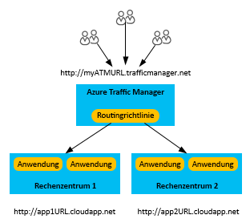
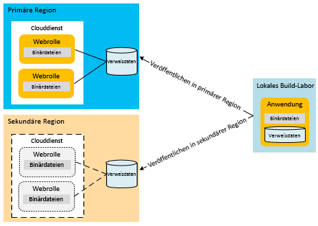
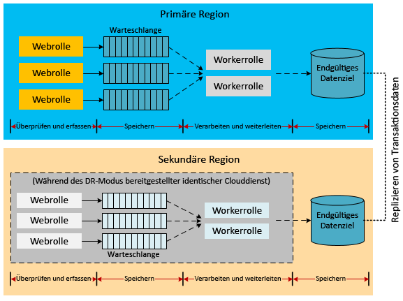
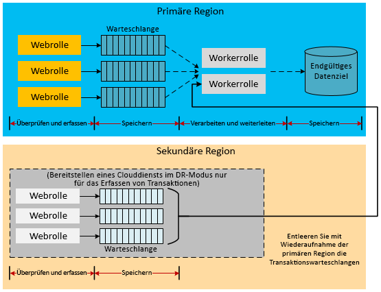
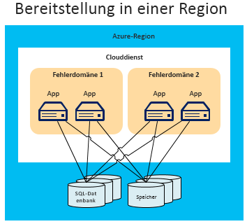
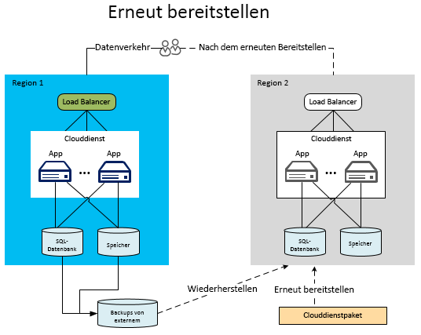
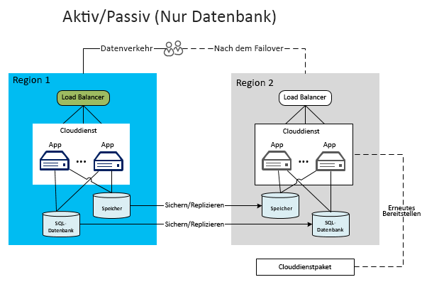
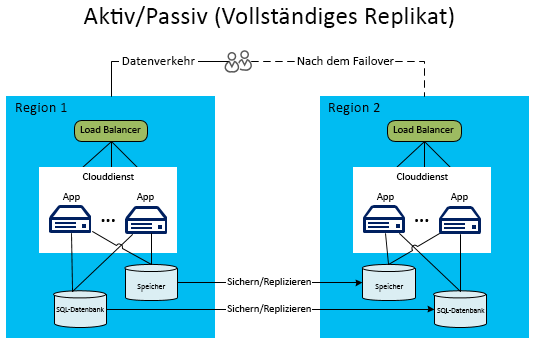
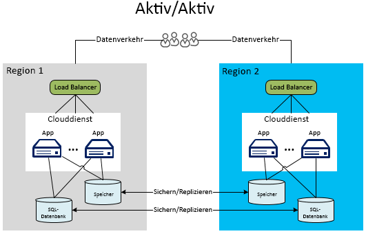

# Notfallwiederherstellung für Azure-Anwendungen

Die Notfallwiederherstellung konzentriert sich auf die Wiederherstellung nach einem katastrophalen Ausfall der Anwendungsfunktionalität. Wenn beispielsweise eine Azure-Region, in der Ihre Anwendung gehostet wird, nicht mehr verfügbar ist, benötigen Sie einen Plan für die Ausführung Ihrer Anwendung oder den Zugriff auf Ihre Daten in einer anderen Region. 

Besitzer von Unternehmen und Technologie müssen ermitteln, welcher Funktionalitätsgrad während eines Notfalls benötigt wird. Für den Funktionalitätsgrad sind viele Varianten möglich: überhaupt nicht verfügbar, teilweise verfügbar (beeinträchtigte Funktionalität oder verzögerte Verarbeitung) oder vollständig verfügbar.

Die Strategien für Resilienz und Hochverfügbarkeit zielen auf die Bewältigung temporärer Ausfallbedingungen ab.  Die Umsetzung dieses Plans umfasst Personen, Prozesse und unterstützende Anwendungen, die die Funktionstüchtigkeit des Systems wieder ermöglichen. Ihr Plan muss das Durchspielen von Fehlern und Testen der Wiederherstellung von Datenbanken umfassen, damit er so solide wie möglich ist. 

## Azure-Funktionen für die Notfallwiederherstellung

Wie auch bei Überlegungen zur Verfügbarkeit bietet Azure einen [technischen Leitfaden zur Resilienz](./index.md), der zur Unterstützung bei der Notfallwiederherstellung dient. Es besteht auch eine Beziehung zwischen Verfügbarkeitsfunktionen von Azure und Notfallwiederherstellung. Beispielsweise erhöht die Verwaltung von Rollen über Fehlerdomänen hinweg die Verfügbarkeit einer Anwendung. Ohne diese Verwaltung würde ein nicht behandelter Hardwarefehler zu einem „Notfall“ werden. Die Nutzung dieser Funktionen und Strategien im Zusammenhang mit der Verfügbarkeit ist ein wichtiger Teil beim Schutz Ihrer Anwendung vor Notfällen. In diesem Artikel werden allerdings nicht die Probleme mit der allgemeinen Verfügbarkeit behandelt, sondern schwerwiegendere (und seltenere) Notfälle.

## Mehrere Rechenzentrumsregionen
Azure betreibt Rechenzentren in vielen Regionen auf der ganzen Welt. Von dieser Infrastruktur werden unterschiedliche Notfallwiederherstellungsszenarien unterstützt, z.B. die vom System bereitgestellte Georeplikation von Azure Storage in sekundären Regionen. Sie können auch einfach und kostengünstig einen Clouddienst an mehreren Standorten auf der ganzen Welt bereitstellen. Vergleichen Sie dies mit den Kosten und Schwierigkeiten der Einrichtung und des Betriebs eigener Rechenzentren in mehreren Regionen. Das Bereitstellen von Daten und Diensten in mehreren Regionen hilft, Ihre Anwendung vor schwerwiegenden Ausfällen in einer einzelnen Region zu schützen. Beim Entwurf Ihres Plans für die Notfallwiederherstellung ist es wichtig, das Konzept gekoppelter Regionen zu verstehen. Weitere Informationen finden Sie unter [Geschäftskontinuität und Notfallwiederherstellung: Azure-Regionspaare](/azure/best-practices-availability-paired-regions).

## Azure Site Recovery

[Azure Site Recovery](/azure/site-recovery/) bietet eine einfache Möglichkeit zum Replizieren von Azure-VMs zwischen Regionen. Der Mehraufwand für die Verwaltung ist minimal, da Sie in der sekundären Region keine zusätzlichen Ressourcen bereitstellen müssen. Wenn Sie die Replikation aktivieren, erstellt Site Recovery basierend auf den Einstellungen der Quell-VM automatisch die erforderlichen Ressourcen in der Zielregion. Es kann eine automatisierte fortlaufende Replikation erfolgen, und Sie können mit nur einem Klick ein Failover für die Anwendung durchführen. Außerdem können Sie Übungen für die Notfallwiederherstellung per Testfailover durchführen, ohne dass Ihre Produktionsworkloads oder die laufende Replikation beeinträchtigt werden. 

## Azure Traffic Manager
Wenn ein regionsspezifischer Ausfall auftritt, müssen Sie den Datenverkehr an Dienste oder Bereitstellungen in einer anderen Region umleiten. Am effektivsten dafür sind Dienste wie Azure Traffic Manager, der das Failover des Benutzerdatenverkehrs in eine andere Region automatisiert, wenn die primäre Region ausfällt. Es ist wichtig, die Grundlagen von Traffic Managers zu verstehen, um eine effektive Strategie für die Notfallwiederherstellung zu entwickeln.

Traffic Manager verwendet das Domain Name System (DNS), um Clientanforderungen auf der Grundlage einer Datenverkehrsrouting-Methode und der Integrität der Endpunkte an den optimalen Endpunkt weiterzuleiten. Im folgenden Diagramm stellen die Benutzer eine Verbindung mit einer Traffic Manager-URL (`http://myATMURL.trafficmanager.net`) her, die die tatsächlichen Website-URLs (`http://app1URL.cloudapp.net` und `http://app2URL.cloudapp.net`) abstrahiert. Benutzeranfragen werden auf Grundlage Ihrer konfigurierten [Traffic Manager-Routingmethode](/azure/traffic-manager/traffic-manager-routing-methods) zur entsprechenden zugrunde liegenden URL weitergeleitet. In diesem Artikel beschäftigen wir uns nur mit der Option „Failover“.

Beim Konfigurieren von Traffic Manager geben Sie ein neues Traffic Manager-DNS-Präfix an, mit dessen Hilfe Benutzer auf Ihren Dienst zugreifen. Traffic Manager führt jetzt den Lastenausgleich eine Ebene über der Regionsebene aus. Der Traffic Manager-DNS-Eintrag entspricht einem CNAME-Eintrag für alle von ihm verwalteten Bereitstellungen.

In Traffic Manager geben Sie eine Prioritätenliste mit Bereitstellungen an, zu denen Benutzer weitergeleitet werden, sobald ein Ausfall eintritt. Traffic Manager überwacht die Endpunkte der Bereitstellung. Wenn die primäre Bereitstellung nicht mehr verfügbar ist, leitet Traffic Manager Benutzer an die nächste Bereitstellung in der Prioritätenliste weiter.

Obwohl Traffic Manager entscheidet, wohin bei einem Failover die Umleitung erfolgt, können Sie entscheiden, ob Ihre Failoverdomäne inaktiv oder aktiv ist, wenn Sie sich nicht im Failovermodus befinden (was nicht mit Traffic Manager in Verbindung steht). Traffic Manager erkennt einen Fehler am primären Standort und führt ein Rollover an den Failoverstandort unabhängig davon aus, ob dieser Standort gerade für Benutzer aktiv ist.

Weitere Informationen zur Funktionsweise von Azure Traffic Manager finden Sie in den folgenden Themen:

* [Traffic Manager – Übersicht](/azure/traffic-manager/traffic-manager-overview/)
* [Traffic Manager-Routingmethoden](/azure/traffic-manager/traffic-manager-routing-methods)
* [Konfigurieren der Routingmethode „Failover“](/azure/traffic-manager/traffic-manager-configure-failover-routing-method/)

## Azure-Notfallszenarien
Die folgenden Abschnitte enthalten verschiedene Typen von Notfallszenarien. Regionsweite Dienstunterbrechungen sind nicht die einzige Ursache von anwendungsweiten Ausfällen. Ein schlechter Entwurf und Verwaltungsfehler können auch zu Ausfällen führen. Es ist wichtig, die möglichen Ursachen eines Ausfalls während der Entwurfs- und Testphase des Wiederherstellungsplans zu berücksichtigen. Ein guter Plan nutzt die Vorteile der Azure-Funktionen und erweitert sie um anwendungsspezifische Strategien. Die ausgewählte Reaktion wird durch die Bedeutung der Anwendung, das RPO (Recovery Point Objective) und das RTO (Recovery Time Objective) vorgegeben.

### Anwendungsausfall
Azure Traffic Manager behandelt Ausfälle automatisch, die von der zugrunde liegenden Hardware oder Betriebssystemsoftware auf dem virtuellen Hostcomputer verursacht werden. Azure legt eine neue Rolleninstanz an und fügt sie dem verfügbaren Pool hinzu. Wenn bereits mehr als eine Rolleninstanz ausgeführt wurde, verlagert Azure die Verarbeitung an die aktiven Rolleninstanzen, während der ausgefallene Knoten ersetzt wird.

Schwerwiegende Anwendungsfehler können auftreten, ohne dass ein zugrunde liegender Ausfall der Hardware oder des Betriebssystems vorliegt. Die Anwendung kann aufgrund der schwerwiegenden Ausnahmen ausfallen, die durch fehlerhafte Logik oder Probleme mit der Datenintegrität verursacht werden. Sie müssen genügend Telemetrie in den Anwendungscode aufnehmen, damit ein Überwachungssystem Fehlerzustände erkennen und einen Anwendungsadministrator benachrichtigen kann. Ein Administrator, der über umfassende Kenntnisse der Prozesse zur Notfallwiederherstellung verfügt, kann entscheiden, ob er einen Failoverprozess auslöst oder einen Ausfall der Verfügbarkeit akzeptiert, während die kritischen Fehler behoben werden.

### Datenbeschädigung
Azure speichert Azure SQL-Datenbank- und Azure Storage-Daten automatisch dreimal redundant in verschiedenen Fehlerdomänen in derselben Region. Wenn Georeplikation verwendet wird, werden die Daten drei weitere Male in einer anderen Region gespeichert. Wenn ein Benutzer oder die Anwendung jedoch die Daten in der primären Kopie beschädigt, werden diese schnell in den anderen Kopien repliziert. Leider führt dies zu mehreren Kopien beschädigter Daten.

Um mit möglichen Beschädigungen von Daten umzugehen, haben Sie zwei Optionen. Erstens können Sie eine benutzerdefinierte Sicherungsstrategie verwalten. Abhängig von Ihren Geschäftsanforderungen oder Governancevorschriften können Sie die Sicherungen in Azure oder lokal speichern. Eine weitere Option ist die Verwendung der Wiederherstellungsoption „Zeitpunktwiederherstellung“ für die Wiederherstellung einer SQL-Datenbank. Weitere Informationen finden Sie unten im Abschnitt zu [Datenstrategien für die Notfallwiederherstellung](#data-strategies-for-disaster-recovery).

### Netzwerkausfall
Wenn auf Teile des Azure-Netzwerks nicht zugegriffen werden kann, können Sie möglicherweise nicht auf Ihre Anwendung oder Ihre Daten zugreifen. Wenn eine oder mehrere Rolleninstanzen aufgrund von Netzwerkproblemen nicht verfügbar sind, nutzt Azure die verbleibenden verfügbaren Instanzen der Anwendung. Wenn Ihre Anwendung aufgrund eines Azure-Netzwerkausfalls nicht auf die Daten zugreifen kann, können Sie möglicherweise mithilfe zwischengespeicherter Daten bei eingeschränkter Anwendungsfunktionalität lokal arbeiten. Sie müssen die Strategie zur Notfallwiederherstellung so gestalten, dass Ihre Anwendung mit eingeschränkter Funktionalität ausgeführt werden kann. Für einige Anwendungen ist dies möglicherweise nicht praktikabel.

Eine andere Möglichkeit ist, Daten an einem alternativen Speicherort zu speichern, bis die Verbindung wiederhergestellt wurde. Falls eingeschränkte Funktionalität nicht in Frage kommt, sind die verbleibenden Optionen Ausfallzeiten der Anwendung oder ein Failover in eine andere Region. Der Entwurf einer Anwendung zur Ausführung mit eingeschränkter Funktionalität ist ebenso eine geschäftliche Entscheidung wie eine technische. Informationen dazu erhalten Sie im Abschnitt zu [eingeschränkter Anwendungsfunktionalität](#reduced-application-functionality).

### Ausfall eines abhängigen Diensts
Azure bietet viele Dienste, bei denen regelmäßig Ausfallzeiten auftreten können. [Azure Redis Cache](https://azure.microsoft.com/services/cache/) ist z.B. ein mehrinstanzfähiger Dienst, der Ihrer Anwendung Funktionen zum Zwischenspeichern bietet. Sie müssen bedenken, was in Ihrer Anwendung passiert, wenn der abhängige Dienst nicht verfügbar ist. Dieses Szenario ist in vielerlei Hinsicht dem Szenario eines Netzwerkausfalls ähnlich. Wenn Sie allerdings jeden Dienst einzeln betrachten, erreichen Sie potenzielle Verbesserungen des globalen Plans.

Azure Redis Cache ermöglicht das Zwischenspeichern für Ihre Anwendung in der Clouddienstbereitstellung und bietet Vorteile für die Notfallwiederherstellung. Zunächst wird der Dienst jetzt mit Rollen ausgeführt, die für die Bereitstellung lokal sind. Aus diesem Grund können Sie den Status des Caches als Teil der globalen Verwaltungsprozesse für den Clouddienst besser überwachen und verwalten. Diese Art des Zwischenspeicherns bietet auch neue Funktionen wie Hochverfügbarkeit für zwischengespeicherte Daten, durch die zwischengespeicherte Daten erhalten bleiben, wenn ein einzelner Knoten ausfällt, indem duplizierte Kopien auf anderen Knoten aufbewahrt werden.

Beachten Sie, dass durch Hochverfügbarkeit der Durchsatz verringert und die Latenz erhöht wird, da sekundäre Kopien auch mittels Schreibvorgängen aktualisiert werden müssen. Der Speicherplatzbedarf für die zwischengespeicherten Daten verdoppelt sich effektiv, was bei der Kapazitätsplanung berücksichtigt werden muss.  Dieses Beispiel veranschaulicht, dass jeder abhängige Dienst Funktionen aufweisen kann, die die allgemeine Verfügbarkeit sowie die Absicherung gegen schwerwiegende Ausfälle verbessern.

Für jeden abhängigen Dienst sollten Sie die Auswirkungen einer Dienstunterbrechung kennen. Im Beispiel mit der Zwischenspeicherung können Sie möglicherweise auf die Daten direkt in einer Datenbank zugreifen, bis Sie Ihren Cache wiederherstellen. Dies würde zu Leistungseinbußen bei vollem Zugriff auf Anwendungsdaten führen.

### Regionsweite Dienstunterbrechung
Die vorherigen Fehler waren in erster Linie Fehler, die innerhalb derselben Azure-Region bewältigt werden können. Allerdings müssen Sie sich auch auf die Möglichkeit vorbereiten, dass eine Dienstunterbrechung die gesamte Region betrifft. Bei einer regionsweiten Dienstunterbrechung sind die lokal redundanten Kopien Ihrer Daten nicht verfügbar. Wenn Sie die Georeplikation aktiviert haben, sind drei zusätzliche Kopien der Blobs und Tabellen in einer anderen Region vorhanden. Wenn Microsoft die Region als verloren deklariert, ordnet Azure alle DNS-Einträge der Region mit Georeplikation neu zu.

> [!NOTE]
> Denken Sie daran, dass Sie keine Kontrolle über diesen Prozess haben, der nur bei einer regionsweiten Dienstunterbrechung auftritt. Erwägen Sie die Verwendung von [Azure Site Recovery](/azure/site-recovery/), um bessere RPO- und RTO-Werte zu erzielen. Bei Site Recovery kann die Anwendung entscheiden, was ein akzeptabler Ausfall ist und wann ein Failover zu den replizierten VMs durchgeführt werden soll.

### Vollständige Dienstunterbrechung in Azure
Im Notfallplan müssen Sie die gesamte Bandbreite möglicher Notfälle abdecken. Eine der schwerwiegendsten Dienstunterbrechungen würde alle Azure-Regionen gleichzeitig betreffen. Wie bei anderen Ausfällen können Sie entscheiden, dass Sie in diesem Fall das Risiko einer vorübergehenden Ausfallzeit in Kauf nehmen. Ausgedehnte Dienstunterbrechungen, die mehrere Regionen umfassen, sind viel seltener als isolierte Dienstunterbrechungen, die abhängige Dienste oder einzelne Regionen betreffen.

Sie können jedoch entscheiden, dass bestimmte geschäftskritische Anwendungen einen Sicherungsplan für eine Dienstunterbrechung in mehreren Regionen benötigen. Dieser Plan kann ein Failover zu Diensten in einer [anderen Cloud](#alternative-cloud) oder eine [hybride Lösung aus lokaler Bereitstellung und Cloudbereitstellung](#hybrid-on-premises-and-cloud-solution) vorsehen.

### Eingeschränkte Anwendungsfunktionalität
Eine überlegt entworfene Anwendung verwendet in der Regel Dienste, die über die Implementierung lose gekoppelter Informationsaustauschmuster miteinander kommunizieren. Eine Anwendung, die die Notfallwiederherstellung erleichtert, erfordert die Trennung von Zuständigkeiten auf Dienstebene. Dadurch wird verhindert, dass die Unterbrechung eines abhängigen Diensts die gesamte Anwendung zum Absturz bringt. Betrachten Sie z.B. eine E-Commerce-Anwendung für Unternehmen Y, die aus den folgenden Modulen bestehen kann:

* **Produktkatalog** ermöglicht Benutzern, nach Produkten zu suchen.
* **Einkaufswagen** ermöglicht Benutzern, Produkte dem Einkaufwagen hinzuzufügen und daraus zu entfernen.
* **Bestellstatus** zeigt den Versandstatus von Benutzerbestellungen an.
* **Übermittlung der Bestellung** schließt die Einkaufssitzung ab, indem die Bestellung übermittelt und bezahlt wird.
* **Auftragsverarbeitung** überprüft die Bestellung auf Datenintegrität und die Verfügbarkeit der Bestellmenge.

Wie funktioniert der Dienst, wenn eine Dienstabhängigkeit in dieser Anwendung nicht mehr verfügbar ist, bis die Abhängigkeit wiederhergestellt ist? Ein gut durchdachtes System implementiert durch die Trennung von Zuständigkeiten zur Entwurfszeit und zur Laufzeit Isolationsgrenzen. Sie können jeden Fehler als behebbar oder nicht behebbar kategorisieren. Durch nicht behebbare Fehler fällt der Dienst aus, doch Sie können einen behebbaren Fehler mithilfe von Alternativen beseitigen. Bestimmte Probleme, die durch die automatische Behandlung von Fehlern und das Ergreifen von Alternativmaßnahmen behoben werden, sind für den Benutzer nicht erkennbar. Bei einer schwerwiegenderen Dienstunterbrechung kann die Anwendung überhaupt nicht verfügbar sein. Eine dritte Möglichkeit besteht darin, die Bearbeitung von Benutzeranforderungen mit eingeschränkter Funktionalität fortzusetzen.

Beispiel: Wenn die Datenbank zum Hosten von Bestellungen ausfällt, kann der Dienst für die Auftragsverarbeitung Verkaufstransaktionen nicht mehr verarbeiten. Je nach Architektur kann es schwierig oder unmöglich sein, die Dienstkomponenten „Übermittlung der Bestellung“ und „Auftragsverarbeitung“ der Anwendung weiter zu nutzen. Wenn die Anwendung nicht zum Behandeln dieses Szenarios ausgelegt ist, kann die gesamte Anwendung offline geschaltet werden. Wenn die Produktdaten jedoch an einem anderen Ort gespeichert sind, kann das Modul „Produktkatalog“ weiterhin zur Ansicht von Produkten verwendet werden. Andere Teile der Anwendung sind jedoch nicht verfügbar, z.B. Bestellungen und Bestandsabfragen.

Die Entscheidung, welche eingerschränkte Anwendungsfunktionalität zur Verfügung steht, ist sowohl geschäftlicher als auch technischer Natur. Sie müssen entscheiden, wie die Benutzer über vorübergehende Probleme der Anwendung informiert werden. Im Beispiel oben kann die Anwendung die Anzeige von Produkten und das Hinzufügen zu einem Warenkorb ermöglichen. Wenn der Benutzer allerdings versucht, einen Kauf zu tätigen, benachrichtigt ihn die Anwendung, dass die Bestellfunktionalität vorübergehend nicht verfügbar ist. Dies ist für den Kunden nicht ideal, verhindert aber eine anwendungsweite Dienstunterbrechung.

## Datenstrategien für die Notfallwiederherstellung
Der richtige Umgang mit Daten ist ein anspruchsvoller Aspekt eines Plans für die Notfallwiederherstellung. Während des Wiederherstellungsprozesses benötigt die Wiederherstellung von Daten in der Regel die meiste Zeit. Verschiedene Optionen für die Einschränkung von Funktionalität führen zu schwierigen Herausforderungen für die Datenwiederherstellung und die Konsistenz nach einem Ausfall.

Einer der Aspekte ist die Notwendigkeit, eine Kopie der Daten der Anwendung wiederherzustellen oder zu verwalten. Sie verwenden diese Daten als Verweis und für Transaktionen an einem sekundären Standort. Eine lokale Bereitstellung erfordert eine arbeits- und zeitaufwendige Planung, um eine Notfallwiederherstellungsstrategie für mehrere Regionen umzusetzen. Praktischerweise ermöglichen die meisten Cloudanbieter, einschließlich Azure, eine einfache Bereitstellung von Anwendungen in mehreren Regionen. Diese Regionen sind geografisch so verteilt, dass eine Dienstunterbrechung in mehreren Regionen nur sehr selten vorkommen sollte. Die Strategie zum Verarbeiten von Daten über Regionen hinweg ist einer der entscheidenden Faktoren für den Erfolg eines jeden Notfallwiederherstellungsplans.

In den folgenden Abschnitten werden die Notfallwiederherstellungsmethoden im Zusammenhang mit Datensicherungen, Verweisdaten und Transaktionsdaten erläutert.

### Sichern und Wiederherstellen
Regelmäßige Sicherungen von Anwendungsdaten können einige Szenarien der Notfallwiederherstellung unterstützen. Für verschiedene Speicherressourcen sind unterschiedliche Verfahren erforderlich.

#### SQL-Datenbank
Für die SQL-Datenbanktarife Basic, Standard und Premium können Sie die Point-in-Time-Wiederherstellung zur Wiederherstellung der Datenbanken nutzen. Weitere Informationen finden Sie unter [Übersicht: Geschäftskontinuität für die Cloud und Notfallwiederherstellung für Datenbanken mit SQL-Datenbank](/azure/sql-database/sql-database-business-continuity/). Eine andere Möglichkeit ist die Verwendung der aktiven Georeplikation für die SQL-Datenbank. Damit werden Datenbankänderungen automatisch in sekundären Datenbanken in derselben Azure-Region oder sogar in einer anderen Azure-Region repliziert. Dies ist eine mögliche Alternative für einige der eher manuellen Datensynchronisierungsmethoden, die in diesem Artikel erläutert werden. Weitere Informationen finden Sie unter [Übersicht: Aktive Georeplikation in Azure SQL-Datenbank](/azure/sql-database/sql-database-geo-replication-overview/).

Sie können auch einen stärker manuellen Ansatz für die Sicherung und Wiederherstellung verwenden. Verwenden Sie den Befehl DATABASE COPY, um eine Kopie der Datenbank mit Transaktionskonsistenz zu erstellen. Sie können auch den Import-/Export-Dienst von Azure SQL-Datenbank nutzen, der den Export von Datenbanken in BACPAC-Dateien (komprimierte Dateien, die Ihr Datenbankschema und die dazugehörigen Daten enthalten) unterstützt, die in Azure Blob Storage gespeichert sind.

Die integrierte Redundanz von Azure Storage erstellt zwei Replikate der Sicherungsdatei in einer Region. Jedoch bestimmt die Häufigkeit der Ausführung des Sicherungsvorgangs Ihre RPO, also den Umfang an Daten, die Sie bei einem Notfall verlieren können. Beispiel: Angenommen, Sie führen eine Sicherung zur vollen Stunde aus, und der Notfall tritt zwei Minuten vorher ein. Sie verlieren die aufgezeichneten Daten von 58 Minuten seit der letzten Sicherung. Darüber hinaus sollten Sie zum Schutz vor einer regionsweiten Dienstunterbrechung die BACPAC-Dateien in eine alternative Region kopieren. Sie können dann diese Sicherungen in der alternativen Region wiederherstellen. Weitere Details finden Sie unter [Übersicht: Geschäftskontinuität für die Cloud und Notfallwiederherstellung für Datenbanken mit SQL-Datenbank](/azure/sql-database/sql-database-business-continuity/).

#### Azure Storage
Für Azure Storage können Sie einen eigenen benutzerdefinierten Sicherungsprozess entwickeln. Sie können aber auch eines der vielen Sicherungstools von Drittanbietern verwenden. Beachten Sie, dass in den meisten Anwendungsentwürfen, in denen Speicherressourcen aufeinander verweisen, zusätzliche Komplexität vorliegt. Stellen Sie sich beispielsweise eine SQL-Datenbank vor, die über eine Spalte mit einem Link zu einem Blob in Azure Storage verfügt. Wenn die Sicherungen nicht gleichzeitig erfolgen, enthält die Datenbank möglicherweise einen Zeiger auf ein Blob, das vor dem Ausfall nicht gesichert wurde. Die Anwendung oder der Notfallwiederherstellungsplan muss Prozesse implementieren, damit diese Inkonsistenz nach einer Wiederherstellung behandelt wird.

#### Andere Datenplattformen
Andere gehostete IaaS-Datenplattformen (Infrastructure-as-a-Service), wie z.B. Elasticsearch oder MongoDB, weisen eigene Möglichkeiten und Aspekte bei der Entwicklung eines integrierten Sicherungs- und Wiederherstellungsprozesses auf. Für diese Datenplattformen wird allgemein empfohlen, alle nativen oder verfügbaren integrationsbasierten Funktionen für Replikation oder Momentaufnahmen zu nutzen. Wenn diese Funktionen nicht vorhanden oder nicht geeignet sind, sollten Sie in Erwägung ziehen, Azure Backup Service oder verwaltete/unverwaltete Datenträger-Momentaufnahmen zu verwenden, um eine zeitpunktbezogene Kopie von Anwendungsdaten zu erstellen. Auf alle Fälle ist es wichtig zu bestimmen, wie konsistente Sicherungen erreicht werden können. Dies gilt insbesondere, wenn Anwendungsdaten sich in mehreren Dateisystemen befinden oder wenn mehrere Laufwerke mithilfe von Volume-Managern oder softwarebasiertem RAID zu einem einzigen Dateisystem zusammengefasst sind.

### Verweisdatenmuster für die Notfallwiederherstellung
Verweisdaten sind schreibgeschützte Daten, die die Anwendungsfunktionalität unterstützen. Sie werden in der Regel nicht häufig geändert. Sicherung und Wiederherstellung stellen eine Methode zum Behandeln von regionsweiten Dienstunterbrechungen dar, jedoch ist die RTO relativ lang. Wenn Sie die Anwendung in einer sekundären Region bereitstellen, gibt es einige Strategien, die RTO für Verweisdaten zu verbessern.

Da Verweisdaten nur selten geändert werden, können Sie die RTO verbessern, indem Sie eine dauerhafte Kopie der Verweisdaten in der sekundären Region verwalten. Dadurch wird der Zeitaufwand für die Wiederherstellung von Sicherungen bei einem Notfall beseitigt. Um die Anforderungen der Notfallwiederherstellung in mehreren Regionen zu erfüllen, müssen Sie die Anwendung und die Verweisdaten zusammen in mehreren Regionen bereitstellen. Wie unter [Verweisdatenmuster für Hochverfügbarkeit](high-availability-azure-applications.md#reference-data-pattern-for-high-availability) dargestellt, können Sie Verweisdaten in der Rolle selbst, in einem externen Speicher oder in einer Kombination aus beidem bereitstellen.

Mit dem Modell zur Bereitstellung von Verweisdaten in Computeknoten werden die Anforderungen an die Notfallwiederherstellung implizit erfüllt. Die Bereitstellung von Verweisdaten in der SQL-Datenbank erfordert, dass Sie eine Kopie der Verweisdaten in jeder Region bereitstellen. Die gleiche Strategie gilt für Azure Storage. Sie müssen eine Kopie aller Verweisdaten, die in Azure Storage gespeichert sind, in der primären und den sekundären Regionen bereitstellen.

Sie müssen Ihre eigenen anwendungsspezifischen Sicherungsroutinen für alle Daten, einschließlich Verweisdaten, implementieren. Regionsübergreifende georeplizierte Kopien werden nur bei einer regionsweiten Dienstunterbrechung verwendet. Um eine längere Ausfallzeit zu verhindern, stellen Sie die unternehmenskritischen Teile der Anwendungsdaten in der sekundären Region bereit. Ein Beispiel dieser Topologie ist das [Aktiv/Passiv-Modell](#active-passive).

### Transaktionsdatenmuster für die Notfallwiederherstellung
Die Implementierung einer vollständig funktionsfähigen Strategie für den Notfallmodus erfordert die asynchrone Replikation der Transaktionsdaten in der sekundären Region. Die Zeitfenster, in denen die Replikation erfolgen kann, bestimmen die RPO-Eigenschaften der Anwendung. Möglicherweise können Sie die Daten wiederherstellen, die in der primären Region während des Replikationsfensters verloren gegangen sind. Auch eine spätere Zusammenführung mit der sekundären Region kann möglich sein.

Die folgenden Architekturbeispiele vermitteln Ihnen einige Ideen der verschiedenen Arten, mit Transaktionsdaten in einem Failoverszenario umzugehen. Sie müssen beachten, dass diese Beispiele nicht vollständig sind. Zwischengeschaltete Speicherorte wie Warteschlangen können z.B. durch Azure SQL-Datenbank ersetzt werden. Die Warteschlangen selbst können entweder Azure Storage- oder Azure Service Bus-Warteschlangen sein (siehe [Azure-Warteschlangen und Service Bus-Warteschlangen – Vergleich und Gegenüberstellung.](/azure/service-bus-messaging/service-bus-azure-and-service-bus-queues-compared-contrasted/)). Serverspeicherziele können auch variieren, z.B. Azure-Tabellen anstelle einer SQL-Datenbank. Darüber hinaus werden möglicherweise Workerrollen als Vermittler in verschiedene Schritte eingefügt. Die Absicht ist, diese Architekturen nicht genau nachzubilden, sondern die diversen Alternativen beim Wiederherstellen von Transaktionsdaten und zugehörigen Modulen zu prüfen.

#### Replikation von Transaktionsdaten zur Vorbereitung der Notfallwiederherstellung
Nehmen Sie eine Anwendung, die Azure Storage-Warteschlangen zum Speichern von Transaktionsdaten verwendet. Dadurch können Workerrollen die Transaktionsdaten in der Serverdatenbank in einer entkoppelten Architektur verarbeiten. Dann muss für Transaktionen eine Form der temporären Zwischenspeicherung genutzt werden, wenn die Front-End-Rollen die Daten direkt abfragen müssen. Je nach Grad der Datenverlusttoleranz können Sie wählen, ob die Warteschlangen, die Datenbank oder sämtliche Speicherressourcen repliziert werden sollen. Wenn Sie nur die Datenbank replizieren: Fällt die primäre Region aus, können Sie weiterhin die Daten in den Warteschlangen wiederherstellen, sobald die primäre Region wieder verfügbar ist.

Das folgende Diagramm zeigt eine Architektur, in der die Serverdatenbank über Regionen hinweg synchronisiert wird.

Die größte Herausforderung beim Implementieren dieser Architektur ist die Strategie für die Replikation zwischen Regionen. Der Dienst [Azure SQL-Datensynchronisierung](/azure/sql-database/sql-database-get-started-sql-data-sync/) ermöglicht diese Art der Replikation. Der Dienst befindet sich zum jetzigen Zeitpunkt in der Vorschauphase und wird noch nicht für Produktionsumgebungen empfohlen. Weitere Informationen finden Sie unter [Übersicht: Geschäftskontinuität für die Cloud und Notfallwiederherstellung für Datenbanken mit SQL-Datenbank](/azure/sql-database/sql-database-business-continuity/). Für Produktionsanwendungen müssen Sie in eine Lösung eines Drittanbieters investieren oder Ihre eigene Logik für die Replikation im Code erstellen. Abhängig von der Architektur kann die Replikation möglicherweise bidirektional sein, was komplexer ist.

Bei einer möglichen Implementierung kann die zwischengeschaltete Warteschlange aus dem vorherigen Beispiel verwendet werden. Die Workerrolle, die die Daten verarbeitet, um das endgültige Speicherziel zu finden, kann die Änderung in der primären und sekundären Region vornehmen. Dies sind keine einfachen Aufgaben, doch eine vollständige Anleitung im Zusammenhang mit dem Replikationscode ist nicht Gegenstand dieses Artikels. Investieren Sie viel Zeit in das Testen des Ansatzes für die Replikation von Daten in die sekundäre Region. Zusätzliche Verarbeitungsschritte und Tests können helfen sicherzustellen, dass die Failover- und Wiederherstellungsprozesse jede mögliche Dateninkonsistenz und doppelte Transaktionen ordnungsgemäß verarbeiten.

> [!NOTE]
> Dieser Artikel beschäftigt sich schwerpunktmäßig mit PaaS (Platform as a Service). Es gibt jedoch zusätzliche Replikations- und Verfügbarkeitsoptionen für Hybridanwendungen, die Azure Virtual Machines verwenden. Diese Hybridanwendungen nutzen IaaS (Infrastructure as a Service), um SQL Server auf virtuellen Computern in Azure zu hosten. Dadurch werden herkömmliche Verfügbarkeitsansätze in SQL Server ermöglicht, z.B. AlwaysOn-Verfügbarkeitsgruppen oder Protokollversand. Einige Techniken, wie z.B. AlwaysOn, funktionieren nur zwischen lokalen SQL Server-Instanzen und virtuellen Azure-Computern. Weitere Informationen finden Sie unter [Hochverfügbarkeit und Notfallwiederherstellung für SQL Server auf virtuellen Azure-Computern](/azure/virtual-machines/windows/sql/virtual-machines-windows-sql-high-availability-dr/).
> 
> 

#### Eingeschränkte Anwendungsfunktionalität für die Transaktionserfassung
Prüfen Sie eine zweite Architektur, die mit eingeschränkter Funktionalität ausgeführt wird. Die Anwendung in der sekundären Region deaktiviert alle Funktionen, z.B. die Berichterstellung, Business Intelligence (BI) oder das Leeren von Warteschlangen. Sie akzeptiert nur die wichtigsten Typen von Transaktionsworkflows, wie durch die Unternehmensanforderungen definiert. Das System erfasst die Transaktionen und schreibt sie in Warteschlangen. Das System kann die Verarbeitung der Daten in der Anfangsphase der Dienstunterbrechung aufschieben. Wenn das System in der primären Region innerhalb des erwarteten Zeitfensters reaktiviert wird, können die Workerrollen in der primären Region die Warteschlangen leeren. Dadurch entfällt die Notwendigkeit, die Datenbanken zusammenzuführen. Dauert die Dienstunterbrechung in der primären Region länger als das tolerierbare Zeitfenster, kann die Anwendung die Verarbeitung der Warteschlangen starten.

In diesem Szenario enthält die Datenbank in der sekundären Region inkrementelle Transaktionsdaten, die zusammengeführt werden müssen, nachdem die primäre Region reaktiviert wurde. Das folgende Diagramm zeigt diese Strategie für die temporäre Speicherung der Transaktionsdaten, bis die primäre Region wiederhergestellt ist.

Nähere Informationen zu Datenverwaltungstechniken für robuste Azure-Anwendungen finden Sie unter [Failsafe: Guidance for Resilient Cloud Architectures](https://channel9.msdn.com/Series/FailSafe)(Ausfallsicherheit: Leitfaden für robuste Cloudarchitekturen).

## Bereitstellungstopologien für die Notfallwiederherstellung
Sie müssen unternehmenskritische Anwendungen auf die Bewältigung einer regionsweiten Dienstunterbrechung vorbereiten. Binden Sie eine Strategie für die Bereitstellung in mehreren Regionen in die operative Planung ein.

Zu Bereitstellungen in mehreren Regionen können IT-Prozesse gehören, um die Anwendungs- und Verweisdaten nach einem Notfall in der sekundären Region zu veröffentlichen. Wenn die Anwendung ein sofortiges Failover erfordert, kann der Bereitstellungsprozess eine Aktiv/Passiv- oder eine Aktiv/Aktiv-Konfiguration umfassen. Zu dieser Art der Bereitstellung gehören vorhandene Instanzen der Anwendung, die in der alternativen Region ausgeführt werden. Ein Routingdienst wie Azure Traffic Manager bietet Lastenausgleichsdienste auf DNS-Ebene. Es kann Dienstunterbrechungen erkennen und die Benutzer bei Bedarf an andere Regionen weiterleiten.

Eine erfolgreiche Azure-Notfallwiederherstellung sieht vor, die Wiederherstellung von Beginn an in die Lösung einzubinden. Die Cloud bietet zusätzliche Optionen für die Wiederherstellung bei Ausfällen während eines Notfalls, die bei einem herkömmlichen Hostinganbieter nicht verfügbar sind. Insbesondere können Sie Ressourcen dynamisch und schnell in einer anderen Region zuordnen und so die Kosten für ungenutzte Ressourcen vor einem Ausfall vermeiden.

Die folgenden Abschnitte enthalten verschiedene Bereitstellungstopologien für die Notfallwiederherstellung. In der Regel führt zusätzliche Verfügbarkeit zu steigenden Kosten und mehr Komplexität.

### Bereitstellung in einer Region
Die Bereitstellung in einer einzelnen Region ist nicht wirklich eine Notfallwiederherstellungstopologie, aber sie dient als Vergleich mit anderen Architekturen. Für Anwendungen in Azure sind Bereitstellungen in einer einzelnen Region üblich, die jedoch nicht den Anforderungen einer Topologie für die Notfallwiederherstellung entsprechen.

Das folgende Diagramm zeigt eine Anwendung, die in einer einzelnen Azure-Region ausgeführt wird. Azure Traffic Manager und die Verwendung von Fehler- und Upgradedomänen erhöhen die Verfügbarkeit der Anwendung innerhalb der Region.

In diesem Szenario ist die Datenbank ein Single Point of Failure. Zwar repliziert Azure die Daten in verschiedene Fehlerdomänen in interne Replikate. Diese Replikation erfolgt jedoch lediglich in derselben Region. Dies bietet der Anwendung keinen Schutz vor einem schwerwiegenden Fehler. Wenn die Region ausfällt, fallen auch alle Fehlerdomänen aus, die alle Dienstinstanzen und Speicherressourcen enthalten.

Sie müssen für alle Anwendungen – auch die weniger wichtigen – einen Plan zum Bereitstellen Ihrer Anwendungen in mehreren Regionen entwickeln. Sie sollten auch RTO und Kosteneinschränkungen bei den Überlegungen berücksichtigen, welche Bereitstellungstopologie genutzt werden soll.

Nun sehen wir uns bestimmte Ansätze zur Unterstützung des Failovers in unterschiedliche Regionen an. In allen Beispielen werden zwei Regionen verwendet, um den Prozess zu beschreiben.

### Failover mit Azure Site Recovery

Wenn Sie die Azure-VM-Replikation mit Azure Site Recovery ermöglichen, werden in der sekundären Region mehrere Ressourcen erstellt:

- Ressourcengruppe
- Virtuelles Netzwerk (VNet)
- Speicherkonto 
- Verfügbarkeitsgruppen für VMs nach dem Failover

Datenschreibvorgänge auf den VM-Datenträgern in der primären Region werden kontinuierlich in das Speicherkonto der sekundären Region übertragen. Nach einigen Minuten werden im Zielspeicherkonto jeweils Wiederherstellungspunkte generiert. Beim Initiieren eines Failovers werden die wiederhergestellten VMs in der Zielressourcengruppe, im VNet und in der Verfügbarkeitsgruppe erstellt. Während eines Failovers können Sie einen beliebigen verfügbaren Wiederherstellungspunkt auswählen.

### Erneute Bereitstellung in einer sekundären Azure-Region
Bei diesem Ansatz werden nur in der primären Region Anwendungen und Datenbanken ausgeführt. Die sekundäre Region wird nicht für ein automatisches Failover eingerichtet. Wenn ein Notfall eintritt, müssen Sie daher alle Teile des Diensts in der neuen Region einrichten. Dies umfasst das Hochladen eines Clouddiensts in Azure, das Bereitstellen der Clouddienste, das Wiederherstellen der Daten und das Ändern des DNS zum Umleiten des Datenverkehrs.

Obwohl dies unter den Optionen für mehrere Regionen die kostengünstigste Option ist, sind die RTO-Eigenschaften jedoch am schlechtesten. Bei diesem Modell werden das Dienstpaket und die Datenbanksicherungen lokal oder in der Azure Blob Storage-Instanz der sekundären Region gespeichert. Sie müssen jedoch einen neuen Dienst bereitstellen und die Daten wiederherstellen, bevor der Betrieb fortgesetzt wird. Selbst bei voller Automatisierung der Datenübertragung aus dem Sicherungsspeicher nimmt die Bereitstellung einer neuen Datenbankumgebung viel Zeit in Anspruch. Das Verschieben von Daten aus dem Sicherungsspeicher in die leere Datenbank in der sekundären Region ist der aufwendigste Teil des Wiederherstellungsprozesses. Sie müssen dies jedoch tun, um die neue Datenbank in einen funktionsfähigen Zustand zu versetzen, da sie nicht repliziert wurde.

Der beste Ansatz ist, die Dienstpakete im Blobspeicher in der sekundären Region zu speichern. Dadurch muss das Paket nicht in Azure hochgeladen werden. Dies geschieht bei einer Bereitstellung über einen lokalen Entwicklungscomputer. Sie können die Dienstpakete schnell mithilfe von PowerShell-Skripts aus dem Blobspeicher einem neuen Clouddienst bereitstellen.

Diese Option ist nur für nicht kritische Anwendungen praktikabel, die eine hohe RTO tolerieren können. Es kann z.B. für eine Anwendung funktionieren, die mehrere Stunden inaktiv sein kann, aber innerhalb von 24 Stunden wieder ausgeführt werden muss.

### Aktiv/Passiv
Eine Aktiv/Passiv-Topologie ist die Option, die von vielen Unternehmen bevorzugt wird. Diese Topologie bietet gegenüber der Topologie mit erneuter Bereitstellung RTO-Verbesserungen bei einem relativ geringen Anstieg der Kosten. In diesem Szenario gibt es wieder eine primäre und eine sekundäre Azure-Region. Der gesamte Datenverkehr wird an die aktive Bereitstellung in der primären Region weitergeleitet. Die sekundäre Region ist besser für die Notfallwiederherstellung vorbereitet, da die Datenbank in beiden Regionen ausgeführt wird. Darüber hinaus gibt es einen Synchronisierungsmechanismus zwischen den Regionen. Dieser Standbyansatz kann zwei Varianten umfassen: ein reiner Datenbankansatz oder eine vollständige Bereitstellung in der sekundären Region.

#### Nur Datenbank
Bei der ersten Variante der Aktiv/Passiv-Topologie weist nur die primäre Region eine bereitgestellte Clouddienstanwendung auf. Im Gegensatz zum Ansatz mit erneuter Bereitstellung werden jedoch beide Regionen mit dem Inhalt der Datenbank synchronisiert. (Weitere Informationen finden Sie im Abschnitt zu [Transaktionsdatenmuster für die Notfallwiederherstellung](#transactional-data-pattern-for-disaster-recovery).) Bei einem Notfall gibt es weniger Aktivierungsanforderungen. Sie starten die Anwendung in der sekundären Region, ändern die Verbindungszeichenfolgen in die neue Datenbank und ändern die DNS-Einträge zum Umleiten des Datenverkehrs.

Wie beim Ansatz mit erneuter Bereitstellung sollten die Dienstpakete bereits in Azure Blob Storage in der sekundären Region für eine schnellere Bereitstellung gespeichert sein. Der Großteil des Verarbeitungsaufwands, der für die Wiederherstellung der Datenbank erforderlich ist, entfällt jedoch, da die Datenbank betriebsbereit ist. Dies spart viel Zeit, sodass dieses Muster für die Notfallwiederherstellung erschwinglich ist (und deshalb am häufigsten zum Einsatz kommt).

#### Vollständiges Replikat
Bei der zweiten Variante der Aktiv/Passiv-Topologie weisen die primäre und die sekundäre Region eine vollständige Bereitstellung auf. Diese Bereitstellung umfasst die Clouddienste und eine synchronisierte Datenbank. Allerdings werden nur in der primären Region aktiv Netzwerkanforderungen der Benutzer verarbeitet. Die sekundäre Region wird nur aktiv, wenn in der primären Region eine Dienstunterbrechung auftritt. In diesem Fall werden alle neuen Netzwerkanforderungen an die sekundäre Region weitergeleitet. Azure Traffic Manager kann dieses Failover automatisch verwalten.

Ein Failover erfolgt schneller als in der reinen Datenbankvariante, da die Dienste bereits bereitgestellt wurden. Diese Topologie bietet ein sehr niedriges RTO. Die sekundäre Failoverregion muss unmittelbar nach einem Ausfall der primären Region bereit sein.

Diese Topologie ermöglicht neben einer schnelleren Reaktionszeit auch die Vorabzuweisung und Bereitstellung von Sicherungsdiensten und vermeidet so die Möglichkeit, dass im Katastrophenfall kein Platz für die Zuweisung neuer Instanzen zur Verfügung steht. Dies ist wichtig, wenn in der sekundären Azure-Region die Kapazität fast erreicht ist. Keine Vereinbarung zum Servicelevel (SLA) garantiert, dass Sie sofort einen oder mehrere neue Clouddienste in einer beliebigen Region bereitstellen können.

Für die schnellste Reaktionszeit mit diesem Modell müssen Sie in der primären und sekundären Region über eine ähnliche Skalierung (Anzahl der Rolleninstanzen) verfügen. Trotz der Vorteile ist es teuer, für ungenutzte Compute-Instanzen zu zahlen, und dies stellt möglicherweise nicht die sinnvollste finanzielle Entscheidung dar. Aus diesem Grund wird häufig eine leicht reduzierte Version der Clouddienste in der sekundären Region verwendet. Anschließend können Sie bei Bedarf schnell ein Failover ausführen und die sekundäre Bereitstellung horizontal hochskalieren. Sie sollten den Failoverprozess automatisieren, damit Sie bei einem Ausfall der primären Region zusätzliche Instanzen abhängig von der Last aktivieren können. Dies kann die Nutzung eines Mechanismus für die automatische Skalierung wie [VM-Skalierungsgruppen](/azure/virtual-machine-scale-sets/virtual-machine-scale-sets-overview/)umfassen.

Das folgende Diagramm zeigt das Modell, in dem die primären und sekundären Regionen einen vollständig bereitgestellten Clouddienst in einer Aktiv/Passiv-Topologie enthalten.

### Aktiv/Aktiv
In einer Aktiv/Aktiv-Topologie werden die Clouddienste und die Datenbank vollständig in beiden Regionen bereitgestellt. Im Gegensatz zum Aktiv/Passiv-Modell empfangen beide Regionen Benutzerdatenverkehr. Diese Option bietet die kürzeste Wiederherstellungszeit. Die Dienste sind bereits skaliert, um einen Teil der Last in jeder Region zu verarbeiten. DNS ist bereits vorbereitet, die sekundäre Region zu verwenden. Es gibt eine zusätzliche Komplexität, da bestimmt werden muss, wie Benutzer an die entsprechende Region weitergeleitet werden. Roundrobinplanung ist möglich. Es ist wahrscheinlicher, dass einige Benutzer eine bestimmte Region verwenden würden, in der sich die primäre Kopie ihrer Daten befindet.

Im Fall eines Failovers deaktivieren Sie einfach DNS in der primären Region. Dadurch wird der gesamte Datenverkehr an die sekundäre Region weitergeleitet.

Auch bei diesem Modell gibt es einige Varianten. Das folgende Diagramm zeigt z.B. eine primäre Region, die die Masterkopie der Datenbank besitzt. Die Clouddienste in beiden Regionen schreiben in diese primäre Datenbank. Die sekundäre Bereitstellung kann aus der primären oder aus der replizierten Datenbank lesen. Die Replikation erfolgt in diesem Beispiel unidirektional.

Es gibt jedoch einen Nachteil der Aktiv/Aktiv-Architektur in der vorherigen Abbildung. Die zweite Region muss auf die Datenbank in der ersten Region zugreifen, da sich die Masterkopie dort befindet. Die Leistung wird erheblich beeinträchtigt, wenn Sie auf Daten außerhalb einer Region zugreifen. Bei regionsübergreifenden Datenbankaufrufen sollten Sie eine Form von Batchverarbeitungsstrategie zur Verbesserung der Leistung dieser Aufrufe in Betracht ziehen. Weitere Informationen finden Sie unter [Gewusst wie: Verbessern der Leistung von SQL-Datenbankanwendungen mithilfe von Batchverarbeitung](/azure/sql-database/sql-database-use-batching-to-improve-performance/).

Eine alternative Architektur kann vorsehen, dass jede Region auf eine eigene Datenbank direkt zugreift. In diesem Modell ist eine Form von bidirektionaler Replikation zum Synchronisieren der Datenbanken in jeder Region erforderlich.

Bei den vorherigen Topologien erhöht eine sinkende RTO in der Regel Kosten und Komplexität. Das Aktiv/Aktiv-Topologie weicht von diesem Kostenmuster ab. Bei der Aktiv/Aktiv-Topologie benötigen Sie möglicherweise nicht so viele Instanzen in der primären Region wie bei der Aktiv/Passiv-Topologie. Wenn Sie in der primären Region in einer Aktiv/Passiv-Architektur 10 Instanzen haben, sollten Sie nur 5 in jeder Region in einer Aktiv/Aktiv-Architektur benötigen. Beide Regionen teilen sich jetzt die Last. Dies kann Kosteneinsparungen gegenüber der Aktiv/Passiv-Topologie bedeuten, bei der Sie einen betriebsbereiten Standbyserver in der passiven Region mit 10 Instanzen bereit halten, die auf das Failover warten.

Beachten Sie, dass bis zur Wiederherstellung der primären Region in der sekundären Region die Anzahl neuer Benutzer rapide ansteigen kann. Wenn es zum Zeitpunkt der Dienstunterbrechung in der primären Region auf jedem Server 10.000 Benutzer waren, muss die sekundäre Region plötzlich 20.000 Benutzer verarbeiten. Überwachungsregeln in der sekundären Region müssen diese Erhöhung erkennen und die Anzahl der Instanzen in der sekundären Region verdoppeln. Weitere Informationen hierzu finden Sie im Abschnitt zur [Ausfallerkennung](#failure-detection).

## hybride Lösungen aus lokaler Bereitstellung und Cloudbereitstellung
Eine weitere Strategie für die Notfallwiederherstellung ist, eine Hybridanwendung zu entwickeln, die lokal und in der Cloud ausgeführt wird. Abhängig von der Anwendung kann die primäre Region einer der beiden Orte sein. Betrachten Sie die zuvor beschriebenen Architekturen, und stellen Sie sich die primäre oder die sekundäre Region als einen lokalen Speicherort vor.

In diesen Hybridarchitekturen gibt es einige Herausforderungen. Erstens wurden in diesem Artikel schwerpunktmäßig PaaS-Architekturmuster (Platform as a Service) behandelt. Typische PaaS-Anwendungen in Azure basieren auf Azure-spezifischen Konstrukten wie Rollen, Clouddiensten und Traffic Manager. Zum Erstellen einer lokalen Lösung für diese Art von PaaS-Anwendung ist eine grundlegend andere Architektur erforderlich. Diese kann aus Verwaltungs- und Kostengründen nicht sinnvoll sein.

Allerdings bedeutet eine Hybridlösung für die Notfallwiederherstellung weniger Herausforderungen für herkömmliche Architekturen, die in die Cloud verschoben wurden, wie z.B. IaaS-basierte Architekturen. IaaS-Anwendungen verwenden virtuelle Computer in der Cloud, die direkte lokale Entsprechungen haben können. Durch die Verwendung von virtuellen Netzwerken können Sie zudem Computer in der Cloud mit lokalen Netzwerkressourcen verbinden. Dadurch ergeben sich eine Reihe von Möglichkeiten, die mit reinen PaaS-Anwendungen nicht möglich sind. SQL Server kann z.B. die Notfallwiederherstellungslösungen wie AlwaysOn-Verfügbarkeitsgruppen und Datenbankspiegelung nutzen. Weitere Informationen finden Sie unter [Hochverfügbarkeit und Notfallwiederherstellung für SQL Server auf virtuellen Azure-Computern](/azure/virtual-machines/windows/sql/virtual-machines-windows-sql-high-availability-dr/).

IaaS-Lösungen bieten zudem einen einfacheren Weg für lokale Anwendungen, Azure als Failoveroption zu verwenden. Möglicherweise verfügen Sie über eine voll funktionsfähige Anwendung in einer vorhandenen lokalen Region. Was geschieht aber, wenn die Ressourcen nicht ausreichen, um eine geografisch getrennte Region für ein Failover zu verwalten? Sie könnten virtuelle Computer und virtuelle Netzwerke verwenden, damit Ihre Anwendung in Azure ausgeführt wird. Definieren Sie in diesem Fall Prozesse, um die Daten mit der Cloud zu synchronisieren. Die Azure-Bereitstellung wird dann zur sekundären Region, die für das Failover verwendet wird. Die primäre Region bleibt die lokale Anwendung. Weitere Informationen zu IaaS-Architekturen und -Funktionen finden Sie in der [Dokumentation zu Virtual Machines](https://azure.microsoft.com/documentation/services/virtual-machines/).

## Alternative Clouds
Es gibt Situationen, in denen die umfangreichen Funktionen von Microsoft Azure noch immer nicht den internen Regeln oder Richtlinien für die Einhaltung von Vorschriften in Ihrem Unternehmen entsprechen. Auch die beste Vorbereitung und ein Entwurf zur Implementierung von Sicherungssystemen während eines Notfalls reichen im Fall einer globalen Dienstunterbrechung eines Clouddienstanbieters nicht aus.

Sie müssen Verfügbarkeitsanforderungen mit Kosten und Komplexität einer höheren Verfügbarkeit abgleichen. Führen Sie eine Risikoanalyse durch, und definieren Sie RTO und RPO für Ihre Lösung. Wenn Ihre Anwendung keine Ausfallzeiten tolerieren kann, kann es sinnvoll sein, eine andere Cloudlösung in Betracht zu ziehen. Sofern nicht das gesamte Internet ausfällt, steht eine andere Cloudlösung möglicherweise immer noch zur Verfügung, wenn auf Azure nicht mehr global zugegriffen werden kann.

Wie beim Hybridszenario können die Failoverbereitstellungen in den vorherigen Architekturen für die Notfallwiederherstellung auch in einer anderen Cloudlösung vorhanden sein. Alternative Cloudstandorte für Notfallwiederherstellungen sollten für Lösungen nur verwendet werden, wenn das RTO nur geringe bzw. überhaupt keine Ausfallzeiten zulässt. Beachten Sie, dass eine Lösung, die einen Standort für die Notfallwiederherstellung außerhalb von Azure nutzt, mehr Aufwand beim Konfigurieren, Entwickeln, Bereitstellen und Verwalten verursacht. Es ist auch schwieriger, bewährte Methoden in einer Architektur mit mehreren Clouds umzusetzen. Obwohl Cloudplattformen ähnliche allgemeine Konzepte aufweisen, unterscheiden sich die APIs und die Architekturen.

Wenn Ihre Strategie für die Notfallwiederherstellung auf mehreren Cloudplattformen basiert, ist es sinnvoll, Abstraktionsebenen in den Entwurf der Lösung einzubeziehen. Sie müssen dann bei einem Notfall nicht zwei verschiedene Versionen der gleichen Anwendung für unterschiedliche Cloudplattformen entwickeln und verwalten. Wie beim Hybridszenario kann die Verwendung von Azure Virtual Machines und Azure Container Service in diesen Fällen einfacher sein als die Nutzung cloudspezifischer PaaS-Entwürfe.

## Automatisierung
Einige der soeben erläuterten Muster erfordern die unverzügliche Aktivierung von Offlinebereitstellungen sowie die Wiederherstellung bestimmter Teile eines Systems. Automatisierungsskripts können Ressourcen bei Bedarf aktivieren und Lösungen schnell bereitstellen. Die folgenden auf die Notfallwiederherstellung bezogenen Automatisierungsbeispiele verwenden [Azure PowerShell](https://msdn.microsoft.com/library/azure/jj156055.aspx). Sie können aber auch mit der [Azure CLI](https://docs.microsoft.com/cli/azure/get-started-with-azure-cli) oder der [Service Management REST API](https://msdn.microsoft.com/library/azure/ee460799.aspx) arbeiten.

Automatisierungsskripts verwalten Aspekte der Notfallwiederherstellung, die von Azure nicht transparent behandelt werden. Dies führt zu konsistenten und wiederholbaren Ergebnissen bei gleichzeitiger Minimierung menschlicher Fehler. Mit vordefinierten Skripts für die Notfallwiederherstellung wird auch die Zeit reduziert, die die Wiederherstellung eines Systems und seiner Bestandteile bei einem Notfall dauert. Sie sollten nicht versuchen, manuell herauszufinden, wie Sie Ihren Standort nach einem Ausfall wiederherstellen können, während Sie minütlich Geld verlieren.

Testen Sie Ihre Skripts wiederholt von Anfang bis Ende. Wenn Sie die grundlegenden Funktionen überprüft haben, müssen Sie sie durch die [Simulation von Notfällen](#disaster-simulation) testen. Dadurch können Sie Fehler in Skripts oder Prozessen aufdecken.

Eine bewährte Methode bei der Automatisierung ist die Erstellung eines Repositorys mit PowerShell- oder CLI-Skripts (Command-Line Interface, Befehlszeilenschnittstelle) für die Azure-Notfallwiederherstellung. Kennzeichnen und kategorisieren Sie sie eindeutig, um schnell Zugriff darauf zu haben. Benennen Sie einen Zuständigen, der das Repository und die Versionen der Skripts verwaltet. Dokumentieren Sie die Skripts mit Erklärungen der Parameter und Beispielen für die Skriptverwendung. Stellen Sie außerdem sicher, dass diese Dokumentation mit Ihren Azure-Bereitstellungen synchronisiert bleibt. Dies verdeutlicht, warum eine Person für alle Teile des Repositorys verantwortlich sein sollte.

## Ausfallerkennung
Um Probleme mit der Verfügbarkeit und der Notfallwiederherstellung korrekt zu behandeln, müssen Sie Lage sein, Ausfälle zu erkennen und zu diagnostizieren. Führen Sie eine erweiterte Server- und Bereitstellungsüberwachung durch. So erkennen Sie schnell, wenn ein System oder seine Komponenten plötzlich nicht mehr verfügbar sind. Überwachungstools, die die Gesamtintegrität des Clouddiensts und seiner Abhängigkeiten analysieren, können einen Teil dieser Arbeit übernehmen. Ein geeignetes Tool von Microsoft ist [System Center 2016](https://www.microsoft.com/server-cloud/products/system-center-2016/). Tools von Drittanbietern können ebenfalls Überwachungsfunktionen bieten. Die meisten Überwachungslösungen verfolgen wichtige Leistungsindikatoren und die Verfügbarkeit von Diensten.

Obwohl diese Tools wichtig sind, müssen Sie eine Ausfallerkennung und entsprechende Berichte in einem Clouddienst vorsehen. Sie müssen auch die ordnungsgemäße Verwendung der Azure-Diagnose einplanen. Benutzerdefinierte Leistungsindikatoren oder Ereignisprotokolleinträge können auch Teil der Gesamtstrategie sein. Dadurch erhalten Sie mehr Daten bei Ausfällen, um schnell das Problem zu diagnostizieren und den vollen Funktionsumfang wiederherzustellen. Darüber hinaus stehen Ihnen so weitere Metriken für die Überwachungstools bereit, mit denen Sie den Zustand der Anwendung bestimmen können. Weitere Informationen finden Sie unter [Aktivieren der Azure-Diagnose in Azure Cloud Services](/azure/cloud-services/cloud-services-dotnet-diagnostics/). Eine Beschreibung der Planung eines globalen „Integritätsmodells“ finden Sie unter [Failsafe: Guidance for Resilient Cloud Architectures](https://channel9.msdn.com/Series/FailSafe)(Ausfallsicherheit: Leitfaden für robuste Cloudarchitekturen).

## Simulation von Notfällen
Bei Simulationstests werden kleine reale Situationen bei der Arbeit herbeigeführt, um zu beobachten, wie die Mitglieder des Teams reagieren. Simulationen zeigen außerdem die Wirksamkeit der Lösungen im Wiederherstellungsplan. Führen Sie Simulationen so aus, dass die erstellten Szenarien sich zwar wie „reale“ Situationen anfühlen, aber den Geschäftsbetrieb nicht unterbrechen.

Sie könnten eine Art „Schalttafel“ in die Anwendung einbinden, um Verfügbarkeitsprobleme manuell zu simulieren. Lösen Sie z.B. über einen „Soft Switch“ Ausnahmen für den Datenbankzugriff für ein Bestellmodul aus, um eine Fehlfunktion zu verursachen. Ähnliche einfache Methoden können für andere Module auf Netzwerkschnittstellenebene gewählt werden.

Alle unzureichend behandelten Probleme werden während der Simulation hervorgehoben. Die simulierten Szenarien müssen vollständig steuerbar sein. Dies bedeutet: Selbst wenn der Wiederherstellungsplan fehlzuschlagen scheint, müssen Sie den Normalzustand wiederherstellen können, ohne dass wesentliche Schäden entstehen. Es ist auch wichtig, dass Sie das übergeordnete Management informieren, wann und wie die Simulationsübungen ausgeführt werden. Dieser Plan muss die Zeit oder die Ressourcen, die während der Simulation betroffen sind, im Detail beschreiben. Definieren Sie auch die Kennzahlen für den Erfolg beim Testen Ihres Plans zur Notfallwiederherstellung.

Bei Verwendung von Azure Site Recovery können Sie ein Testfailover nach Azure durchführen, um Ihre Replikationsstrategie zu überprüfen, oder eine Übung für die Notfallwiederherstellung, ohne dass es zu Datenverlusten oder Ausfällen kommt. Ein Testfailover hat keinerlei Auswirkungen auf die laufende VM-Replikation oder Ihre Produktionsumgebung.

Pläne für die Notfallwiederherstellung können mit verschiedenen anderen Techniken getestet werden. Die meisten davon sind jedoch einfach Varianten dieser grundlegenden Techniken. Ziel dieser Tests ist es, die Durchführbarkeit des Wiederherstellungsplans zu bewerten. Tests der Notfallwiederherstellung befassen sich mit den Details, um Lücken im grundlegenden Wiederherstellungsplan zu ermitteln.

## Dienstspezifischer Leitfaden

In den folgenden Themen werden die spezifischen Azure-Dienste für die Notfallwiederherstellung beschrieben:

| Dienst | Thema |
|---------|-------|
| Cloud Services | [Vorgehensweise bei einer Azure-Dienstunterbrechung mit Auswirkungen auf Azure Cloud Services](/azure/cloud-services/cloud-services-disaster-recovery-guidance) |
| Schlüsseltresor | [Azure Key Vault: Verfügbarkeit und Redundanz](/azure/key-vault/key-vault-disaster-recovery-guidance) |
|Speicher | [Vorgehensweise beim Ausfall von Azure Storage](/azure/storage/storage-disaster-recovery-guidance) |
| SQL-Datenbank | [Wiederherstellen einer Azure SQL-Datenbank oder Failover auf eine sekundäre Datenbank](/azure/sql-database/sql-database-disaster-recovery) |
| Virtuelle Computer | [Vorgehensweise bei einer Azure-Dienstunterbrechung mit Auswirkungen auf virtuelle Azure-Computer](/azure/virtual-machines/virtual-machines-disaster-recovery-guidance) |
| Virtuelle Netzwerke | [Virtuelles Netzwerk: Geschäftskontinuität](/azure/virtual-network/virtual-network-disaster-recovery-guidance) |

