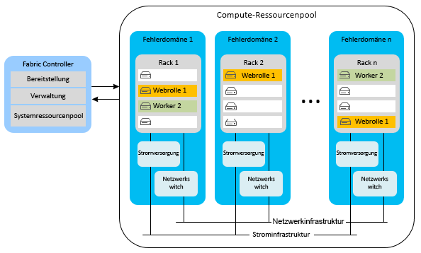
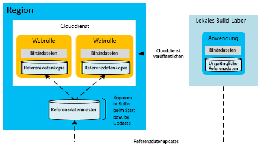
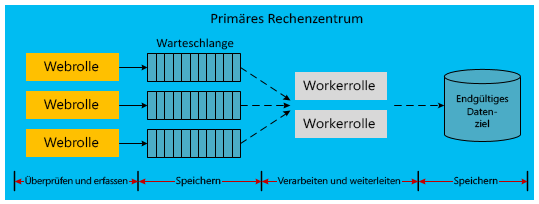

[!INCLUDE [header](../_includes/header.md)]

# Hochverfügbarkeit für in Microsoft Azure erstellte AnwendungenHigh availability for applications built on Microsoft Azure
Eine hochverfügbare Anwendung gleicht Schwankungen bei Verfügbarkeit und Last sowie vorübergehende Ausfälle in abhängigen Diensten und Hardwarekomponenten aus.A highly available application absorbs fluctuations in availability, load, and temporary failures in dependent services and hardware. Die Anwendung funktioniert weiterhin auf einem akzeptablen Niveau, wie dies durch Geschäftsanforderungen oder Vereinbarungen zum Servicelevel (SLAs) für die Anwendung definiert ist.The application continues to perform acceptably, as defined by business requirements or application service-level agreements (SLAs).

## Funktionen von Azure für hohe VerfügbarkeitAzure high-availability features
Azure weist viele integrierte Plattformfunktionen auf, die hoch verfügbare Anwendungen unterstützen.Azure has many built-in platform features that support highly available applications. In diesem Abschnitt werden einige dieser wichtigen Funktionen beschrieben.This section describes some of those key features.

### Fabric ControllerFabric controller
Mit dem Azure Fabric Controller wird der Zustand von Azure-Serverinstanzen bereitgestellt und überwacht.The Azure fabric controller provisions and monitors the condition of Azure compute instances. Der Fabric Controller überwacht den Status der Hardware und Software für die Host- und Gastcomputerinstanzen.The fabric controller monitors the status of the hardware and software of the host and guest machine instances. Wenn ein Fehler erkannt wird, werden SLAs durch automatisches Verschieben der VM-Instanzen aufrechterhalten.When it detects a failure, it maintains SLAs by automatically relocating the VM instances. Das Konzept von Fehler- und Upgradedomänen unterstützt Compute-SLAs zusätzlich.The concept of fault and upgrade domains further supports the compute SLA.

Wenn mehrere Clouddienst-Rolleninstanzen bereitgestellt werden, stellt Azure diese in verschiedenen Fehlerdomänen bereit.When multiple Cloud Service role instances are deployed, Azure deploys these instances to different fault domains. Eine Fehlerdomänengrenze ist im Wesentlichen ein anderes Hardwarerack in der gleichen Region.A fault domain boundary is essentially a different hardware rack in the same region. Fehlerdomänen reduzieren die Wahrscheinlichkeit, dass ein ermittelter Hardwarefehler die Dienstbereitstellung einer Anwendung unterbricht.Fault domains reduce the probability that a localized hardware failure interrupts the service of an application. Sie können die Anzahl von Fehlerdomänen für Ihre Worker- oder Webrollen nicht verwalten.You cannot manage the number of fault domains of your worker roles or web roles. Der Fabric Controller verwendet dedizierte Ressourcen, die von den in Azure gehosteten Anwendungen getrennt sind.The fabric controller uses dedicated resources that are separate from Azure-hosted applications. Er weist eine Betriebszeit von 100 % auf, da er das Herzstück des Azure-Systems darstellt.It requires 100 percent uptime because it serves as the nucleus of the Azure system. Er überwacht und verwaltet Rolleninstanzen über Fehlerdomänen hinweg.It monitors and manages role instances across fault domains.

Im folgenden Diagramm sind gemeinsam genutzte Azure-Ressourcen dargestellt, die vom Fabric Controller über verschiedene Fehlerdomänen hinweg bereitgestellt und verwaltet werden.The following diagram shows Azure shared resources that the fabric controller deploys and manages across different fault domains.

Während Fehlerdomänen physische Trennungen zur Vermeidung von Ausfällen darstellen, handelt es sich bei Upgradedomänen um logische Einheiten der Instanzentrennung, die bestimmen, für welche Instanzen eines Diensts zu einem bestimmten Zeitpunkt ein Upgrade durchgeführt wird.While fault domains are physical separations to mitigate failure, upgrade domains are logical units of instance separation that determine which instances of a service will be upgraded at a specific time. Standardmäßig sind fünf Upgradedomänen für Ihre Bereitstellung des gehosteten Diensts definiert.By default, five upgrade domains are defined for your hosted service deployment. Sie können diesen Wert jedoch in der Dienstdefinitionsdatei ändern.However, you can change that value in the service definition file. Wenn Sie beispielsweise über acht Instanzen Ihrer Webrolle verfügen, befinden sich zwei Instanzen in drei Upgradedomänen und zwei Instanzen in einer Upgradedomäne.For example, if you have eight instances of your web role, there are two instances in three upgrade domains and two instances in one upgrade domain. Azure definiert die Updatesequenz basierend auf der Anzahl von Upgradedomänen.Azure defines the update sequence based on the number of upgrade domains. Weitere Informationen finden Sie unter [Aktualisieren eines Clouddiensts](/azure/cloud-services/cloud-services-update-azure-service/).For more information, see [Update a cloud service](/azure/cloud-services/cloud-services-update-azure-service/).

### Funktionen in anderen DienstenFeatures in other services
Zusätzlich zu den Plattformfeatures, die Hochverfügbarkeit von Computeressourcen unterstützen, bettet Azure Hochverfügbarkeitsfeatures in die anderen Dienste ein.In addition to the platform features that support high availability of compute resources, Azure embeds high-availability features in its other services. Beispielsweise behält Azure Storage mindestens drei Replikate aller Daten in Ihrem Azure Storage-Konto bei.For example, Azure Storage maintains at least three replicas of all data in your Azure storage account. Darüber hinaus wird die Georeplikation zum Speichern von Datenkopien in einer sekundären Region ermöglicht.It also enables geo-replication to store copies of your data in a secondary region. Das Azure Content Delivery Network ermöglicht die Zwischenspeicherung von Blobs auf der ganzen Welt, um Redundanz, Skalierbarkeit und niedrigere Latenzen sicherzustellen.The Azure Content Delivery Network allows blobs to be cached around the world for redundancy, scalability, and lower latency. In Azure SQL-Datenbank werden auch mehrere Replikate gespeichert.Azure SQL Database maintains multiple replicas as well.

Eine detailliertere Erläuterung der Verfügbarkeitsfeatures der Azure-Plattform finden Sie in der [technischen Dokumentation zur Resilienz](index.md).For a deeper discussion of Azure platform availability features, see [Resiliency technical guidance](index.md). Weitere Informationen finden Sie auch unter [Bewährte Methoden für das Entwerfen umfassender Dienste mit Microsoft Azure](https://azure.microsoft.com/blog/best-practices-for-designing-large-scale-services-on-windows-azure/).Also see [Best practices for designing large-scale services on Windows Azure](https://azure.microsoft.com/blog/best-practices-for-designing-large-scale-services-on-windows-azure/).

Obwohl Azure mehrere Funktionen zur Unterstützung von Hochverfügbarkeit bereitstellt, ist es wichtig, die Grenzen dieser Funktionen zu kennen:Although Azure provides multiple features that support high availability, it's important to understand their limitations:

* Azure garantiert in Bezug auf die Computeleistung, dass Ihre Rollen verfügbar sind und ausgeführt werden, kann jedoch nicht erkennen, ob Ihre Anwendung ausgeführt wird oder überlastet ist.For compute, Azure guarantees that your roles are available and running, but it cannot detect whether your application is running or overloaded.
* Für Azure SQL-Datenbank werden Daten synchron innerhalb der Region repliziert.For Azure SQL Database, data is replicated synchronously within the region. Sie können die aktive Georeplikation auswählen, bei der bis zu vier zusätzliche Datenbankkopien in derselben Region (oder verschiedenen Regionen) zulässig sind.You can choose active geo-replication, which allows up to four additional database copies in the same region (or different regions). Bei diesen Datenbankreplikaten handelt es sich zwar nicht um Point-in-Time-Sicherungen, diese Funktionen werden jedoch von der SQL-Datenbank bereitgestellt.While these database replicas are not point-in-time backups, SQL Database does provide point-in-time backup capabilities. Weitere Informationen finden Sie unter [Wiederherstellen einer Azure SQL-Datenbank mit automatisierten Datenbanksicherungen: Point-in-Time-Wiederherstellung](/azure/sql-database/sql-database-recovery-using-backups#point-in-time-restore).For more information, see [Recover an Azure SQL Database using automated data backups: Point-in-time restore](/azure/sql-database/sql-database-recovery-using-backups#point-in-time-restore).
* Für Azure Storage werden Tabellen- und Blobdaten standardmäßig in eine andere Region repliziert.For Azure Storage, table data and blob data are replicated by default to an alternate region. Sie können auf die Replikate jedoch erst zugreifen, nachdem Microsoft ein Failover zum alternativen Standort durchgeführt hat.However, you cannot access the replicas until Microsoft chooses to fail over to the alternate site. Ein Regionsfailover findet nur bei einer längeren regionsweiten Dienstunterbrechung statt, und es gibt keine SLA für die Dauer eines geografischen Failovers.A region failover occurs only during a prolonged region-wide service disruption, and there is no SLA for geo-failover time. Beachten Sie auch, dass sich jegliche Datenbeschädigungen schnell auf die Replikate ausbreiten.It's also important to note that any data corruption quickly spreads to the replicas. Aus diesen Gründen müssen Plattformverfügbarkeitsfeatures durch anwendungsspezifische Verfügbarkeitsfeatures ergänzt werden, z.B. durch das Blobmomentaufnahmefeature für die Erstellung von Point-in-Time-Sicherungen von Blobdaten.For these reasons, you must supplement platform availability features with application-specific availability features, including the blob snapshot feature to create point-in-time backups of blob data.

### Verfügbarkeitsgruppen für virtuelle Azure-ComputerAvailability sets for Azure Virtual Machines
In diesem Dokument werden hauptsächlich Clouddienste behandelt, die auf einem PaaS-Modell (Platform as a Service) basieren.This document primarily focuses on cloud services, which use a platform-as-a-service (PaaS) model. Es gibt auch bestimmte Verfügbarkeitsfeatures für virtuelle Azure-Computer, die ein IaaS-Modell (Infrastructure-as-a-Service) verwenden.There are also specific availability features for Azure Virtual Machines, which use an infrastructure-as-a-service (IaaS) model. Um Hochverfügbarkeit bei virtuellen Computern zu erzielen, müssen Sie Verfügbarkeitsgruppen verwenden, die eine ähnliche Funktion für Fehler- und Upgradedomänen erfüllen.To achieve high availability with Virtual Machines, you must use availability sets, which serve a similar function to fault and upgrade domains. Innerhalb einer Verfügbarkeitsgruppe positioniert Azure die virtuellen Computer so, dass ermittelte Hardwarefehler und Wartungsaktivitäten nicht dazu führen, dass alle Computer in dieser Gruppe ausfallen.Within an availability set, Azure positions the virtual machines in a way that prevents localized hardware faults and maintenance activities from bringing down all the machines in that group. Verfügbarkeitsgruppen sind erforderlich, um die Azure-SLA für die Verfügbarkeit von virtuellen Computern zu erreichen.Availability sets are required to achieve the Azure SLA for the availability of Virtual Machines.

Das folgende Diagramm zeigt zwei Verfügbarkeitsgruppen für virtuelle Webcomputer bzw. virtuelle SQL Server-Computer.The following diagram shows two availability sets for web and SQL Server virtual machines, respectively.

> [!NOTE]
> Im vorherigen Diagramm ist SQL Server installiert und wird auf virtuellen Computern ausgeführt.In the preceding diagram, SQL Server is installed and running on virtual machines. Dies unterscheidet sich von der Azure SQL-Datenbank, bei der eine Datenbank als verwalteter Dienst bereitgestellt wird.This is different from Azure SQL Database, which provides a database as a managed service.
> 
> 

## Anwendungsstrategien für HochverfügbarkeitApplication strategies for high availability
Die meisten Anwendungsstrategien für Hochverfügbarkeit umfassen entweder Redundanz oder die Entfernung von festen Abhängigkeiten zwischen Anwendungskomponenten.Most application strategies for high availability involve either redundancy or the removal of hard dependencies between application components. Der Anwendungsentwurf sollte Fehlertoleranz während zeitweiliger Ausfälle von Azure oder Drittanbieterdiensten unterstützen.Application design should support fault tolerance during sporadic downtime of Azure or third-party services. In den folgenden Abschnitten werden Anwendungsmuster zur Erhöhung der Verfügbarkeit Ihrer Clouddienste beschrieben.The following sections describe application patterns for improving the availability of your cloud services.

### Asynchrone Kommunikation und permanente WarteschlangenAsynchronous communication and durable queues
Um die Verfügbarkeit in Azure-Anwendungen zu erhöhen, betrachten wir die asynchrone Kommunikation zwischen lose gekoppelten Diensten.To increase availability in Azure applications, consider asynchronous communication between loosely coupled services. In diesem Muster werden Nachrichten zur späteren Verarbeitung entweder an Speicherwarteschlangen oder an Azure Service Bus-Warteschlangen geschrieben.In this pattern, messages are written to either storage queues or Azure Service Bus queues for later processing. Wenn eine Nachricht an die Warteschlange geschrieben wird, erfolgt sofort die Steuerelementrückgabe an den Absender.When a message is written to the queue, control immediately returns to the sender. Die Nachricht wird von einem anderen Dienst der Anwendung, die üblicherweise als Workerrolle implementiert ist, verarbeitet.Another service of the application (typically implemented as a worker role) processes the message. Wenn der Verarbeitungsdienst angehalten wird, werden die Nachrichten in der Warteschlange gesammelt, bis der Verarbeitungsdienst wiederhergestellt wird.If the processing service stops working, the messages accumulate in the queue until the processing service is restored. Es gibt keine direkte Abhängigkeit zwischen dem Absender im Front-End und dem Nachrichtenprozessor.There is no direct dependency between the front-end sender and the message processor. Hierdurch werden synchrone Dienstaufrufe verhindert, die Engpässe in verteilten Anwendungen verursachen können.This eliminates synchronous service calls that can cause bottlenecks in distributed applications.

Eine Variante dieses Musters speichert Informationen über fehlerhafte Datenbankaufrufe in Azure Storage (Blobs, Tabellen, Warteschlangen) oder Service Bus-Warteschlangen.A variation of this pattern stores information about failed database calls in Azure Storage (blobs, tables, or queues) or Service Bus queues. Ein Beispiel: Ein synchroner Aufruf an einen anderen Dienst innerhalb einer Anwendung (z.B. Azure SQL-Datenbank) führt wiederholt zu einem Fehler.For example, a synchronous call within an application to another service (such as Azure SQL Database) fails repeatedly. Sie können diese Anforderung möglicherweise in einem permanenten Speicher serialisieren.You might be able to serialize that request into durable storage. Zu einem späteren Zeitpunkt, wenn der Dienst oder die Datenbank wieder online ist, kann die Anwendung die Anforderung aus dem Speicher erneut übermitteln.At some later point when the service or database is back online, the application can resubmit the request from storage. Der Unterschied in diesem Modell besteht darin, dass der temporäre Speicherort nur bei Ausfällen verwendet wird und kein fester Bestandteil des Anwendungsworkflows ist.The difference in this model is that the intermediate location is used only during failures, not as a regular part of the application workflow.

In beiden Szenarien verhindern die asynchrone Kommunikation und der temporäre Speicher, dass ein ausgefallener Back-End-Dienst zu einem Ausfall der gesamten Anwendung führt.In both scenarios, asynchronous communication and intermediate storage prevent a downed back-end service from bringing down the entire application. Warteschlangen dienen als logisches Zwischenelement.Queues serve as a logical intermediary. Weitere Informationen zur Auswahl des Warteschlangendiensts finden Sie unter [Storage-Warteschlangen und Service Bus-Warteschlangen – Vergleich und Gegenüberstellung](/azure/service-bus-messaging/service-bus-azure-and-service-bus-queues-compared-contrasted/).For more information on choosing between queuing services, see [Azure queues and Azure Service Bus queues &mdash; compared and contrasted](/azure/service-bus-messaging/service-bus-azure-and-service-bus-queues-compared-contrasted/).

### Fehlererkennung und WiederholungslogikFault detection and retry logic
Ein wichtiger Aspekt beim Entwerfen von hochverfügbaren Anwendungen ist die Verwendung einer Wiederholungslogik im Code, um einen vorübergehend nicht verfügbaren Dienst richtig behandeln zu können.A key aspect of the design of highly available applications is the use of retry logic within code to gracefully handle a service that is temporarily unavailable. Die aktuellen SDK-Versionen für Azure Storage und den Azure Service Bus bieten native Unterstützung für Wiederholungen.Recent versions of SDKs for both Azure Storage and Azure Service Bus natively support retries. Weitere Informationen zum Bereitstellen einer benutzerdefinierten Wiederholungslogik für Ihre Anwendung finden Sie unter [Muster „Wiederholung“](../patterns/retry.md).For more information on providing custom retry logic for your application, see the [Retry pattern](../patterns/retry.md).

### Verweisdatenmuster für HochverfügbarkeitReference data pattern for high availability
Verweisdaten sind die schreibgeschützten Daten einer Anwendung.Reference data is the read-only data of an application. Diese Daten stellen den Geschäftskontext bereit, innerhalb dessen die Anwendung während eines Geschäftsvorgangs Transaktionsdaten generiert.This data provides the business context within which the application generates transactional data during a business operation. Um die Integrität der Transaktionsdaten sicherzustellen, ist eine Momentaufnahme der Verweisdaten zu dem Zeitpunkt, an dem die Transaktion abgeschlossen wurde, erforderlich.The integrity of transactional data depends on a snapshot of the reference data at the time the transaction was completed.

Für die ordnungsgemäße Ausführung der Anwendung sind Verweisdaten erforderlich.Reference data is necessary for the proper operation of the application. Verschiedene Anwendungen erstellen und verwalten Verweisdaten – Systeme zur Masterdatenverwaltung (MDM) führen diese Funktion häufig aus.Various applications create and maintain reference data; master data management (MDM) systems often perform this function. Diese Systeme sind für den Lebenszyklus der Verweisdaten zuständig.These systems are responsible for the life cycle of the reference data. Beispiele für Verweisdaten: Produktkataloge, Mitarbeitermaster, Teilemaster und Gerätemaster.Examples of reference data include product catalog, employee master, parts master, and equipment master. Verweisdaten können auch von außerhalb der Organisation stammen, z.B. Postleitzahlen oder Steuersätze.Reference data can also originate from outside the organization, for example, postal codes or tax rates. Strategien zur Erhöhung der Verfügbarkeit von Verweisdaten sind üblicherweise weniger kompliziert als Strategien für Transaktionsdaten.Strategies for increasing the availability of reference data are typically less difficult than those for transactional data. Verweisdaten haben den Vorteil, größtenteils unveränderlich zu sein.Reference data has the advantage of being mostly immutable.

Web- und Workerrollen in Azure, die Verweisdaten verwenden, können autonom zur Runtime erstellt werden, indem die Verweisdaten zusammen mit der Anwendung bereitgestellt werden.Azure web and worker roles that consume reference data can be made autonomous at runtime by deploying the reference data along with the application. Diese Vorgehensweise ist ideal, wenn die Größe des lokalen Speichers eine solche Bereitstellung zulässt.This approach is ideal if the size of the local storage allows such a deployment. Eingebettete SQL-Datenbanken, NoSQL-Datenbanken oder lokal bereitgestellte XML-Dateien unterstützen die Autonomie von Azure-Computeskalierungseinheiten.Embedded SQL databases, NoSQL databases, or XML files deployed locally help with the autonomy of Azure compute scale units. Sie sollten jedoch einen Mechanismus einrichten, um die Daten in jeder Rolle ohne erneute Bereitstellung zu aktualisieren.However, you should have a mechanism to update the data in each role without requiring redeployment. Platzieren Sie zu diesem Zweck alle Updates der Verweisdaten in einem Cloudspeicherendpunkt (z.B. im Azure Blob Storage oder in der SQL-Datenbank).To do this, place any updates to the reference data at a cloud storage endpoint (for example, Azure Blob storage or SQL Database). Fügen Sie jeder Rolle Code hinzu, der die Datenupdates beim Starten der Rolle in die Computeknoten herunterlädt.Add code to each role that downloads the data updates into the compute nodes at role startup. Alternativ dazu können Sie auch Code hinzufügen, der einem Administrator erlaubt, einen erzwungenen Download in die Rolleninstanzen durchzuführen.Alternatively, add code that allows an administrator to perform a forced download into the role instances.

Um die Verfügbarkeit zu erhöhen, sollten Sie Rollen auch einen Satz Verweisdaten enthalten, falls der Speicher ausfällt.To increase availability, the roles should also contain a set of reference data in case storage is down. Auf diese Weise können die Rollen mit einem Basissatz an Verweisdaten starten, bis die Speicherressource für die Updates verfügbar wird.Roles can start with a basic set of reference data until the storage resource becomes available for the updates.

Bei diesem Muster dauert das Starten neuer Bereitstellungen oder Rolleninstanzen möglicherweise länger, wenn Sie große Mengen von Verweisdaten bereitstellen oder herunterladen.With this pattern, new deployments or role instances may take longer to start if you are deploying or downloading large amounts of reference data. Dieser Nachteil kann jedoch akzeptabel sein, wenn Sie dafür die Autonomie erhalten, dass die Verweisdaten für jede Rolle sofort verfügbar sind und Sie sich nicht auf externe Speicherdienste verlassen müssen.This tradeoff might be acceptable for the autonomy of having the reference data immediately available on each role, rather than depending on external storage services.

### Transaktionsdatenmuster für HochverfügbarkeitTransactional data pattern for high availability
Transaktionsdaten sind die Daten, die von einer Anwendung in einem Geschäftskontext generiert werden.Transactional data is the data that the application generates in a business context. Transaktionsdaten sind eine Kombination aus den Geschäftsprozessen, die von der Anwendung implementiert werden, und den Verweisdaten, die diese Prozesse unterstützen.Transactional data is a combination of the set of business processes that the application implements and the reference data that supports these processes. Beispiele für Transaktionsdaten sind Bestellungen, erweiterte Versandmitteilungen, Rechnungen und CRM-Verkaufschancen.Examples of transactional data can include orders, advanced shipping notices, invoices, and customer relationship management (CRM) opportunities. Transaktionsdaten werden zu Aufbewahrungszwecken oder zur weiteren Verarbeitung an externe Systeme übermittelt.Transactional data is supplied to external systems for record keeping or for further processing.

Verweisdaten können sich innerhalb der für diese Daten zuständigen Systeme verändern.Reference data can change within the systems that are responsible for that data. Daher müssen Transaktionsdaten den Point-in-Time-Verweisdatenkontext speichern, um externe Abhängigkeiten für die semantische Konsistenz auf ein Minimum zu reduzieren.Therefore, transactional data must save the point-in-time reference data context to minimize external dependencies for its semantic consistency. Beispiel: Ein Produkt wird einige Monate nach Ausführung einer Bestellung aus dem Katalog entfernt.For example, a product may be removed from the catalog several months after an order is fulfilled. Es empfiehlt sich, einen möglichst umfangreichen Verweisdatenkontext mit der Transaktion zu speichern.Storing as much reference data context as possible with the transaction is recommended. Durch diese Vorgehensweise wird die mit der Transaktion verknüpfte Semantik beibehalten, auch wenn sich die Verweisdaten nach der Erfassung der Transaktion ändern.This approach preserves the semantics associated with the transaction, even if the reference data changes after the transaction is captured.

Wie bereits erwähnt, können Architekturen, die eine lose Kopplung und asynchrone Kommunikation verwenden, eine höhere Verfügbarkeit bieten.As mentioned previously, architectures that use loose coupling and asynchronous communication can provide higher levels of availability. Dies gilt auch für Transaktionsdaten, die Implementierung ist jedoch komplexer.This is true for transactional data as well, but the implementation is more complex. Bei konventionellen Transaktionsmustern garantiert üblicherweise die Datenbank die Transaktion.Traditional transactional patterns usually rely on the database for guaranteeing the transaction. Wenn Sie Zwischenschichten einführen, muss der Anwendungscode die Daten in verschiedenen Schichten ordnungsgemäß verarbeiten, um Konsistenz und Dauerhaftigkeit sicherzustellen.When you introduce intermediate layers, the application code must correctly handle the data at various layers to ensure sufficient consistency and durability.

Die folgende Sequenz beschreibt einen Workflow, der die Erfassung der Transaktionsdaten von ihrer Verarbeitung trennt:The following sequence describes a workflow that separates the capture of transactional data from its processing:

1. Webcomputeknoten: Vorlegen der Verweisdaten.Web compute node: Present reference data.
2. Externer Speicher: Speichern der Transaktionszwischendaten.External storage: Save intermediate transactional data.
3. Webcomputeknoten: Abschließen der Endbenutzertransaktion.Web compute node: Complete the end-user transaction.
4. Webcomputeknoten: Senden der abgeschlossenen Transaktionsdaten mit dem jeweiligen Verweisdatenkontext an einen temporären permanenten Speicher, für den eine vorhersagbare Reaktion garantiert wird.Web compute node: Send the completed transactional data with its reference data context to temporary durable storage that is guaranteed to give a predictable response.
5. Webcomputeknoten: Signalisieren des Abschlusses der Transaktion an den Benutzer.Web compute node: Signal the end-user completion of the transaction.
6. Hintergrundcomputeknoten: Extrahieren der Transaktionsdaten, Weiterverarbeiten der Daten bei Bedarf und Senden der Daten an den endgültigen Speicherort im aktuellen System.Background compute node: Extract the transactional data, process it further if necessary, and send it to its final storage location in the current system.

Das folgende Diagramm zeigt eine mögliche Implementierung dieses Entwurfs in einem in Azure gehosteten Clouddienst.The following diagram shows one possible implementation of this design in an Azure-hosted cloud service.

Die gestrichelten Pfeile im vorherigen Diagramm weisen auf eine asynchrone Verarbeitung hin.The dashed arrows in the preceding diagram indicate asynchronous processing. Die Front-End-Webrolle hat keine Kenntnis über diese asynchrone Verarbeitung.The front-end web role is not aware of this asynchronous processing. Dadurch wird die Transaktion an ihrem endgültigen Ziel mit Verweis auf das aktuelle System gespeichert.This leads to the storage of the transaction at its final destination with reference to the current system. Aufgrund der durch dieses asynchrone Modell eingeführten Latenz stehen die Transaktionsdaten nicht sofort für Abfragen zur Verfügung.Due to the latency that this asynchronous model introduces, the transactional data is not immediately available for query. Daher muss jede Transaktionsdateneinheit in einem Cache oder einer Benutzersitzung gespeichert werden, um die sofortigen Anforderungen der Benutzeroberfläche zu erfüllen.Therefore, each unit of the transactional data needs to be saved in a cache or a user session to meet the immediate UI needs.

Die Webrolle ist vom Rest der Infrastruktur unabhängig.The web role is autonomous from the rest of the infrastructure. Ihr Verfügbarkeitsprofil ist eine Kombination der Webrolle und der Azure-Warteschlange, nicht der gesamten Infrastruktur.Its availability profile is a combination of the web role and the Azure queue and not the entire infrastructure. Dieser Ansatz sorgt nicht nur für Hochverfügbarkeit, sondern ermöglicht auch unabhängig vom Back-End-Speicher eine horizontale Skalierung der Webrolle.In addition to high availability, this approach allows the web role to scale horizontally, independent of the back-end storage. Dieses Modell für hohe Verfügbarkeit kann die Wirtschaftlichkeit von Vorgängen beeinflussen.This high-availability model can have an impact on the economics of operations. Zusätzliche Komponenten wie Azure-Warteschlangen und -Workerrollen können sich auf die monatlichen Nutzungskosten auswirken.Additional components like Azure queues and worker roles can affect monthly usage costs.

Das vorherige Diagramm zeigt eine Implementierung dieses entkoppelten Ansatzes für Transaktionsdaten.The previous diagram shows one implementation of this decoupled approach to transactional data. Es gibt viele weitere mögliche Implementierungen.There are many other possible implementations. Die folgende Liste enthält einige Alternativen:The following list provides some alternatives:

* Eine Workerrolle kann zwischen Webrolle und Speicherwarteschlange platziert werden.A worker role might be placed between the web role and the storage queue.
* Eine Service Bus-Warteschlange kann anstelle einer Azure Storage-Warteschlange verwendet werden.A Service Bus queue can be used instead of an Azure Storage queue.
* Beim endgültigen Ziel kann es sich um Azure Storage oder einen anderen Datenbankanbieter handeln.The final destination might be Azure Storage or a different database provider.
* Azure Cache kann auf der Webschicht verwendet werden, um die unmittelbaren Anforderungen an eine Zwischenspeicherung nach der Transaktion zu erfüllen.Azure Cache can be used at the web layer to provide the immediate caching requirements after the transaction.

### SkalierbarkeitsmusterScalability patterns
Es ist wichtig zu beachten, dass sich die Skalierbarkeit eines Clouddiensts direkt auf die Verfügbarkeit auswirkt.It's important to note that the scalability of a cloud service directly affects availability. Wenn Ihr Dienst aufgrund einer erhöhten Last nicht mehr reagiert, nehmen die Benutzer dies als Ausfall der Anwendung wahr.If increased load causes your service to be unresponsive, the user perception is that the application is down. Befolgen Sie die bewährten Methoden für die Skalierbarkeit basierend auf der erwarteten Anwendungslast und Ihren zukünftigen Erwartungen.Follow proven practices for scalability based on your expected application load and future expectations. Die Maximierung der Skalierung erfordert eine Vielzahl von Überlegungen, z.B. die Verwendung einzelner oder mehrerer Speicherkonten, die gemeinsame Nutzung über mehrere Datenbanken hinweg sowie Strategien für die Zwischenspeicherung.Maximizing scale involves many considerations, such as single versus multiple storage accounts, sharing across multiple databases, and caching strategies. Ausführliche Informationen zu diesen Mustern finden Sie unter [Bewährte Methoden für das Entwerfen umfassender Dienste mit Microsoft Azure](https://azure.microsoft.com/blog/best-practices-for-designing-large-scale-services-on-windows-azure/).For in-depth information about these patterns, see [Best practices for designing large-scale services on Microsoft Azure](https://azure.microsoft.com/blog/best-practices-for-designing-large-scale-services-on-windows-azure/).

## Nächste SchritteNext steps
In dieser Dokumentreihe werden die Themen Notfallwiederherstellung und Hochverfügbarkeit für in Microsoft Azure erstellte Anwendungen behandelt.This series of documents covers disaster recovery and high availability for applications built on Microsoft Azure. Der nächste Artikel dieser Reihe ist [Notfallwiederherstellung für in Microsoft Azure erstellte Anwendungen](disaster-recovery-azure-applications.md).The next article in the series is [Disaster recovery for applications built on Microsoft Azure](disaster-recovery-azure-applications.md).

