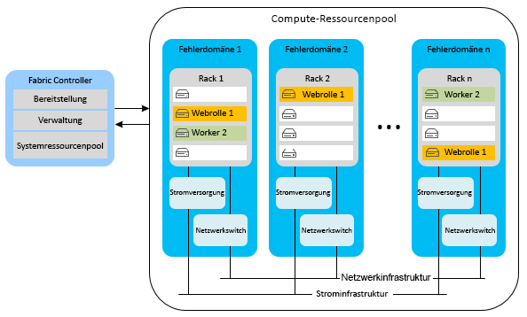
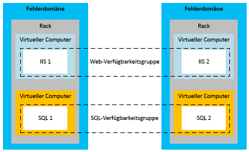
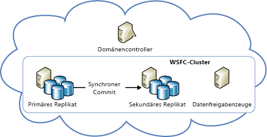
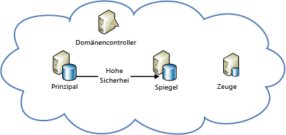

[!INCLUDE [header](../_includes/header.md)]

# Technischer Leitfaden zur Resilienz in Azure – Wiederherstellung nach lokalen Ausfällen in AzureAzure resiliency technical guidance: Recovery from local failures in Azure

Es gibt zwei primäre Bedrohungen der Anwendungsverfügbarkeit:There are two primary threats to application availability:

* Ausfall von Geräten, z.B. Festplatten und ServernThe failure of devices, such as drives and servers
* Volle Auslastung kritischer Ressourcen, z.B. von Computeressourcen bei SpitzenlastThe exhaustion of critical resources, such as compute under peak load conditions

Um unter solchen Umständen für Hochverfügbarkeit zu sorgen, bietet Azure eine Kombination aus Ressourcenverwaltung, Elastizität, Lastenausgleich und Partitionierung.Azure provides a combination of resource management, elasticity, load balancing, and partitioning to enable high availability under these circumstances. Einige dieser Funktionen werden automatisch für alle Azure-Dienste ausgeführt.Some of these features are performed automatically for all Azure services. In einigen Fällen muss der Anwendungsentwickler aber zusätzliche Schritte ausführen, um davon zu profitieren.However, in some cases, the application developer must do some additional work to benefit from them.

## Cloud ServicesCloud Services
Azure Cloud Services besteht aus Sammlungen mit mindestens einer Web- oder Workerrolle.Azure Cloud Services consists of collections of one or more web or worker roles. Eine oder mehrere Instanzen einer Rolle können gleichzeitig ausgeführt werden.One or more instances of a role can run concurrently. Die Konfiguration bestimmt die Anzahl von Instanzen.The configuration determines the number of instances. Rolleninstanzen werden mithilfe einer Komponente überwacht und verwaltet, die als Fabric Controller bezeichnet wird.Role instances are monitored and managed through a component called the fabric controller. Der Fabric Controller erkennt sowohl Software- als auch Hardwarefehler automatisch und reagiert darauf.The fabric controller detects and responds to both software and hardware failures automatically.

Jede Rolleninstanz wird in einem eigenen virtuellen Computer ausgeführt und kommuniziert über einen Gast-Agent mit dem Fabric Controller.Every role instance runs in its own virtual machine (VM) and communicates with its fabric controller through a guest agent. Der Gast-Agent sammelt Ressourcen- und Knotenmetriken, einschließlich VM-Nutzung, Status, Protokolle, Ressourcenauslastung, Ausnahmen und Fehlerbedingungen.The guest agent collects resource and node metrics, including VM usage, status, logs, resource usage, exceptions, and failure conditions. Der Fabric Controller fragt den Gast-Agent in konfigurierbaren Intervallen ab und startet die VM neu, wenn der Gast-Agent nicht antwortet.The fabric controller queries the guest agent at configurable intervals, and it restarts the VM if the guest agent fails to respond. Bei einem Hardwarefehler verschiebt der zugehörige Fabric Controller alle betroffenen Rolleninstanzen in einen neuen Hardwareknoten und konfiguriert das Netzwerk neu, um den Datenverkehr an diesen Knoten zu leiten.In the event of hardware failure, the associated fabric controller moves all affected role instances to a new hardware node and reconfigures the network to route traffic there.

Um von diesen Funktionen profitieren zu können, sollten Entwickler sicherstellen, dass Dienstrollen keinen Statusinformationen in den Rolleninstanzen speichern.To benefit from these features, developers should ensure that all service roles avoid storing state on the role instances. Stattdessen sollte der Zugriff auf alle persistenten Daten über einen permanenten Speicher erfolgen, beispielsweise über Azure Storage oder Azure SQL-Datenbank.Instead, all persistent data should be accessed from durable storage, such as Azure Storage or Azure SQL Database. So wird allen Rollen die Behandlung von Anforderungen ermöglicht.This allows any roles to handle requests. Das bedeutet auch, dass Rolleninstanzen jederzeit ausfallen können, ohne Inkonsistenzen im vorübergehenden oder permanenten Status des Diensts zu verursachen.It also means that role instances can go down at any time without creating inconsistencies in the transient or persistent state of the service.

Die Anforderung, den Status außerhalb der Rollen zu speichern, hat verschiedene Auswirkungen.The requirement to store state externally to the roles has several implications. Es sollten z.B. alle zugehörigen Änderungen an einem Azure-Tabellenspeicher nach Möglichkeit in einer einzigen Entitätsgruppentransaktion ausgeführt werden.It implies, for example, that all related changes to an Azure Storage table should be changed in a single entity-group transaction, if possible. Es ist allerdings nicht immer möglich, alle Änderungen in einer einzigen Transaktion auszuführen.Of course, it isn't always possible to make all changes in a single transaction. Sie sollten sorgfältig darauf achten, dass Rolleninstanzfehler keine Probleme verursachen, wenn sie langfristige Vorgänge unterbrechen, die zwei oder mehr Updates am persistenten Status des Diensts umfassen.You must take special care to ensure that role instance failures do not cause problems when they interrupt long-running operations that span two or more updates to the persistent state of the service. Wenn eine andere Rolle versucht, einen solchen Vorgang erneut auszuführen, sollte sie den Fall voraussehen, dass die Arbeit nur teilweise abgeschlossen wurde, und entsprechend reagieren.If another role attempts to retry such an operation, it should anticipate and handle the case where the work was partially completed.

Stellen Sie sich beispielsweise einen Dienst vor, bei dem Daten über mehrere Speicher hinweg partitioniert werden.For example, consider a service that partitions data across multiple stores. Wenn eine Workerrolle ausfällt, während ein Shard neu angeordnet wird, wird dieser Vorgang unter Umständen nicht abgeschlossen.If a worker role goes down while it's relocating a shard, the relocation of the shard might not finish. Es kann auch sein, dass die Neuanordnung von einer anderen Workerrolle von Beginn an wiederholt wird. Dies kann unter Umständen zu verwaisten oder beschädigten Daten führen.Or the relocation might be repeated from its inception by a different worker role, potentially causing orphaned data or data corruption. Zur Verhinderung von Problemen müssen Vorgänge mit langer Ausführungsdauer mindestens eine der beiden folgenden Eigenschaften haben:To prevent problems, long-running operations must be one or both of the following:

* *Idempotent*: Eine Wiederholung ist ohne Nebeneffekte möglich.*Idempotent*: Repeatable without side effects. Um idempotent zu sein, sollte ein langfristiger Vorgang immer die gleiche Auswirkung haben, und zwar unabhängig davon, wie oft er ausgeführt wird und ob er unterbrochen wird.To be idempotent, a long-running operation should have the same effect no matter how many times it's executed, even when it's interrupted during execution.
* *Inkrementell erneut startbar*: Der Vorgang sollte ab der letzten Fehlerquelle fortgesetzt werden können.*Incrementally restartable*: Able to continue from the most recent point of failure. Um dies zu ermöglichen, sollte ein Vorgang mit langer Ausführungsdauer aus einer Abfolge von kleineren „atomaren“ Vorgängen bestehen.To be incrementally restartable, a long-running operation should consist of a sequence of smaller atomic operations. Außerdem sollte der Status in permanentem Speicher aufgezeichnet werden, damit der Vorgang bei jedem nachfolgenden Aufruf an der Stelle fortgesetzt wird, an der der Vorgänger den Vorgang beendet hat.It should also record its progress in durable storage, so that each subsequent invocation picks up where its predecessor stopped.

Alle langfristigen Vorgänge sollten wiederholt aufgerufen werden, bis sie erfolgreich abgeschlossen werden.Finally, all long-running operations should be invoked repeatedly until they succeed. Ein Bereitstellungsvorgang kann beispielsweise in einer Azure-Warteschlange platziert und von einer Workerrolle erst nach erfolgreicher Durchführung aus der Warteschlange entfernt werden.For example, a provisioning operation might be placed in an Azure queue, and then removed from the queue by a worker role only when it succeeds. Zum Bereinigen von Daten, die durch unterbrochene Vorgänge erstellt wurden, ist möglicherweise eine Garbage Collection erforderlich.Garbage collection might be necessary to clean up data that interrupted operations create.

### ElastizitätElasticity
Die anfängliche Anzahl von Instanzen, die für jede Rolle ausgeführt werden, ist in der Konfiguration jeder Rolle festgelegt.The initial number of instances running for each role is determined in each role’s configuration. Administratoren sollten zu Beginn jede Rolle so konfigurieren, dass sie je nach erwarteter Auslastung mit mindestens zwei Instanzen ausgeführt wird.Administrators should initially configure each role to run with two or more instances based on expected load. Sie können Rolleninstanzen aber problemlos nach oben oder unten skalieren, wenn sich Nutzungsmuster ändern.But you can easily scale role instances up or down as usage patterns change. Dies ist manuell im Azure-Portal möglich, oder Sie können den Prozess automatisieren, indem Sie Windows PowerShell, die Dienstverwaltungs-API oder Drittanbietertools verwenden.You can do this manually in the Azure portal, or you can automate the process by using Windows PowerShell, the Service Management API, or third-party tools. Weitere Informationen finden Sie unter [Automatisches Skalieren einer Anwendung](/azure/cloud-services/cloud-services-how-to-scale/).For more information, see [How to autoscale an application](/azure/cloud-services/cloud-services-how-to-scale/).

### PartitionierungPartitioning
Der Azure Fabric Controller verwendet zwei Arten von Partitionen:The Azure fabric controller uses two types of partitions:

* Eine *Updatedomäne* wird zum Aktualisieren der Rolleninstanzen eines Diensts in Gruppen verwendet.An *update domain* is used to upgrade a service’s role instances in groups. Azure stellt Dienstinstanzen in mehreren Updatedomänen bereit.Azure deploys service instances into multiple update domains. Für ein direktes Update fährt der Fabric Controller alle Instanzen in einer Updatedomäne herunter, aktualisiert sie und startet sie neu. Anschließend fährt der Fabric Controller mit der nächsten Updatedomäne fort.For an in-place update, the fabric controller brings down all the instances in one update domain, updates them, and then restarts them before moving to the next update domain. Dieser Ansatz verhindert, dass während des Aktualisierungsvorgangs der komplette Dienst nicht verfügbar ist.This approach prevents the entire service from being unavailable during the update process.
* Eine *Fehlerdomäne* definiert potenzielle Hardware- oder Netzwerkfehlerstellen.A *fault domain* defines potential points of hardware or network failure. Bei Rollen mit mehr als einer Instanz stellt der Fabric Controller sicher, dass die Instanzen auf mehrere Fehlerdomänen verteilt werden, um zu verhindern, dass isolierte Hardwarefehler zu Dienstunterbrechungen führen.For any role that has more than one instance, the fabric controller ensures that the instances are distributed across multiple fault domains, to prevent isolated hardware failures from disrupting service. Sämtliche Risiken hinsichtlich Server- und Clusterfehlern werden durch Fehlerdomänen abgedeckt.Fault domains govern all exposure to server and cluster failures.

Gemäß der [Azure-Vereinbarung zum Servicelevel (SLA)](https://azure.microsoft.com/support/legal/sla/) garantiert Microsoft eine externe Konnektivität von mindestens 99,95%, wenn zwei oder mehr Webrolleninstanzen in verschiedenen Fehler- und Upgradedomänen bereitgestellt werden.The [Azure service-level agreement (SLA)](https://azure.microsoft.com/support/legal/sla/) guarantees that when two or more web role instances are deployed to different fault and upgrade domains, they'll have external connectivity at least 99.95 percent of the time. Im Gegensatz zu Updatedomänen gibt es keine Möglichkeit, die Anzahl von Fehlerdomänen zu steuern.Unlike update domains, there's no way to control the number of fault domains. Azure weist Fehlerdomänen automatisch zu und verteilt Rolleninstanzen auf diese.Azure automatically allocates fault domains and distributes role instances across them. Mindestens die ersten beiden Instanzen jeder Rolle werden in verschiedenen Fehler- und Upgradedomänen platziert, um sicherzustellen, dass jede Rolle mit mindestens zwei Instanzen die SLA erfüllt.At least the first two instances of every role are placed in different fault and upgrade domains to ensure that any role with at least two instances will satisfy the SLA. Dies ist im folgenden Diagramm dargestellt:This is represented in the following diagram.

### LastenausgleichLoad balancing
Jeglicher eingehender Datenverkehr einer Webrolle wird durch einen zustandslosen Lastenausgleich geleitet, der Clientanforderungen zwischen den Rolleninstanzen verteilt.All inbound traffic to a web role passes through a stateless load balancer, which distributes client requests among the role instances. Einzelne Rolleninstanzen besitzen keine öffentlichen IP-Adressen und sind nicht direkt aus dem Internet erreichbar.Individual role instances do not have public IP addresses, and they are not directly addressable from the Internet. Webrollen sind zustandslos, sodass alle Clientanforderungen an jede Rolleninstanz weitergeleitet werden können.Web roles are stateless so that any client request can be routed to any role instance. Alle 15 Sekunden wird ein [StatusCheck](https://msdn.microsoft.com/library/microsoft.windowsazure.serviceruntime.roleenvironment.statuscheck.aspx) -Ereignis ausgelöst.A [StatusCheck](https://msdn.microsoft.com/library/microsoft.windowsazure.serviceruntime.roleenvironment.statuscheck.aspx) event is raised every 15 seconds. Sie können es verwenden, um anzugeben, ob die Rolle für den Empfang von Datenverkehr bereit ist oder ob sie beschäftigt ist und aus der Lastenausgleichsrotation herausgenommen werden sollte.You can use this to indicate whether the role is ready to receive traffic, or whether it's busy and should be taken out of the load-balancer rotation.

## Virtual MachinesVirtual Machines
Virtuelle Azure-Computer unterscheiden sich von PaaS-Computerollen (Platform as a Service) im Zusammenhang mit Hochverfügbarkeit in mehreren Punkten.Azure Virtual Machines differs from platform as a service (PaaS) compute roles in several respects in relation to high availability. In einigen Fällen müssen Sie zusätzliche Aufgaben ausführen, um Hochverfügbarkeit sicherzustellen.In some instances, you must do additional work to ensure high availability.

### Dauerhaftigkeit von DatenträgernDisk durability
Im Gegensatz zu PaaS-Rolleninstanzen sind auf virtuellen Computern gespeicherte Daten persistent, auch wenn der virtuelle Computer verschoben wird.Unlike PaaS role instances, data stored on virtual machine drives is persistent even when the virtual machine is relocated. Virtuelle Azure-Computer verwenden VM-Datenträger, die in Azure Storage als Blobs vorhanden sind.Azure virtual machines use VM disks that exist as blobs in Azure Storage. Aufgrund der Verfügbarkeitsmerkmale von Azure Storage sind die Daten, die auf Laufwerken virtueller Computer gespeichert werden, ebenfalls hoch verfügbar.Because of the availability characteristics of Azure Storage, the data stored on a virtual machine’s drives is also highly available.

Beachten Sie, dass das Laufwerk D (auf Windows-VMs) eine Ausnahme von dieser Regel darstellt.Note that drive D (in Windows VMs) is the exception to this rule. Das Laufwerk D ist eigentlich ein physischer Speicher auf dem Rackserver, der den virtuellen Computer hostet, und die Daten dieses Laufwerks gehen verloren, wenn der virtuelle Computer recycelt wird.Drive D is actually physical storage on the rack server that hosts the VM, and its data will be lost if the VM is recycled. Das Laufwerk D ist nur für die temporäre Speicherung vorgesehen.Drive D is intended for temporary storage only. Unter Linux macht Azure den lokalen temporären Datenträger „normalerweise“ (aber nicht immer) als /dev/sdb-Blockgerät verfügbar.In Linux, Azure “usually” (but not always) exposes the local temporary disk as /dev/sdb block device. Häufig wird er vom Azure Linux-Agent als „/mnt/resource“- oder „/mnt“-Bereitstellungspunkt bereitgestellt (konfigurierbar über „/etc/waagent.conf“).It is often mounted by the Azure Linux Agent as /mnt/resource or /mnt mount points (configurable via /etc/waagent.conf).

### PartitionierungPartitioning
Azure bietet native Unterstützung für die Ebenen einer PaaS-Anwendung (Webrolle und Workerrolle) und kann diese daher richtig auf Fehler- und Updatedomänen verteilen.Azure natively understands the tiers in a PaaS application (web role and worker role) and thus can properly distribute them across fault and update domains. Die Ebenen in einer IaaS-Anwendung (Infrastructure as a Service) müssen dagegen manuell über Verfügbarkeitsgruppen definiert werden.In contrast, the tiers in an infrastructure as a service (IaaS) application must be manually defined through availability sets. Für ein IaaS-SLA sind Verfügbarkeitsgruppen erforderlich.Availability sets are required for an SLA under IaaS.

Im vorherigen Diagramm sind die IIS-Ebene (Internet Information Services), die als Web-App-Ebene fungiert, und die SQL-Ebene, die als Datenebene fungiert, verschiedenen Verfügbarkeitsgruppen zugewiesen.In the preceding diagram, the Internet Information Services (IIS) tier (which works as a web app tier) and the SQL tier (which works as a data tier) are assigned to different availability sets. Indem virtuelle Computer auf verschiedene Fehlerdomänen verteilt werden, wird sichergestellt, dass alle Instanzen jeder Ebene über Hardwareredundanz verfügen und während einer Aktualisierung nicht ganze Ebenen heruntergefahren werden.This ensures that all instances of each tier have hardware redundancy by distributing virtual machines across fault domains, and that entire tiers are not taken down during an update.

### LastenausgleichLoad balancing
Wenn der Datenverkehr auf die virtuellen Computer verteilt werden soll, müssen Sie die virtuellen Computer in einer Anwendung gruppieren und den Lastenausgleich über einen bestimmten TCP- oder UDP-Endpunkt ausführen.If the VMs should have traffic distributed across them, you must group the VMs in an application and load balance across a specific TCP or UDP endpoint. Weitere Informationen finden Sie unter [Lastenausgleich zwischen virtuellen Computern](/azure/virtual-machines/virtual-machines-linux-load-balance/?toc=%2fazure%2fvirtual-machines%2flinux%2ftoc.json).For more information, see [Load balancing virtual machines](/azure/virtual-machines/virtual-machines-linux-load-balance/?toc=%2fazure%2fvirtual-machines%2flinux%2ftoc.json). Wenn die virtuellen Computer Eingaben aus einer anderen Quelle erhalten (beispielsweise einem Warteschlangenmechanismus), ist kein Lastenausgleich erforderlich.If the VMs receive input from another source (for example, a queuing mechanism), a load balancer is not required. Der Lastenausgleich verwendet eine grundlegende Integritätsprüfung, um zu ermitteln, ob der Datenverkehr an den Knoten gesendet werden soll.The load balancer uses a basic health check to determine whether traffic should be sent to the node. Sie können auch selbst Tests erstellen, um anwendungsspezifische Integritätsmetriken zu implementieren, die bestimmen, ob der virtuelle Computer Datenverkehr empfangen soll.It's also possible to create your own probes to implement application-specific health metrics that determine whether the VM should receive traffic.

## SpeicherStorage
Azure Storage ist der grundlegende permanente Datendienst für Azure.Azure Storage is the baseline durable data service for Azure. Er stellt Blob-, Tabellen-, Warteschlangen- und VM-Datenträgerspeicher bereit.It provides blob, table, queue, and VM disk storage. Storage verwendet eine Kombination aus Replikation und Ressourcenverwaltung, um innerhalb eines einzelnen Rechenzentrums Hochverfügbarkeit bereitzustellen.It uses a combination of replication and resource management to provide high availability within a single datacenter. Mit der Vereinbarung zum Servicelevel (SLA) zur Verfügbarkeit von Azure Storage wird gewährleistet, dass mindestens 99,9% der Zeit Folgendes sichergestellt ist:The Azure Storage availability SLA guarantees that at least 99.9 percent of the time:

* Richtig formatierte Anforderungen zum Hinzufügen, Aktualisieren, Lesen und Löschen von Daten werden erfolgreich und korrekt verarbeitet.Correctly formatted requests to add, update, read, and delete data will be successfully and correctly processed.
* Speicherkonten verfügen über eine Verbindung mit dem Internetgateway.Storage accounts will have connectivity to the Internet gateway.

### ReplikationReplication
Die Dauerhaftigkeit von Daten für Azure Storage wird ermöglicht, indem mehrere Kopien aller Daten auf verschiedenen Laufwerken gespeichert werden, die sich auf voneinander vollständig unabhängigen physischen Speichersubsystemen innerhalb der Region befinden.Azure Storage facilitates data durability by maintaining multiple copies of all data on different drives across fully independent physical storage subsystems within the region. Daten werden synchron repliziert, und für alle Kopien wird ein Commit ausgeführt, bevor ein Schreibvorgang bestätigt wird.Data is replicated synchronously, and all copies are committed before the write is acknowledged. Azure Storage weist eine hohe Konsistenz auf, was bedeutet, dass Lesevorgänge garantiert die neuesten Schreibvorgänge widerspiegeln.Azure Storage is strongly consistent, meaning that reads are guaranteed to reflect the most recent writes. Darüber hinaus werden Kopien der Daten fortlaufend überprüft, um Datenverfall zu erkennen und zu beheben – eine häufig übersehene Bedrohung der Integrität gespeicherter Daten.In addition, copies of data are continually scanned to detect and repair bit rot, an often overlooked threat to the integrity of stored data.

Dienste profitieren bereits durch die reine Verwendung von Azure Storage von der Replikation.Services benefit from replication just by using Azure Storage. Der Dienstentwickler muss für die Wiederherstellung nach einem lokalen Ausfall keine zusätzlichen Schritte ausführen.The service developer doesn't need to do additional work to recover from a local failure.

### RessourcenverwaltungResource management
Speicherkonten, die nach Mai 2014 erstellt wurden, können auf bis zu 500 TB skaliert werden (zuvor lag die Höchstgrenze bei 200 TB).Storage accounts created after May 2014, can grow to up to 500 TB (the previous maximum was 200 TB). Wenn zusätzlicher Speicherplatz erforderlich ist, müssen Anwendungen so entworfen werden, dass sie mehrere Speicherkonten verwenden.If additional space is required, applications must be designed to use multiple storage accounts.

### VM-DatenträgerVirtual machine disks
Ein VM-Datenträger wird als Seitenblob in Azure Storage gespeichert und erhält damit die gleichen Dauerhaftigkeits- und Skalierbarkeitseigenschaften wie Blobspeicher.A virtual machine’s disk is stored as a page blob in Azure Storage, giving it all the same durability and scalability properties as Blob storage. Aufgrund dieses Designs sind die Daten auf dem Datenträger eines virtuellen Computers persistent. Dies gilt selbst dann, wenn der Server ausfällt, auf dem der virtuelle Computer ausgeführt wird, und der virtuelle Computer auf einem anderen Server neu gestartet werden muss.This design makes the data on a virtual machine’s disk persistent, even if the server running the VM fails and the VM must be restarted on another server.

## DatenbankDatabase
### SQL-DatenbankSQL Database
Azure SQL-Datenbank ermöglicht „Database as a Service“.Azure SQL Database provides database as a service. Hierbei können Anwendungen relationale Datenbanken schnell bereitstellen, Daten einfügen und die Datenbanken abfragen.It allows applications to quickly provision, insert data into, and query relational databases. Azure SQL-Datenbank stellt viele der vertrauten SQL Server-Features und -Funktionen bereit und entbindet Sie gleichzeitig vom Aufwand für Hardware, Konfiguration, Patching und Resilienz.It provides many of the familiar SQL Server features and functionality, while abstracting the burden of hardware, configuration, patching, and resiliency.

> [!NOTE]
> Azure SQL-Datenbank weist keine 1:1-Featureübereinstimmung mit SQL Server auf.Azure SQL Database does not provide one-to-one feature parity with SQL Server. Es sollen andere Anforderungen erfüllt werden, und zwar speziell für Cloudanwendungen (elastische Skalierung, „Database as a Service“ zur Reduzierung von Wartungskosten usw.).It's intended to fulfill a different set of requirements--one that's uniquely suited to cloud applications (elastic scale, database as a service to reduce maintenance costs, and so on). Weitere Informationen finden Sie unter [Wählen Sie eine SQL Server-Cloudoption: Azure SQL-Datenbank (PaaS) oder SQL Server auf Azure-VMs (IaaS)](/azure/sql-database/sql-database-paas-vs-sql-server-iaas/).For more information, see [Choose a cloud SQL Server option: Azure SQL (PaaS) Database or SQL Server on Azure VMs (IaaS)](/azure/sql-database/sql-database-paas-vs-sql-server-iaas/).
> 
> 

#### ReplikationReplication
Azure SQL-Datenbank stellt integrierte Resilienz gegenüber Fehlern auf Knotenebene bereit.Azure SQL Database provides built-in resiliency to node-level failure. Alle Schreibvorgänge in eine Datenbank werden automatisch mithilfe eines Commitverfahrens per Quorum auf mindestens zwei Hintergrundknoten repliziert.All writes into a database are automatically replicated to two or more background nodes through a quorum commit technique. (Der primäre Knoten und mindestens ein sekundärer Knoten müssen bestätigen, dass die Aktivität in das Transaktionsprotokoll geschrieben wird, bevor die Transaktion als erfolgreich betrachtet und zurückgegeben wird.) Im Fall eines Knotenfehlers führt die Datenbank automatisch ein Failover auf eins der sekundären Replikate durch.(The primary and at least one secondary must confirm that the activity is written to the transaction log before the transaction is deemed successful and returns.) In the case of node failure, the database automatically fails over to one of the secondary replicas. Dies verursacht eine vorübergehende Unterbrechung der Verbindung für Clientanwendungen.This causes a transient connection interruption for client applications. Aus diesem Grund müssen alle Azure SQL-Datenbank-Clients die Verarbeitung vorübergehender Verbindungen in irgendeiner Form implementieren.For this reason, all Azure SQL Database clients must implement some form of transient connection handling. Weitere Informationen finden Sie unter [Anleitung zu dienstspezifischen Wiederholungsmechanismen](/azure/best-practices-retry-service-specific/).For more information, see [Retry service specific guidance](/azure/best-practices-retry-service-specific/).

#### RessourcenverwaltungResource management
Jede Datenbank wird bei der Erstellung mit einer Größenbeschränkung konfiguriert.Each database, when created, is configured with an upper size limit. Die derzeit verfügbare maximale Größe beträgt 1 TB (Größenbeschränkungen variieren je nach Dienstebene, siehe [Tarife und Leistungsstufen von Azure SQL-Datenbanken](/azure/sql-database/sql-database-resource-limits/#service-tiers-and-performance-levels)).The currently available maximum size is 1 TB (size limits vary based on your service tier, see [service tiers and performance levels of Azure SQL Databases](/azure/sql-database/sql-database-resource-limits/#service-tiers-and-performance-levels). Wenn eine Datenbank den oberen Grenzwert erreicht, werden weitere INSERT- oder UPDATE-Befehle zurückgewiesen.When a database hits its upper size limit, it rejects additional INSERT or UPDATE commands. (Das Abfragen und Löschen von Daten ist weiterhin möglich.)(Querying and deleting data is still possible.)

Innerhalb einer Datenbank verwendet Azure SQL-Datenbank ein Fabric zur Verwaltung von Ressourcen.Within a database, Azure SQL Database uses a fabric to manage resources. Anstelle eines Fabric Controllers wird jedoch eine Ringtopologie eingesetzt, um Fehler zu erkennen.However, instead of a fabric controller, it uses a ring topology to detect failures. Jedes Replikat in einem Cluster besitzt zwei Nachbarn und ist dafür zuständig zu erkennen, wenn diese ausfallen.Every replica in a cluster has two neighbors and is responsible for detecting when they go down. Wenn ein Replikat ausfällt, lösen seine Nachbarn einen Reconfiguration Agent aus, um das Replikat auf einem anderen Computer neu zu erstellen.When a replica goes down, its neighbors trigger a reconfiguration agent to re-create it on another machine. Mithilfe einer Engine-Drosselung wird sichergestellt, dass ein logischer Server nicht zu viele Ressourcen auf einem Computer verwendet oder die physischen Grenzwerte des Computers überschreitet.Engine throttling is provided to ensure that a logical server doesn't use too many resources on a machine or exceed the machine’s physical limits.

### ElastizitätElasticity
Wenn für die Anwendung mehr Speicherplatz als das von der Datenbank vorgegebene Limit von 1 TB erforderlich ist, muss ein Verfahren zur horizontalen Hochskalierung implementiert werden.If the application requires more than the 1 TB database limit, it must implement a scale-out approach. Sie führen die horizontale Hochskalierung mit Azure SQL-Datenbank durch, indem Sie Daten über mehrere SQL-Datenbanken hinweg manuell partitionieren (auch als Sharding bezeichnet).You scale out with Azure SQL Database by manually partitioning, also known as sharding, data across multiple SQL databases. Ein solcher Ansatz ermöglicht es, mithilfe der Skalierung einen nahezu linearen Kostenanstieg zu erreichen.This scale-out approach provides the opportunity to achieve nearly linear cost growth with scale. Durch elastisches Wachstum bzw. bedarfsgesteuerte Kapazität können Systeme mit inkrementellem Kostenanstieg wachsen, da Datenbanken basierend auf der pro Tag tatsächlich durchschnittlich genutzten Größe berechnet werden, nicht basierend auf der möglichen Maximalgröße.Elastic growth or capacity on demand can grow with incremental costs as needed because databases are billed based on the average actual size used per day, not based on maximum possible size.

## SQL Server auf virtuellen ComputernSQL Server on Virtual Machines
Durch das Installieren von SQL Server auf virtuellen Azure-Computern (Version 2014 oder höher) können Sie die herkömmlichen Verfügbarkeitsfunktionen von SQL Server nutzen.By installing SQL Server (version 2014 or later) on Azure Virtual Machines, you can take advantage of the traditional availability features of SQL Server. Beispiele hierfür sind AlwaysOn-Verfügbarkeitsgruppen oder die Datenbankspiegelung.These features include AlwaysOn Availability Groups and database mirroring. Beachten Sie, dass für virtuelle Computer, Speicher und Netzwerkressourcen von Azure andere Betriebsmerkmale gelten als für eine lokale, nicht virtualisierte IT-Infrastruktur.Note that Azure VMs, storage, and networking have different operational characteristics than an on-premises, non-virtualized IT infrastructure. Für eine erfolgreiche Implementierung einer SQL Server-Lösung für Hochverfügbarkeit und Notfallwiederherstellung in Azure sollten Sie diese Unterschiede kennen und Ihre Lösung daran anpassen.A successful implementation of a high availability/disaster recovery (HA/DR) SQL Server solution in Azure requires that you understand these differences and design your solution to accommodate them.

### Hochverfügbarkeitsknoten in einer VerfügbarkeitsgruppeHigh-availability nodes in an availability set
Wenn Sie eine Hochverfügbarkeitslösung in Azure implementieren, können Sie mithilfe einer Verfügbarkeitsgruppe in Azure Hochverfügbarkeitsknoten in separaten Fehler- und Upgradedomänen platzieren.When you implement a high-availability solution in Azure, you can use the availability set in Azure to place the high-availability nodes into separate fault domains and upgrade domains. Bei einer Verfügbarkeitsgruppe handelt es sich um ein Azure-Konzept.To be clear, the availability set is an Azure concept. Sie sollten diese bewährte Methode befolgen, um sicherzustellen, dass Ihre Datenbanken tatsächlich hoch verfügbar sind – unabhängig davon, ob Sie AlwaysOn-Verfügbarkeitsgruppen, Datenbankspiegelung oder andere Verfahren verwenden.It's a best practice that you should follow to make sure that your databases are indeed highly available, whether you're using AlwaysOn Availability Groups, database mirroring, or something else. Wenn Sie diese bewährte Methode nicht befolgen, gehen Sie unter Umständen fälschlicherweise davon aus, dass Ihr System hoch verfügbar ist.If you don't follow this best practice, you might be under the false assumption that your system is highly available. In Wahrheit können Ihre Knoten jedoch alle gleichzeitig ausfallen, weil sie zufällig in der gleichen Fehlerdomäne in der Azure-Region platziert wurden.But in reality, your nodes can all fail simultaneously because they happen to be placed in the same fault domain in the Azure region.

Diese Empfehlung gilt nicht im gleichen Ausmaß für den Protokollversand.This recommendation is not as applicable with log shipping. Es handelt sich hierbei um eine Funktion der Notfallwiederherstellung. Sie sollten sicherstellen, dass die Server in separaten Azure-Regionen ausgeführt werden.As a disaster recovery feature, you should ensure that the servers are running in separate Azure regions. Der Definition nach handelt es sich bei diesen Regionen um separate Fehlerdomänen.By definition, these regions are separate fault domains.

Damit sich Azure Cloud Services-VMs, die über das klassische Portal bereitgestellt werden, in derselben Verfügbarkeitsgruppe befinden, müssen Sie sie in derselben Cloud Service-Instanz bereitstellen.For Azure Cloud Services VMs deployed through the classic portal to be in the same availability set, you must deploy them in the same Cloud Service. Für VMs, die mit dem Azure Resource Manager (aktuelles Portal) bereitgestellt werden, besteht diese Einschränkung nicht.VMs deployed through Azure Resource Manager (the current portal) do not have this limitation. Für VMs, die mit dem klassischen Portal in Azure Cloud Services bereitgestellt werden, können nur Knoten in derselben Cloud Services-Instanz an derselben Verfügbarkeitsgruppe beteiligt sein.For classic portal deployed VMs in Azure Cloud Service, only nodes in the same Cloud Service can participate in the same availability set. Darüber hinaus sollten sich die Cloud Services-VMs in demselben virtuellen Netzwerk befinden, um sicherzustellen, dass sie auch nach einer Dienstreparatur ihre IPs beibehalten.In addition, the Cloud Services VMs should be in the same virtual network to ensure that they maintain their IPs even after service healing. So können Störungen beim DNS-Update vermieden werden.This avoids DNS update disruptions.

### Nur in Azure: Lösungen mit hoher VerfügbarkeitAzure-only: High-availability solutions
Sie können eine Lösung mit hoher Verfügbarkeit für SQL Server-Datenbanken in Azure mit AlwaysOn-Verfügbarkeitsgruppen oder per Datenbankspiegelung umsetzen.You can have a high-availability solution for your SQL Server databases in Azure by using AlwaysOn Availability Groups or database mirroring.

Das folgende Diagramm veranschaulicht die Architektur von AlwaysOn-Verfügbarkeitsgruppen, die auf Azure Virtual Machines ausgeführt werden.The following diagram demonstrates the architecture of AlwaysOn Availability Groups running on Azure Virtual Machines. Das Diagramm stammt aus dem detaillierten Artikel zu diesem Thema: [Hochverfügbarkeit und Notfallwiederherstellung für SQL Server auf virtuellen Azure-Computern](/azure/virtual-machines/windows/sql/virtual-machines-windows-sql-high-availability-dr/).This diagram was taken from the in-depth article on this subject, [High availability and disaster recovery for SQL Server on Azure Virtual Machines](/azure/virtual-machines/windows/sql/virtual-machines-windows-sql-high-availability-dr/).

Sie können eine AlwaysOn-Verfügbarkeitsgruppe auch als automatische End-to-End-Bereitstellung auf virtuellen Azure-Computern implementieren, indem Sie die AlwaysOn-Vorlage im Azure-Portal verwenden.You can also automatically provision an AlwaysOn Availability Groups deployment end-to-end on Azure VMs by using the AlwaysOn template in the Azure portal. Weitere Informationen finden Sie unter [SQL Server AlwaysOn Offering in Microsoft Azure Portal Gallery](https://blogs.technet.microsoft.com/dataplatforminsider/2014/08/25/sql-server-alwayson-offering-in-microsoft-azure-portal-gallery/)(in englischer Sprache).For more information, see [SQL Server AlwaysOn Offering in Microsoft Azure Portal Gallery](https://blogs.technet.microsoft.com/dataplatforminsider/2014/08/25/sql-server-alwayson-offering-in-microsoft-azure-portal-gallery/).

Das folgende Diagramm veranschaulicht die Verwendung der Datenbankspiegelung auf Azure Virtual Machines.The following diagram demonstrates the use of database mirroring on Azure Virtual Machines. Auch dieses Diagramm stammt aus dem detaillierten Artikel [Hochverfügbarkeit und Notfallwiederherstellung für SQL Server auf virtuellen Azure-Computern](/azure/virtual-machines/windows/sql/virtual-machines-windows-sql-high-availability-dr/).It was also taken from the in-depth topic [High availability and disaster recovery for SQL Server on Azure Virtual Machines](/azure/virtual-machines/windows/sql/virtual-machines-windows-sql-high-availability-dr/).

> [!NOTE]
> Für beide Architekturen ist ein Domänencontroller erforderlich.Both architectures require a domain controller. Bei der Datenbankspiegelung können jedoch Serverzertifikate verwendet werden, sodass kein Domänencontroller benötigt wird.However, with database mirroring, it's possible to use server certificates to eliminate the need for a domain controller.
> 
> 

## Weitere Azure Platform-DiensteOther Azure platform services
Anwendungen, die unter Azure erstellt werden, profitieren von Plattformfunktionen für die Wiederherstellung nach lokalen Ausfällen.Applications that are built on Azure benefit from platform capabilities to recover from local failures. In einigen Fällen können Sie bestimmte Aktionen durchführen, um die Verfügbarkeit für Ihr jeweiliges Szenario zu erhöhen.In some cases, you can take specific actions to increase availability for your specific scenario.

### SERVICE BUSService Bus
Um die Risiken durch einen vorübergehenden Ausfall von Azure Service Bus zu minimieren, können Sie eine dauerhafte clientseitige Warteschlange erstellen.To mitigate against a temporary outage of Azure Service Bus, consider creating a durable client-side queue. Diese Warteschlange verwendet vorübergehend einen alternativen, lokalen Speichermechanismus, um Nachrichten zu speichern, die der Service Bus-Warteschlange nicht hinzugefügt werden können.This temporarily uses an alternate, local storage mechanism to store messages that cannot be added to the Service Bus queue. Die Anwendung kann entscheiden, wie die temporär gespeicherten Nachrichten verarbeitet werden sollen, nachdem der Dienst wiederhergestellt wurde.The application can decide how to handle the temporarily stored messages after the service is restored. Weitere Informationen finden Sie unter [Bewährte Methoden für Leistungsoptimierungen mithilfe von Service Bus-Brokermessaging](/azure/service-bus-messaging/service-bus-performance-improvements/) sowie unter [Service Bus (Notfallwiederherstellung)](recovery-loss-azure-region.md#other-azure-platform-services).For more information, see [Best practices for performance improvements using Service Bus brokered messaging](/azure/service-bus-messaging/service-bus-performance-improvements/) and [Service Bus (disaster recovery)](recovery-loss-azure-region.md#other-azure-platform-services).

### HDInsightHDInsight
Die mit Azure HDInsight verknüpften Daten werden standardmäßig in Azure Blob Storage gespeichert.The data that's associated with Azure HDInsight is stored by default in Azure Blob storage. Azure Storage stellt Eigenschaften für hohe Verfügbarkeit und Dauerhaftigkeit für Blob Storage bereit.Azure Storage specifies high-availability and durability properties for Blob storage. Die Verarbeitung über mehrere Knoten hinweg, die für Hadoop MapReduce-Aufträge erforderlich ist, erfolgt auf einem vorübergehenden Hadoop Distributed File System (HDFS), das bei Bedarf für HDInsight bereitgestellt wird.The multiple-node processing that's associated with Hadoop MapReduce jobs occurs on a transient Hadoop Distributed File System (HDFS) that is provisioned when HDInsight needs it. Die Ergebnisse eines MapReduce-Auftrags werden standardmäßig auch in Azure Blob Storage gespeichert, sodass die verarbeiteten Daten dauerhaft und hoch verfügbar sind, nachdem die Bereitstellung des Hadoop-Clusters aufgehoben wurde.Results from a MapReduce job are also stored by default in Azure Blob storage, so that the processed data is durable and remains highly available after the Hadoop cluster is deprovisioned. Weitere Informationen finden Sie unter [HDInsight (Notfallwiederherstellung)](recovery-loss-azure-region.md#other-azure-platform-services).For more information, see [HDInsight (disaster recovery)](recovery-loss-azure-region.md#other-azure-platform-services).

## Prüflisten für lokale FehlerChecklists for local failures
### Cloud ServicesCloud Services
1. Lesen Sie den Abschnitt zu Cloud Services in diesem Dokument.Review the Cloud Services section of this document.
2. Konfigurieren Sie mindestens zwei Instanzen für jede Rolle.Configure at least two instances for each role.
3. Speichern Sie den Status in einem permanenten Speicher, nicht in Rolleninstanzen.Persist state in durable storage, not on role instances.
4. Verarbeiten Sie das StatusCheck-Ereignis richtig.Correctly handle the StatusCheck event.
5. Fassen Sie aufeinander bezogene Änderungen in Transaktionen zusammen, sofern dies möglich ist.Wrap related changes in transactions when possible.
6. Überprüfen Sie, ob die Workerrollenaufgaben idempotent sind und neu gestartet werden können.Verify that worker role tasks are idempotent and restartable.
7. Rufen Sie Vorgänge so lange auf, bis sie erfolgreich sind.Continue to invoke operations until they succeed.
8. Erwägen Sie die Verwendung von Strategien für eine automatische Skalierung.Consider autoscaling strategies.

### Virtual MachinesVirtual Machines
1. Lesen Sie den Abschnitt zu Virtual Machines in diesem Dokument.Review the Virtual Machines section of this document.
2. Verwenden Sie Laufwerk D nicht zum dauerhaften Speichern.Do not use drive D for persistent storage.
3. Gruppieren Sie Computer einer Dienstebene in einer Verfügbarkeitsgruppe.Group machines in a service tier into an availability set.
4. Konfigurieren Sie den Lastenausgleich und optionale Tests.Configure load balancing and optional probes.

### SpeicherStorage
1. Lesen Sie den Abschnitt zu Storage in diesem Dokument.Review the Storage section of this document.
2. Verwenden Sie mehrere Speicherkonten, wenn Daten oder Bandbreite das Kontingent überschreiten.Use multiple storage accounts when data or bandwidth exceeds quotas.

### SQL-DatenbankSQL Database
1. Lesen Sie den Abschnitt zu SQL-Datenbank in diesem Dokument.Review the SQL Database section of this document.
2. Implementieren Sie eine Wiederholungsrichtlinie zum Verarbeiten von vorübergehenden Fehlern.Implement a retry policy to handle transient errors.
3. Verwenden Sie Partitionierung/Sharding als Strategie zum horizontalen Hochskalieren.Use partitioning/sharding as a scale-out strategy.

### SQL Server auf virtuellen ComputernSQL Server on Virtual Machines
1. Lesen Sie den Abschnitt zu SQL Server auf Virtual Machines in diesem Dokument.Review the SQL Server on Virtual Machines section of this document.
2. Befolgen Sie die vorherigen Empfehlungen für Virtual Machines.Follow the previous recommendations for Virtual Machines.
3. Verwenden Sie die Hochverfügbarkeitsfunktionen von SQL Server, z.B. AlwaysOn.Use SQL Server high availability features, such as AlwaysOn.

### SERVICE BUSService Bus
1. Lesen Sie den Abschnitt zu Service Bus in diesem Dokument.Review the Service Bus section of this document.
2. Erstellen Sie ggf. eine dauerhafte clientseitige Warteschlange.Consider creating a durable client-side queue as a backup.

### HDInsightHDInsight
1. Lesen Sie den Abschnitt zu HDInsight in diesem Dokument.Review the HDInsight section of this document.
2. Es sind keine zusätzlichen Schritte erforderlich, um die Verfügbarkeit bei lokalen Fehlern sicherzustellen.No additional availability steps are required for local failures.

