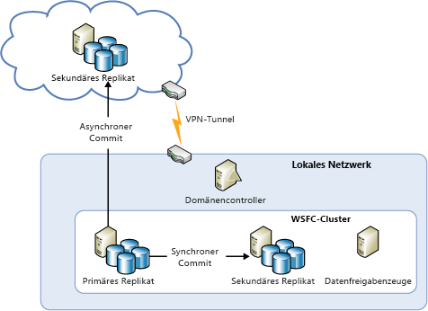
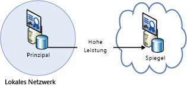
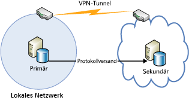
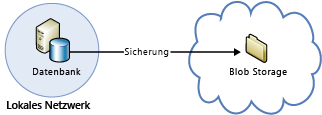

[!INCLUDE [header](../_includes/header.md)]
# Technischer Leitfaden zur Resilienz in Azure: Wiederherstellung eines lokalen Rechenzentrums in AzureAzure resiliency technical guidance: Recovery from on-premises to Azure
Azure bietet eine Reihe von Diensten, mit denen sich ein lokales Datencenter auf Azure ausweiten lässt, um hohe Verfügbarkeit und Notfallwiederherstellung zu ermöglichen:Azure provides a comprehensive set of services for enabling the extension of an on-premises datacenter to Azure for high availability and disaster recovery purposes:

* **Netzwerk**: Mit einem virtuellen privaten Netzwerk können Sie Ihr lokales Netzwerk sicher in die Cloud erweitern.**Networking**: With a virtual private network, you securely extend your on-premises network to the cloud.
* **Compute**: Kunden, die Hyper-V lokal verwenden, können vorhandene virtuelle Computer ganz einfach per „Lift&amp;amp;Shift“ nach Azure verlagern.**Compute**: Customers using Hyper-V on-premises can “lift and shift” existing virtual machines (VMs) to Azure.
* **Speicher**: StorSimple erweitert Ihr Dateisystem in Azure Storage.**Storage**: StorSimple extends your file system to Azure Storage. Der Azure Backup-Dienst ermöglicht die Sicherung von Dateien und SQL-Datenbanken in Azure Storage.The Azure Backup service provides backup for files and SQL databases to Azure Storage.
* **Datenbankreplikation**: Mit Verfügbarkeitsgruppen in SQL Server 2014 (oder höher) können Sie eine hohe Verfügbarkeit und Notfallwiederherstellung für Ihre lokalen Daten implementieren.**Database replication**: With SQL Server 2014 (or later) Availability Groups, you can implement high availability and disaster recovery for your on-premises data.

## NetzwerkNetworking
Azure Virtual Network ermöglicht die Erstellung eines logisch isolierten Bereichs in Azure, den Sie über eine IPsec-Verbindung sicher mit Ihrem lokalen Datencenter oder mit einem einzelnen Clientcomputer verbinden können.You can use Azure Virtual Network to create a logically isolated section in Azure and securely connect it to your on-premises datacenter or a single client machine by using an IPsec connection. Mit Virtual Network profitieren Sie von den Vorteilen der skalierbaren bedarfsgesteuerten Infrastruktur in Azure und können gleichzeitig eine Verbindung mit lokalen Daten und Anwendungen bereitstellen – einschließlich Systemen, die unter Windows Server, Mainframes und UNIX ausgeführt werden.With Virtual Network, you can take advantage of the scalable, on-demand infrastructure in Azure while providing connectivity to data and applications on-premises, including systems running on Windows Server, mainframes, and UNIX. Weitere Informationen finden Sie in der [Azure-Netzwerkdokumentation](/azure/virtual-network/virtual-networks-overview/) .See [Azure networking documentation](/azure/virtual-network/virtual-networks-overview/) for more information.

## ComputeCompute
Wenn Sie Hyper-V lokal verwenden, können Sie vorhandene virtuelle Computer per „Lift&Shift“ nach Azure sowie an Dienstanbieter unter Windows Server 2012 (oder höher) verlagern, ohne Änderungen am virtuellen Computer vornehmen oder Formate für virtuelle Computer konvertieren zu müssen.If you're using Hyper-V on-premises, you can “lift and shift” existing virtual machines to Azure and service providers running Windows Server 2012 (or later), without making changes to the VM or converting VM formats. Weitere Informationen finden Sie unter [Informationen zu Festplatten und VHDs für virtuelle Azure-Computer](/azure/virtual-machines/virtual-machines-linux-about-disks-vhds/?toc=%2fazure%2fvirtual-machines%2flinux%2ftoc.json).For more information, see [About disks and VHDs for Azure virtual machines](/azure/virtual-machines/virtual-machines-linux-about-disks-vhds/?toc=%2fazure%2fvirtual-machines%2flinux%2ftoc.json).

## Azure Site RecoveryAzure Site Recovery
Wenn Sie DRaaS (Disaster Recovery as a Service) einrichten möchten, nutzen Sie [Azure Site Recovery](https://azure.microsoft.com/services/site-recovery/).If you want disaster recovery as a service (DRaaS), Azure provides [Azure Site Recovery](https://azure.microsoft.com/services/site-recovery/). Azure Site Recovery bietet umfassenden Schutz für VMware-Server, Hyper-V-Server und physische Server.Azure Site Recovery offers comprehensive protection for VMware, Hyper-V, and physical servers. Mit Azure Site Recovery können Sie einen anderen lokalen Server oder Azure als Wiederherstellungsstandort nutzen.With Azure Site Recovery, you can use another on-premises server or Azure as your recovery site. Weitere Informationen zu Azure Site Recovery finden Sie in der [Dokumentation zu Azure Site Recovery](https://azure.microsoft.com/documentation/services/site-recovery/).For more information on Azure Site Recovery, see the [Azure Site Recovery documentation](https://azure.microsoft.com/documentation/services/site-recovery/).

## SpeicherStorage
Es gibt verschiedene Möglichkeiten, Azure als Sicherungsstandort für lokale Daten zu nutzen.There are several options for using Azure as a backup site for on-premises data.

### StorSimpleStorSimple
StorSimple integriert Cloudspeicher für lokale Anwendungen sicher und transparent.StorSimple securely and transparently integrates cloud storage for on-premises applications. Darüber hinaus bietet die Lösung eine einzelne Appliance mit hochleistungsfähigem, gestaffeltem Speicher (lokal und cloudbasiert), Livearchivierung, cloudbasiertem Datenschutz cloudbasierter Notfallwiederherstellung.It also offers a single appliance that delivers high-performance tiered local and cloud storage, live archiving, cloud-based data protection, and disaster recovery. Weitere Informationen finden Sie auf der [StorSimple-Produktseite](https://azure.microsoft.com/services/storsimple/).For more information, see the [StorSimple product page](https://azure.microsoft.com/services/storsimple/).

### Azure BackupAzure Backup
Azure Backup ermöglicht Cloudsicherungen mithilfe der vertrauten Tools in Windows Server 2012 (oder höher), Windows Server 2012 Essentials (oder höher) und System Center 2012 Data Protection Manager (oder höher).Azure Backup enables cloud backups by using the familiar backup tools in Windows Server 2012 (or later), Windows Server 2012 Essentials (or later), and System Center 2012 Data Protection Manager (or later). Diese Tools stellen einen Workflow für die Sicherungsverwaltung bereit, der unabhängig vom Speicherort der Sicherungen ist – egal, ob es sich um einen lokalen Datenträger oder Azure Storage handelt.These tools provide a workflow for backup management that is independent of the storage location of the backups, whether a local disk or Azure Storage. Nachdem die Daten in der Cloud gesichert wurden, können autorisierte Benutzer die Sicherungen ohne weiteres auf jedem beliebigen Server wiederherstellen.After data is backed up to the cloud, authorized users can easily recover backups to any server.

Bei inkrementellen Sicherungen werden nur Änderungen an Dateien in die Cloud übertragen.With incremental backups, only changes to files are transferred to the cloud. Dies trägt zu einer effizienten Speichernutzung bei, reduziert die Bandbreitenauslastung und unterstützt die Point-in-Time-Wiederherstellung mehrerer Datenversionen.This helps to efficiently use storage space, reduce bandwidth consumption, and support point-in-time recovery of multiple versions of the data. Sie können auch zusätzliche Funktionen nutzen, wie etwa Datenaufbewahrungsrichtlinien, Datenkomprimierung und Drosselung von Datenübertragungen.You can also choose to use additional features, such as data retention policies, data compression, and data transfer throttling. Die Verwendung von Azure als Speicherort für Sicherungen bietet den offensichtlichen Vorteil, dass die Sicherungen automatisch außerhalb des Standorts gespeichert werden.Using Azure as the backup location has the obvious advantage that the backups are automatically “offsite”. Damit entfallen zusätzliche Anforderungen zum Sichern und Schützen der lokalen Sicherungsmedien.This eliminates the extra requirements to secure and protect on-site backup media.

Weitere Informationen finden Sie unter [Was ist Azure Backup ?](/azure/backup/backup-introduction-to-azure-backup/) sowie unter [Konfigurieren von Azure Backup für DPM-Daten](https://technet.microsoft.com/library/jj728752.aspx).For more information, see [What is Azure Backup?](/azure/backup/backup-introduction-to-azure-backup/) and [Configure Azure Backup for DPM data](https://technet.microsoft.com/library/jj728752.aspx).

## DatenbankDatabase
Sie können eine Notfallwiederherstellungslösung für Ihre SQL Server-Datenbanken in einer IT-Hybridumgebung mit AlwaysOn-Verfügbarkeitsgruppen, Datenbankspiegelung, Protokollversand und Sicherung/Wiederherstellung mit Azure-Blobspeicher nutzen.You can have a disaster recovery solution for your SQL Server databases in a hybrid-IT environment by using AlwaysOn Availability Groups, database mirroring, log shipping, and backup and restore with Azure Blob storage. All diese Lösungen verwenden SQL Server auf Azure Virtual Machines.All of these solutions use SQL Server running on Azure Virtual Machines.

AlwaysOn-Verfügbarkeitsgruppen können in hybriden IT-Umgebungen verwenden werden, in denen Datenbankreplikate sowohl lokal als auch in der Cloud existieren.AlwaysOn Availability Groups can be used in a hybrid-IT environment where database replicas exist both on-premises and in the cloud. Dies wird im folgenden Diagramm veranschaulicht:This is shown in the following diagram.

Die Datenbankspiegelung kann in einer zertifikatbasierten Konfiguration auch lokale Server und die Cloud umfassen.Database mirroring can also span on-premises servers and the cloud in a certificate-based setup. Das folgende Diagramm veranschaulicht dieses Konzept.The following diagram illustrates this concept.

Der Protokollversand kann verwendet werden, um eine lokale Datenbank mit einer SQL-Server-Datenbank auf einem virtuellen Azure-Computer zu synchronisieren.Log shipping can be used to synchronize an on-premises database with a SQL Server database in an Azure virtual machine.

Und schließlich können Sie eine lokale Datenbank direkt in einem Azure-Blobspeicher sichern.Finally, you can back up an on-premises database directly to Azure Blob storage.

Weitere Informationen finden Sie unter [Hohe Verfügbarkeit und Notfallwiederherstellung für SQL Server auf virtuellen Azure-Computern](/azure/virtual-machines/windows/sql/virtual-machines-windows-sql-high-availability-dr/) und[ Sicherung und Wiederherstellung für SQL Server auf virtuellen Azure-Computern](/azure/virtual-machines/windows/sql/virtual-machines-windows-sql-backup-recovery/).For more information, see [High availability and disaster recovery for SQL Server in Azure virtual machines](/azure/virtual-machines/windows/sql/virtual-machines-windows-sql-high-availability-dr/) and [Backup and restore for SQL Server in Azure virtual machines](/azure/virtual-machines/windows/sql/virtual-machines-windows-sql-backup-recovery/).

## Prüflisten für die lokale Wiederherstellung in Microsoft AzureChecklists for on-premises recovery in Microsoft Azure
### NetzwerkNetworking
1. Lesen Sie den Netzwerkabschnitt in diesem Dokument.Review the Networking section of this document.
2. Verwenden Sie Virtual Network, um eine sichere Verbindung zwischen dem lokalen System und der Cloud herzustellen.Use Virtual Network to securely connect on-premises to the cloud.

### ComputeCompute
1. Lesen Sie den Abschnitt zu Compute in diesem Dokument.Review the Compute section of this document.
2. Verschieben Sie virtuelle Computer zwischen Hyper-V und Azure.Relocate VMs between Hyper-V and Azure.

### SpeicherStorage
1. Lesen Sie den Abschnitt zu Storage in diesem Dokument.Review the Storage section of this document.
2. Nutzen Sie StorSimple-Dienste für Cloudspeicher.Take advantage of StorSimple services for using cloud storage.
3. Verwenden Sie den Azure Backup-Dienst.Use the Azure Backup service.

### DatenbankDatabase
1. Lesen Sie den Abschnitt zur Datenbank in diesem Dokument.Review the Database section of this document.
2. Verwenden Sie ggf. SQL Server auf virtuellen Azure-Computern als Sicherung.Consider using SQL Server on Azure VMs as the backup.
3. Richten Sie AlwaysOn-Verfügbarkeitsgruppen ein.Set up AlwaysOn Availability Groups.
4. Konfigurieren Sie die zertifikatbasierte Datenbankspiegelung.Configure certificate-based database mirroring.
5. Nutzen Sie den Protokollversand.Use log shipping.
6. Sichern Sie die lokale Datenbank in einem Azure-Blobspeicher.Back up on-premises databases to Azure Blob storage.

