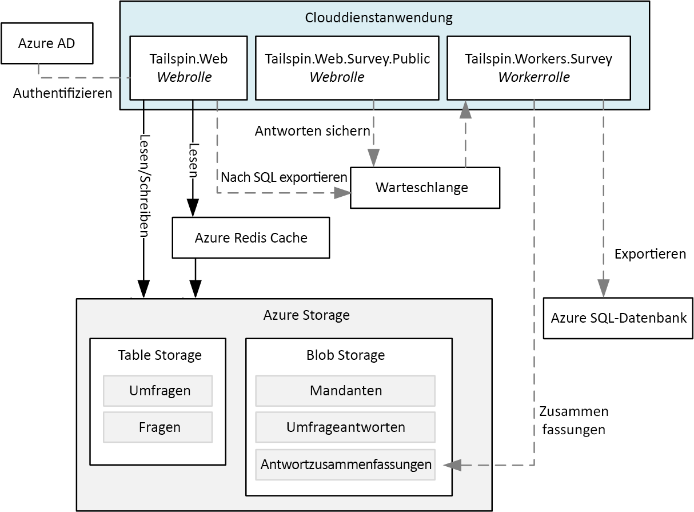
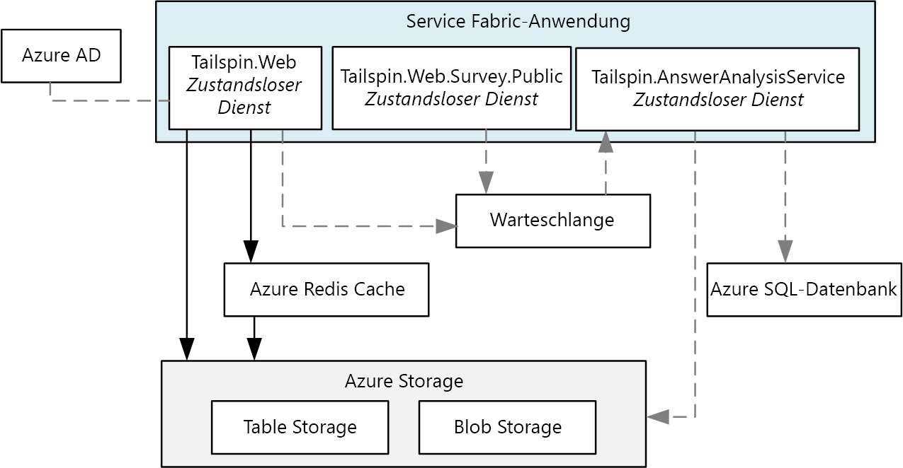
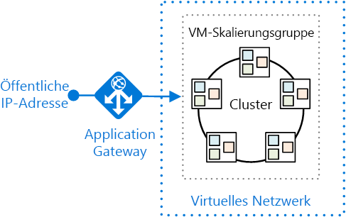
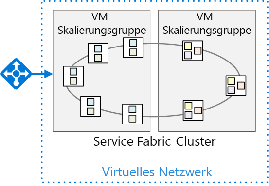

# <a name="migrate-an-azure-cloud-services-application-to-azure-service-fabric"></a>Migrieren einer Azure Cloud Services-Anwendung zu Azure Service Fabric 

[-Beispielcode][sample-code]

In diesem Artikel wird die Migration einer Anwendung von Azure Cloud Services zu Azure Service Fabric beschrieben. Er konzentriert sich auf architekturbezogene Entscheidungen und empfohlene Vorgehensweisen. 

Für dieses Projekt haben wir mit einer Cloud Services-Anwendung namens „Surveys“ begonnen und diese zu Service Fabric portiert. Ziel war es, die Anwendung mit möglichst wenigen Änderungen zu migrieren. In einem späteren Artikel werden wir die Anwendung für Service Fabric optimieren, indem wir eine Microservices-Architektur übernehmen.

Bevor Sie diesen Artikel lesen, ist es hilfreich, die Grundlagen der Service Fabric- und Microservices-Architekturen im Allgemeinen zu verstehen. Entsprechende Informationen finden Sie in den folgenden Artikeln:

- [Übersicht über Azure Service Fabric][sf-overview]
- [Gründe für einen Microservices-Ansatz zum Erstellen von Anwendungen][sf-why-microservices]


## <a name="about-the-surveys-application"></a>Informationen zur Anwendung „Surveys“

Im Jahr 2012 hat die Gruppe für Muster und Vorgehensweisen eine Anwendung namens „Surveys“ für das Buch [Developing Multi-tenant Applications for the Cloud][tailspin-book] (Entwickeln von mehrinstanzenfähigen Anwendungen für die Cloud) erstellt. Das Buch beschreibt ein fiktives Unternehmen namens „Tailspin“, das die Anwendung „Surveys“ entwirft und implementiert.

„Surveys“ ist eine mehrinstanzenfähige Anwendung, mit der Kunden Umfragen erstellen können. Nachdem sich ein Kunde für die Anwendung angemeldet hat, können Mitglieder der Organisation des Kunden Umfragen erstellen und veröffentlichen und die Ergebnisse zur Analyse sammeln. Die Anwendung enthält eine öffentliche Website, auf der die Benutzer an einer Umfrage teilnehmen können. Weitere Informationen zum ursprünglichen Tailspin-Szenario finden Sie [hier][tailspin-scenario].

Jetzt will Tailspin die Surveys-Anwendung mithilfe von Service Fabric, das unter Azure ausgeführt wird, in eine Microservices-Architektur verschieben. Da die Anwendung bereits als Cloud Services-Anwendung bereitgestellt wurde, verfolgt Tailspin einen mehrstufigen Ansatz:

1.  Portierung der Clouddienste zu Service Fabric bei gleichzeitiger Minimierung von Änderungen an der Anwendung.
2.  Optimierung der Anwendung für Service Fabric durch Umstellung auf eine Microservices-Architektur.

In diesem Artikel wird die erste Phase beschrieben. In einem späteren Artikel wird die zweite Phase beschrieben. In einem realen Projekt ist es wahrscheinlich, dass sich beide Phasen überlappen. Bei der Portierung zu Service Fabric würden Sie auch damit beginnen, die Anwendung in Mikroservices umzugestalten. Später können Sie die Architektur weiter verfeinern und umfassendere Dienste in kleinere Dienste unterteilen.  

Der Anwendungscode steht auf [GitHub][sample-code] zur Verfügung. Dieses Repository enthält sowohl die Cloud Services-Anwendung als auch die Service Fabric-Version. 

> Der Clouddienst ist eine aktualisierte Version der ursprünglichen Anwendung aus dem Buch *Developing Multi-tenant Applications* (Entwickeln von mehrinstanzenfähigen Anwendungen).

## <a name="why-microservices"></a>Gründe für die Verwendung von Microservices

Eine ausführliche Auseinandersetzung mit Mikroservices geht über den Rahmen dieses Artikels hinaus, aber hier folgen einige der Vorteile, die Tailspin durch den Umstieg auf eine Mikroservices-Architektur erzielen möchte:

- **Anwendungsupgrades**: Dienste können unabhängig voneinander bereitgestellt werden, sodass Sie einen inkrementellen Ansatz zum Ausführen von Upgrades für eine Anwendung verfolgen können.
- **Resilienz und Fehlerisolierung**: Wenn ein Dienst fehlerhaft ist, werden andere Dienste weiterhin ausgeführt.
- **Skalierbarkeit**. Die Dienste können unabhängig voneinander skaliert werden.
- **Flexibilität**: Dienste sind auf Geschäftsszenarien und nicht auf Technologiestapel ausgerichtet und erleichtern die Migration von Diensten zu neuen Technologien, Frameworks oder Datenspeichern.
- **Agile Entwicklung**: Einzelne Dienste weisen weniger Code als eine monolithische Anwendung auf, wodurch die Codebasis leichter zu verstehen, zu begründen und zu testen ist.
- **Kleine, fokussierte Teams**: Da die Anwendung in viele kleine Dienste unterteilt ist, kann jeder Dienst von einem kleinen, fokussierten Team erstellt werden.

## <a name="why-service-fabric"></a>Gründe für Service Fabric
      
Service Fabric eignet sich gut für eine Mikroservices-Architektur, da die meisten Funktionen, die in einem verteilten System benötigt werden, in Service Fabric integriert sind, einschließlich:

- **Clusterverwaltung**: Service Fabric übernimmt automatisch Knotenfailover, Integritätsüberwachung und andere Funktionen der Clusterverwaltung.
- **Horizontale Skalierung**: Wenn Sie Knoten zu einem Service Fabric-Cluster hinzufügen, wird die Anwendung automatisch skaliert, da die Dienste auf die neuen Knoten verteilt werden.
- **Dienstermittlung**: Service Fabric stellt einen Ermittlungsdienst bereit, der den Endpunkt für einen benannten Dienst auflösen kann.
- **Zustandslose und zustandsbehaftete Dienste**: Zustandsbehaftete Dienste verwenden [zuverlässige Sammlungen][sf-reliable-collections], die an die Stelle eines Cache oder einer Warteschlange treten und partitioniert werden können.
- **Anwendungslebenszyklusverwaltung**: Ein Upgrade der Dienste ist unabhängig und ohne Ausfallzeiten der Anwendungen möglich.
- **Dienstorchestrierung** für einen Cluster aus Computern.
- **Höhere Dichte** zur Optimierung des Ressourcenverbrauchs. Ein einzelner Knoten kann mehrere Dienste hosten.

Service Fabric wird von verschiedenen Microsoft-Diensten verwendet, darunter Azure SQL-Datenbank, Cosmos DB, Azure Event Hubs und andere, was es zu einer bewährten Plattform für die Erstellung verteilter Cloudanwendungen macht. 

## <a name="comparing-cloud-services-with-service-fabric"></a>Unterschiede zwischen Cloud Services und Service Fabric

In der folgenden Tabelle sind einige der wichtigsten Unterschiede zwischen Cloud Services- und Service Fabric-Anwendungen zusammengefasst. Eine ausführlichere Beschreibung finden Sie unter [Lernen Sie die Unterschiede zwischen Cloud Services und Service Fabric kennen, bevor Sie Anwendungen migrieren][sf-compare-cloud-services].

|        | Cloud Services | Service Fabric |
|--------|---------------|----------------|
| Anwendungskomposition | Rollen| Dienste |
| Dichte |Eine Rolleninstanz pro VM | Mehrere Dienste auf einem einzelnen Knoten |
| Mindestanzahl von Knoten | 2 pro Rolle | 5 pro Cluster für Produktionsbereitstellungen |
| Zustandsverwaltung | Zustandslos | Zustandslos oder zustandsbehaftet* |
| Hosting | Azure | Cloud oder lokal |
| Webhosting | IIS** | Self-Hosting |
| Bereitstellungsmodell | [Klassisches Bereitstellungsmodell][azure-deployment-models] | [Resource Manager][azure-deployment-models]  |
| Verpackung | Clouddienst-Paketdateien (.cspkg) | Anwendungs- und Dienstpakete |
| Anwendungsupdate | VIP-Austausch oder paralleles Update | Paralleles Update |
| Automatische Skalierung | [Integrierter Dienst][cloud-service-autoscale] | VM-Skalierungsgruppen für die automatische horizontale Skalierung |
| Debuggen | Lokaler Emulator | Lokaler Cluster |


\*Zustandsbehaftete Dienste verwenden [zuverlässige Sammlungen][sf-reliable-collections], um den Zustand replikatübergreifend zu speichern, damit alle Lesezugriffe lokal zu den Knoten im Cluster erfolgen. Schreibzugriffe werden aus Zuverlässigkeitsgründen knotenübergreifend repliziert. Zustandslose Dienste können einen externen Zustand aufweisen, indem sie eine Datenbank oder einen anderen externen Speicher verwenden.

** Workerrollen können die ASP.NET-Web-API mithilfe von OWIN auch selbst hosten.

## <a name="the-surveys-application-on-cloud-services"></a>Die Anwendung „Surveys“ unter Cloud Services

Das folgende Diagramm zeigt die Architektur der Surveys-Anwendung, die unter Cloud Services ausgeführt wird. 



Die Anwendung besteht aus zwei Webrollen und einer Workerrolle.

- Die Webrolle **Tailspin.Web** hostet eine ASP.NET-Website, die Tailspin-Kunden zum Erstellen und Verwalten von Umfragen verwenden. Kunden können sich auch über diese Website für die Anwendung registrieren und ihre Abonnements verwalten. Schließlich können Tailspin-Administratoren damit die Liste der Mandanten anzeigen und die Mandantendaten verwalten. 

- Die Webrolle **Tailspin.Web.Survey.Public** hostet eine ASP.NET-Website, auf der die Teilnehmer an den Umfragen teilnehmen können, die Tailspin-Kunden veröffentlichen. 

- Die Workerrolle **Tailspin.Workers.Survey** führt die Hintergrundverarbeitung durch. Die Webrollen stellen Arbeitsaufgaben in eine Warteschlange, und die Workerrolle verarbeitet die Arbeitsaufgaben. Zwei Hintergrundaufgaben sind definiert: Exportieren von Umfrageantworten in die Azure SQL-Datenbank und Berechnen von Statistiken für Umfrageantworten.

Zusätzlich zu den Cloud Services verwendet die Surveys-Anwendung einige andere Azure-Dienste:

- **Azure Storage**, um Umfragen, Umfrageantworten und Mandanteninformationen zu speichern.

- **Azure Redis Cache**, um einige der Daten, die in Azure Storage gespeichert werden, für einen schnelleren Lesezugriff zwischenzuspeichern. 

- **Azure Active Directory** (Azure AD), um Kunden und Tailspin-Administratoren zu authentifizieren.

- **Azure SQL-Datenbank**, um Umfrageantworten für die Analyse zu speichern. 

## <a name="moving-to-service-fabric"></a>Wechsel zu Service Fabric

Wie bereits erwähnt, war das Ziel dieser Phase die Migration zu Service Fabric mit den minimal notwendigen Änderungen. Zu diesem Zweck haben wir zustandslose Dienste erstellt, die den einzelnen Clouddienstrollen in der ursprünglichen Anwendung entsprechen:



Diese Architektur ist der ursprünglichen Anwendung bewusst sehr ähnlich. Das Diagramm blendet jedoch einige wichtige Unterschiede aus. Im Rest dieses Artikels werden wir diese Unterschiede untersuchen. 


## <a name="converting-the-cloud-service-roles-to-services"></a>Konvertieren von Clouddienstrollen in Dienste

Wie bereits erwähnt, haben wir jede Clouddienstrolle zu einem Service Fabric-Dienst migriert. Da Clouddienstrollen zustandslos sind, war es in dieser Phase sinnvoll, zustandslose Dienste in Service Fabric zu erstellen. 

Für die Migration haben wir die Schritte befolgt, die im Abschnitt [Anleitung zur Konvertierung von Web- und Workerrollen in zustandslose Service Fabric-Dienste][sf-migration] aufgeführt sind. 

### <a name="creating-the-web-front-end-services"></a>Erstellen der Web-Front-End-Dienste

In Service Fabric wird ein Dienst innerhalb eines Prozesses ausgeführt, der von der Service Fabric-Laufzeit erstellt wurde. Für ein Web-Front-End bedeutet dies, dass der Dienst nicht innerhalb von IIS ausgeführt wird. Stattdessen muss der Dienst einen Webserver hosten. Dieser Ansatz wird *Self-Hosting* genannt, da der Code, der innerhalb des Prozesses aufgeführt wird, als Webserverhost fungiert. 

Die Anforderung zum Self-Hosting bedeutet, dass ein Service Fabric-Dienst keine ASP.NET MVC- oder ASP.NET-Web Forms verwenden kann, da diese Frameworks IIS erfordern und Self-Hosting nicht unterstützen. Zu den Optionen für das Self-Hosting zählen:

- [ASP.NET Core][aspnet-core], mit dem [Kestrel][kestrel]-Webserver selbstgehostet. 
- [ASP.NET Web API][aspnet-webapi], mithilfe von [OWIN][owin] selbstgehostet.
- Frameworks von Drittanbietern wie [Nancy](http://nancyfx.org/).

Die ursprüngliche Surveys-Anwendung verwendet ASP.NET MVC. Da ASP.NET MVC in Service Fabric nicht selbstgehostet werden kann, haben wir die folgenden Migrationsoptionen in Betracht gezogen:

- Portieren Sie die Webrollen zu ASP. NET Core, das selbstgehostet werden kann.
- Konvertieren Sie die Website in eine einseitige Anwendung (SPA), die eine Web-API aufruft, die mit der ASP.NET-Web-API implementiert wurde. Dies hätte eine komplette Neugestaltung des Web-Front-Ends erforderlich gemacht.
- Behalten Sie den vorhandenen ASP.NET MVC-Code bei, und stellen Sie IIS in einem Windows Server-Container für Service Fabric bereit. Dieser Ansatz würde nur eine geringe oder gar keine Codeänderung erfordern. Die [Containerunterstützung][sf-containers] in Service Fabric befindet sich derzeit jedoch noch in der Vorschauversion.

Auf der Grundlage dieser Überlegungen haben wir uns für die erste Option entschieden, die Portierung zu ASP.NET Core. Dazu haben wir die Schritte befolgt, die in [Migrieren von ASP.NET MVC zu ASP.NET Core MVC][aspnet-migration] beschrieben sind. 

> [!NOTE]
> Wenn Sie ASP.NET Core mit Kestrel verwenden, sollten Sie aus Sicherheitsgründen einen Reverseproxy vor Kestrel platzieren, um den Datenverkehr aus dem Internet zu verarbeiten. Weitere Informationen finden Sie unter [Einführung in die Kestrel-Webserverimplementierung in ASP.NET Core][kestrel]. Der Abschnitt [Bereitstellen der Anwendung](#deploying-the-application) beschreibt eine empfohlene Azure-Bereitstellung.

### <a name="http-listeners"></a>HTTP-Listener

In Cloud Services macht eine Web- oder Workerrolle einen HTTP-Endpunkt verfügbar, indem dieser in der [Dienstdefinitionsdatei][cloud-service-endpoints] deklariert wird. Eine Webrolle muss über mindestens einen Endpunkt verfügen.

```xml
<!-- Cloud service endpoint -->
<Endpoints>
    <InputEndpoint name="HttpIn" protocol="http" port="80" />
</Endpoints>
```

Auf ähnliche Weise werden Service Fabric-Endpunkte in einem Dienstmanifest deklariert: 

```xml
<!-- Service Fabric endpoint -->
<Endpoints>
    <Endpoint Protocol="http" Name="ServiceEndpoint" Type="Input" Port="8002" />
</Endpoints>
```

Im Gegensatz zu einer Clouddienstrolle können Service Fabric-Dienste jedoch innerhalb desselben Knotens gemeinsam platziert werden. Aus diesem Grund muss jeder Dienst an einem eindeutigen Port lauschen. Später in diesem Artikel werden wir besprechen, wie Clientanforderungen an Port 80 oder Port 443 zum richtigen Port für den Dienst weitergeleitet werden.

Ein Dienst muss für jeden Endpunkt explizit Listener erstellen. Der Grund dafür ist, dass Service Fabric sich nicht mit Kommunikationsstapeln auseinandersetzt. Weitere Informationen finden Sie unter [Erstellen eines Webdienst-Front-Ends für Ihre Anwendung mithilfe von ASP.NET Core][sf-aspnet-core].

## <a name="packaging-and-configuration"></a>Verpackung und Konfiguration

 Ein Clouddienst enthält die folgenden Konfigurations- und Paketdateien:

| Datei | Beschreibung |
|------|-------------|
| Dienstdefinitionsdatei (.csdef) | Einstellungen, die von Azure verwendet werden, um den Clouddienst zu konfigurieren. Definiert die Rollen, Endpunkte, Startaufgaben und die Namen von Konfigurationseinstellungen. |
| Dienstkonfigurationsschema (.cscfg) | Bereitstellungsabhängige Einstellungen, einschließlich der Anzahl der Rolleninstanzen, der Portnummern der Endpunkte und der Werte der Konfigurationseinstellungen. 
| Dienstpaket (.cspkg) | Enthält den Anwendungscode, die Konfigurationen und die Dienstdefinitionsdatei.  |

Es gibt eine CSDEF-Datei für die gesamte Anwendung. Sie können mehrere CSCFG-Dateien für verschiedene Umgebungen verwenden, z. B. „Lokal“, „Test“ oder „Produktion“. Wenn der Dienst ausgeführt wird, können Sie die CSCFG-Datei aktualisieren, aber nicht die CSDEF-Datei. Weitere Informationen finden Sie unter [Was ist das Clouddienstmodell, und wie kann es gepackt werden?][cloud-service-config]

Service Fabric weist eine ähnliche Trennung von *Dienstdefinition* und *Diensteinstellungen* auf, aber die Struktur ist differenzierter. Um das Konfigurationsmodell von Service Fabric zu verstehen, ist es hilfreich zu erkennen, wie eine Service Fabric-Anwendung verpackt ist. Folgende Struktur wird verwendet:

```
Application package
  - Service packages
    - Code package
    - Configuration package
    - Data package (optional)
```

Das Anwendungspaket ist das, was Sie bereitstellen. Es enthält mindestens ein Dienstpaket. Ein Dienstpaket enthält Code-, Konfigurations- und Datenpakete. Das Codepaket enthält die Binärdateien für die Dienste, während das Konfigurationspaket die Konfigurationseinstellungen enthält. Dieses Modell gestattet es Ihnen, einzelne Dienste zu aktualisieren, ohne die gesamte Anwendung erneut bereitzustellen. Außerdem können Sie nur die Konfigurationseinstellungen aktualisieren, ohne den Code erneut bereitzustellen oder den Dienst erneut zu starten.

Eine Service Fabric-Anwendung enthält die folgenden Konfigurationsdateien:

| Datei | Standort | Beschreibung |
|------|----------|-------------|
| ApplicationManifest.xml | Anwendungspaket | Definiert die Dienste, aus denen sich die Anwendung zusammensetzt. |
| ServiceManifest.xml | Dienstpaket| Beschreibt mindestens einen Dienst. |
| Settings.xml | Konfigurationspaket | Enthält Konfigurationseinstellungen für die Dienste, die im Dienstpaket definiert sind. |

Weitere Informationen finden Sie unter [Modellieren einer Anwendung in Service Fabric][sf-application-model].

Wenn Sie verschiedene Konfigurationseinstellungen für mehrere Umgebungen unterstützen möchten, verwenden Sie den folgenden Ansatz, der in [Verwalten von Anwendungsparametern für mehrere Umgebungen][sf-multiple-environments] beschrieben ist:

1. Definieren Sie die Einstellung in der Datei „Setting.xml“ für den Dienst.
2. Definieren Sie im Anwendungsmanifest eine Außerkraftsetzung für die Einstellung.
3. Stellen Sie umgebungsspezifische Einstellungen in Anwendungsparameterdateien.


## <a name="deploying-the-application"></a>Bereitstellen der Anwendung

Während Azure Cloud Services ein verwalteter Dienst ist, handelt es sich bei Service Fabric um eine Laufzeit. Sie können Service Fabric-Cluster in vielen Umgebungen erstellen, einschließlich Azure und lokal. In diesem Artikel konzentrieren wir uns auf die Bereitstellung für Azure. 

Das folgende Diagramm zeigt eine empfohlene Bereitstellung:



Der Service Fabric-Cluster wird in einer [VM-Skalierungsgruppe][vm-scale-sets] bereitgestellt. Skalierungsgruppen sind eine Azure-Computeressource, mit der Sie eine Gruppe von identischen virtuellen Computern bereitstellen und verwalten können. 

Wie bereits erwähnt, benötigt der Kestrel-Webserver aus Sicherheitsgründen einen Reverseproxy. Dieses Diagramm zeigt [Azure Application Gateway][application-gateway], ein Azure-Dienst, der verschiedene Layer 7-Lastausgleichsfunktionen bietet. Er fungiert als Reverseproxydienst, beendet die Clientverbindung und leitet Anforderungen an Back-End-Endpunkte weiter. Möglicherweise verwenden Sie eine andere Reverseproxylösung wie nginx.  

### <a name="layer-7-routing"></a>Layer 7-Routing

In der ursprünglichen [Survey-Anwendung](https://msdn.microsoft.com/en-us/library/hh534477.aspx#sec21) lauschte eine Webrolle an Port 80 und die andere Webrolle an Port 443. 

| Öffentliche Website | Umfrageverwaltungswebsite |
|-------------|------------------------|
| `http://tailspin.cloudapp.net` | `https://tailspin.cloudapp.net` |

Eine andere Möglichkeit besteht darin, das Layer 7-Routing zu verwenden. Bei diesem Ansatz werden unterschiedliche URL-Pfade zu unterschiedlichen Portnummern am Back-End weitergeleitet. Die öffentliche Website kann z. B. URL-Pfade verwenden, die mit `/public/` beginnen. 

Folgende Optionen zählen zum Layer 7-Routing:

- Die Verwendung von Application Gateway. 

- Die Verwendung eines virtuellen Netzwerkgeräts wie nginx.

- Das Schreiben eines benutzerdefinierten Gateways als zustandsloser Dienst.

Betrachten Sie diesen Ansatz, wenn Sie über zwei oder mehr Dienste mit öffentlichen HTTP-Endpunkten verfügen, diese aber als einzelne Website mit einem einzigen Domänennamen angezeigt werden sollen.

> Ein Ansatz, der *nicht* empfohlen wird, besteht darin, externen Clients das Senden von Anforderungen über den [Reverseproxy][sf-reverse-proxy] von Service Fabric zu gestatten. Obwohl dies möglich ist, ist der Reverseproxy für die Kommunikation zwischen Diensten vorgesehen. Wenn Sie ihn für externe Clients öffnen, wird *jeder* im Cluster aktive Dienst sichtbar, der über einen HTTP-Endpunkt verfügt.

### <a name="node-types-and-placement-constraints"></a>Knotentypen und Platzierungseinschränkungen

In der oben gezeigten Bereitstellung werden alle Dienste auf allen Knoten ausgeführt. Sie können jedoch auch Dienste gruppieren, sodass bestimmte Dienste nur auf gewissen Knoten innerhalb des Clusters ausgeführt werden. Gründe für die Verwendung dieses Ansatzes:

- Es werden einige Dienste auf verschiedenen Arten von virtuellen Computern ausgeführt. Einige Dienste sind möglicherweise rechenintensiv oder erfordern GPUs. Sie können eine Mischung aus verschiedenen Arten von virtuellen Computern in Ihrem Service Fabric-Cluster verwenden.
- Isolieren Sie die Front-End-Dienste aus Sicherheitsgründen von den Back-End-Diensten. Alle Front-End-Dienste werden auf einer Gruppe von Knoten ausgeführt, während die Back-End-Dienste auf anderen Knoten im selben Cluster ausgeführt werden.
- Es liegen unterschiedliche Skalierungsanforderungen vor. Einige Dienste müssen möglicherweise auf einer größeren Anzahl von Knoten als andere Dienste ausgeführt werden. Wenn Sie Front-End- und Back-End-Knoten definieren, kann jede Gruppe unabhängig skaliert werden.

Das folgende Diagramm zeigt einen Cluster mit getrennten Front-End- und Back-End-Diensten:



So implementieren Sie diesen Ansatz

1.  Definieren Sie beim Erstellen des Clusters mindestens zwei Knotentypen. 
2.  Verwenden Sie für jeden Dienst [Platzierungseinschränkungen][sf-placement-constraints], um den Dienst einem Knotentyp zuzuweisen.

Bei der Bereitstellung in Azure wird jeder Knotentyp in einer separaten VM-Skalierungsgruppe bereitgestellt. Der Service Fabric-Cluster umfasst alle Knotentypen. Weitere Informationen finden Sie unter [Die Beziehung zwischen Service Fabric-Knotentypen und VM-Skalierungsgruppen][sf-node-types].

> Wenn ein Cluster über mehrere Knotentypen verfügt, wird ein Knotentyp als *primärer* Knotentyp bestimmt. Service Fabric-Laufzeitdienste wie der Clusterverwaltungsdienst werden auf dem primären Knotentyp ausgeführt. Stellen Sie mindestens fünf Knoten für den primären Knotentyp in einer Produktionsumgebung bereit. Der andere Knotentyp sollte mindestens zwei Knoten umfassen.

## <a name="configuring-and-managing-the-cluster"></a>Konfigurieren und Verwalten des Clusters

Cluster müssen gesichert werden, um zu verhindern, dass sich nicht autorisierte Benutzer mit Ihrem Cluster verbinden. Es wird empfohlen, Azure AD für die Authentifizierung von Clients und X.509-Zertifikate für die Knoten-zu-Knoten-Sicherheit zu verwenden. Weitere Informationen finden Sie unter [Szenarien für die Clustersicherheit in Service Fabric][sf-security].

Informationen zum Konfigurieren eines öffentlichen HTTPS-Endpunkts finden Sie unter [Angeben von Ressourcen in einem Dienstmanifest][sf-manifest-resources].

Sie können die Anwendung horizontal hochskalieren, indem Sie dem Cluster virtuelle Computer hinzufügen. VM-Skalierungsgruppen unterstützen die automatische Skalierung mithilfe automatischer Skalierungsregeln auf Grundlage von Leistungsindikatoren. Weitere Informationen finden Sie unter [Zentrales Hoch- oder Herunterskalieren eines Service Fabric-Clusters mithilfe von Regeln für die automatische Skalierung][sf-auto-scale].

Während der Cluster aktiv ist, sollten Sie Protokolle von allen Knoten an einem zentralen Speicherort sammeln. Weitere Informationen finden Sie unter [Sammeln von Protokollen mit der Azure-Diagnose][sf-logs].   


## <a name="conclusion"></a>Zusammenfassung

Das Portieren der Survey-Anwendung zu Service Fabric hat sich als recht einfach erwiesen. Zusammengefasst haben wir die folgenden Schritte ausgeführt:

- Die Rollen in zustandslose Dienste konvertiert.
- Die Web-Front-Ends in ASP.NET Core konvertiert.
- Die Verpackungs- und Konfigurationsdateien auf das Service Fabric-Modell angepasst.

Darüber hinaus wurde die Bereitstellung von Cloud Services in einen Service Fabric-Cluster geändert, der in einer VM-Skalierungsgruppe ausgeführt wird.

An dieser Stelle profitiert die Anwendung jedoch nicht von allen Vorteilen der Mikroservices, z. B. von der unabhängigen Bereitstellung und Versionsverwaltung von Diensten. Damit Service Fabric optimal genutzt werden kann, muss Tailspin ebenfalls weiter optimiert werden.


<!-- links -->

[application-gateway]: /azure/application-gateway/
[aspnet-core]: /aspnet/core/
[aspnet-webapi]: https://www.asp.net/web-api
[aspnet-migration]: /aspnet/core/migration/mvc
[aspnet-hosting]: /aspnet/core/fundamentals/hosting
[aspnet-webapi]: https://www.asp.net/web-api
[azure-deployment-models]: /azure/azure-resource-manager/resource-manager-deployment-model
[cloud-service-autoscale]: /azure/cloud-services/cloud-services-how-to-scale-portal
[cloud-service-config]: /azure/cloud-services/cloud-services-model-and-package
[cloud-service-endpoints]: /azure/cloud-services/cloud-services-enable-communication-role-instances#worker-roles-vs-web-roles
[kestrel]: https://docs.microsoft.com/aspnet/core/fundamentals/servers/kestrel
[lb-probes]: /azure/load-balancer/load-balancer-custom-probe-overview
[owin]: https://www.asp.net/aspnet/overview/owin-and-katana
[sample-code]: https://github.com/mspnp/cloud-services-to-service-fabric
[sf-application-model]: /azure/service-fabric/service-fabric-application-model
[sf-aspnet-core]: /azure/service-fabric/service-fabric-add-a-web-frontend
[sf-auto-scale]: /azure/service-fabric/service-fabric-cluster-scale-up-down
[sf-compare-cloud-services]: /azure/service-fabric/service-fabric-cloud-services-migration-differences
[sf-connect-and-communicate]: /azure/service-fabric/service-fabric-connect-and-communicate-with-services
[sf-containers]: /azure/service-fabric/service-fabric-containers-overview
[sf-logs]: /azure/service-fabric/service-fabric-diagnostics-how-to-setup-wad
[sf-manifest-resources]: /azure/service-fabric/service-fabric-service-manifest-resources
[sf-migration]: /azure/service-fabric/service-fabric-cloud-services-migration-worker-role-stateless-service
[sf-multiple-environments]: /azure/service-fabric/service-fabric-manage-multiple-environment-app-configuration
[sf-node-types]: /azure/service-fabric/service-fabric-cluster-nodetypes
[sf-overview]: /azure/service-fabric/service-fabric-overview
[sf-placement-constraints]: /azure/service-fabric/service-fabric-cluster-resource-manager-cluster-description
[sf-reliable-collections]: /azure/service-fabric/service-fabric-reliable-services-reliable-collections
[sf-reliable-services]: /azure/service-fabric/service-fabric-reliable-services-introduction
[sf-reverse-proxy]: /azure/service-fabric/service-fabric-reverseproxy
[sf-security]: /azure/service-fabric/service-fabric-cluster-security
[sf-why-microservices]: /azure/service-fabric/service-fabric-overview-microservices
[tailspin-book]: https://msdn.microsoft.com/en-us/library/ff966499.aspx
[tailspin-scenario]: https://msdn.microsoft.com/en-us/library/hh534482.aspx
[unity]: https://msdn.microsoft.com/en-us/library/ff647202.aspx
[vm-scale-sets]: /azure/virtual-machine-scale-sets/virtual-machine-scale-sets-overview
