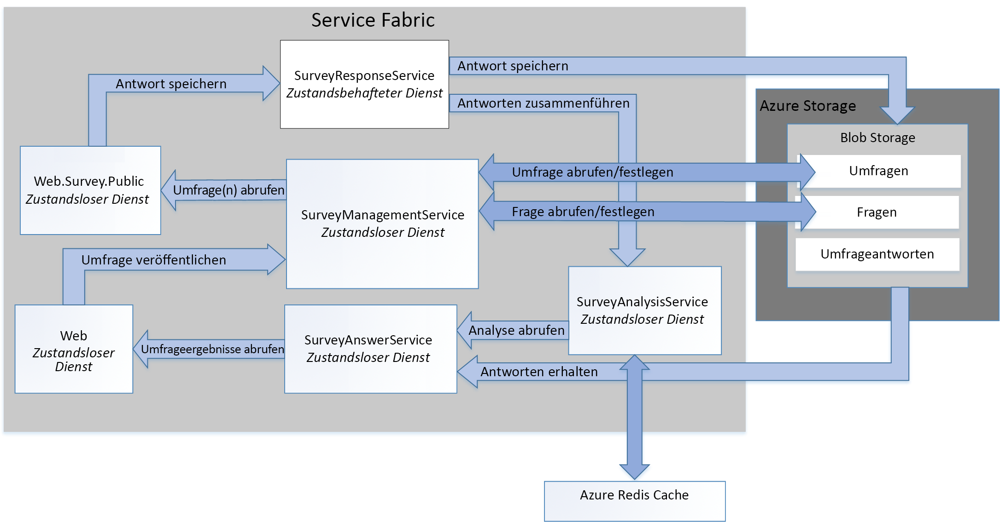

# <a name="refactor-an-azure-service-fabric-application-migrated-from-azure-cloud-services"></a><span data-ttu-id="dd8db-103">Umgestalten einer Azure Service Fabric-Anwendung, die von Azure Cloud Services migriert wurde</span><span class="sxs-lookup"><span data-stu-id="dd8db-103">Refactor an Azure Service Fabric Application migrated from Azure Cloud Services</span></span>

<span data-ttu-id="dd8db-104">[-Beispielcode][sample-code]</span><span class="sxs-lookup"><span data-stu-id="dd8db-104">[ Sample code][sample-code]</span></span>

<span data-ttu-id="dd8db-105">In diesem Artikel erfahren Sie, wie Sie eine vorhandene Azure Service Fabric-Anwendung umgestalten, um ihr zu einer detaillierteren Architektur zu verhelfen.</span><span class="sxs-lookup"><span data-stu-id="dd8db-105">This article describes refactoring an existing Azure Service Fabric application to a more granular architecture.</span></span> <span data-ttu-id="dd8db-106">Der Artikel konzentriert sich auf Gestaltungs-, Paket-, Leistungs- und Bereitstellungsaspekte der umgestalteten Service Fabric-Anwendung.</span><span class="sxs-lookup"><span data-stu-id="dd8db-106">This article focuses on the design, packaging, performance, and deployment considerations of the refactored Service Fabric application.</span></span>

## <a name="scenario"></a><span data-ttu-id="dd8db-107">Szenario</span><span class="sxs-lookup"><span data-stu-id="dd8db-107">Scenario</span></span>

<span data-ttu-id="dd8db-108">Wie im Artikel [Migrieren einer Azure Cloud Services-Anwendung zu Azure Service Fabric][migrate-from-cloud-services] bereits erwähnt, hat das Team für Muster und Vorgehensweisen im Jahr 2012 ein Buch über die Entwicklung und Implementierung einer Cloud Services-Anwendung in Azure geschrieben.</span><span class="sxs-lookup"><span data-stu-id="dd8db-108">As discussed in the previous article, [Migrating an Azure Cloud Services application to Azure Service Fabric][migrate-from-cloud-services], the patterns & practices team authored a book in 2012 that documented the process for designing and implementing a Cloud Services application in Azure.</span></span> <span data-ttu-id="dd8db-109">Das Buch beschreibt ein fiktives Unternehmen namens Tailspin, das eine Cloud Services-Anwendung namens **Surveys** entwerfen und implementieren möchte.</span><span class="sxs-lookup"><span data-stu-id="dd8db-109">The book describes a fictitious company named Tailspin that wants to create a Cloud Services application named **Surveys**.</span></span> <span data-ttu-id="dd8db-110">Mit der Anwendung „Surveys“ können Benutzer öffentliche Umfragen erstellen und veröffentlichen.</span><span class="sxs-lookup"><span data-stu-id="dd8db-110">The Surveys application allows users to create and publish surveys that can be answered by the public.</span></span> <span data-ttu-id="dd8db-111">Das folgende Diagramm zeigt die Architektur dieser Version der Anwendung:</span><span class="sxs-lookup"><span data-stu-id="dd8db-111">The following diagram shows the architecture of this version of the Surveys application:</span></span>


<span data-ttu-id="dd8db-112">Die Webrolle **Tailspin.Web** hostet eine ASP.NET-MVC-Website, die Tailspin-Kunden für Folgendes verwenden:</span><span class="sxs-lookup"><span data-stu-id="dd8db-112">The **Tailspin.Web** web role hosts an ASP.NET MVC site that Tailspin customers use to:</span></span>
* <span data-ttu-id="dd8db-113">Registrieren bei der Anwendung „Surveys“</span><span class="sxs-lookup"><span data-stu-id="dd8db-113">sign up for the Surveys application,</span></span>
* <span data-ttu-id="dd8db-114">Erstellen oder Löschen einer einzelnen Umfrage</span><span class="sxs-lookup"><span data-stu-id="dd8db-114">create or delete a single survey,</span></span>
* <span data-ttu-id="dd8db-115">Anzeigen der Ergebnisse für eine einzelne Umfrage</span><span class="sxs-lookup"><span data-stu-id="dd8db-115">view results for a single survey,</span></span>
* <span data-ttu-id="dd8db-116">Anfordern des Exports der Umfrageergebnisse in SQL</span><span class="sxs-lookup"><span data-stu-id="dd8db-116">request that survey results be exported to SQL, and</span></span>
* <span data-ttu-id="dd8db-117">Anzeigen aggregierter Umfrageergebnisse und Analysen</span><span class="sxs-lookup"><span data-stu-id="dd8db-117">view aggregated survey results and analysis.</span></span>

<span data-ttu-id="dd8db-118">Die Webrolle **Tailspin.Web.Survey.Public** hostet zudem eine ASP.NET-MVC-Website, auf der Besucher die Umfragen beantworten.</span><span class="sxs-lookup"><span data-stu-id="dd8db-118">The **Tailspin.Web.Survey.Public** web role also hosts an ASP.NET MVC site that the public visits to fill out the surveys.</span></span> <span data-ttu-id="dd8db-119">Die Antworten werden zur Speicherung einer Warteschlange hinzugefügt.</span><span class="sxs-lookup"><span data-stu-id="dd8db-119">These responses are put in a queue to be saved.</span></span>

<span data-ttu-id="dd8db-120">Die Workerrolle **Tailspin.Workers.Survey** führt die Hintergrundverarbeitung durch und greift dazu Anforderungen aus verschiedenen Warteschlangen auf.</span><span class="sxs-lookup"><span data-stu-id="dd8db-120">The **Tailspin.Workers.Survey** worker role performs background processing by picking up requests from multiple queues.</span></span>

<span data-ttu-id="dd8db-121">Als Nächstes hat das Team für Muster und Vorgehensweisen ein neues Projekt erstellt, um diese Anwendung in Azure Service Fabric zu überführen.</span><span class="sxs-lookup"><span data-stu-id="dd8db-121">The patterns & practices team then created a new project to port this application to Azure Service Fabric.</span></span> <span data-ttu-id="dd8db-122">Ziel dieses Projekts war es, nur Codeänderungen vorzunehmen, die für die Ausführung der Anwendung in einem Azure Service Fabric-Cluster erforderlich sind.</span><span class="sxs-lookup"><span data-stu-id="dd8db-122">The goal of this project was to make only the necessary code changes to get the application running in an Azure Service Fabric cluster.</span></span> <span data-ttu-id="dd8db-123">Die ursprünglichen Web- und Workerrollen wurden daher nicht in eine detailliertere Architektur aufgegliedert.</span><span class="sxs-lookup"><span data-stu-id="dd8db-123">As a result, the original web and worker roles were not decomposed into a more granular architecture.</span></span> <span data-ttu-id="dd8db-124">Die resultierende Architektur ähnelt sehr stark der Clouddienstversion der Anwendung:</span><span class="sxs-lookup"><span data-stu-id="dd8db-124">The resulting architecture is very similar to the Cloud Service version of the application:</span></span>


<span data-ttu-id="dd8db-125">Der Dienst **Tailspin.Web** wird aus der ursprünglichen Webrolle *Tailspin.Web* portiert.</span><span class="sxs-lookup"><span data-stu-id="dd8db-125">The **Tailspin.Web** service is ported from the original *Tailspin.Web* web role.</span></span>

<span data-ttu-id="dd8db-126">Der Dienst **Tailspin.Web.Survey.Public** wird aus der ursprünglichen Webrolle *Tailspin.Web.Survey.Public* portiert.</span><span class="sxs-lookup"><span data-stu-id="dd8db-126">The **Tailspin.Web.Survey.Public** service is ported from the original *Tailspin.Web.Survey.Public* web role.</span></span>

<span data-ttu-id="dd8db-127">Der Dienst **Tailspin.AnswerAnalysisService** wird aus der ursprünglichen Webrolle *Tailspin.Workers.Survey* portiert.</span><span class="sxs-lookup"><span data-stu-id="dd8db-127">The **Tailspin.AnswerAnalysisService** service is ported from the original *Tailspin.Workers.Survey* worker role.</span></span>

> [!NOTE] 
> <span data-ttu-id="dd8db-128">Der Code der einzelnen Web- und Workerrollen wurde jeweils nur geringfügig geändert, **Tailspin.Web** und **Tailspin.Web.Survey.Public** wurden allerdings für das Selbsthosting eines Webservers vom Typ [Kestrel] angepasst.</span><span class="sxs-lookup"><span data-stu-id="dd8db-128">While minimal code changes were made to each of the web and worker roles, **Tailspin.Web** and **Tailspin.Web.Survey.Public** were modified to self-host a [Kestrel] web server.</span></span> <span data-ttu-id="dd8db-129">Bei der früheren Version der Anwendung „Surveys“ handelt es sich um eine ASP.NET-Anwendung, die mit Internet Information Services (IIS) gehostet wurde. IIS kann jedoch nicht als Dienst in Service Fabric ausgeführt werden.</span><span class="sxs-lookup"><span data-stu-id="dd8db-129">The earlier Surveys application is an ASP.Net application that was hosted using Interet Information Services (IIS), but it is not possible to run IIS as a service in Service Fabric.</span></span> <span data-ttu-id="dd8db-130">Daher muss jeder Webserver selbsthostingfähig sein (wie etwa [Kestrel]).</span><span class="sxs-lookup"><span data-stu-id="dd8db-130">Therefore, any web server must be capable of being self-hosted, such as [Kestrel].</span></span> <span data-ttu-id="dd8db-131">In bestimmten Situationen kann IIS in einem Container in Service Fabric ausgeführt werden.</span><span class="sxs-lookup"><span data-stu-id="dd8db-131">It is possible to run IIS in a container in Service Fabric in some situations.</span></span> <span data-ttu-id="dd8db-132">Weitere Informationen finden Sie unter [Szenarien für die Verwendung von Containern][container-scenarios].</span><span class="sxs-lookup"><span data-stu-id="dd8db-132">See [scenarios for using containers][container-scenarios] for more information.</span></span>  

<span data-ttu-id="dd8db-133">Nun gestaltet Tailspin die Anwendung „Surveys“ zu einer detaillierten Architektur um.</span><span class="sxs-lookup"><span data-stu-id="dd8db-133">Now, Tailspin is refactoring the Surveys application to a more granular architecture.</span></span> <span data-ttu-id="dd8db-134">Ziel dieser Umgestaltung ist es, die Entwicklung, Erstellung und Bereitstellung der Anwendung zu vereinfachen.</span><span class="sxs-lookup"><span data-stu-id="dd8db-134">Tailspin's motivation for refactoring is to make it easier to develop, build, and deploy the Surveys application.</span></span> <span data-ttu-id="dd8db-135">Durch die Aufgliederung der vorhandenen Web- und Workerrollen in eine detailliertere Architektur möchte Tailspin die enge Kopplung der Kommunikations- und Datenabhängigkeiten zwischen diesen Rollen beseitigen.</span><span class="sxs-lookup"><span data-stu-id="dd8db-135">By decomposing the existing web and worker roles to a more granular architecture, Tailspin wants to remove the existing tightly coupled communication and data dependencies between these roles.</span></span>

<span data-ttu-id="dd8db-136">Außerdem erwartet sich Tailspin folgende Vorteile von der Migration der Anwendung „Surveys“ zu einer detaillierten Architektur:</span><span class="sxs-lookup"><span data-stu-id="dd8db-136">Tailspin sees other benefits in moving the Surveys application to a more granular architecture:</span></span>
* <span data-ttu-id="dd8db-137">Jeder Dienst kann in unabhängigen Projekten mit einem Umfang verpackt werden, der problemlos von einem kleinen Team verwaltet werden kann.</span><span class="sxs-lookup"><span data-stu-id="dd8db-137">Each service can be packaged into independent projects with a scope small enough to be managed by a small team.</span></span>
* <span data-ttu-id="dd8db-138">Jeder Dienst kann unabhängig versioniert und bereitgestellt werden.</span><span class="sxs-lookup"><span data-stu-id="dd8db-138">Each service can be independently versioned and deployed.</span></span>
* <span data-ttu-id="dd8db-139">Jeder Dienst kann mit der optimalen Technologie für den jeweiligen Dienst implementiert werden.</span><span class="sxs-lookup"><span data-stu-id="dd8db-139">Each service can be implemented using the best technology for that service.</span></span> <span data-ttu-id="dd8db-140">Ein Service Fabric-Cluster kann beispielsweise Dienste enthalten, die mit verschiedenen .NET Framework-Versionen, mit Java oder mit anderen Sprachen wie C# oder C++ erstellt wurden.</span><span class="sxs-lookup"><span data-stu-id="dd8db-140">For example, a service fabric cluster can include services built using different versions of the .Net Frameworks, Java, or other languages such as C or C++.</span></span>
* <span data-ttu-id="dd8db-141">Jeder Dienst kann unabhängig skaliert werden, um auf eine Zu- oder Abnahme der Last zu reagieren.</span><span class="sxs-lookup"><span data-stu-id="dd8db-141">Each service can be independently scaled to respond to increases and decreases in load.</span></span>

> [!NOTE] 
> <span data-ttu-id="dd8db-142">Mehrinstanzenfähigkeit wird im Rahmen der Umgestaltung dieser Anwendung nicht behandelt.</span><span class="sxs-lookup"><span data-stu-id="dd8db-142">Multitenancy is out of scope for the refactoring of this application.</span></span> <span data-ttu-id="dd8db-143">Tailspin hat mehrere Möglichkeiten zur Unterstützung von Mehrinstanzenfähigkeit und kann diese Designentscheidungen später ohne Auswirkungen auf das ursprüngliche Design treffen.</span><span class="sxs-lookup"><span data-stu-id="dd8db-143">Tailspin has several options to support multitenancy and can make these design decisions later without affecting the initial design.</span></span> <span data-ttu-id="dd8db-144">So kann Tailspin beispielsweise für jeden Mandanten in einem Cluster separate Instanzen der Dienste oder für jeden Mandanten einen separaten Cluster erstellen.</span><span class="sxs-lookup"><span data-stu-id="dd8db-144">For example, Tailspin can create separate instances of the services for each tenant within a cluster or create a separate cluster for each tenant.</span></span>

## <a name="design-considerations"></a><span data-ttu-id="dd8db-145">Überlegungen zum Entwurf</span><span class="sxs-lookup"><span data-stu-id="dd8db-145">Design considerations</span></span>
 
<span data-ttu-id="dd8db-146">Das folgende Diagramm zeigt die Architektur der Anwendung „Surveys“ nach der Umgestaltung zu einer detaillierteren Architektur:</span><span class="sxs-lookup"><span data-stu-id="dd8db-146">The following diagram shows the architecture of the Surveys application refactored to a more granular architecture:</span></span>



<span data-ttu-id="dd8db-147">**Tailspin.Web** ist ein zustandsloser Dienst für eine selbstgehostete ASP.NET-MVC-Anwendung, mit der Tailspin-Kunden Umfragen erstellen und Umfrageergebnisse anzeigen.</span><span class="sxs-lookup"><span data-stu-id="dd8db-147">**Tailspin.Web** is a stateless service self-hosting an ASP.NET MVC application that Tailspin customers visit to create surveys and view survey results.</span></span> <span data-ttu-id="dd8db-148">Dieser Dienst hat größtenteils den gleichen Code wie der Dienst *Tailspin.Web* aus der portierten Service Fabric-Anwendung.</span><span class="sxs-lookup"><span data-stu-id="dd8db-148">This service shares most of its code with the *Tailspin.Web* service from the ported Service Fabric application.</span></span> <span data-ttu-id="dd8db-149">Wie weiter oben erwähnt, verwendet dieser Dienst ASP.NET Core und implementiert einen Weblistener, anstatt Kestrel als Web-Front-End zu verwenden.</span><span class="sxs-lookup"><span data-stu-id="dd8db-149">As mentioned earlier, this service uses ASP.NET core and switches from using Kestrel as web frontend to implementing a WebListener.</span></span>

<span data-ttu-id="dd8db-150">**Tailspin.Web.Survey.Public** ist ein zustandsloser Dienst und hostet ebenfalls selbst eine ASP.NET-MVC-Website.</span><span class="sxs-lookup"><span data-stu-id="dd8db-150">**Tailspin.Web.Survey.Public** is a stateless service also self-hosting an ASP.NET MVC site.</span></span> <span data-ttu-id="dd8db-151">Benutzer besuchen diese Website, um Umfragen aus einer Liste auszuwählen und zu beantworten. Dieser Dienst hat größtenteils den gleichen Code wie der Dienst *Tailspin.Web.Survey.Public* aus der portierten Service Fabric-Anwendung.</span><span class="sxs-lookup"><span data-stu-id="dd8db-151">Users visit this site to select surveys from a list and then fill them out. This service shares most of its code with the *Tailspin.Web.Survey.Public* service from the ported Service Fabric application.</span></span> <span data-ttu-id="dd8db-152">Dieser Dienst verwendet ebenfalls ASP.NET Core und implementiert auch einen Weblistener, anstatt Kestrel als Web-Front-End zu verwenden.</span><span class="sxs-lookup"><span data-stu-id="dd8db-152">This service also uses ASP.NET Core and also switches from using Kestrel as web frontend to implementing a WebListener.</span></span>

<span data-ttu-id="dd8db-153">**Tailspin.SurveyResponseService** ist ein zustandsbehafteter Dienst, der Umfrageantworten in Azure Blob Storage speichert.</span><span class="sxs-lookup"><span data-stu-id="dd8db-153">**Tailspin.SurveyResponseService** is a stateful service that stores survey answers in Azure Blob Storage.</span></span> <span data-ttu-id="dd8db-154">Darüber hinaus führt er Antworten in den Umfrageanalysedaten zusammen.</span><span class="sxs-lookup"><span data-stu-id="dd8db-154">It also merges answers into the survey analysis data.</span></span> <span data-ttu-id="dd8db-155">Der Dienst wird als zustandsbehafteter Dienst implementiert, da er [ReliableConcurrentQueue][reliable-concurrent-queue] verwendet, um Umfrageantworten in Batches zu verarbeiten.</span><span class="sxs-lookup"><span data-stu-id="dd8db-155">The service is implemented as a stateful service because it uses a [ReliableConcurrentQueue][reliable-concurrent-queue] to process survey answers in batches.</span></span> <span data-ttu-id="dd8db-156">Diese Funktion wurde ursprünglich im Dienst *Tailspin.AnswerAnalysisService* in der portierten Service Fabric-Anwendung implementiert.</span><span class="sxs-lookup"><span data-stu-id="dd8db-156">This functionality was originally implemented in the *Tailspin.AnswerAnalysisService* service in the ported Service Fabric application.</span></span>

<span data-ttu-id="dd8db-157">**Tailspin.SurveyManagementService** ist ein zustandsloser Dienst zum Speichern und Abrufen von Umfragen und der Fragen von Umfragen.</span><span class="sxs-lookup"><span data-stu-id="dd8db-157">**Tailspin.SurveyManagementService** is a stateless service that stores and retrieves surveys and survey questions.</span></span> <span data-ttu-id="dd8db-158">Der Dienst verwendet Azure Blob Storage.</span><span class="sxs-lookup"><span data-stu-id="dd8db-158">The service uses Azure Blob storage.</span></span> <span data-ttu-id="dd8db-159">Diese Funktion wurde ebenfalls ursprünglich in den Datenzugriffskomponenten der Dienste *Tailspin.Web* und *Tailspin.Web.Survey.Public* in der portierten Service Fabric-Anwendung implementiert.</span><span class="sxs-lookup"><span data-stu-id="dd8db-159">This functionality was also originally implemented in the data access components of the *Tailspin.Web* and *Tailspin.Web.Survey.Public* services in the ported Service Fabric application.</span></span> <span data-ttu-id="dd8db-160">Tailspin hat die ursprüngliche Funktion in diesem Dienst umgestaltet, um eine unabhängige Skalierung zu ermöglichen.</span><span class="sxs-lookup"><span data-stu-id="dd8db-160">Tailspin refactored the original functionality into this service to allow it to scale independently.</span></span>

<span data-ttu-id="dd8db-161">**Tailspin.SurveyAnswerService** ist ein zustandsloser Dienst zum Abrufen von Umfrageantworten und -analysen.</span><span class="sxs-lookup"><span data-stu-id="dd8db-161">**Tailspin.SurveyAnswerService** is a stateless service that retrieves survey answers and survey analysis.</span></span> <span data-ttu-id="dd8db-162">Der Dienst verwendet ebenfalls Azure Blob Storage.</span><span class="sxs-lookup"><span data-stu-id="dd8db-162">The service also uses Azure Blob storage.</span></span> <span data-ttu-id="dd8db-163">Diese Funktion wurde ebenfalls ursprünglich in den Datenzugriffskomponenten des Diensts *Tailspin.Web* in der portierten Service Fabric-Anwendung implementiert.</span><span class="sxs-lookup"><span data-stu-id="dd8db-163">This functionality was also originally implemented in the data access components of the *Tailspin.Web* service in the ported Service Fabric application.</span></span> <span data-ttu-id="dd8db-164">Tailspin hat die ursprüngliche Funktion in diesem Dienst umgestaltet, da das Unternehmen mit weniger Last rechnet und durch die Verwendung von weniger Instanzen Ressourcen sparen möchte.</span><span class="sxs-lookup"><span data-stu-id="dd8db-164">Tailspin refactored the original functionality into this service because it expects less load and wants to use fewer instances to conserve resources.</span></span>

<span data-ttu-id="dd8db-165">**Tailspin.SurveyAnalysisService** ist ein zustandsloser Dienst, der Zusammenfassungsdaten für Umfrageantworten in einem Redis Cache speichert, um sie schnell abrufen zu können.</span><span class="sxs-lookup"><span data-stu-id="dd8db-165">**Tailspin.SurveyAnalysisService** is a stateless service that persists survey answer summary data in a Redis cache for quick retrieval.</span></span> <span data-ttu-id="dd8db-166">Dieser Dienst wird von *Tailspin.SurveyResponseService* aufgerufen, wenn eine Umfrage beantwortet wird, und die neuen Umfrageantwortdaten werden in den Zusammenfassungsdaten zusammengeführt.</span><span class="sxs-lookup"><span data-stu-id="dd8db-166">This service is called by the *Tailspin.SurveyResponseService* each time a survey is answered and the new survey answer data is merged in the summary data.</span></span> <span data-ttu-id="dd8db-167">Dieser Dienst enthält die Funktion, die ursprünglich im Dienst *Tailspin.AnswerAnalysisService* aus der portierten Service Fabric-Anwendung implementiert wurde.</span><span class="sxs-lookup"><span data-stu-id="dd8db-167">This service includes the functionality originally implemented in the *Tailspin.AnswerAnalysisService* service from the ported Service Fabric application.</span></span>

## <a name="stateless-versus-stateful-services"></a><span data-ttu-id="dd8db-168">Gegenüberstellung von Zustandslosen und zustandsbehafteten Diensten</span><span class="sxs-lookup"><span data-stu-id="dd8db-168">Stateless versus stateful services</span></span>

<span data-ttu-id="dd8db-169">Azure Service Fabric unterstützt folgende Programmiermodelle:</span><span class="sxs-lookup"><span data-stu-id="dd8db-169">Azure Service Fabric supports the following programming models:</span></span>
* <span data-ttu-id="dd8db-170">Beim Modell der ausführbaren Gastanwendungsdatei kann jede beliebige ausführbare Datei als Dienst verpackt und in einem Service Fabric-Cluster bereitgestellt werden.</span><span class="sxs-lookup"><span data-stu-id="dd8db-170">The guest executable model allows any executable to be packaged as a service and deployed to a Service Fabric cluster.</span></span> <span data-ttu-id="dd8db-171">Service Fabric orchestriert und verwaltet die Ausführung der ausführbaren Gastanwendungsdatei.</span><span class="sxs-lookup"><span data-stu-id="dd8db-171">Service Fabric orchestrates and manages execution of the guest executable.</span></span>
* <span data-ttu-id="dd8db-172">Das Containermodell ermöglicht die Bereitstellung von Diensten in Containerimages.</span><span class="sxs-lookup"><span data-stu-id="dd8db-172">The container model allows for deployment of services in container images.</span></span> <span data-ttu-id="dd8db-173">Service Fabric unterstützt die Erstellung und Verwaltung von Containern oberhalb von Linux-Kernelcontainern und Windows Server-Containern.</span><span class="sxs-lookup"><span data-stu-id="dd8db-173">Service Fabric supports creation and management of containers on top of Linux kernel containers as well as Windows Server containers.</span></span> 
* <span data-ttu-id="dd8db-174">Das Reliable Services-Programmiermodell ermöglicht die Erstellung zustandsloser oder zustandsbehafteter Dienste mit Integration in alle Service Fabric-Plattformfeatures.</span><span class="sxs-lookup"><span data-stu-id="dd8db-174">The reliable services programming model allows for the creation of stateless or stateful services that integrate with all Service Fabric platform features.</span></span> <span data-ttu-id="dd8db-175">Zustandsbehaftete Dienste ermöglichen die Speicherung des replizierten Zustands im Service Fabric-Cluster.</span><span class="sxs-lookup"><span data-stu-id="dd8db-175">Stateful services allow for replicated state to be stored in the Service Fabric cluster.</span></span> <span data-ttu-id="dd8db-176">Bei zustandslosen Diensten ist dies nicht möglich.</span><span class="sxs-lookup"><span data-stu-id="dd8db-176">Stateless services do not.</span></span>
* <span data-ttu-id="dd8db-177">Das Reliable Actors-Programmiermodell ermöglicht die Erstellung von Diensten, die das Muster „Virtueller Akteur“ implementieren.</span><span class="sxs-lookup"><span data-stu-id="dd8db-177">The reliable actors programming model allows for the creation of services that implement the virtual actor pattern.</span></span>

<span data-ttu-id="dd8db-178">Mit Ausnahme des Diensts *Tailspin.SurveyResponseService* sind alle Dienste in der Anwendung „Surveys“ zustandslose Reliable Services.</span><span class="sxs-lookup"><span data-stu-id="dd8db-178">All the services in the Surveys application are stateless reliable services, except for the *Tailspin.SurveyResponseService* service.</span></span> <span data-ttu-id="dd8db-179">Dieser Dienst implementiert [ReliableConcurrentQueue][reliable-concurrent-queue], um Umfrageantworten zu verarbeiten, wenn sie empfangen werden.</span><span class="sxs-lookup"><span data-stu-id="dd8db-179">This service implements a [ReliableConcurrentQueue][reliable-concurrent-queue] to process survey answers when they are received.</span></span> <span data-ttu-id="dd8db-180">Antworten in „ReliableConcurrentQueue“ werden in Azure Blob Storage gespeichert und zur Analyse an *Tailspin.SurveyAnalysisService* übergeben.</span><span class="sxs-lookup"><span data-stu-id="dd8db-180">Responses in the ReliableConcurrentQueue are saved into Azure Blob Storage and passed to the *Tailspin.SurveyAnalysisService* for analysis.</span></span> <span data-ttu-id="dd8db-181">Tailspin entscheidet sich für einen ReliableConcurrentQueue-basierten Ansatz, da für Antworten keine strenge FIFO-Sortierung (First In – First Out) erforderlich ist, wie sie beispielsweise von einer Warteschlange wie Azure Service Bus geboten wird.</span><span class="sxs-lookup"><span data-stu-id="dd8db-181">Tailspin chooses a ReliableConcurrentQueue because responses do not require strict first-in-first-out (FIFO) ordering provided by a queue such as Azure Service Bus.</span></span> <span data-ttu-id="dd8db-182">„ReliableConcurrentQueue“ bietet zudem einen hohen Durchsatz und eine geringe Wartezeit beim Hinzufügen zur Warteschlange und beim Entfernen aus der Warteschlange.</span><span class="sxs-lookup"><span data-stu-id="dd8db-182">A ReliableConcurrentQueue is also designed to deliver high throughput and low latency for queue and dequeue operations.</span></span>

<span data-ttu-id="dd8db-183">Beachten Sie, dass Vorgänge zum Speichern von Elementen, die aus „ReliableConcurrentQueue“ entfernt wurden, im Idealfall idempotent sein sollten.</span><span class="sxs-lookup"><span data-stu-id="dd8db-183">Note that operations to persist dequeued items from a ReliableConcurrentQueue should ideally be idempotent.</span></span> <span data-ttu-id="dd8db-184">Wenn bei der Verarbeitung eines Elements aus der Warteschlange eine Ausnahme ausgelöst wird, kann das gleiche Element mehrmals verarbeitet werden.</span><span class="sxs-lookup"><span data-stu-id="dd8db-184">If an exception is thrown during the processing of an item from the queue, the same item may be processed more than once.</span></span> <span data-ttu-id="dd8db-185">In der Anwendung „Surveys“ ist der Vorgang zum Zusammenführen von Umfrageantworten in *Tailspin.SurveyAnalysisService* nicht idempotent, da Tailspin beschlossen hat, dass es sich bei den Umfrageanalysedaten lediglich um eine aktuelle Momentaufnahme der Analysedaten handelt und diese nicht konsistent sein müssen.</span><span class="sxs-lookup"><span data-stu-id="dd8db-185">In the Surveys application, the operation to merge survey answers to the *Tailspin.SurveyAnalysisService* is not idempotent because Tailspin decided that the survey analysis data is only a current snapshot of the analysis data and does not need to be consistent.</span></span> <span data-ttu-id="dd8db-186">Da die in Azure Blob Storage gespeicherten Umfrageantworten letztlich konsistent sind, kann die Abschlussanalyse der Umfrage jederzeit auf der Grundlage dieser Daten neu berechnet werden.</span><span class="sxs-lookup"><span data-stu-id="dd8db-186">The survey answers saved to Azure Blob Storage are eventually consistent, so the survey final analysis can always be recalculated correctly from this data.</span></span>

## <a name="communication-framework"></a><span data-ttu-id="dd8db-187">Kommunikationsframework</span><span class="sxs-lookup"><span data-stu-id="dd8db-187">Communication framework</span></span>

<span data-ttu-id="dd8db-188">Jeder Dienst in der Anwendung „Surveys“ kommuniziert über eine RESTful-Web-API.</span><span class="sxs-lookup"><span data-stu-id="dd8db-188">Each service in the Surveys application communicates using a RESTful web API.</span></span> <span data-ttu-id="dd8db-189">RESTful-APIs bieten folgende Vorteile:</span><span class="sxs-lookup"><span data-stu-id="dd8db-189">RESTful APIs offer the following benefits:</span></span>
* <span data-ttu-id="dd8db-190">Benutzerfreundlichkeit: Jeder Dienst basiert auf ASP.NET Core-MVC und unterstützt somit nativ die Erstellung von Web-APIs.</span><span class="sxs-lookup"><span data-stu-id="dd8db-190">Ease of use: each service is built using ASP.Net Core MVC, which natively supports the creation of Web APIs.</span></span>
* <span data-ttu-id="dd8db-191">Sicherheit: Zwar ist es nicht erforderlich, für jeden Dienst SSL zu verwenden, Tailspin hat jedoch die Möglichkeit, dies so einzurichten.</span><span class="sxs-lookup"><span data-stu-id="dd8db-191">Security: While each service does not require SSL, Tailspin could require each service to do so.</span></span> 
* <span data-ttu-id="dd8db-192">Versionsverwaltung: Clients können für eine bestimmte Version einer Web-API geschrieben und getestet werden.</span><span class="sxs-lookup"><span data-stu-id="dd8db-192">Versioning: clients can be written and tested against a specific version of a web API.</span></span>

<span data-ttu-id="dd8db-193">Dienste in der Anwendung „Surveys“ verwenden den von Service Fabric implementierten [Reverseproxy][reverse-proxy].</span><span class="sxs-lookup"><span data-stu-id="dd8db-193">Services in the Survey application make use of the [reverse proxy][reverse-proxy] implemented by Service Fabric.</span></span> <span data-ttu-id="dd8db-194">Der Reverseproxy ist ein Dienst, der auf den einzelnen Knoten im Service Fabric-Cluster ausgeführt wird. Er bietet Endpunktauflösung und automatische Wiederholung und behandelt andere Arten von Verbindungsfehlern.</span><span class="sxs-lookup"><span data-stu-id="dd8db-194">Reverse proxy is a service that runs on each node in the Service Fabric cluster and provides endpoint resolution, automatic retry, and handles other types of connection failures.</span></span> <span data-ttu-id="dd8db-195">Zur Verwendung des Reverseproxys erfolgt jeder RESTful-API-Aufruf für einen bestimmten Dienst über einen vordefinierten Reverseproxyport.</span><span class="sxs-lookup"><span data-stu-id="dd8db-195">To use the reverse proxy, each RESTful API call to a specific service is made using a predefined reverse proxy port.</span></span>  <span data-ttu-id="dd8db-196">Wenn der Reverseproxyport also beispielsweise auf **19081** festgelegt wurde, kann ein Aufruf für *Tailspin.SurveyAnswerService* wie folgt durchgeführt werden:</span><span class="sxs-lookup"><span data-stu-id="dd8db-196">For example, if the reverse proxy port has been set to **19081**, a call to the *Tailspin.SurveyAnswerService* can be made as follows:</span></span>

```csharp
static SurveyAnswerService()
{
    httpClient = new HttpClient
    {
        BaseAddress = new Uri("http://localhost:19081/Tailspin/SurveyAnswerService/")
    };
}
```
<span data-ttu-id="dd8db-197">Geben Sie zum Aktivieren des Reverseproxys bei der Erstellung des Service Fabric-Clusters einen Reverseproxyport an.</span><span class="sxs-lookup"><span data-stu-id="dd8db-197">To enable reverse proxy, specify a reverse proxy port during creation of the Service Fabric cluster.</span></span> <span data-ttu-id="dd8db-198">Weitere Informationen finden Sie unter [Reverseproxy in Azure Service Fabric][reverse-proxy].</span><span class="sxs-lookup"><span data-stu-id="dd8db-198">For more information, see [reverse proxy][reverse-proxy] in Azure Service Fabric.</span></span>

## <a name="performance-considerations"></a><span data-ttu-id="dd8db-199">Überlegungen zur Leistung</span><span class="sxs-lookup"><span data-stu-id="dd8db-199">Performance considerations</span></span>

<span data-ttu-id="dd8db-200">Tailspin hat die ASP.NET Core-Dienste für *Tailspin.Web* und *Tailspin.Web.Surveys.Public* mithilfe von Visual Studio-Vorlagen erstellt.</span><span class="sxs-lookup"><span data-stu-id="dd8db-200">Tailspin created the ASP.NET Core services for *Tailspin.Web* and *Tailspin.Web.Surveys.Public* using Visual Studio templates.</span></span> <span data-ttu-id="dd8db-201">Diese Vorlagen beinhalten standardmäßig eine Protokollierung in der Konsole.</span><span class="sxs-lookup"><span data-stu-id="dd8db-201">By default, these templates include logging to the console.</span></span> <span data-ttu-id="dd8db-202">Die Protokollierung in die Konsole kann während der Entwicklung und beim Debuggen genutzt werden, sollte aber entfernt werden, wenn die Anwendung in der Produktionsumgebung bereitgestellt wird.</span><span class="sxs-lookup"><span data-stu-id="dd8db-202">Logging to the console may be done during development and debugging, but all logging to the console should be removed when the application is deployed to production.</span></span>

> [!NOTE]
> <span data-ttu-id="dd8db-203">Weitere Informationen zum Einrichten der Überwachung und Diagnose für Service Fabric-Anwendungen, die in der Produktionsumgebung ausgeführt werden, finden Sie unter [Überwachung und Diagnose für Azure Service Fabric][monitoring-diagnostics].</span><span class="sxs-lookup"><span data-stu-id="dd8db-203">For more information about setting up monitoring and diagnostics for Service Fabric applications running in production, see [monitoring and diagnostics][monitoring-diagnostics] for Azure Service Fabric.</span></span>

<span data-ttu-id="dd8db-204">So sollten beispielsweise die folgenden Zeilen in *startup.cs* für jeden der Web-Front-End-Dienste auskommentiert werden:</span><span class="sxs-lookup"><span data-stu-id="dd8db-204">For example, the following lines in *startup.cs* for each of the web front end services should be commented out:</span></span>

```csharp
// This method gets called by the runtime. Use this method to configure the HTTP request pipeline.
public void Configure(IApplicationBuilder app, IHostingEnvironment env, ILoggerFactory loggerFactory)
{
    //loggerFactory.AddConsole(Configuration.GetSection("Logging"));
    //loggerFactory.AddDebug();

    app.UseMvc();
}
```

> [!NOTE]
> <span data-ttu-id="dd8db-205">Diese Zeilen können bedingt ausgeschlossen werden, wenn Visual Studio bei der Veröffentlichung auf „Release“ festgelegt ist.</span><span class="sxs-lookup"><span data-stu-id="dd8db-205">These lines may be conditionally excluded when Visual Studio is set to “release” when publishing.</span></span>

<span data-ttu-id="dd8db-206">Wenn Tailspin die Anwendung „Surveys“ dann in der Produktionsumgebung bereitstellt, wird Visual Studio in den Modus **Release** versetzt.</span><span class="sxs-lookup"><span data-stu-id="dd8db-206">Finally, when Tailspin deploys the Tailspin application to production, they switch Visual Studio to **release** mode.</span></span>

## <a name="deployment-considerations"></a><span data-ttu-id="dd8db-207">Überlegungen zur Bereitstellung</span><span class="sxs-lookup"><span data-stu-id="dd8db-207">Deployment considerations</span></span>

<span data-ttu-id="dd8db-208">Die umgestaltete Anwendung „Surveys“ besteht aus fünf zustandslosen Diensten und einem zustandsbehafteten Dienst. Die Clusterplanung ist also auf die Bestimmung der richtigen VM-Größe und der Anzahl von Knoten beschränkt.</span><span class="sxs-lookup"><span data-stu-id="dd8db-208">The refactored Surveys application is composed of five stateless services and one stateful service, so cluster planning is limited to determining the correct VM size and number of nodes.</span></span> <span data-ttu-id="dd8db-209">In der Datei *applicationmanifest.xml*, die den Cluster beschreibt, legt Tailspin das Attribut *InstanceCount* des Tags *StatelessService* für jeden der Dienste auf „-1“ fest.</span><span class="sxs-lookup"><span data-stu-id="dd8db-209">In the *applicationmanifest.xml* file that describes the cluster, Tailspin sets the *InstanceCount* attribute of the *StatelessService* tag to -1 for each of the services.</span></span> <span data-ttu-id="dd8db-210">Durch den Wert „-1“ wird Service Fabric angewiesen, auf jedem Knoten im Cluster eine Instanz des Diensts zu erstellen.</span><span class="sxs-lookup"><span data-stu-id="dd8db-210">A value of -1 directs Service Fabric to create an instance of the service on each node in the cluster.</span></span>

> [!NOTE]
> <span data-ttu-id="dd8db-211">Bei zustandsbehafteten Diensten muss zusätzlich die richtige Anzahl von Partitionen und Replikaten für die Daten geplant werden.</span><span class="sxs-lookup"><span data-stu-id="dd8db-211">Stateful services require the additional step of planning the correct number of partitions and replicas for their data.</span></span>

<span data-ttu-id="dd8db-212">Tailspin stellt den Cluster über das Azure-Portal bereit.</span><span class="sxs-lookup"><span data-stu-id="dd8db-212">Tailspin deploys the cluster using the Azure Portal.</span></span> <span data-ttu-id="dd8db-213">Der Ressourcentyp „Service Fabric-Cluster“ stellt die gesamte erforderliche Infrastruktur bereit – einschließlich VM-Skalierungsgruppen und Lastenausgleich.</span><span class="sxs-lookup"><span data-stu-id="dd8db-213">The Service Fabric Cluster resource type deploys all of the necessary infrastructure, including VM scale sets and a load balancer.</span></span> <span data-ttu-id="dd8db-214">Die empfohlenen VM-Größen werden während des Bereitstellungsprozesses für den Service Fabric-Cluster im Azure-Portal angezeigt.</span><span class="sxs-lookup"><span data-stu-id="dd8db-214">The recommended VM sizes are displayed in the Azure portal during the provisioning process for the Service Fabric cluster.</span></span> <span data-ttu-id="dd8db-215">Da die virtuellen Computer in einer VM-Skalierungsgruppe bereitgestellt werden, können sie sowohl zentral als auch horizontal hochskaliert werden, wenn die Benutzerauslastung zunimmt.</span><span class="sxs-lookup"><span data-stu-id="dd8db-215">Note that because the VMs are deployed in a VM scale set, they can be both scaled up and out as user load increases.</span></span>

> [!NOTE]
> <span data-ttu-id="dd8db-216">Wie bereits erwähnt waren die beiden Web-Front-Ends in der migrierten Version der Anwendung „Surveys“ selbstgehostet (unter Verwendung von ASP.NET Core und einem Kestrel-Webserver).</span><span class="sxs-lookup"><span data-stu-id="dd8db-216">As discussed earlier, in the migrated version of the Surveys application the two web front ends were self-hosted using ASP.Net Core and Kestrel as a web server.</span></span> <span data-ttu-id="dd8db-217">Die migrierte Version der Anwendung „Surveys“ verwendet zwar keinen Reverseproxy, es wird jedoch dringend empfohlen, einen Reverseproxy wie IIS, Nginx oder Apache zu verwenden.</span><span class="sxs-lookup"><span data-stu-id="dd8db-217">While the migrated version of the Survey application does not use a reverse proxy, it is strongly recommended to use a reverse proxy such as IIS, Nginx, or Apache.</span></span> <span data-ttu-id="dd8db-218">Weitere Informationen finden Sie in der [Einführung in die Kestrel-Webserverimplementierung in ASP.NET Core][kestrel-intro].</span><span class="sxs-lookup"><span data-stu-id="dd8db-218">For more information see [introduction to Kestrel web server implementation in ASP.NET core][kestrel-intro].</span></span>
> <span data-ttu-id="dd8db-219">In der umgestalteten Anwendung „Surveys“ werden die beiden Web-Front-Ends unter Verwendung von ASP.NET Core mit [WebListener][weblistener] als Webserver selbstgehostet, sodass kein Reverseproxy erforderlich ist.</span><span class="sxs-lookup"><span data-stu-id="dd8db-219">In the refactored Surveys application, the two web front ends are self-hosted using ASP.Net Core with [WebListener][weblistener] as a web server so a reverse proxy is not necessary.</span></span>

## <a name="next-steps"></a><span data-ttu-id="dd8db-220">Nächste Schritte</span><span class="sxs-lookup"><span data-stu-id="dd8db-220">Next steps</span></span>

<span data-ttu-id="dd8db-221">Der Code der Anwendung „Surveys“ steht auf [GitHub][sample-code] zur Verfügung.</span><span class="sxs-lookup"><span data-stu-id="dd8db-221">The Surveys application code is available on [GitHub][sample-code].</span></span>

<span data-ttu-id="dd8db-222">Wenn Sie noch nicht mit [Azure Service Fabric][service-fabric] gearbeitet haben, richten Sie zunächst Ihre Entwicklungsumgebung ein, und laden Sie anschließend das neueste [Azure SDK][azure-sdk] und das [Azure Service Fabric SDK][service-fabric-sdk] herunter.</span><span class="sxs-lookup"><span data-stu-id="dd8db-222">If you are just getting started with [Azure Service Fabric][service-fabric], first set up your development environment then download the latest [Azure SDK][azure-sdk] and the [Azure Service Fabric SDK][service-fabric-sdk].</span></span> <span data-ttu-id="dd8db-223">Das SDK enthält den OneBox-Cluster-Manager, sodass Sie die Anwendung „Surveys“ lokal mit uneingeschränktem F5-Debugging bereitstellen und testen können.</span><span class="sxs-lookup"><span data-stu-id="dd8db-223">The SDK includes the OneBox cluster manager so you can deploy and test the Surveys application locally with full F5 debugging.</span></span>

<!-- links -->
[azure-sdk]: https://azure.microsoft.com/downloads/archive-net-downloads/
[container-scenarios]: /azure/service-fabric/service-fabric-containers-overview
[kestrel]: https://docs.microsoft.com/aspnet/core/fundamentals/servers/kestrel?tabs=aspnetcore2x
[kestrel-intro]: https://docs.microsoft.com/aspnet/core/fundamentals/servers/kestrel?tabs=aspnetcore1x
[migrate-from-cloud-services]: migrate-from-cloud-services.md
[monitoring-diagnostics]: /azure/service-fabric/service-fabric-diagnostics-overview
[reliable-concurrent-queue]: /azure/service-fabric/service-fabric-reliable-services-reliable-concurrent-queue
[reverse-proxy]: /azure/service-fabric/service-fabric-reverseproxy
[sample-code]: https://github.com/mspnp/cloud-services-to-service-fabric/tree/master/servicefabric-phase-2
[service-fabric]: /azure/service-fabric/service-fabric-get-started
[service-fabric-sdk]: /azure/service-fabric/service-fabric-get-started
[weblistener]: https://docs.microsoft.com/aspnet/core/fundamentals/servers/weblistener
